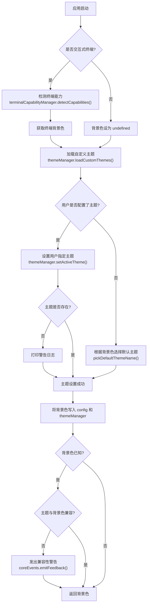

# terminalTheme.ts

## 概述

`terminalTheme.ts` 是 Gemini CLI 的终端主题初始化模块，负责在应用启动时完成以下三项核心工作：

1. **检测终端能力** — 识别终端是否支持 Kitty 图形协议、检测终端背景色（深色/浅色/未知）。
2. **加载并设置主题** — 加载用户自定义主题，根据用户配置或终端背景色自动选择合适的主题。
3. **主题兼容性警告** — 当激活的主题类型与终端背景色不匹配时，向用户发出警告反馈。

该模块仅导出一个异步函数 `setupTerminalAndTheme`，在应用初始化流程中被调用一次。

## 架构图（Mermaid）

## 核心组件

### `setupTerminalAndTheme(config, settings): Promise<TerminalBackgroundColor>`

| 参数 | 类型 | 说明 |
|------|------|------|
| `config` | `Config` | 应用全局配置对象，包含 `isInteractive()`、`setTerminalBackground()` 等方法 |
| `settings` | `LoadedSettings` | 已加载的用户设置，包含 `merged.ui.theme` 和 `merged.ui.customThemes` |

| 返回值 | 类型 | 说明 |
|--------|------|------|
| `terminalBackground` | `TerminalBackgroundColor` | 检测到的终端背景色，交互模式下为具体颜色值，非交互模式下为 `undefined` |

#### 执行步骤详解

1. **终端能力检测（仅交互模式）**
   - 条件：`config.isInteractive() && process.stdin.isTTY`
   - 调用 `terminalCapabilityManager.detectCapabilities()` 并行检测 Kitty 协议支持与背景色
   - 通过 `getTerminalBackgroundColor()` 获取检测结果

2. **加载自定义主题**
   - 从 `settings.merged.ui.customThemes` 加载用户在配置文件中定义的自定义主题

3. **选择激活主题**
   - 若用户在设置中指定了 `ui.theme`，尝试激活该主题；若主题不存在，使用 `debugLogger.warn()` 记录警告
   - 若未指定主题，调用 `pickDefaultThemeName()` 根据终端背景色智能选择默认主题（深色终端选深色主题，浅色终端选浅色主题）

4. **同步背景色到全局状态**
   - `config.setTerminalBackground(terminalBackground)` — 写入全局配置
   - `themeManager.setTerminalBackground(terminalBackground)` — 写入主题管理器

5. **主题兼容性检查**
   - 仅在背景色已知时执行
   - 调用 `themeManager.isThemeCompatible()` 判断当前主题是否适配终端背景
   - 不兼容时通过 `coreEvents.emitFeedback('warning', ...)` 发出用户可见的警告，建议用户使用 `/theme` 命令更换

## 依赖关系

### 内部依赖

| 模块路径 | 导入内容 | 用途 |
|----------|----------|------|
| `../ui/utils/terminalCapabilityManager.js` | `TerminalBackgroundColor` (类型), `terminalCapabilityManager` (实例) | 检测终端能力和背景色 |
| `../ui/themes/theme-manager.js` | `themeManager` (实例), `DEFAULT_THEME` (常量) | 管理主题的加载、激活、兼容性检查 |
| `../ui/themes/theme.js` | `pickDefaultThemeName` (函数) | 根据背景色选择默认主题名称 |
| `../ui/themes/color-utils.js` | `getThemeTypeFromBackgroundColor` (函数) | 将背景色值转换为主题类型字符串（"dark"/"light"） |
| `../config/settings.js` | `LoadedSettings` (类型) | 用户设置的类型定义 |

### 外部依赖

| 包名 | 导入内容 | 用途 |
|------|----------|------|
| `@google/gemini-cli-core` | `Config` (类型), `coreEvents` (实例), `debugLogger` (实例) | 全局配置类型、事件反馈系统、调试日志 |

## 关键实现细节

1. **并行检测终端能力**：`detectCapabilities()` 内部并行检测多项终端能力（Kitty 协议、背景色等），避免串行等待拖慢启动速度。

2. **优雅降级策略**：
   - 非交互模式（如管道输入）跳过终端检测，背景色为 `undefined`
   - 用户指定的主题不存在时仅记录警告日志，不中断启动流程
   - 主题与背景色不兼容时仅给出建议性警告，不强制切换

3. **默认主题选择逻辑**：`pickDefaultThemeName()` 接收终端背景色、所有可用主题列表、深色默认主题名和浅色默认主题名（`'Default Light'`），返回最合适的主题名称。

4. **主题兼容性提示**：警告消息中包含了具体的主题名、主题类型和终端背景类型，并提示用户可使用 `/theme` 命令切换，提供了良好的用户体验。

5. **全局状态同步**：背景色同时写入 `config` 和 `themeManager` 两个全局对象，确保后续所有消费方都能获取到正确的终端背景信息。
