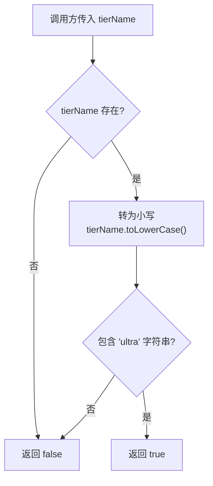

# tierUtils.ts

## 概述

`tierUtils.ts` 是 Gemini CLI 中的用户等级（Tier）工具模块。该文件非常精简，仅包含一个纯函数 `isUltraTier`，用于判断给定的用户等级名称是否属于 "Ultra" 级别。

在 Gemini CLI 的产品体系中，用户可能有不同的服务等级（如 Free、Pro、Ultra 等），Ultra 等级通常拥有更高的模型访问权限或更多的功能。此工具函数作为一个集中的判断逻辑，被其他模块调用以决定是否开放特定功能。

## 架构图（Mermaid）

## 核心组件

### `isUltraTier(tierName?: string): boolean`

判断给定的等级名称是否为 "Ultra" 等级。

| 参数 | 类型 | 是否必填 | 说明 |
|------|------|----------|------|
| `tierName` | `string \| undefined` | 否 | 用户的等级名称，可以为 `undefined` |

| 返回值 | 类型 | 说明 |
|--------|------|------|
| — | `boolean` | 如果等级名称中包含 "ultra"（不区分大小写）则返回 `true`，否则返回 `false` |

#### 匹配示例

| 输入 | 输出 | 说明 |
|------|------|------|
| `"Ultra"` | `true` | 精确匹配 |
| `"ultra"` | `true` | 小写匹配 |
| `"ULTRA"` | `true` | 大写匹配 |
| `"Gemini Ultra Plan"` | `true` | 包含 ultra 子串 |
| `"Pro"` | `false` | 不包含 ultra |
| `undefined` | `false` | 未提供等级名称 |
| `""` | `false` | 空字符串 |

## 依赖关系

### 内部依赖

无。该模块是一个纯工具函数，不依赖项目中的任何其他模块。

### 外部依赖

无。该模块不依赖任何第三方包，仅使用 JavaScript/TypeScript 原生字符串方法。

## 关键实现细节

1. **大小写不敏感匹配**：使用 `toLowerCase()` 将输入转为小写后再进行 `includes('ultra')` 检查，确保 "Ultra"、"ULTRA"、"ultra" 等各种大小写变体都能正确匹配。

2. **安全的可选链操作**：使用 `tierName?.toLowerCase()` 可选链语法，当 `tierName` 为 `undefined` 时不会抛出异常，而是返回 `undefined`，然后被 `!!` 转换为 `false`。

3. **宽松匹配策略**：使用 `includes('ultra')` 而非严格相等比较，意味着只要等级名称中 **包含** "ultra" 子串即视为 Ultra 等级。这种设计允许等级名称包含额外的修饰词（如 "Gemini Ultra Plan"、"Ultra Pro" 等），具有良好的前向兼容性。

4. **双重取反转布尔**：`!!` 运算符将 `undefined`（可选链短路时）或 `boolean`（`includes()` 返回值）统一转换为明确的 `boolean` 类型，确保函数返回值类型的一致性。

5. **纯函数设计**：无副作用、无状态依赖，易于测试和复用。
