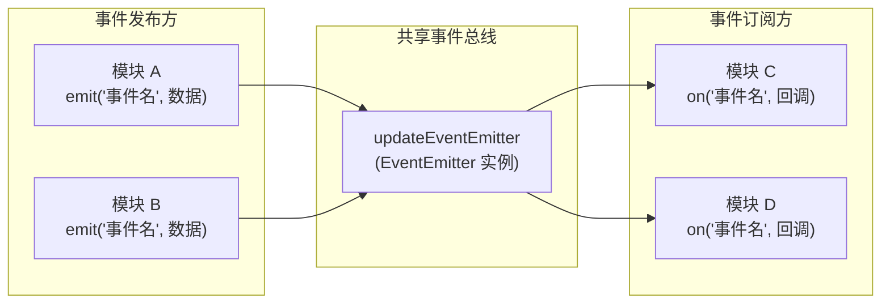

# updateEventEmitter.ts

## 概述

`updateEventEmitter.ts` 是 Gemini CLI 中的全局事件发射器模块。该文件极为精简，仅创建并导出了一个共享的 `EventEmitter` 实例 `updateEventEmitter`，用于在 CLI 应用中解耦的各个部分之间进行事件驱动的通信。

该模块基于 Node.js 内置的 `EventEmitter`，是一个典型的**发布/订阅（Pub/Sub）模式**实现。应用中的任何模块都可以通过该实例发布事件或订阅事件，而无需直接引用彼此，从而实现模块间的松耦合通信。

## 架构图（Mermaid）



## 核心组件

### `updateEventEmitter: EventEmitter`

一个全局共享的 `EventEmitter` 单例实例。

| 属性 | 类型 | 说明 |
|------|------|------|
| `updateEventEmitter` | `EventEmitter` | 应用级别的共享事件发射器，用于解耦模块间的通信 |

#### 继承自 `EventEmitter` 的关键方法

由于 `updateEventEmitter` 是标准 `EventEmitter` 实例，它支持以下核心方法：

| 方法 | 说明 |
|------|------|
| `on(event, listener)` | 注册事件监听器 |
| `once(event, listener)` | 注册一次性事件监听器（触发后自动移除） |
| `emit(event, ...args)` | 触发事件，通知所有监听器 |
| `off(event, listener)` / `removeListener(event, listener)` | 移除特定事件监听器 |
| `removeAllListeners([event])` | 移除所有（或指定事件的）监听器 |

#### 典型使用模式

```typescript
// 订阅方
import { updateEventEmitter } from './updateEventEmitter.js';
updateEventEmitter.on('someUpdate', (data) => {
  // 处理更新事件
});

// 发布方
import { updateEventEmitter } from './updateEventEmitter.js';
updateEventEmitter.emit('someUpdate', { key: 'value' });
```

## 依赖关系

### 内部依赖

无。该模块不依赖项目中的任何其他模块，是一个独立的基础设施组件。

### 外部依赖

| 包名 | 导入内容 | 用途 |
|------|----------|------|
| `node:events` | `EventEmitter` (类) | Node.js 内置事件模块，提供发布/订阅能力 |

## 关键实现细节

1. **单例模式**：通过 ES Module 的模块缓存机制，`updateEventEmitter` 在整个应用中只会被实例化一次。所有导入该模块的文件都会获得同一个 `EventEmitter` 实例，天然实现了单例模式。

2. **命名语义**："update" 前缀暗示该事件发射器主要用于传播"更新"类事件（如 UI 更新、状态变更通知等），但作为一个通用的 `EventEmitter`，它实际上可以承载任何类型的事件。

3. **解耦设计**：该模块的核心价值在于提供一个中心化的事件总线，使得事件的发布方和订阅方之间不需要直接引用。例如，一个后台检查更新的模块可以通过 `emit` 发布"有新版本"事件，而 UI 模块通过 `on` 订阅该事件来展示更新提示，两者完全解耦。

4. **无类型约束**：当前实现没有对事件名称和数据进行 TypeScript 类型约束。这提供了灵活性，但也意味着事件名称的拼写错误或数据格式不匹配不会在编译时被捕获。在更严格的实现中，可以通过泛型化 `EventEmitter` 或使用 typed-emitter 库来增强类型安全。

5. **Node.js 原生实现**：使用 `node:events` 前缀导入（而非 `events`），这是 Node.js 推荐的内置模块导入方式，可以明确区分内置模块和第三方 npm 包，避免潜在的命名冲突。

6. **轻量级实现**：整个文件仅 3 行有效代码（1 行导入 + 1 行导出），体现了"做好一件事"的 Unix 哲学，将事件总线的创建与具体业务逻辑完全分离。
