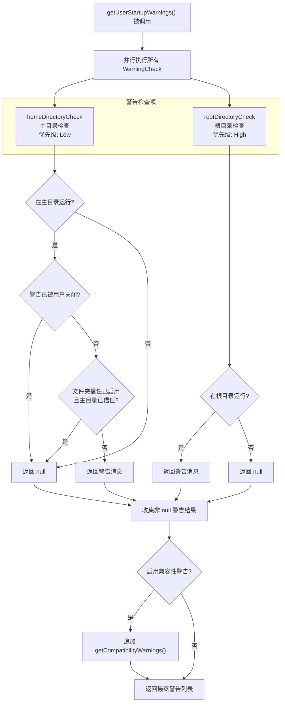

# userStartupWarnings.ts

## 概述

`userStartupWarnings.ts` 是 Gemini CLI 的启动警告检查模块，负责在应用启动时检测用户的运行环境，并生成相应的警告信息。该模块采用可扩展的**检查项注册机制**，将各类警告检查抽象为统一的 `WarningCheck` 接口，便于新增警告规则。

当前实现了两类启动警告：

1. **主目录警告**（低优先级）— 检测用户是否在 Home 目录运行 CLI，因为 Home 目录包含大量无关文件，可能影响上下文质量。
2. **根目录警告**（高优先级）— 检测用户是否在系统根目录（`/`）运行 CLI，这会导致整个文件系统结构被用作上下文。

此外，该模块还集成了来自 `@google/gemini-cli-core` 的**兼容性警告**检查。

## 架构图（Mermaid）

## 核心组件

### 类型定义

#### `WarningCheck`

警告检查项的类型定义，定义了统一的检查接口：

| 字段 | 类型 | 说明 |
|------|------|------|
| `id` | `string` | 警告的唯一标识符 |
| `check` | `(workspaceRoot: string, settings: Settings) => Promise<string \| null>` | 异步检查函数，返回警告消息字符串或 `null`（表示无警告） |
| `priority` | `WarningPriority` | 警告优先级，来自 `@google/gemini-cli-core` |

### 警告检查项

#### `homeDirectoryCheck`

| 属性 | 值 |
|------|---|
| ID | `'home-directory'` |
| 优先级 | `WarningPriority.Low` |
| 触发条件 | 工作区路径与用户 Home 目录路径相同 |
| 可被关闭 | 是 — `settings.ui.showHomeDirectoryWarning === false` |
| 信任豁免 | 是 — 当文件夹信任功能启用且主目录已信任时跳过 |

**检查逻辑详解：**
1. 首先检查用户是否在设置中关闭了此警告（`showHomeDirectoryWarning === false`）
2. 使用 `fs.realpath()` 并行解析工作区路径和 Home 路径的真实路径（处理软链接）
3. 比较两者是否相同
4. 若相同，再检查文件夹信任机制是否豁免了该目录
5. 文件系统错误时返回通用错误消息

#### `rootDirectoryCheck`

| 属性 | 值 |
|------|---|
| ID | `'root-directory'` |
| 优先级 | `WarningPriority.High` |
| 触发条件 | 工作区路径为文件系统根目录 |
| 可被关闭 | 否 |

**检查逻辑详解：**
1. 使用 `fs.realpath()` 解析工作区真实路径
2. 通过 `path.dirname(workspaceRealPath) === workspaceRealPath` 判断是否为根目录（根目录的父目录是自身）
3. 此检查无法通过用户设置关闭，因为在根目录运行存在严重的安全和性能风险

### 主函数

#### `getUserStartupWarnings(settings, workspaceRoot?, options?): Promise<StartupWarning[]>`

| 参数 | 类型 | 默认值 | 说明 |
|------|------|--------|------|
| `settings` | `Settings` | — | 用户设置对象 |
| `workspaceRoot` | `string` | `process.cwd()` | 工作区根目录路径 |
| `options` | `{ isAlternateBuffer?: boolean }` | `undefined` | 可选配置项 |

| 返回值 | 类型 | 说明 |
|--------|------|------|
| — | `Promise<StartupWarning[]>` | 启动警告数组，每项包含 `id`、`message`、`priority` |

**执行流程：**
1. 使用 `Promise.all()` 并行执行 `WARNING_CHECKS` 中所有检查项
2. 每个检查项返回 `StartupWarning` 对象或 `null`
3. 过滤掉 `null` 结果，收集有效警告
4. 若用户未关闭兼容性警告（`settings.ui.showCompatibilityWarnings !== false`），追加来自 `getCompatibilityWarnings()` 的兼容性警告
5. 返回完整的警告列表

### 常量

#### `WARNING_CHECKS: readonly WarningCheck[]`

包含所有警告检查项的只读数组，当前包含：
- `homeDirectoryCheck`
- `rootDirectoryCheck`

新增警告只需创建一个符合 `WarningCheck` 接口的对象并添加到此数组中。

## 依赖关系

### 内部依赖

| 模块路径 | 导入内容 | 用途 |
|----------|----------|------|
| `../config/settingsSchema.js` | `Settings` (类型) | 用户设置的类型定义 |
| `../config/trustedFolders.js` | `isFolderTrustEnabled` (函数), `isWorkspaceTrusted` (函数) | 文件夹信任机制，用于主目录警告的豁免逻辑 |

### 外部依赖

| 包名 | 导入内容 | 用途 |
|------|----------|------|
| `node:fs/promises` | `fs` (默认导出) | 异步文件系统操作，用于 `realpath()` 解析真实路径 |
| `node:path` | `path` (默认导出) | 路径操作，用于 `dirname()` 判断根目录 |
| `node:process` | `process` (默认导出) | 获取 `cwd()` 作为默认工作区路径 |
| `@google/gemini-cli-core` | `homedir` (函数), `getCompatibilityWarnings` (函数), `WarningPriority` (枚举), `StartupWarning` (类型) | 主目录获取、兼容性警告生成、优先级枚举定义、警告类型定义 |

## 关键实现细节

1. **可扩展的检查项机制**：`WarningCheck` 类型定义了统一的检查接口（`id` + `check` 函数 + `priority`），新增警告只需创建对象并添加到 `WARNING_CHECKS` 数组，无需修改主函数逻辑，符合**开闭原则**。

2. **并行检查执行**：`Promise.all()` 确保所有检查项并行执行，避免串行等待。每个检查项内部也使用 `Promise.all()` 并行解析路径（如 `homeDirectoryCheck` 中同时解析工作区路径和 Home 路径）。

3. **真实路径比较**：使用 `fs.realpath()` 解析符号链接后的真实路径再进行比较，避免因符号链接导致的误判。例如，用户可能通过符号链接 `cd` 到 Home 目录的别名路径。

4. **根目录检测算法**：`path.dirname(workspaceRealPath) === workspaceRealPath` 是判断根目录的经典方法 — 在 Unix 系统中 `/` 的父目录仍然是 `/`，在 Windows 中 `C:\` 的父目录仍然是 `C:\`，因此该方法具有跨平台兼容性。

5. **多层豁免机制**（主目录检查）：
   - 第一层：用户可通过 `settings.ui.showHomeDirectoryWarning = false` 全局关闭
   - 第二层：若文件夹信任功能已启用且 Home 目录已被信任，则自动跳过
   - 这种多层设计兼顾了灵活性和安全性

6. **错误处理**：两个检查项都对文件系统操作做了 `try-catch` 包裹，异常时返回通用的文件系统错误消息，而非直接抛出异常导致启动失败。

7. **兼容性警告集成**：通过 `getCompatibilityWarnings()` 从核心库获取终端兼容性相关的警告，`isAlternateBuffer` 选项用于判断是否在备用屏幕缓冲区中运行（某些终端功能在备用缓冲区中可能受限）。

8. **类型安全过滤**：`results.filter((w): w is StartupWarning => w !== null)` 使用 TypeScript 类型谓词（type predicate），在过滤 `null` 的同时将数组类型从 `(StartupWarning | null)[]` 收窄为 `StartupWarning[]`。
