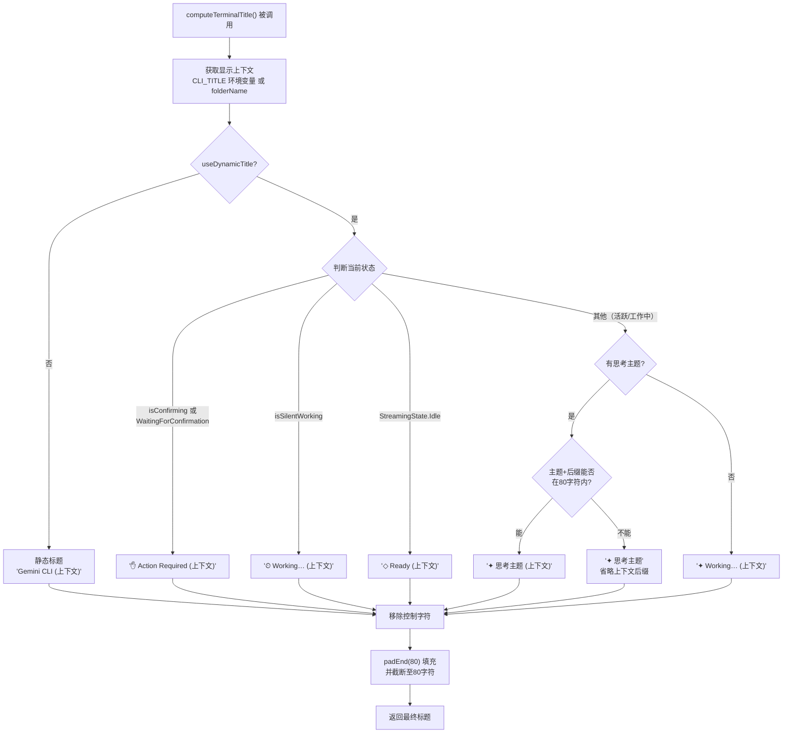

# windowTitle.ts

## 概述

`windowTitle.ts` 是 Gemini CLI 的终端窗口标题计算模块，负责根据 CLI 的当前状态动态生成终端窗口标题字符串。该模块实现了一个智能的标题生成系统，能够根据不同的应用状态（空闲、工作中、等待确认等）展示不同的状态指示器和上下文信息。

生成的标题字符串固定填充到 80 个字符宽度，以防止终端任务栏图标因标题长度变化而产生抖动（jitter）。标题中还会自动清除控制字符，确保在各种终端中安全显示。

## 架构图（Mermaid）

## 核心组件

### 接口定义

#### `TerminalTitleOptions`

计算终端标题所需的选项接口：

| 字段 | 类型 | 是否必填 | 说明 |
|------|------|----------|------|
| `streamingState` | `StreamingState` | 是 | 当前的流式传输状态（Idle、Active、WaitingForConfirmation 等） |
| `thoughtSubject` | `string \| undefined` | 否 | AI 当前的思考主题，用于在标题中展示 |
| `isConfirming` | `boolean` | 是 | 是否正在等待用户确认操作 |
| `isSilentWorking` | `boolean` | 是 | 是否在静默工作中（无需用户交互的后台处理） |
| `folderName` | `string` | 是 | 当前工作文件夹名称，用作默认的上下文标识 |
| `showThoughts` | `boolean` | 是 | 是否显示 AI 的思考主题 |
| `useDynamicTitle` | `boolean` | 是 | 是否启用动态标题（否则使用静态格式） |

### 工具函数

#### `truncate(text: string, maxLen: number): string`

私有辅助函数，将文本截断到指定长度。

| 参数 | 类型 | 说明 |
|------|------|------|
| `text` | `string` | 待截断文本 |
| `maxLen` | `number` | 最大长度限制 |

| 返回值 | 类型 | 说明 |
|--------|------|------|
| — | `string` | 若原文本长度不超过 `maxLen` 则原样返回，否则截取前 `maxLen - 1` 个字符并追加省略号 `…` |

### 主函数

#### `computeTerminalTitle(options: TerminalTitleOptions): string`

根据当前 CLI 状态计算终端窗口标题。

| 返回值 | 类型 | 说明 |
|--------|------|------|
| — | `string` | 格式化的终端标题，固定填充至 80 个字符宽度 |

#### 状态映射表

| 优先级 | 条件 | 图标 | 标题格式 | 含义 |
|--------|------|------|----------|------|
| 1 | `isConfirming` 或 `WaitingForConfirmation` | ✋ | `✋  Action Required (上下文)` | 需要用户确认操作 |
| 2 | `isSilentWorking` | ⏲ | `⏲  Working… (上下文)` | 静默后台工作中 |
| 3 | `StreamingState.Idle` | ◇ | `◇  Ready (上下文)` | 空闲就绪状态 |
| 4 | 其他（活跃状态） | ✦ | `✦  {思考主题/Working…} (上下文)` | 正在处理中 |

#### 活跃状态的智能布局逻辑

在活跃/工作状态（优先级 4）下，标题的组成更为复杂：

1. 若 `showThoughts` 为 `true` 且有 `thoughtSubject`：
   - 先清理主题文本（去除换行、首尾空白）
   - 尝试将"思考主题 + 上下文后缀"放入 80 字符限制内
   - 若能放下，标题为 `✦  {思考主题} ({上下文})`
   - 若放不下，丢弃上下文后缀，将所有空间留给思考主题：`✦  {思考主题}`
2. 若无思考主题，显示通用的 `Working…`

## 依赖关系

### 内部依赖

| 模块路径 | 导入内容 | 用途 |
|----------|----------|------|
| `../ui/types.js` | `StreamingState` (枚举) | 定义流式传输状态常量（Idle、Active、WaitingForConfirmation 等） |

### 外部依赖

| 包名 | 导入内容 | 用途 |
|------|----------|------|
| — | `process.env['CLI_TITLE']` | 通过环境变量自定义终端标题上下文（隐式依赖 Node.js `process` 全局对象） |

## 关键实现细节

1. **固定宽度标题（80 字符）**：所有生成的标题都会被 `padEnd(80, ' ')` 填充到 80 个字符，并用 `substring(0, 80)` 截断以确保绝不超过限制。固定宽度的设计目的是防止终端任务栏图标因标题长度频繁变化而产生视觉抖动。

2. **控制字符清理**：使用正则 `/[\x00-\x1F\x7F]/g` 移除所有 ASCII 控制字符（包括 `\x00`-`\x1F` 和 `\x7F`），防止恶意或意外的控制字符序列破坏终端标题的渲染。

3. **环境变量覆盖**：`process.env['CLI_TITLE']` 允许用户通过环境变量完全自定义标题中的上下文部分，优先级高于 `folderName` 参数，适用于用户希望自定义终端标题标识的场景。

4. **动态/静态双模式**：
   - **静态模式**（`useDynamicTitle = false`）：标题始终为 `Gemini CLI (上下文)` 格式，不随状态变化
   - **动态模式**（`useDynamicTitle = true`）：根据 CLI 状态实时切换图标和文本

5. **智能空间分配**：在活跃状态下，当思考主题文本过长时会自动省略上下文后缀 `(folderName)`，将所有可用空间留给思考主题。通过 `canFitThoughtWithSuffix` 变量精确计算是否能同时容纳两者。

6. **省略号截断**：`truncate()` 函数使用 Unicode 省略号字符 `…`（U+2026）而非三个点 `...`，仅占用 1 个字符位置，在有限空间内保留更多有效文本。

7. **思考主题清理**：`thoughtSubject?.replace(/[\r\n]+/g, ' ').trim()` 将多行思考主题中的换行符替换为空格，并去除首尾空白，确保标题在单行中正常显示。

8. **状态优先级设计**：状态判断使用 `if-else if` 链式结构，确保优先级从高到低依次为：等待确认 > 静默工作 > 空闲 > 活跃状态。`isConfirming` 独立于 `streamingState` 检查，因为确认状态可能来自不同的触发源。

9. **图标选择语义**：
   - ✋（举手）— 需要用户干预
   - ⏲（计时器）— 后台处理中
   - ◇（空心菱形）— 就绪/等待输入
   - ✦（实心四角星）— 活跃处理/AI 思考中
