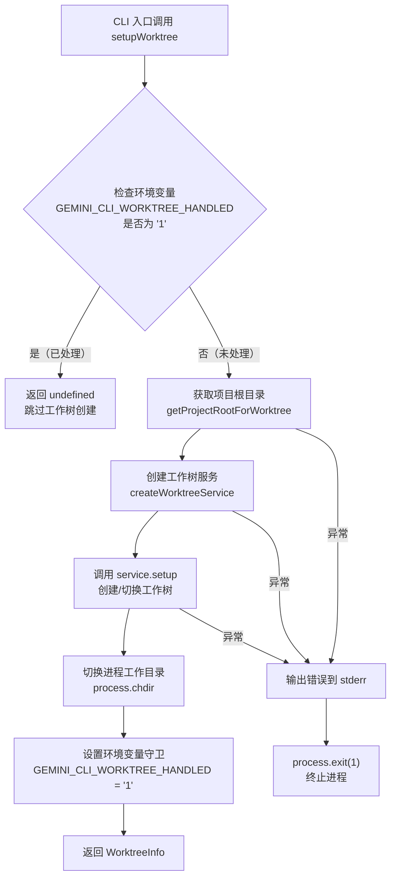

# worktreeSetup.ts

## 概述

`worktreeSetup.ts` 是 Gemini CLI 中用于设置 **Git Worktree（工作树）** 的工具模块。它的核心功能是为并行会话创建独立的 Git 工作树，使多个 CLI 实例可以在同一仓库中同时工作而互不干扰。

该模块只导出一个异步函数 `setupWorktree`，通过环境变量守卫机制防止在 CLI 自我重启（例如为了调整内存分配）时创建嵌套的工作树。

**源文件路径**: `packages/cli/src/utils/worktreeSetup.ts`

## 架构图（Mermaid）



## 核心组件

### `setupWorktree` 函数

| 属性 | 说明 |
|------|------|
| **签名** | `async function setupWorktree(worktreeName: string \| undefined): Promise<WorktreeInfo \| undefined>` |
| **导出方式** | 命名导出 (`export async function`) |
| **参数** | `worktreeName` - 可选的工作树名称，为 `undefined` 时由服务自动生成 |
| **返回值** | `WorktreeInfo` 对象（成功时）或 `undefined`（已处理过时） |

#### 执行流程详解

1. **守卫检查（防止嵌套创建）**
   - 检查 `process.env['GEMINI_CLI_WORKTREE_HANDLED']` 是否为 `'1'`
   - 如果是，说明当前进程已经在工作树环境中（可能是 CLI 重启后的新进程），直接返回 `undefined`
   - 这一机制确保了 CLI 在因内存分配等原因自我重启时，不会重复创建工作树

2. **获取项目根目录**
   - 调用 `getProjectRootForWorktree(process.cwd())`
   - 以当前工作目录为起点，向上查找 Git 仓库的根目录

3. **创建工作树服务**
   - 调用 `createWorktreeService(projectRoot)`
   - 基于项目根目录创建一个工作树管理服务实例

4. **设置工作树**
   - 调用 `service.setup(worktreeName || undefined)`
   - 注意：空字符串 `''` 会被转换为 `undefined`，确保传给服务的是有效名称或 `undefined`
   - 返回 `WorktreeInfo` 对象，包含工作树路径等信息

5. **切换工作目录**
   - `process.chdir(worktreeInfo.path)` 将当前进程的工作目录切换到新创建的工作树路径

6. **设置守卫标记**
   - 将 `GEMINI_CLI_WORKTREE_HANDLED` 环境变量设为 `'1'`
   - 子进程或重启进程会继承此环境变量，从而跳过工作树创建

7. **错误处理**
   - 整个流程包裹在 try-catch 中
   - 错误发生时将错误信息写入 stderr 并以退出码 1 终止进程
   - 这是一个"致命错误"策略——工作树创建失败意味着无法安全地进行并行操作

## 依赖关系

### 内部依赖

| 依赖项 | 来源模块 | 说明 |
|--------|---------|------|
| `getProjectRootForWorktree` | `@google/gemini-cli-core` | 从当前目录向上查找项目根目录（Git 仓库根目录） |
| `createWorktreeService` | `@google/gemini-cli-core` | 创建工作树管理服务实例，封装了 Git worktree 的操作逻辑 |
| `writeToStderr` | `@google/gemini-cli-core` | 向标准错误流写入消息的工具函数 |
| `WorktreeInfo` (类型) | `@google/gemini-cli-core` | 工作树信息的类型定义，包含工作树路径等元数据 |

### 外部依赖

| 依赖项 | 说明 |
|--------|------|
| Node.js `process` 全局对象 | 使用 `process.env` 读写环境变量、`process.cwd()` 获取当前目录、`process.chdir()` 切换目录、`process.exit()` 退出进程 |

## 关键实现细节

### 1. 环境变量守卫模式

```typescript
if (process.env['GEMINI_CLI_WORKTREE_HANDLED'] === '1') {
  return undefined;
}
```

这是一个经典的"一次性执行"守卫模式。Gemini CLI 可能因为多种原因重新启动自身（例如通过 `execv` 重新启动以调整 V8 内存限制），在这种情况下，环境变量会被子进程继承，从而防止重复创建工作树。使用字符串 `'1'` 而非布尔值是因为环境变量只支持字符串类型。

### 2. 参数空值归一化

```typescript
const worktreeInfo = await service.setup(worktreeName || undefined);
```

使用 `||` 运算符将空字符串 `''` 也归一化为 `undefined`。这确保了即使调用方传入了空字符串，服务层也能正确处理（通常是自动生成一个工作树名称）。

### 3. 致命错误策略

```typescript
catch (error) {
  const errorMessage = error instanceof Error ? error.message : String(error);
  writeToStderr(`Failed to create or switch to worktree: ${errorMessage}\n`);
  process.exit(1);
}
```

工作树创建失败被视为致命错误，会立即终止进程。这是合理的设计，因为：
- 如果用户请求使用工作树进行并行操作，但工作树创建失败，继续执行可能导致对主仓库的意外修改
- 使用 `writeToStderr` 而非 `console.error` 确保错误信息与 CLI 的日志系统保持一致
- 使用 `instanceof Error` 检查来安全地提取错误信息，兼容非 Error 类型的抛出值

### 4. 进程状态的全局修改

该函数会修改两项全局的进程状态：
- **工作目录** (`process.chdir`) - 影响后续所有文件操作的相对路径解析
- **环境变量** (`process.env`) - 影响当前进程及所有子进程

这种全局副作用意味着 `setupWorktree` 应当在 CLI 初始化阶段尽早调用，且仅调用一次。
