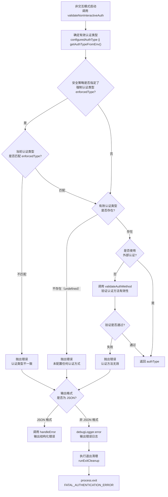

# validateNonInterActiveAuth.ts

## 概述

`validateNonInterActiveAuth.ts` 是 Gemini CLI 中用于**非交互模式下认证验证**的模块。当 CLI 在无人值守/脚本化环境中运行时（例如 CI/CD 管道、自动化脚本），无法弹出浏览器或提示用户输入，因此需要在启动前严格验证认证配置是否正确且完整。

该模块导出唯一的异步函数 `validateNonInteractiveAuth`，它执行以下三层验证：
1. **强制认证类型检查** - 确保当前认证类型与安全策略中强制指定的类型一致
2. **认证存在性检查** - 确保至少配置了一种认证方式
3. **认证方法有效性检查** - 验证所配置的认证方法是否合法可用

**源文件路径**: `packages/cli/src/validateNonInterActiveAuth.ts`

## 架构图（Mermaid）



## 核心组件

### `validateNonInteractiveAuth` 函数

| 属性 | 说明 |
|------|------|
| **签名** | `async function validateNonInteractiveAuth(configuredAuthType, useExternalAuth, nonInteractiveConfig, settings)` |
| **导出方式** | 命名导出 (`export async function`) |
| **返回值** | `AuthType`（成功时）；错误时终止进程，无返回值 |

#### 参数说明

| 参数名 | 类型 | 说明 |
|--------|------|------|
| `configuredAuthType` | `AuthType \| undefined` | 已配置的认证类型，可能由上层逻辑（如命令行参数或配置文件）提供 |
| `useExternalAuth` | `boolean \| undefined` | 是否使用外部认证机制（为 `true` 时跳过内部认证方法验证） |
| `nonInteractiveConfig` | `Config` | 非交互模式的配置对象，用于获取输出格式等信息 |
| `settings` | `LoadedSettings` | 已加载的用户设置，包含安全策略中的强制认证类型等信息 |

#### 三层验证逻辑详解

**第一层：强制认证类型验证**

```typescript
const enforcedType = settings.merged.security.auth.enforcedType;
if (enforcedType && effectiveAuthType !== enforcedType) {
  // 抛出错误
}
```

从合并后的用户设置中读取 `security.auth.enforcedType`。如果管理员/用户在设置中强制指定了认证类型（例如仅允许 Vertex AI 认证），则当前使用的认证类型必须与之匹配。此层验证确保了组织安全策略的执行。

**第二层：认证存在性验证**

```typescript
if (!effectiveAuthType) {
  throw new Error(`Please set an Auth method in your ${USER_SETTINGS_PATH} ...`);
}
```

如果经过 `configuredAuthType || getAuthTypeFromEnv()` 后仍然没有有效的认证类型，说明用户既没有在配置文件中设置认证，也没有通过环境变量提供。错误信息明确告知用户可以通过 `GEMINI_API_KEY`、`GOOGLE_GENAI_USE_VERTEXAI` 或 `GOOGLE_GENAI_USE_GCA` 环境变量来配置认证。

**第三层：认证方法有效性验证**

```typescript
if (!useExternalAuth) {
  const err = validateAuthMethod(String(authType));
  if (err != null) {
    throw new Error(err);
  }
}
```

仅在未使用外部认证时执行。调用 `validateAuthMethod` 检查所指定的认证方法是否是系统支持的合法方法。使用外部认证时跳过此步骤，因为外部认证的验证逻辑由外部系统负责。

## 依赖关系

### 内部依赖

| 依赖项 | 来源模块 | 说明 |
|--------|---------|------|
| `debugLogger` | `@google/gemini-cli-core` | 调试日志记录器，用于在非 JSON 模式下输出错误信息 |
| `OutputFormat` | `@google/gemini-cli-core` | 输出格式枚举（如 `JSON`、文本等） |
| `ExitCodes` | `@google/gemini-cli-core` | 进程退出码枚举，包含 `FATAL_AUTHENTICATION_ERROR` |
| `getAuthTypeFromEnv` | `@google/gemini-cli-core` | 从环境变量中推断认证类型的函数 |
| `Config` (类型) | `@google/gemini-cli-core` | 配置对象类型定义 |
| `AuthType` (类型) | `@google/gemini-cli-core` | 认证类型枚举/联合类型定义 |
| `USER_SETTINGS_PATH` | `./config/settings.js` | 用户设置文件的路径常量，用于错误提示中指引用户 |
| `LoadedSettings` (类型) | `./config/settings.js` | 已加载设置的类型定义 |
| `validateAuthMethod` | `./config/auth.js` | 认证方法有效性验证函数 |
| `handleError` | `./utils/errors.js` | 结构化错误处理函数，用于 JSON 输出模式 |
| `runExitCleanup` | `./utils/cleanup.js` | 退出前清理函数，确保资源被正确释放 |

### 外部依赖

| 依赖项 | 说明 |
|--------|------|
| Node.js `process` 全局对象 | 使用 `process.exit()` 以特定退出码终止进程 |

## 关键实现细节

### 1. 认证类型解析优先级

```typescript
const effectiveAuthType = configuredAuthType || getAuthTypeFromEnv();
```

认证类型的解析遵循明确的优先级：
1. **显式配置** (`configuredAuthType`) - 由调用方直接传入的认证类型，优先级最高
2. **环境变量推断** (`getAuthTypeFromEnv()`) - 从 `GEMINI_API_KEY`、`GOOGLE_GENAI_USE_VERTEXAI`、`GOOGLE_GENAI_USE_GCA` 等环境变量推断

这种设计允许用户在配置文件和环境变量两个层面灵活配置认证。

### 2. 差异化错误处理策略

```typescript
if (nonInteractiveConfig.getOutputFormat() === OutputFormat.JSON) {
  handleError(error, nonInteractiveConfig, ExitCodes.FATAL_AUTHENTICATION_ERROR);
} else {
  debugLogger.error(error.message);
  await runExitCleanup();
  process.exit(ExitCodes.FATAL_AUTHENTICATION_ERROR);
}
```

根据输出格式采用不同的错误处理路径：

- **JSON 模式**：调用 `handleError` 输出结构化的 JSON 错误信息，便于上游程序解析处理。`handleError` 内部负责退出流程。
- **非 JSON 模式**：通过 `debugLogger.error` 输出人类可读的错误信息，然后显式调用 `runExitCleanup()` 执行清理（如关闭文件句柄、清除临时文件等），最后以 `FATAL_AUTHENTICATION_ERROR` 退出码终止进程。

注意 JSON 模式下没有显式调用 `runExitCleanup()`，因为 `handleError` 函数内部已经包含了清理逻辑。

### 3. 外部认证的短路逻辑

```typescript
if (!useExternalAuth) {
  const err = validateAuthMethod(String(authType));
  // ...
}
```

当使用外部认证（`useExternalAuth === true`）时，完全跳过认证方法验证。这是因为外部认证系统（如企业 SSO、OAuth 代理等）有自己的认证验证机制，CLI 无需也无法验证其有效性。

### 4. 安全策略强制执行

```typescript
const enforcedType = settings.merged.security.auth.enforcedType;
```

通过 `settings.merged` 访问合并后的设置（可能包含项目级设置、用户级设置和系统级设置的合并结果），确保安全策略可以在组织层面进行管理和强制执行。这是企业级安全合规的重要特性——管理员可以强制所有用户使用特定的认证方式（如 Vertex AI），禁止使用 API Key 等可能不够安全的方式。

### 5. 函数的返回类型隐含问题

从 TypeScript 类型角度看，该函数的返回类型是隐式推断的。在成功路径上返回 `AuthType`，在 catch 块中要么调用 `handleError`（可能内部 `process.exit`），要么显式 `process.exit`。由于 `process.exit` 的返回类型是 `never`，TypeScript 编译器能正确推断该函数在 catch 路径上不会正常返回。但从调用方角度，返回类型可能被推断为 `AuthType | undefined`，调用方需要注意处理这一点。
