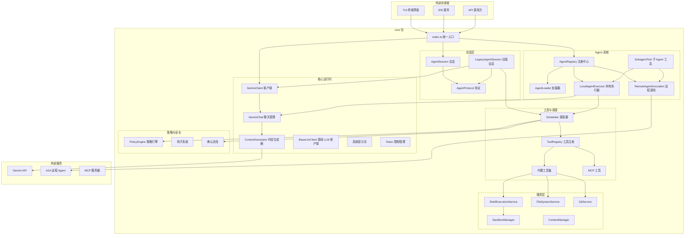

# packages/core

## 概述

`@google/gemini-cli-core` 是 Gemini CLI 的核心包，提供了与 Gemini AI 模型交互的全部基础能力。它是整个 CLI 应用的引擎层，封装了 Agent 会话管理、LLM 调用、工具注册与执行、策略引擎、服务层、遥测等核心功能。该包以 ESM 模块形式发布，入口文件为 `src/index.ts`，通过 re-export 将内部各子模块的公共 API 暴露给上层消费者（如 TUI、IDE 插件等）。

- **包名**: `@google/gemini-cli-core`
- **版本**: 0.36.0-nightly
- **许可证**: Apache-2.0
- **Node 要求**: >= 20

## 目录结构

```
packages/core/
├── package.json              # 包定义、依赖声明
├── tsconfig.json             # TypeScript 编译配置
├── src/
│   ├── index.ts              # 统一导出入口
│   ├── agent/                # Agent 协议与会话抽象层
│   ├── agents/               # 内置 Agent 定义与执行器
│   ├── availability/         # 模型可用性策略
│   ├── billing/              # 计费相关
│   ├── code_assist/          # Code Assist (OAuth/服务端) 集成
│   ├── commands/             # CLI 命令逻辑
│   ├── config/               # 配置管理（Config、Storage、模型配置等）
│   ├── confirmation-bus/     # 工具调用确认消息总线
│   ├── core/                 # 核心运行时（LLM 客户端、聊天管理、提示词等）
│   ├── fallback/             # 模型降级处理
│   ├── hooks/                # 钩子系统
│   ├── ide/                  # IDE 集成（VS Code 等）
│   ├── mcp/                  # MCP（Model Context Protocol）支持
│   ├── output/               # 输出格式化
│   ├── policy/               # 策略引擎（TOML 规则、权限控制）
│   ├── prompts/              # 提示词模板
│   ├── resources/            # 资源注册
│   ├── routing/              # 模型路由策略
│   ├── safety/               # 安全相关
│   ├── sandbox/              # 沙箱执行（macOS/Windows）
│   ├── scheduler/            # 工具调用调度器
│   ├── services/             # 服务层（文件系统、Git、Shell 执行等）
│   ├── skills/               # 技能管理
│   ├── telemetry/            # 遥测与日志
│   ├── tools/                # 内置工具定义（读文件、写文件、Shell 等）
│   ├── utils/                # 工具函数集合
│   └── voice/                # 语音相关
└── dist/                     # 构建产物
```

## 架构图



## 核心组件

### 入口文件 (index.ts)

`src/index.ts` 是包的统一导出入口，通过 `export *` 语法 re-export 了以下模块的公共 API：

| 模块分类 | 主要导出 |
|---------|---------|
| 配置 (config) | `Config`, `AgentLoopContext`, `Memory`, `ModelConfigs`, `Constants` |
| 输出 (output) | `OutputTypes`, `JsonFormatter`, `StreamJsonFormatter` |
| 策略 (policy) | `PolicyEngine`, `PolicyDecision`, `ApprovalMode` |
| 核心运行时 (core) | `BaseLlmClient`, `GeminiClient`, `ContentGenerator`, `GeminiChat`, `Turn` |
| 调度器 (scheduler) | `Scheduler`, `ToolExecutor`, `PolicyMiddleware` |
| 工具 (tools) | `ToolRegistry`, 各内置工具（read-file, write-file, shell, grep 等） |
| Agent (agents) | `AgentDefinition`, `AgentLoader`, `LocalAgentExecutor`, `AgentScheduler` |
| 会话 (agent) | `AgentSession`, `LegacyAgentSession`, `EventTranslator`, `AgentProtocol` |
| 服务 (services) | `ShellExecutionService`, `FileSystemService`, `GitService`, `SandboxManager` |
| 遥测 (telemetry) | 遥测函数、计费事件 |
| MCP | `MCPOAuthProvider`, `MCPOAuthTokenStorage` |
| 钩子 (hooks) | 钩子类型定义和注册 |

### 关键类型导出

- `Content`, `Part`, `FunctionCall` -- 来自 `@google/genai` 的核心类型
- `AgentEvent`, `AgentProtocol`, `AgentSend` -- Agent 事件协议类型

## 依赖关系

### 内部依赖

- `@google/gemini-cli-test-utils` (devDependency) -- 测试工具

### 外部依赖（主要）

| 依赖 | 用途 |
|------|------|
| `@google/genai` | Gemini API SDK |
| `@a2a-js/sdk` | A2A (Agent-to-Agent) 协议 SDK |
| `@modelcontextprotocol/sdk` | MCP (Model Context Protocol) SDK |
| `@opentelemetry/*` | OpenTelemetry 遥测 |
| `google-auth-library` | Google 认证 |
| `simple-git` | Git 操作 |
| `puppeteer-core` | 浏览器自动化 |
| `web-tree-sitter` | 代码解析 |
| `zod` | 运行时类型验证 |
| `ajv` | JSON Schema 验证 |
| `js-yaml` | YAML 解析 |
| `dotenv` | 环境变量加载 |

## 数据流

### 主要交互流程

1. **用户消息 -> Agent 响应**: 消费者通过 `AgentSession.send()` 发送消息，内部经过 `GeminiClient` -> `GeminiChat` -> Gemini API 完成模型调用，响应以 `AgentEvent` 流的形式返回
2. **工具调用**: 模型返回 `FunctionCall` 后，由 `Scheduler` 调度执行，经过 `PolicyEngine` 权限检查和 `MessageBus` 确认后，分发给对应的 `Tool` 实现
3. **子 Agent 委托**: 主 Agent 通过 `SubagentTool` 将任务委托给本地/远程子 Agent，子 Agent 拥有独立的工具注册表和消息总线
