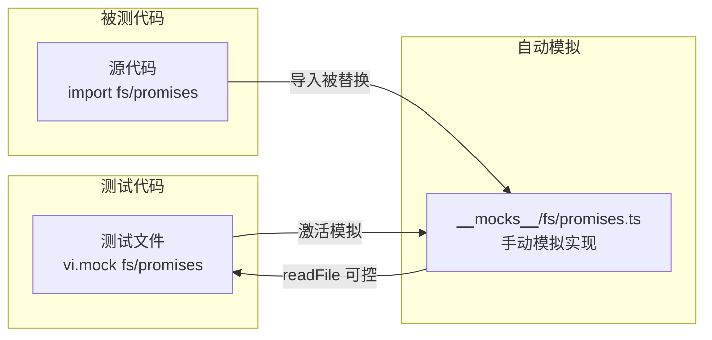

# __mocks__

## 概述

`__mocks__` 目录提供了 Vitest/Jest 自动模拟 (auto-mock) 机制所使用的手动模拟文件。该目录遵循测试框架约定，当测试中模拟 Node.js 内置模块时，框架会自动查找此目录下的对应模拟实现。目前仅包含 `fs/promises` 模块的部分模拟。

## 目录结构

```
__mocks__/
└── fs/
    └── promises.ts    # Node.js fs/promises 模块的手动模拟
```

## 架构图



## 核心组件

### `fs/promises.ts`
- **职责**: 提供 `node:fs/promises` 模块的选择性模拟
- **模拟策略**:
  - `readFile` - 使用 `vi.fn()` 替换为可控的 mock 函数
  - 其他所有导出 (`access`, `mkdir`, `writeFile`, `stat`, `rm` 等) - 透传到真实的 `node:fs/promises` 模块
- **控制接口**: 导出 `mockControl` 对象，供测试代码访问和配置 mock

```typescript
export const mockControl = {
  mockReadFile: readFileMock,  // vi.fn() 实例
};
```

### 使用示例
```typescript
// 在测试文件中
import { mockControl } from '../__mocks__/fs/promises';

mockControl.mockReadFile.mockResolvedValue('文件内容');
```

## 依赖关系

### 内部依赖
无内部模块依赖。

### 外部依赖
- `vitest` - 测试框架 (`vi.fn()`)
- `node:fs/promises` - 被模拟的 Node.js 原生模块

## 数据流

### 模拟激活流程
1. 测试文件中调用 `vi.mock('fs/promises')` 或框架自动发现此目录
2. Vitest 加载 `__mocks__/fs/promises.ts` 替换真实模块
3. 被测代码中对 `fs.readFile` 的调用被重定向到 mock 函数
4. 测试通过 `mockControl.mockReadFile` 配置返回值或行为
5. 其他 fs/promises 方法（如 `mkdir`, `writeFile`）使用真实实现
