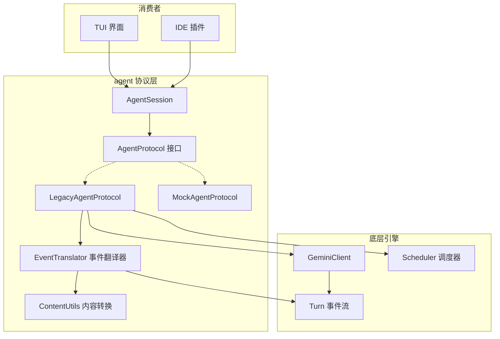
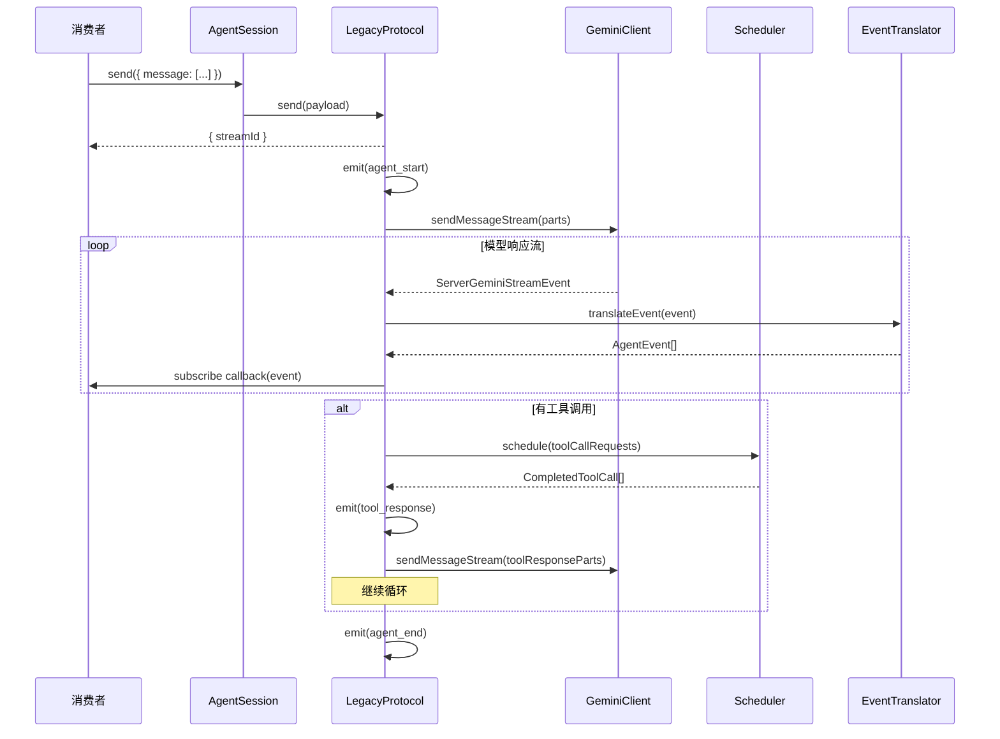

# agent (Agent 协议与会话层)

## 概述

`agent/` 目录定义了 Gemini CLI 的 **Agent 协议抽象层**，是上层消费者（TUI、IDE 插件等）与底层 Agent 执行引擎之间的统一接口。它通过 `AgentProtocol` 接口规范了 Agent 的事件驱动通信模型，并提供了 `AgentSession` 包装类将事件流转换为更便捷的 `AsyncIterable` API。

该层的核心设计思想是**协议与实现分离**：上层只依赖 `AgentProtocol` 接口，底层可以有不同的实现（如 `LegacyAgentProtocol` 基于现有的 GeminiClient + Scheduler 循环）。

## 目录结构

```
agent/
├── types.ts                  # 核心类型定义（AgentProtocol、AgentEvent 等）
├── agent-session.ts          # AgentSession 会话包装类
├── legacy-agent-session.ts   # 基于旧版 GeminiClient 的协议实现
├── event-translator.ts       # ServerGeminiStreamEvent -> AgentEvent 翻译器
├── content-utils.ts          # Gemini Part <-> ContentPart 转换工具
├── mock.ts                   # 测试用 MockAgentProtocol
├── *.test.ts                 # 对应的单元测试文件
```

## 架构图



## 核心组件

### AgentProtocol (types.ts)

Agent 协议接口，定义了与 Agent 交互的三个核心方法：

```typescript
interface AgentProtocol extends Trajectory {
  send(payload: AgentSend): Promise<{ streamId: string | null }>;
  subscribe(callback: (event: AgentEvent) => void): Unsubscribe;
  abort(): Promise<void>;
  readonly events: readonly AgentEvent[];
}
```

- **`send()`**: 向 Agent 发送消息/引出响应/配置更新，返回 `streamId` 用于关联后续事件
- **`subscribe()`**: 订阅所有未来事件，返回取消订阅函数
- **`abort()`**: 中止当前活跃的 Agent 活动流

### AgentEvent 事件体系 (types.ts)

所有事件共享 `AgentEventCommon` 基础字段（`id`、`streamId`、`timestamp`、`type`），通过联合类型实现类型判别：

| 事件类型 | 说明 |
|---------|------|
| `initialize` | 会话初始化，绑定 Agent 和 sessionId |
| `session_update` | 会话配置更新（标题、模型等） |
| `message` | 消息内容（用户/Agent/开发者） |
| `agent_start` | Agent 活动流开始 |
| `agent_end` | Agent 活动流结束，附带终止原因 |
| `tool_request` | Agent 发起的工具调用请求 |
| `tool_update` | 长时间运行工具的中间更新 |
| `tool_response` | 工具调用结果 |
| `elicitation_request` | 向用户请求输入 |
| `elicitation_response` | 用户对引出请求的响应 |
| `usage` | Token 使用量报告 |
| `error` | 错误报告 |
| `custom` | 自定义事件 |

### ContentPart 类型 (types.ts)

框架无关的内容片段类型，支持：
- `text` -- 纯文本
- `thought` -- 模型思考输出
- `media` -- 富媒体（图片/视频/PDF 等）
- `reference` -- 内联资源引用（如 @-mention 文件）

### AgentSession (agent-session.ts)

`AgentProtocol` 的便捷包装类，增加了两个高级方法：

- **`sendStream(payload)`**: 发送消息并返回 `AsyncIterable<AgentEvent>`，自动关联到新创建的流
- **`stream(options)`**: 返回 `AsyncIterable`，支持从历史事件重放（`eventId`）、重新附加到现有流（`streamId`）

内部通过事件队列和 Promise 链实现异步迭代，确保不丢失事件。

### LegacyAgentSession (legacy-agent-session.ts)

基于现有 `GeminiClient` + `Scheduler` 循环的 `AgentProtocol` 实现。核心工作流：

1. `send()` 接收用户消息，转换为 Gemini API `Part[]`
2. 启动异步运行循环 `_runLoop()`
3. 在循环中调用 `client.sendMessageStream()` 获取模型响应
4. 通过 `EventTranslator` 将 `ServerGeminiStreamEvent` 转换为 `AgentEvent` 并分发
5. 如有工具调用，通过 `Scheduler.schedule()` 执行后继续循环
6. 直到模型完成/错误/中止时发出 `agent_end` 事件

### EventTranslator (event-translator.ts)

纯函数式、无状态的事件翻译模块，将底层 `ServerGeminiStreamEvent` 一对多映射为 `AgentEvent[]`。维护 `TranslationState` 跟踪流状态（streamId、事件计数器、待处理工具名等）。

主要映射关系：
- `GeminiEventType.Content` -> `message` (role: agent)
- `GeminiEventType.Thought` -> `message` (type: thought)
- `GeminiEventType.ToolCallRequest` -> `tool_request`
- `GeminiEventType.ToolCallResponse` -> `tool_response`
- `GeminiEventType.Finished` -> `usage`
- `GeminiEventType.Error` -> `error`
- `GeminiEventType.UserCancelled` -> `agent_end` (reason: aborted)

还提供了 `mapFinishReason()`、`mapHttpToGrpcStatus()`、`mapError()` 等公共映射函数。

### ContentUtils (content-utils.ts)

Gemini API `Part` 与框架无关 `ContentPart` 之间的双向转换：

- **`geminiPartsToContentParts()`**: Gemini Part[] -> ContentPart[]
- **`contentPartsToGeminiParts()`**: ContentPart[] -> Gemini Part[]
- **`toolResultDisplayToContentParts()`**: 工具结果展示内容转换
- **`buildToolResponseData()`**: 构建 tool_response 事件的 data 字段

### MockAgentProtocol (mock.ts)

测试用的 Mock 实现，支持：
- `pushResponse()` 预设响应序列
- `pushToStream()` 向已有流追加事件
- 自动生成 `agent_start`/`agent_end` 包围事件

## 依赖关系

### 内部依赖

- `core/turn.ts` -- `ServerGeminiStreamEvent`、`GeminiEventType` 等底层事件类型
- `core/client.ts` -- `GeminiClient` 客户端
- `core/geminiChat.ts` -- `GeminiChat` 聊天管理
- `scheduler/scheduler.ts` -- `Scheduler` 工具调度器
- `config/config.ts` -- `Config` 配置对象
- `tools/tool-error.ts` -- 工具错误类型
- `code_assist/telemetry.ts` -- 工具调用遥测记录

### 外部依赖

- `@google/genai` -- `Part`、`FinishReason` 等 API 类型

## 数据流

### send() -> 事件流 的完整生命周期


