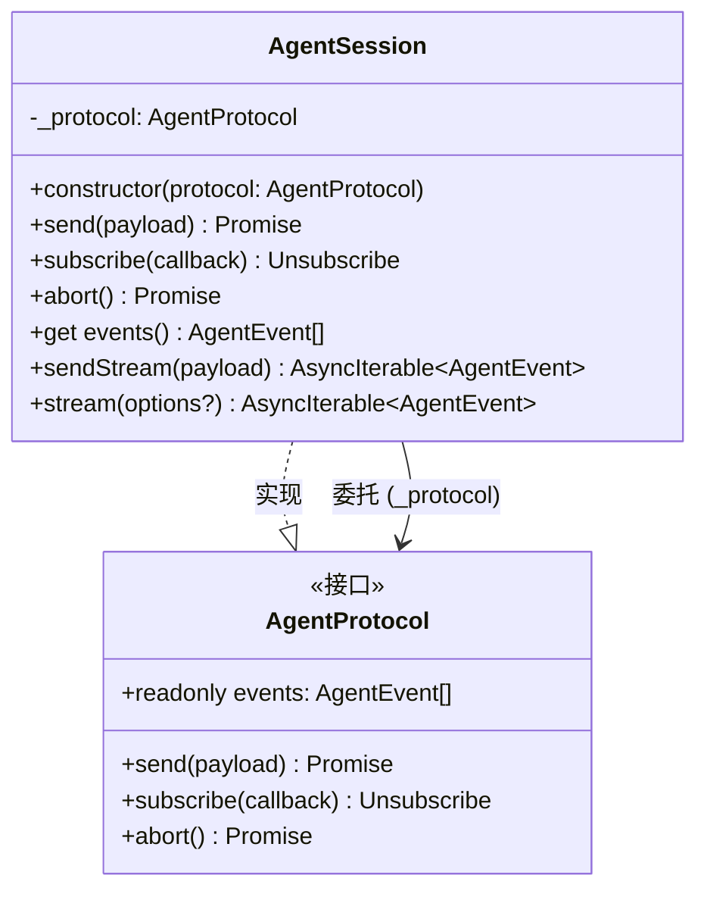
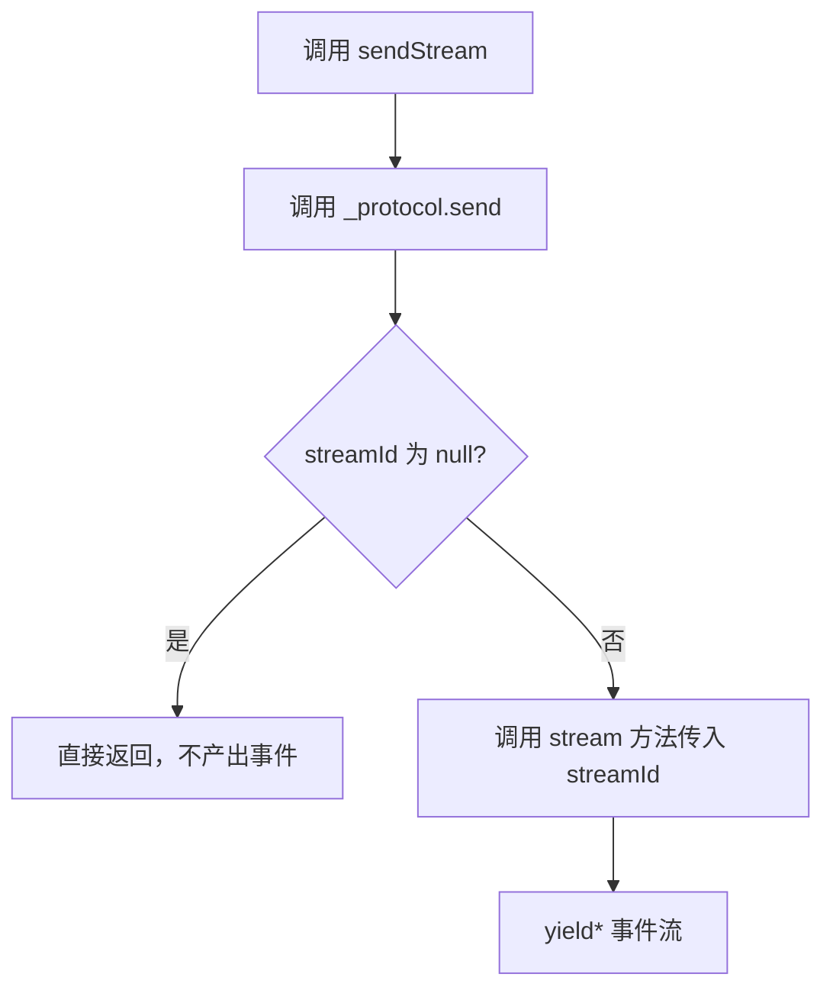
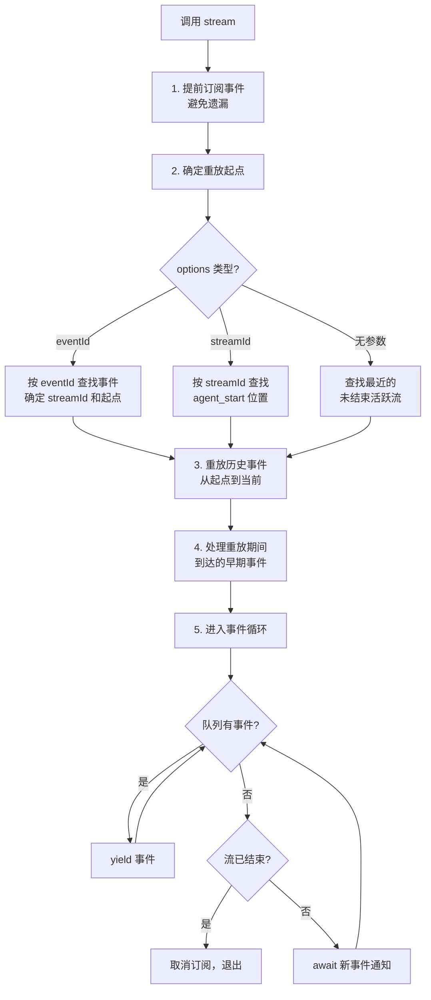
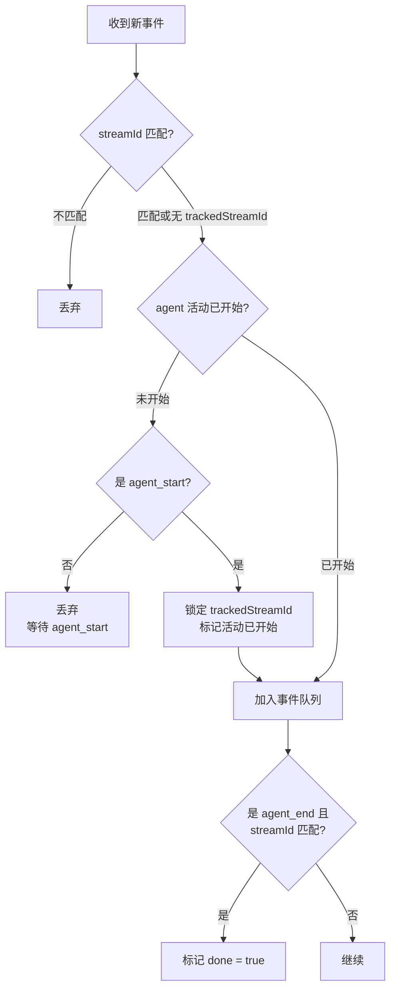

# agent-session.ts

## 概述

`agent-session.ts` 是 Agent 模块的**会话包装层**，提供了 `AgentSession` 类。该类是对底层 `AgentProtocol` 的高层封装，核心价值在于将 Agent 的事件订阅模型（回调 + `subscribe`）转换为更便于消费的 `AsyncIterable` 模式（`stream` / `sendStream`）。

该文件的核心职责：
- **委托代理**：将 `AgentProtocol` 的 `send`、`subscribe`、`abort`、`events` 全部委托给底层协议实例
- **异步迭代器模式**：提供 `sendStream()` 和 `stream()` 方法，将事件流转换为 `AsyncIterable<AgentEvent>`
- **事件重放**：支持从历史事件中恢复/重放，通过 `eventId` 或 `streamId` 定位重放起点
- **流过滤**：只 yield 属于特定 `streamId` 的事件，从 `agent_start` 到 `agent_end`
- **无遗漏订阅**：在重放设置期间提前订阅，确保不遗漏并发到达的事件

## 架构图



### sendStream 流程



### stream 方法核心流程



### 事件过滤逻辑



## 核心组件

### 类: `AgentSession`

`AgentProtocol` 的高层包装类，同时实现 `AgentProtocol` 接口并提供额外的异步迭代器方法。

#### 构造函数
```typescript
constructor(protocol: AgentProtocol)
```
接受一个底层 `AgentProtocol` 实例进行包装。

#### 委托方法

##### `send(payload: AgentSend): Promise<{ streamId: string | null }>`
直接委托给 `_protocol.send(payload)`。

##### `subscribe(callback: (event: AgentEvent) => void): Unsubscribe`
直接委托给 `_protocol.subscribe(callback)`。

##### `abort(): Promise<void>`
直接委托给 `_protocol.abort()`。

##### `get events(): readonly AgentEvent[]`
直接返回 `_protocol.events`。

---

#### 扩展方法

##### `async *sendStream(payload: AgentSend): AsyncIterable<AgentEvent>`
发送载荷并返回结果事件流的异步迭代器。

**参数：**
- `payload: AgentSend` — 发送给 Agent 的载荷

**返回值：** `AsyncIterable<AgentEvent>` — 该次发送产生的事件流

**行为：**
1. 调用 `_protocol.send(payload)` 获取 `streamId`
2. 若 `streamId` 为 `null`（发送被确认但未启动 Agent 活动），立即返回空迭代器
3. 否则委托给 `stream({ streamId })` 产出事件

---

##### `async *stream(options?: { eventId?: string; streamId?: string }): AsyncIterable<AgentEvent>`
返回事件流的异步迭代器，支持从历史重放和重新连接到已有流。

**参数 options：**
- `eventId?: string` — 从指定事件 ID 之后恢复重放
- `streamId?: string` — 连接到指定流 ID 的事件
- 无参数 — 自动查找最近的未结束活跃流

**返回值：** `AsyncIterable<AgentEvent>` — 从 `agent_start` 到 `agent_end` 的事件流

**重放策略（按 options 分类）：**

1. **`eventId` 模式**：
   - 在历史事件中查找指定 ID 的事件，确定其 `streamId`
   - 若该事件是 `agent_end`：标记 done，仅重放该事件之后的历史（通常为空）
   - 若 `agent_start` 已存在且在该事件之前或等于该事件：从该事件之后开始重放
   - 若 `agent_start` 存在但在该事件之后：从 `agent_start` 开始重放（因为 stream 只 yield agent_start 到 agent_end）
   - 若 `agent_start` 不存在：**抛出异常**，因为无法区分"Agent 活动将稍后开始"和"此次 send 不会启动 Agent 活动"

2. **`streamId` 模式**：
   - 在历史事件中查找该流的 `agent_start` 事件
   - 若找到，从 `agent_start` 位置开始重放
   - 若未找到，等待未来事件

3. **无参数模式**：
   - 从后向前扫描所有 `agent_start` 事件
   - 找到第一个没有对应 `agent_end` 的 `agent_start`（最近的活跃流）
   - 从该 `agent_start` 位置开始重放

**事件循环机制：**
- 使用 `Promise` 链实现事件通知：每次有新事件时 resolve 当前 Promise 并创建新 Promise
- 事件队列采用批量 yield：一次性 yield 队列中所有事件后清空队列
- `done` 标志在收到 `agent_end` 时设置，循环在清空队列后退出
- `finally` 块确保取消订阅

## 依赖关系

### 内部依赖
| 依赖模块 | 导入内容 | 用途 |
|---|---|---|
| `./types.js` | `AgentProtocol`, `AgentSend`, `AgentEvent`, `Unsubscribe` (类型) | Agent 协议接口和类型 |

### 外部依赖
无。

## 关键实现细节

1. **无遗漏事件保证**：`stream()` 方法在开始重放历史事件**之前**就订阅了实时事件（步骤 1）。重放设置期间到达的事件被暂存到 `earlyEvents` 数组中，重放完成后立即处理。这确保了从历史到实时的无缝过渡，不会遗漏任何事件。

2. **Promise 链通知机制**：使用经典的 Promise 链模式实现异步等待：
   ```
   let resolve; let next = new Promise(r => resolve = r);
   // 新事件到达时：
   const currentResolve = resolve;
   next = new Promise(r => resolve = r);
   currentResolve();
   // 消费者等待：
   await next;
   ```
   每次有新事件时，resolve 当前 Promise（唤醒消费者），同时创建新的 Promise 供下一次等待。

3. **`agent_start` 门控**：`queueVisibleEvent` 函数实现了一个门控逻辑——在收到 `agent_start` 之前，所有事件都被忽略。`agent_start` 是打开门控的钥匙，同时锁定 `trackedStreamId`。这确保了流的边界清晰。

4. **批量 yield**：事件循环中，每次从队列取出**所有**积压事件一次性 yield，而不是逐个 await + yield。这避免了高频事件场景下的性能问题。

5. **自动资源清理**：`try/finally` 确保迭代器被垃圾回收或 `break` 退出时，订阅会被正确取消，防止内存泄漏。

6. **装饰器模式**：`AgentSession` 采用经典的装饰器模式，包装 `AgentProtocol` 并添加 `sendStream` 和 `stream` 两个额外方法，同时保持原始接口的完整性。消费者可以将 `AgentSession` 当作 `AgentProtocol` 使用。

7. **错误处理**：`stream()` 在以下情况抛出异常：
   - `eventId` 指向不存在的事件：`Unknown eventId: ...`
   - `eventId` 指向一个 `agent_start` 还未出现的流：`Cannot resume from eventId ... before agent_start for stream ...`
