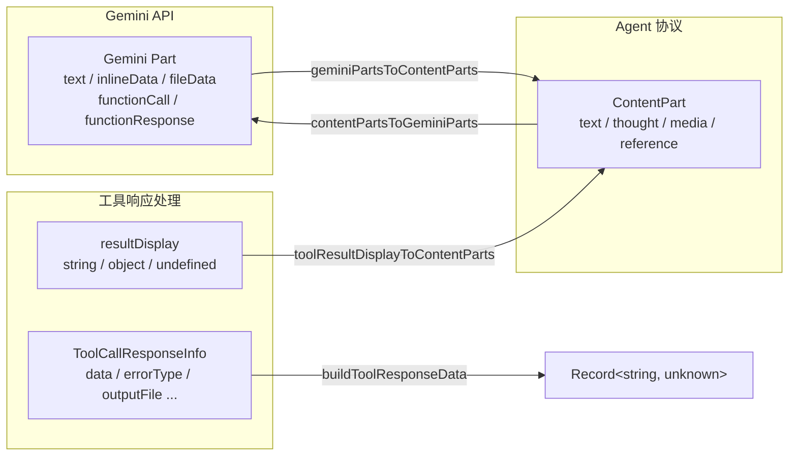
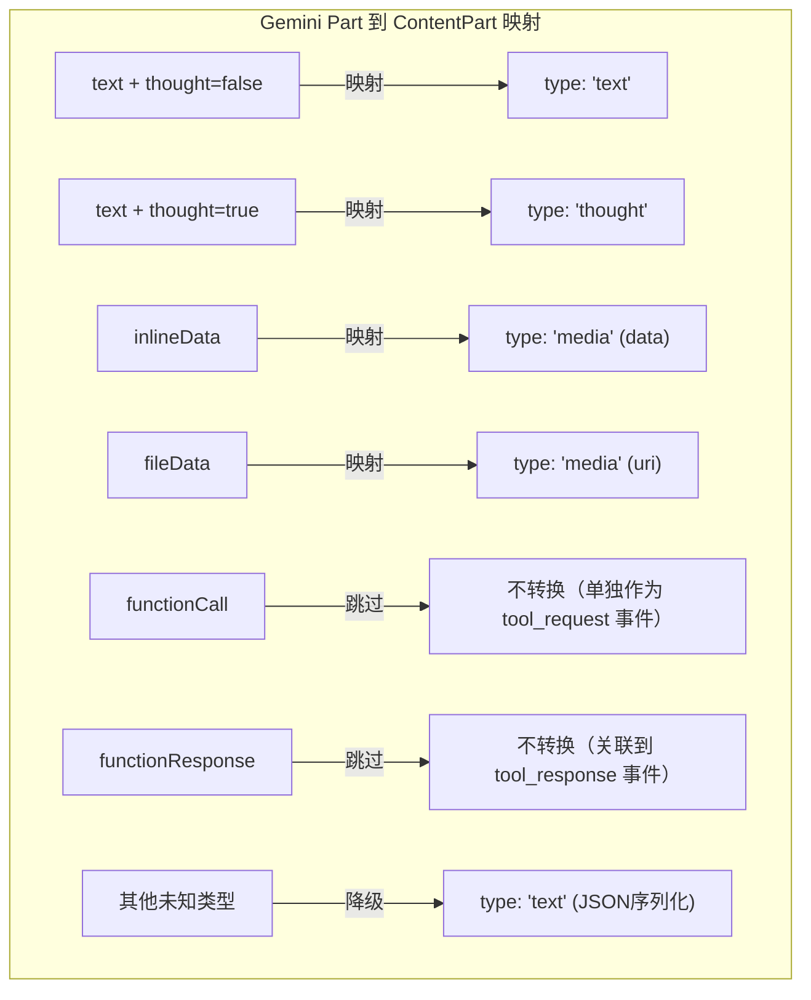
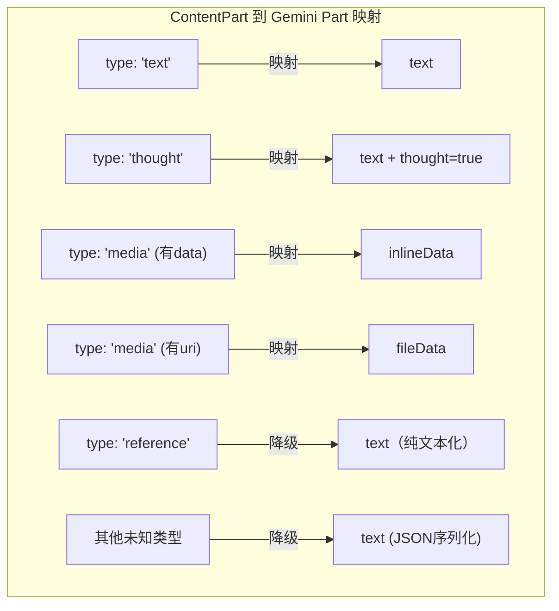

# content-utils.ts

## 概述

`content-utils.ts` 是 Agent 模块的**内容转换工具集**，负责在 Gemini API 的 `Part` 对象与框架无关的 `ContentPart` 对象之间进行双向转换。它充当 Gemini 模型原生数据格式与 Agent 协议内部格式之间的适配层（Adapter）。

该文件的核心职责：
- **Gemini -> ContentPart**：将 Gemini API 返回的 `Part[]` 转换为框架无关的 `ContentPart[]`，处理文本、思考、内联数据、文件数据等多种类型
- **ContentPart -> Gemini**：将 `ContentPart[]` 转换回 Gemini API 的 `Part[]`，供模型调用使用
- **工具结果展示转换**：将工具调用的展示结果（`resultDisplay`）统一转换为 `ContentPart[]`
- **工具响应数据构建**：从工具调用响应信息中提取并整合元数据

## 架构图

### 类型映射关系

## 核心组件

### 函数

#### `geminiPartsToContentParts(parts: Part[]): ContentPart[]`

将 Gemini API 的 `Part` 对象数组转换为框架无关的 `ContentPart` 数组。

**参数：**
- `parts: Part[]` — Gemini API 返回的内容部件数组

**返回值：** `ContentPart[]` — 转换后的框架无关内容部件数组

**转换规则：**
| Gemini Part 类型 | 条件 | 转换目标 |
|---|---|---|
| `text` | `thought` 为 `false` 或不存在 | `{ type: 'text', text }` |
| `text` | `thought` 为 `true` | `{ type: 'thought', thought, thoughtSignature? }` |
| `inlineData` | 存在 | `{ type: 'media', data, mimeType }` |
| `fileData` | 存在 | `{ type: 'media', uri, mimeType }` |
| `functionCall` | 存在 | **跳过**（作为独立的 `tool_request` 事件发出） |
| `functionResponse` | 存在 | **跳过**（关联到 `tool_response` 事件） |
| 其他 | 无法识别 | `{ type: 'text', text: JSON.stringify(part), _meta: { partType: 'unknown' } }` |

---

#### `contentPartsToGeminiParts(content: ContentPart[]): Part[]`

将框架无关的 `ContentPart` 对象数组转换为 Gemini API 的 `Part` 数组。

**参数：**
- `content: ContentPart[]` — 框架无关的内容部件数组

**返回值：** `Part[]` — Gemini API 格式的内容部件数组

**转换规则：**
| ContentPart 类型 | 转换目标 |
|---|---|
| `text` | `{ text }` |
| `thought` | `{ text, thought: true, thoughtSignature? }` |
| `media` (有 `data`) | `{ inlineData: { data, mimeType } }` — mimeType 默认 `'application/octet-stream'` |
| `media` (有 `uri`) | `{ fileData: { fileUri, mimeType } }` |
| `reference` | `{ text }` — 引用被降级为纯文本 |
| 其他/未知 | `{ text: JSON.stringify(part) }` — JSON 序列化降级 |

---

#### `toolResultDisplayToContentParts(resultDisplay: unknown): ContentPart[] | undefined`

将工具调用的展示结果转换为 `ContentPart[]`。

**参数：**
- `resultDisplay: unknown` — 工具调用结果展示值，可能是 `string`、对象（如 `FileDiff`、`SubagentProgress` 等）或 `undefined`

**返回值：** `ContentPart[] | undefined`
- 若输入为 `undefined` 或 `null`，返回 `undefined`
- 若输入为 `string`，直接包装为 `[{ type: 'text', text }]`
- 若输入为对象，先 `JSON.stringify` 后再包装为文本内容

---

#### `buildToolResponseData(response: {...}): Record<string, unknown> | undefined`

从工具调用响应信息中构建结构化数据记录。

**参数：**
- `response` 对象，包含以下可选字段：
  - `data?: Record<string, unknown>` — 原始数据（会被展开合并）
  - `errorType?: string` — 错误类型
  - `outputFile?: string` — 输出文件路径
  - `contentLength?: number` — 内容长度

**返回值：** `Record<string, unknown> | undefined`
- 若有任何有效字段，返回合并后的数据对象
- 若所有字段都为空，返回 `undefined`

## 依赖关系

### 内部依赖
| 依赖模块 | 导入内容 | 用途 |
|---|---|---|
| `./types.js` | `ContentPart` (类型) | 框架无关的内容部件类型定义 |

### 外部依赖
| 依赖包 | 导入内容 | 用途 |
|---|---|---|
| `@google/genai` | `Part` (类型) | Gemini API 的内容部件类型定义 |

## 关键实现细节

1. **无损降级策略**：对于无法识别的 `Part` 类型或 `ContentPart` 类型，文件采用 JSON 序列化降级为文本的策略（`JSON.stringify(part)`），而非静默丢弃数据。`geminiPartsToContentParts` 中还会附加 `_meta: { partType: 'unknown' }` 元数据标记。

2. **functionCall/functionResponse 跳过处理**：Gemini API 的函数调用和函数响应 `Part` 不会被转换为 `ContentPart`，因为它们在 Agent 协议中作为独立的 `tool_request` 和 `tool_response` 事件处理，避免重复。

3. **media 类型的双模式**：`ContentPart` 的 `media` 类型同时支持内联数据（`data` 字段，base64 编码）和外部 URI 引用（`uri` 字段），分别对应 Gemini API 的 `inlineData` 和 `fileData`。转换时通过 `data` 优先级高于 `uri` 来判断。

4. **reference 降级**：`reference` 类型在转换为 Gemini Part 时被降级为纯文本（`{ text: part.text }`），因为 Gemini API 没有对应的引用概念。

5. **mimeType 默认值**：`media` 类型中有 `data` 但无 `mimeType` 时，使用 `'application/octet-stream'` 作为默认 MIME 类型，确保 Gemini API 调用不会因缺少 mimeType 而失败。

6. **`buildToolResponseData` 的合并策略**：`response.data` 中的字段会被展开（`Object.assign`）到结果对象中，而 `errorType`、`outputFile`、`contentLength` 作为额外字段添加。这意味着如果 `response.data` 中已有同名键，额外字段会覆盖它们。
