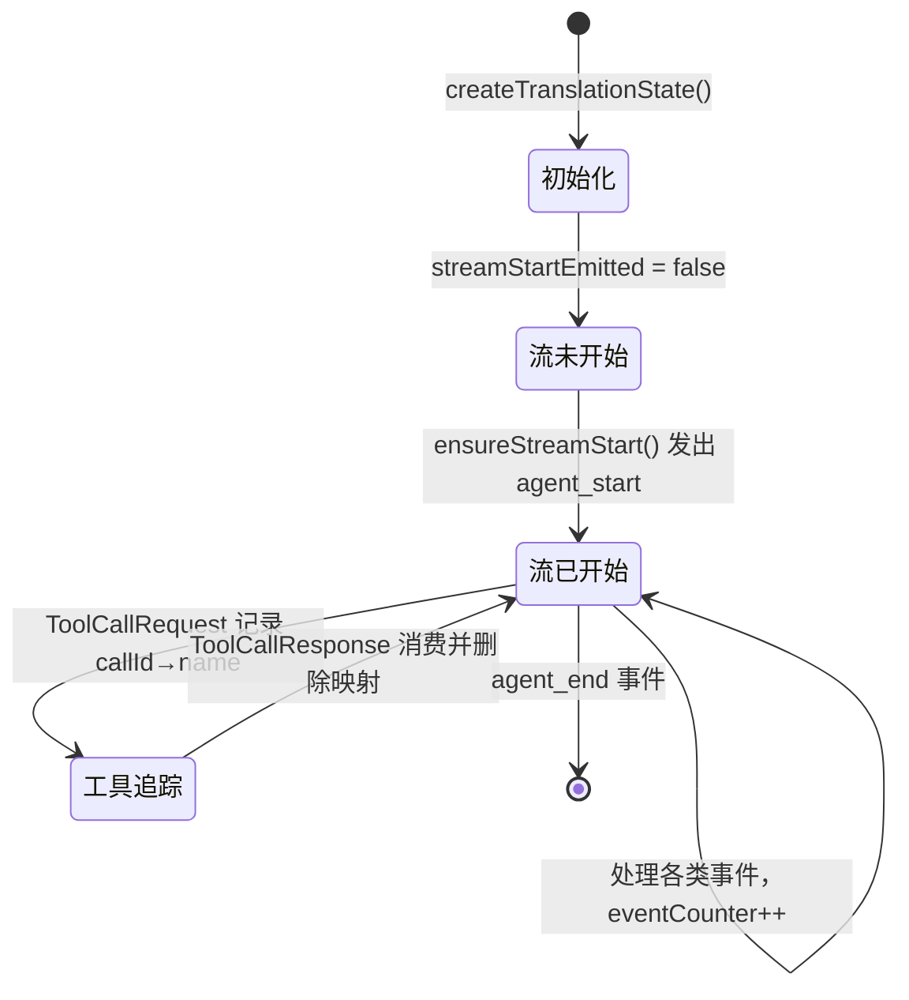
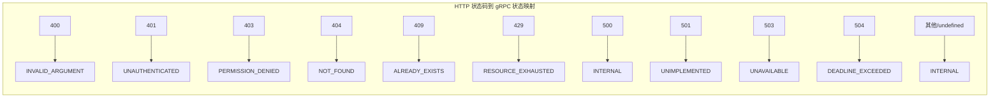
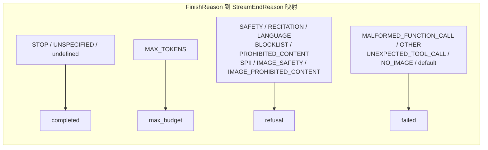

# event-translator.ts

## 概述

`event-translator.ts` 是 Agent 模块的**事件翻译层**，负责将 Gemini 服务端流事件（`ServerGeminiStreamEvent`）翻译为框架无关的 Agent 事件（`AgentEvent`）。它是一组纯粹的、无状态（per-call）的翻译函数集合，核心函数 `translateEvent` 接收一个 Gemini 事件和可变的翻译状态，返回零个或多个 `AgentEvent`。

该文件的核心职责：
- **事件翻译**：将 Gemini 的 14+ 种流事件类型映射为 Agent 协议的标准事件
- **状态管理**：通过 `TranslationState` 跟踪流 ID、事件计数器、工具名称等翻译过程中的状态
- **错误映射**：将 HTTP 状态码映射为 gRPC 风格的错误状态字符串
- **完成原因映射**：将 Gemini 的 `FinishReason` 映射为 Agent 协议的 `StreamEndReason`
- **使用量映射**：将 Gemini 的 token 使用量元数据转换为标准 `Usage` 格式

## 架构图

```mermaid
flowchart TD
    subgraph 输入
        SGE[ServerGeminiStreamEvent<br/>Gemini 服务端流事件]
        TS[TranslationState<br/>翻译状态]
    end

    SGE --> TE[translateEvent<br/>核心翻译函数]
    TS --> TE

    TE --> AE[AgentEvent[]<br/>Agent 事件数组]

    subgraph translateEvent 内部路由
        MC[ModelInfo] --> SU[session_update]
        CO[Content] --> MSG[message 文本]
        TH[Thought] --> MSGT[message 思考]
        CT[Citation] --> MSGC[message 引用]
        FI[Finished] --> US[usage]
        ER[Error] --> ERR[error]
        UC[UserCancelled] --> AEA[agent_end 中止]
        MST[MaxSessionTurns] --> AEM[agent_end 最大轮次]
        LD[LoopDetected] --> ERRL[error 循环检测]
        CWO[ContextWindowWillOverflow] --> ERRR[error 资源耗尽]
        AES[AgentExecutionStopped] --> AEC[agent_end 完成]
        AEB[AgentExecutionBlocked] --> ERRP[error 权限拒绝]
        IS[InvalidStream] --> ERRI[error 无效流]
        TCR[ToolCallRequest] --> TR[tool_request]
        TCRES[ToolCallResponse] --> TRES[tool_response]
        TCC[ToolCallConfirmation] -->|跳过| SKIP1[无事件]
        CC[ChatCompressed] -->|跳过| SKIP2[无事件]
        RT[Retry] -->|跳过| SKIP3[无事件]
    end
```

### 翻译状态生命周期



### 错误映射关系



### 完成原因映射



## 核心组件

### 接口

#### `TranslationState`
```typescript
export interface TranslationState {
  streamId: string;                         // 当前流的唯一标识
  streamStartEmitted: boolean;              // agent_start 事件是否已发出
  model: string | undefined;                // 当前使用的模型名称
  eventCounter: number;                     // 事件计数器，用于生成唯一事件 ID
  pendingToolNames: Map<string, string>;    // callId → 工具名称映射
}
```
翻译过程中的可变状态。每个翻译流创建一个实例，在整个流的生命周期内共享。

---

### 工厂函数

#### `createTranslationState(streamId?: string): TranslationState`
创建新的翻译状态实例。

**参数：**
- `streamId?: string` — 可选的流 ID，若不提供则使用 `crypto.randomUUID()` 自动生成

**返回值：** 初始化后的 `TranslationState`，`streamStartEmitted` 为 `false`，`eventCounter` 为 `0`，`pendingToolNames` 为空 Map。

---

### 核心翻译函数

#### `translateEvent(event: ServerGeminiStreamEvent, state: TranslationState): AgentEvent[]`
将单个 Gemini 服务端流事件翻译为零个或多个 Agent 事件。

**参数：**
- `event: ServerGeminiStreamEvent` — Gemini 服务端流事件
- `state: TranslationState` — 可变翻译状态（会被修改）

**返回值：** `AgentEvent[]` — 翻译后的 Agent 事件数组（可能为空）

**副作用：** 修改 `state` 的 `eventCounter`、`streamStartEmitted`、`model`、`pendingToolNames`。

**事件映射表：**

| Gemini 事件类型 | 产生的 Agent 事件 | 说明 |
|---|---|---|
| `ModelInfo` | `session_update` | 记录模型名称并发出会话更新 |
| `Content` | `message` (role: agent) | 文本内容 |
| `Thought` | `message` (role: agent, type: thought) | 思考过程，附带 subject 元数据 |
| `Citation` | `message` (role: agent, _meta: citation) | 引用信息 |
| `Finished` | `usage` | 仅在有 usageMetadata 时发出 |
| `Error` | `error` | 通过 `mapError` 映射错误 |
| `UserCancelled` | `agent_end` (reason: aborted) | 用户取消 |
| `MaxSessionTurns` | `agent_end` (reason: max_turns) | 超过最大轮次 |
| `LoopDetected` | `error` (status: INTERNAL, fatal: false) | 检测到循环 |
| `ContextWindowWillOverflow` | `error` (status: RESOURCE_EXHAUSTED, fatal: true) | 上下文窗口溢出 |
| `AgentExecutionStopped` | `agent_end` (reason: completed) | Agent 主动停止 |
| `AgentExecutionBlocked` | `error` (status: PERMISSION_DENIED, fatal: false) | Agent 被阻止执行 |
| `InvalidStream` | `error` (status: INTERNAL, fatal: true) | 无效流 |
| `ToolCallRequest` | `tool_request` | 工具调用请求 |
| `ToolCallResponse` | `tool_response` | 工具调用响应 |
| `ToolCallConfirmation` | **无** | 由会话层单独处理 |
| `ChatCompressed` | **无** | 内部关注事项 |
| `Retry` | **无** | 内部关注事项 |

---

### 内部辅助函数

#### `makeEvent<T>(type: T, state: TranslationState, payload: Partial<AgentEvent<T>>): AgentEvent`
构造 Agent 事件对象，自动填充 `id`（格式：`{streamId}-{counter}`）、`timestamp`（ISO 格式）、`streamId` 和 `type`。

#### `ensureStreamStart(state: TranslationState, out: AgentEvent[]): void`
确保 `agent_start` 事件在流的第一个实际事件之前被发出。使用 `streamStartEmitted` 标志避免重复发出。

#### `handleFinished(value: GeminiFinishedEventValue, state: TranslationState, out: AgentEvent[]): void`
处理 Gemini 的 `Finished` 事件，提取 `usageMetadata` 并映射为 `usage` 事件。

#### `handleError(error: unknown, state: TranslationState, out: AgentEvent[]): void`
处理 Gemini 的 `Error` 事件，通过 `mapError` 映射后发出 `error` 事件。

---

### 公共映射函数

#### `mapFinishReason(reason: FinishReason | undefined): StreamEndReason`
将 Gemini 的 `FinishReason` 映射为 Agent 协议的 `StreamEndReason`。

**映射规则：**
- `undefined` / `'STOP'` / `'FINISH_REASON_UNSPECIFIED'` -> `'completed'`
- `'MAX_TOKENS'` -> `'max_budget'`
- 安全相关（`SAFETY`, `RECITATION`, `LANGUAGE`, `BLOCKLIST`, `PROHIBITED_CONTENT`, `SPII`, `IMAGE_SAFETY`, `IMAGE_PROHIBITED_CONTENT`） -> `'refusal'`
- 其他 (`MALFORMED_FUNCTION_CALL`, `OTHER`, `UNEXPECTED_TOOL_CALL`, `NO_IMAGE`, default) -> `'failed'`

---

#### `mapHttpToGrpcStatus(httpStatus: number | undefined): ErrorData['status']`
将 HTTP 状态码映射为 gRPC 风格的状态字符串。

---

#### `mapError(error: unknown): ErrorData & { _meta?: Record<string, unknown> }`
将错误对象（`StructuredError` / `Error` / 其他）映射为 `ErrorData` 载荷。

**处理优先级：**
1. **`StructuredError`**（有 `message` 和可选 `status`）：使用 `mapHttpToGrpcStatus` 映射状态，`fatal: true`，保留原始错误和额外元数据（`exitCode`、`code`）
2. **`Error` 实例**：状态为 `'INTERNAL'`，`fatal: true`，保留 `errorName`、`exitCode`、`code` 元数据
3. **其他值**：`String(error)` 作为 message，状态为 `'INTERNAL'`，`fatal: true`

---

#### `mapUsage(metadata: {...}, model?: string): Usage`
将 Gemini 的 `usageMetadata` 映射为标准 `Usage` 格式。

**字段映射：**
| Gemini 字段 | Agent 字段 |
|---|---|
| `promptTokenCount` | `inputTokens` |
| `candidatesTokenCount` | `outputTokens` |
| `cachedContentTokenCount` | `cachedTokens` |

---

#### `isStructuredError(error: unknown): error is StructuredError` (内部)
类型守卫函数，检查错误对象是否为 `StructuredError`（具有 `message` 字符串属性的对象）。

## 依赖关系

### 内部依赖
| 依赖模块 | 导入内容 | 用途 |
|---|---|---|
| `../core/turn.js` | `GeminiEventType` (枚举), `ServerGeminiStreamEvent`, `StructuredError`, `GeminiFinishedEventValue` (类型) | Gemini 服务端流事件定义 |
| `./types.js` | `AgentEvent`, `StreamEndReason`, `ErrorData`, `Usage`, `AgentEventType` (类型) | Agent 协议事件类型 |
| `./content-utils.js` | `geminiPartsToContentParts`, `toolResultDisplayToContentParts`, `buildToolResponseData` (函数) | 内容格式转换工具 |

### 外部依赖
| 依赖包 | 导入内容 | 用途 |
|---|---|---|
| `@google/genai` | `FinishReason` (类型) | Gemini API 完成原因枚举 |

## 关键实现细节

1. **惰性 agent_start 发出**：`ensureStreamStart` 函数确保 `agent_start` 事件在流的第一个实际业务事件之前自动发出，但只发出一次。这使得调用方无需手动管理流开始事件的时机。

2. **事件 ID 生成策略**：事件 ID 采用 `{streamId}-{counter}` 格式（如 `abc123-0`、`abc123-1`），其中 `counter` 是递增整数。这保证了同一流内事件 ID 的唯一性和有序性。

3. **工具名称追踪**：`ToolCallRequest` 事件会将 `callId -> name` 映射存入 `pendingToolNames`，`ToolCallResponse` 事件从中取出工具名称后删除映射。这解决了 Gemini 的 `ToolCallResponse` 不包含工具名称的问题。

4. **穷尽性检查**：`translateEvent` 的 `default` 分支使用 `((x: never) => ...)` 模式，确保编译时如果新增了 `GeminiEventType` 但未处理，TypeScript 会报错。

5. **静默跳过的事件**：三种事件不产生 Agent 事件：
   - `ToolCallConfirmation`：由会话层（session layer）单独处理 Elicitation
   - `ChatCompressed`：内部压缩事件
   - `Retry`：内部重试事件

6. **错误分级**：不同错误有不同的 `fatal` 标志：
   - **致命错误**（`fatal: true`）：`ContextWindowWillOverflow`、`InvalidStream`、所有通过 `mapError` 映射的错误
   - **非致命错误**（`fatal: false`）：`LoopDetected`、`AgentExecutionBlocked`

7. **所有错误默认致命**：`mapError` 函数对所有错误统一设置 `fatal: true`，这意味着 Gemini 的 `Error` 事件总是被视为致命错误。非致命错误需要在 `translateEvent` 中显式设置 `fatal: false`。
