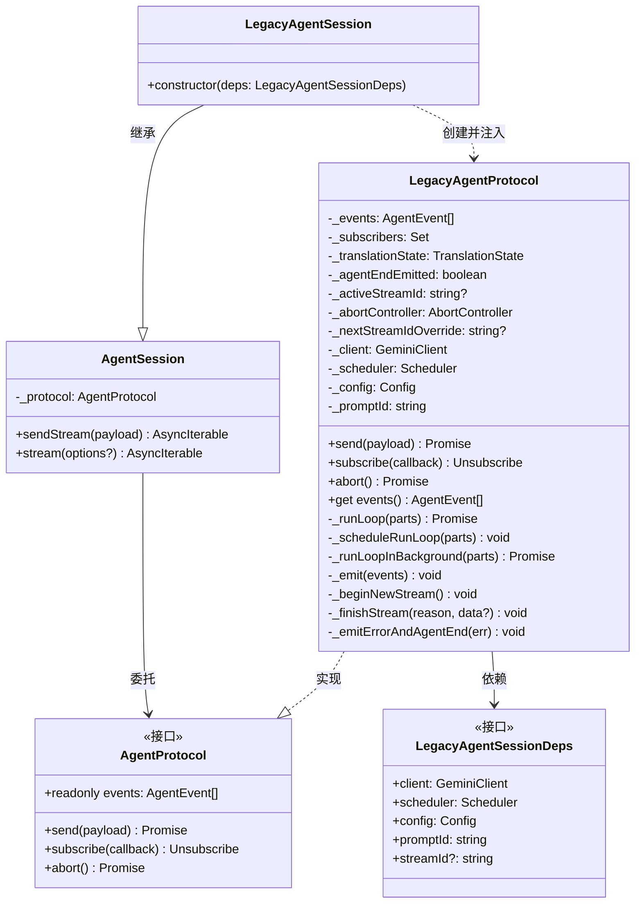
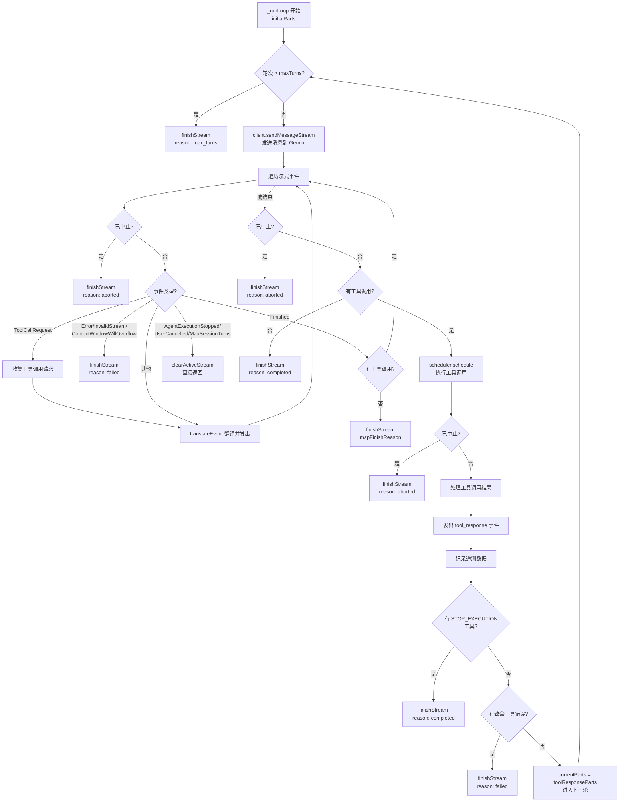
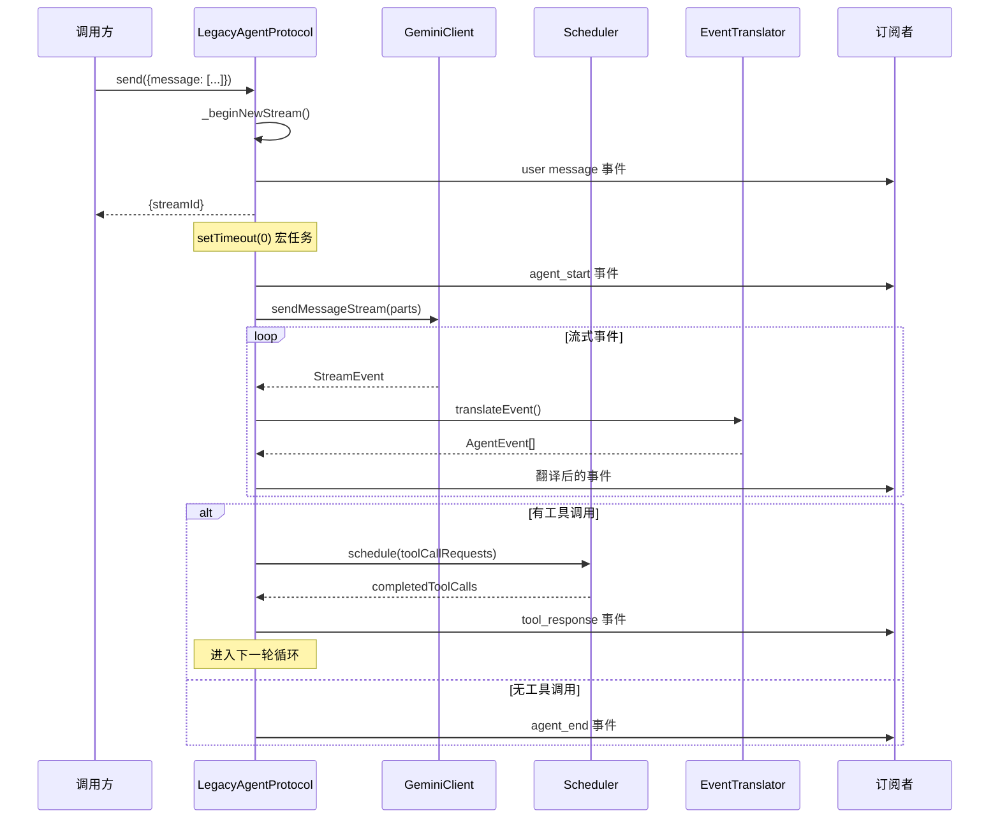
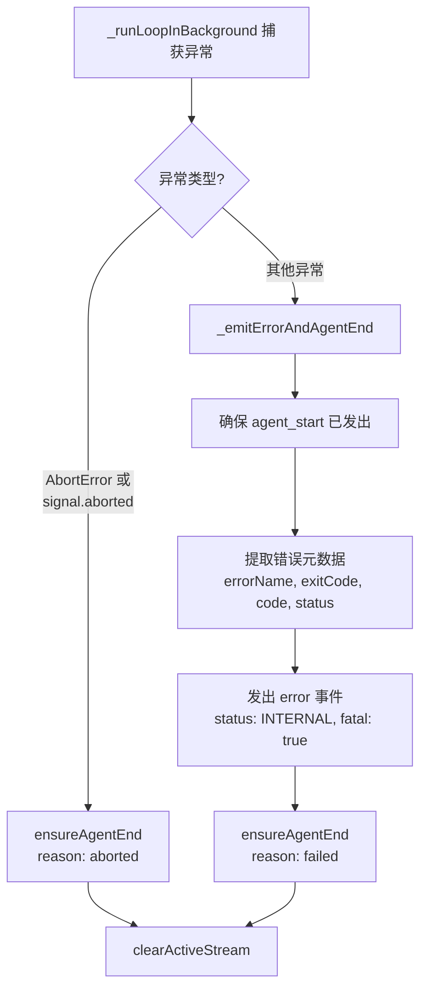

# legacy-agent-session.ts

## 概述

`legacy-agent-session.ts` 是 Agent 模块的**遗留会话实现**，提供了基于现有 Gemini Client + Scheduler 调度循环的 `AgentProtocol` 完整实现。它是将旧有的 Gemini 交互逻辑适配到新的 AgentProtocol / AgentSession 统一接口的桥梁。

该文件包含两个核心类：
- **`LegacyAgentProtocol`**（内部类）：实现 `AgentProtocol` 接口，封装完整的 Agent 运行循环（发送消息 -> 接收流式响应 -> 执行工具调用 -> 循环直到完成）
- **`LegacyAgentSession`**（导出类）：继承 `AgentSession`，将 `LegacyAgentProtocol` 注入父类，对外提供 `sendStream`/`stream` 等高层 API

核心职责：
- **Agent 运行循环**：实现"发送 -> 流式响应 -> 工具调度 -> 反馈 -> 再次发送"的多轮对话循环
- **事件翻译**：利用 `event-translator` 将 Gemini 流事件翻译为 Agent 事件
- **工具调度集成**：与 `Scheduler` 协作，并行或串行执行工具调用
- **流生命周期管理**：管理 `agent_start` / `agent_end` 的发出、中止信号传递、错误处理
- **遥测记录**：记录工具调用的遥测数据

## 架构图



### 运行循环流程（_runLoop）



### 事件发出时序



### 错误处理流程



## 核心组件

### 辅助函数

#### `isAbortLikeError(err: unknown): boolean`
```typescript
function isAbortLikeError(err: unknown): boolean
```
检查错误是否为 `AbortError`（由 `AbortController.abort()` 触发的中止信号产生）。

---

### 接口

#### `LegacyAgentSessionDeps`
```typescript
export interface LegacyAgentSessionDeps {
  client: GeminiClient;    // Gemini API 客户端
  scheduler: Scheduler;    // 工具调用调度器
  config: Config;          // 全局配置
  promptId: string;        // 提示 ID
  streamId?: string;       // 可选的初始流 ID
}
```
`LegacyAgentSession` 的依赖注入接口，封装了运行 Agent 循环所需的所有外部依赖。

---

### 类: `LegacyAgentProtocol` (内部类，不导出)

完整实现 `AgentProtocol` 接口，封装了基于 Gemini Client + Scheduler 的 Agent 运行循环。

#### 属性
| 属性 | 类型 | 说明 |
|---|---|---|
| `_events` | `AgentEvent[]` | 事件历史存储 |
| `_subscribers` | `Set<callback>` | 事件订阅者集合 |
| `_translationState` | `TranslationState` | 事件翻译状态 |
| `_agentEndEmitted` | `boolean` | agent_end 是否已发出 |
| `_activeStreamId` | `string \| undefined` | 当前活跃流 ID |
| `_abortController` | `AbortController` | 中止控制器 |
| `_nextStreamIdOverride` | `string \| undefined` | 下一次流的 ID 覆盖 |
| `_client` | `GeminiClient` (readonly) | Gemini API 客户端 |
| `_scheduler` | `Scheduler` (readonly) | 工具调度器 |
| `_config` | `Config` (readonly) | 配置 |
| `_promptId` | `string` (readonly) | 提示 ID |

#### 方法

##### `send(payload: AgentSend): Promise<{ streamId: string }>`
发送消息到 Agent。**目前仅支持 `message` 类型的载荷**，其他类型会抛出异常。不允许在流活跃期间调用（并发保护）。

**流程：**
1. 验证载荷类型为 `message`
2. 检查无活跃流（并发锁）
3. `_beginNewStream()` 初始化新流
4. 将 `ContentPart[]` 转换为 Gemini `Part[]`
5. 发出 user message 事件
6. `_scheduleRunLoop()` 通过 `setTimeout(0)` 异步启动运行循环
7. 立即返回 `streamId`

##### `abort(): Promise<void>`
调用 `_abortController.abort()` 发送中止信号。

##### `_scheduleRunLoop(initialParts: Part[]): void` (private)
通过 `setTimeout(0)` 宏任务异步启动运行循环，确保 `send()` 先返回 `streamId`。

##### `_runLoopInBackground(initialParts: Part[]): Promise<void>` (private)
运行循环的外层包装，负责发出 `agent_start` 和异常处理：
- `AbortError` / 信号已中止 -> `agent_end (aborted)`
- 其他异常 -> `_emitErrorAndAgentEnd`

##### `_runLoop(initialParts: Part[]): Promise<void>` (private)
**核心运行循环**，实现了完整的多轮对话流程：

1. **轮次检查**：若超过 `maxTurns`，以 `max_turns` 原因结束
2. **发送消息**：调用 `client.sendMessageStream()` 获取流式响应
3. **处理流事件**：
   - 收集 `ToolCallRequest`
   - 翻译并发出所有事件
   - 遇到 `Error`/`InvalidStream`/`ContextWindowWillOverflow` 立即以 `failed` 结束
   - 遇到 `Finished` 且无工具调用，以映射后的原因结束
   - 遇到 `AgentExecutionStopped`/`UserCancelled`/`MaxSessionTurns` 直接返回
4. **执行工具调用**：通过 `scheduler.schedule()` 执行所有工具调用
5. **处理工具结果**：
   - 发出 `tool_response` 事件
   - 记录遥测数据
   - 检查 `STOP_EXECUTION` 工具 -> `completed` 结束
   - 检查致命工具错误 -> `failed` 结束
6. **下一轮**：将工具响应 Parts 作为下一轮的输入继续循环

##### `_emit(events: AgentEvent[]): void` (private)
批量发出事件：添加到历史（去重）、标记 `agent_end`、通知所有订阅者。订阅者列表在遍历前被复制（snapshot），防止在回调中修改订阅者集合导致问题。

##### `_beginNewStream(): void` (private)
初始化新流：创建新的 `TranslationState`、新的 `AbortController`、重置 `agentEndEmitted`、设置 `_activeStreamId`。

##### `_ensureAgentStart(): void` (private)
确保 `agent_start` 已发出（幂等）。

##### `_ensureAgentEnd(reason?: StreamEndReason): void` (private)
确保 `agent_end` 已发出（幂等），仅在 `agent_start` 已发出且 `agent_end` 未发出时有效。

##### `_finishStream(reason: StreamEndReason, data?: Record<string, unknown>): void` (private)
结束流：发出 `agent_end` 事件并清除活跃流。若提供 `data`，直接创建带 data 的 `agent_end` 事件。

##### `_emitErrorAndAgentEnd(err: unknown): void` (private)
发出错误事件和 `agent_end` 事件。提取错误的元数据（`errorName`、`exitCode`、`code`、`status`）保存到 `_meta`，便于下游消费者重建 CLI 错误。

##### `_nextEventFields(): {...}` (private)
生成事件的公共字段（`id`、`timestamp`、`streamId`），使用 `TranslationState` 的计数器。

##### `_makeUserMessageEvent(content, meta?): AgentEvent<'message'>` (private)
创建用户消息事件。

##### `_makeToolResponseEvent(payload): AgentEvent<'tool_response'>` (private)
创建工具响应事件。

##### `_makeAgentStartEvent(): AgentEvent<'agent_start'>` (private)
创建 Agent 开始事件。

##### `_makeAgentEndEvent(reason, data?): AgentEvent<'agent_end'>` (private)
创建 Agent 结束事件。

##### `_makeErrorEvent(payload): AgentEvent<'error'>` (private)
创建错误事件。

---

### 类: `LegacyAgentSession` (导出类)

```typescript
export class LegacyAgentSession extends AgentSession {
  constructor(deps: LegacyAgentSessionDeps) {
    super(new LegacyAgentProtocol(deps));
  }
}
```

`AgentSession` 的子类，简单地将 `LegacyAgentProtocol` 实例注入到父类。对外暴露 `sendStream`、`stream` 等便捷 API。

## 依赖关系

### 内部依赖
| 依赖模块 | 导入内容 | 用途 |
|---|---|---|
| `../core/turn.js` | `GeminiEventType` (枚举) | Gemini 流事件类型 |
| `../core/client.js` | `GeminiClient` (类型) | Gemini API 客户端 |
| `../config/config.js` | `Config` (类型) | 全局配置 |
| `../scheduler/types.js` | `ToolCallRequestInfo` (类型) | 工具调用请求信息 |
| `../scheduler/scheduler.js` | `Scheduler` (类型) | 工具调度器 |
| `../code_assist/telemetry.js` | `recordToolCallInteractions` (函数) | 工具调用遥测记录 |
| `../tools/tool-error.js` | `ToolErrorType`, `isFatalToolError` (枚举/函数) | 工具错误类型判断 |
| `../utils/debugLogger.js` | `debugLogger` (实例) | 调试日志 |
| `./content-utils.js` | `buildToolResponseData`, `contentPartsToGeminiParts`, `geminiPartsToContentParts`, `toolResultDisplayToContentParts` (函数) | 内容格式转换 |
| `./agent-session.js` | `AgentSession` (类) | Agent 会话基类 |
| `./event-translator.js` | `createTranslationState`, `mapFinishReason`, `translateEvent`, `TranslationState` (函数/类型) | 事件翻译 |
| `./types.js` | `AgentEvent`, `AgentProtocol`, `AgentSend`, `ContentPart`, `StreamEndReason`, `Unsubscribe` (类型) | 核心类型定义 |

### 外部依赖
| 依赖包 | 导入内容 | 用途 |
|---|---|---|
| `@google/genai` | `Part` (类型) | Gemini API 内容部件 |

## 关键实现细节

1. **宏任务延迟启动**：`_scheduleRunLoop` 使用 `setTimeout(0)` 而非 `Promise.resolve().then(...)` 来延迟运行循环的启动。宏任务比微任务延迟更久，确保 `send()` 的调用方有充足时间在 `agent_start` 发出之前通过 `subscribe` 或 `stream()` 注册监听。

2. **并发保护**：`send()` 方法在流活跃期间会抛出异常，防止并发发送。`_activeStreamId` 在 `_beginNewStream()` 时设置，在 `_clearActiveStream()` 时清除。未来可能支持流内更新和交互响应。

3. **仅支持 message 载荷**：当前实现只处理 `message` 类型的 `AgentSend`，对 `update`、`elicitations`、`action` 类型均抛出异常，留作未来扩展。

4. **双重中止检查**：运行循环在多个关键点检查 `_abortController.signal.aborted`：
   - 流式事件遍历的每次迭代开始
   - 流式事件遍历结束后
   - 工具调用调度完成后
   这确保中止信号能在最短时间内被响应。

5. **订阅者快照**：`_emit` 方法在遍历订阅者前先复制集合（`[...this._subscribers]`），防止订阅者回调中添加/删除订阅者导致迭代异常。

6. **工具执行终止条件**：
   - `ToolErrorType.STOP_EXECUTION`：工具主动请求停止执行，以 `completed` 原因结束
   - `isFatalToolError(errorType)`：致命工具错误，以 `failed` 原因结束

7. **遥测容错**：工具调用遥测记录（`recordToolCallInteractions` 和 `recordCompletedToolCalls`）被包裹在 try/catch 中，遥测失败不会影响主循环执行。

8. **streamId 覆盖**：`_nextStreamIdOverride` 允许外部通过 `deps.streamId` 指定首次流的 ID，之后自动清除。后续流使用 `crypto.randomUUID()` 生成。

9. **事件 ID 共享计数器**：`LegacyAgentProtocol` 直接使用 `TranslationState` 的 `eventCounter` 来生成事件 ID（通过 `_nextEventFields`），同时 `translateEvent` 也使用同一个计数器。这确保了同一流内所有事件（无论由翻译器还是协议层直接生成）的 ID 都是唯一且有序的。

10. **`_finishStream` 与 `_ensureAgentEnd` 的区别**：`_finishStream` 除了发出 `agent_end` 外还会清除活跃流（`_clearActiveStream`），是流结束的标准路径；`_ensureAgentEnd` 仅确保 `agent_end` 被发出，不清除活跃流，用于异常处理等场景中 `_clearActiveStream` 在调用方另行处理的情况。
