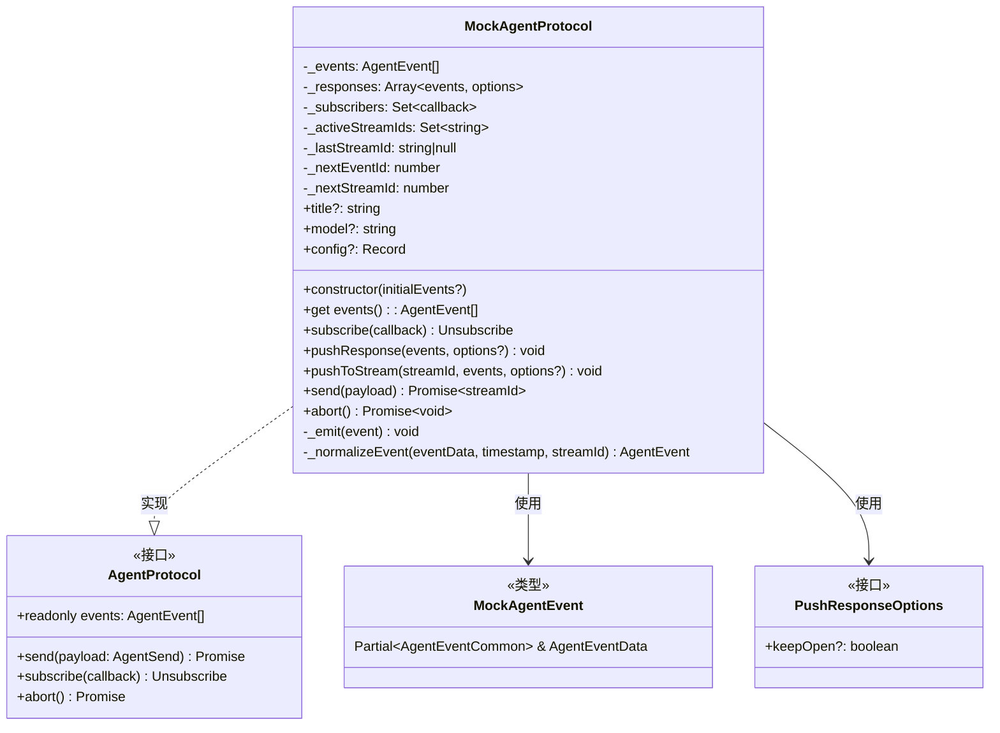
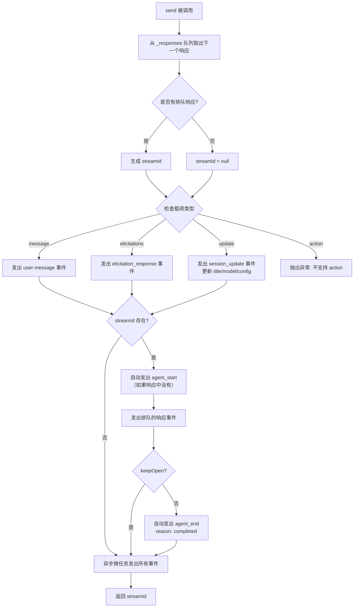
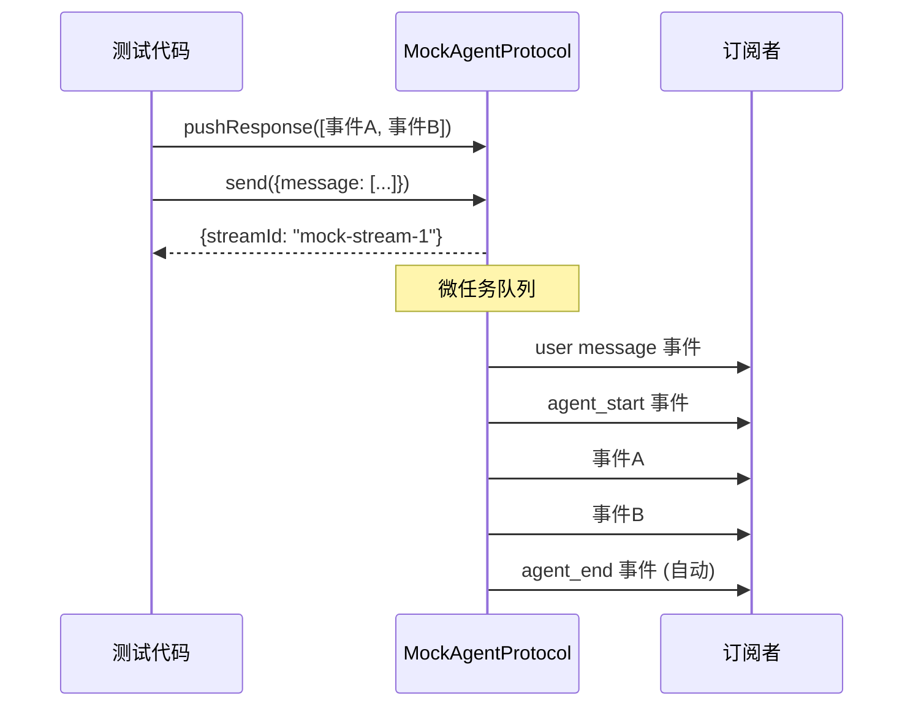

# mock.ts

## 概述

`mock.ts` 是 Agent 模块的**测试模拟实现**，提供了 `AgentProtocol` 接口的 Mock 实现类 `MockAgentProtocol`。它专为单元测试和集成测试设计，允许预先排队响应事件，在 `send()` 调用时自动发出，从而在不连接真实 Gemini API 的情况下测试 Agent 交互流程。

该文件的核心职责：
- **模拟 Agent 协议**：完整实现 `AgentProtocol` 接口（`send`、`subscribe`、`abort`、`events`）
- **响应排队**：通过 `pushResponse` 预置 Agent 的响应事件序列
- **流管理**：自动管理 `agent_start` 和 `agent_end` 事件的发出时机
- **事件规范化**：自动为事件填充 `id`、`timestamp`、`streamId` 等公共字段
- **流追加**：支持通过 `pushToStream` 向已有流追加事件

## 架构图



### send() 事件发出流程



### 事件发出时序



## 核心组件

### 类型

#### `MockAgentEvent`
```typescript
export type MockAgentEvent = Partial<AgentEventCommon> & AgentEventData;
```
Mock 事件类型，公共字段（`id`、`timestamp`、`streamId` 等）为可选，事件数据字段为必填。允许测试代码只提供核心数据，其余由 `_normalizeEvent` 自动填充。

---

### 接口

#### `PushResponseOptions`
```typescript
export interface PushResponseOptions {
  keepOpen?: boolean;  // 若为 true，不自动添加 agent_end 事件
}
```
控制 `pushResponse` 行为的选项。设置 `keepOpen: true` 可保持流开放，便于后续通过 `pushToStream` 继续追加事件。

---

### 类: `MockAgentProtocol`

实现 `AgentProtocol` 接口的 Mock 类。

#### 构造函数
```typescript
constructor(initialEvents: AgentEvent[] = [])
```
接受可选的初始事件数组，用于预置事件历史。

#### 属性
| 属性 | 类型 | 访问 | 说明 |
|---|---|---|---|
| `events` | `AgentEvent[]` | getter | 所有已发出的事件历史 |
| `title` | `string \| undefined` | public | 当前会话标题（由 update 载荷设置） |
| `model` | `string \| undefined` | public | 当前模型名称（由 update 载荷设置） |
| `config` | `Record<string, unknown> \| undefined` | public | 当前配置（由 update 载荷设置） |
| `_events` | `AgentEvent[]` | private | 事件存储 |
| `_responses` | `Array<{events, options}>` | private | 响应队列 |
| `_subscribers` | `Set<callback>` | private | 事件订阅者集合 |
| `_activeStreamIds` | `Set<string>` | private | 活跃流 ID 集合 |
| `_lastStreamId` | `string \| null` | private | 最近操作的流 ID |
| `_nextEventId` | `number` | private | 事件 ID 自增计数器 |
| `_nextStreamId` | `number` | private | 流 ID 自增计数器 |

#### 方法

##### `subscribe(callback: (event: AgentEvent) => void): Unsubscribe`
订阅所有未来事件。将回调添加到 `_subscribers` 集合中，返回取消订阅函数（从集合中删除回调）。

##### `pushResponse(events: MockAgentEvent[], options?: PushResponseOptions): void`
向响应队列末尾添加一组事件。下一次 `send()` 调用将消费队头的响应。

**参数：**
- `events` — Mock 事件数组，公共字段可省略
- `options` — 可选配置，`keepOpen: true` 阻止自动发出 `agent_end`

##### `pushToStream(streamId: string, events: MockAgentEvent[], options?: { close?: boolean }): void`
向已有流追加事件并通知订阅者。

**参数：**
- `streamId` — 目标流 ID
- `events` — 要追加的事件
- `options.close` — 若为 `true` 且事件中不含 `agent_end`，自动追加 `agent_end` (reason: completed)

##### `async send(payload: AgentSend): Promise<{ streamId: string | null }>`
模拟向 Agent 发送数据。按以下顺序处理：

1. 从响应队列取出下一个响应（先入先出）
2. 根据载荷类型生成对应的用户侧事件（message / elicitation_response / session_update）
3. 若有排队响应，自动发出 `agent_start`（除非响应中已包含）
4. 发出排队的响应事件
5. 若未设置 `keepOpen` 且无 `agent_end`，自动发出 `agent_end`
6. **异步**发出所有事件（通过 `Promise.resolve().then(...)`），确保调用方先接收 `streamId`

**载荷处理：**
- `message`：创建 `role: 'user'` 的 message 事件
- `elicitations`：为每个 elicitation 创建 `elicitation_response` 事件
- `update`：更新 `title`/`model`/`config` 属性并创建 `session_update` 事件
- `action`：**不支持**，直接抛出异常

##### `async abort(): Promise<void>`
中止最近活跃的流，发出 `agent_end` 事件（reason: aborted）。仅在流仍处于活跃状态时有效。

##### `_emit(event: AgentEvent): void` (private)
发出事件：添加到事件历史（去重）、通知所有订阅者、在 `agent_end` 时清除活跃流。

##### `_normalizeEvent(eventData, timestamp, streamId): AgentEvent` (private)
将 `MockAgentEvent` 规范化为完整的 `AgentEvent`，自动填充缺失的 `id`（格式 `e-{N}`）、`timestamp` 和 `streamId`。

## 依赖关系

### 内部依赖
| 依赖模块 | 导入内容 | 用途 |
|---|---|---|
| `./types.js` | `AgentEvent`, `AgentEventCommon`, `AgentEventData`, `AgentProtocol`, `AgentSend`, `Unsubscribe` (类型) | Agent 协议类型定义 |

### 外部依赖
无。

## 关键实现细节

1. **异步事件发出**：`send()` 方法通过 `Promise.resolve().then(...)` 将事件发出延迟到微任务队列，确保调用方在接收到 `streamId` 返回值**之后**才收到事件通知。这符合 `AgentProtocol` 的契约要求："streamId MUST be returned before the agent_start event is emitted"。

2. **事件去重**：`_emit` 方法在添加事件到历史前检查 ID 是否已存在（`this._events.some(e => e.id === event.id)`），防止同一事件被重复记录。

3. **自动流生命周期管理**：
   - `agent_start` 自动在响应事件序列前发出（除非响应中已包含）
   - `agent_end` 自动在响应结束时发出（除非设置 `keepOpen` 或响应中已包含）
   - 流的开启/关闭通过 `_activeStreamIds` Set 追踪

4. **streamId 生成**：若排队响应的第一个事件包含 `streamId`，则使用该值；否则自动生成 `mock-stream-{N}` 格式的 ID。

5. **action 载荷不支持**：`send()` 对 `action` 类型载荷直接抛出 `Error`，因为 Mock 实现不需要处理自定义动作。

6. **fallbackStreamId 惰性生成**：当 `streamId` 为 `null`（无排队响应）但仍需为事件关联流时，`fallbackStreamId` 通过赋值表达式 `??=` 惰性生成，确保同一 `send` 调用中的所有事件共享同一个 fallback ID。
