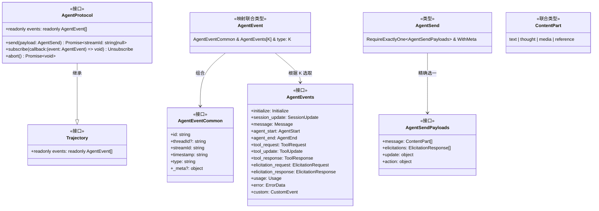
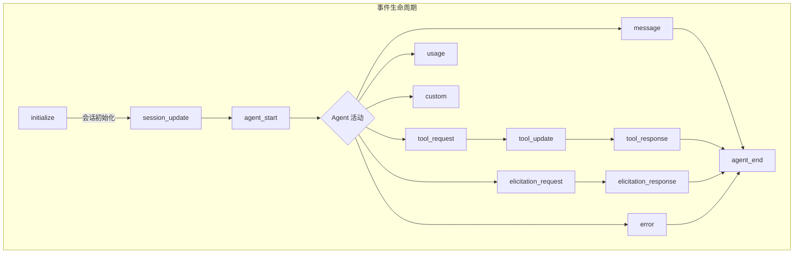
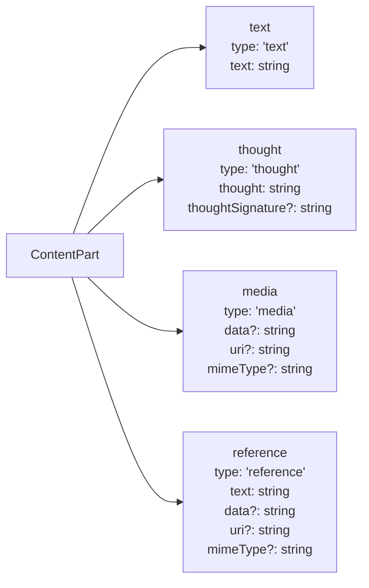

# types.ts

## 概述

`types.ts` 是 Agent 模块的**核心类型定义文件**，定义了整个 Agent 协议（AgentProtocol）的所有数据类型、事件接口和通信载荷结构。它是 Agent 会话系统的类型基础设施，所有其他 Agent 相关模块都依赖于此文件中导出的类型。

该文件的职责包括：
- 定义 Agent 协议接口（`AgentProtocol`），规范 Agent 的发送、订阅、中止等核心行为
- 定义完整的事件类型系统（`AgentEvents`），涵盖会话初始化、消息、工具调用、用户交互等全部事件
- 定义内容部分（`ContentPart`）的多态联合类型，支持文本、思考、媒体、引用等
- 定义错误状态码体系，对齐 Google RPC 错误码规范
- 定义辅助工具类型（如 `RequireExactlyOne`、`WithMeta`）

## 架构图



### 事件类型体系



### ContentPart 多态结构



## 核心组件

### 工具类型

#### `WithMeta`
```typescript
export type WithMeta = { _meta?: Record<string, unknown> };
```
可选的元数据混入类型，为任何类型添加 `_meta` 属性，用于携带任意键值对形式的元数据。

#### `Unsubscribe`
```typescript
export type Unsubscribe = () => void;
```
取消订阅函数类型，调用后停止接收事件。

#### `RequireExactlyOne<T>` (内部类型)
```typescript
type RequireExactlyOne<T> = {
  [K in keyof T]: Required<Pick<T, K>> &
    Partial<Record<Exclude<keyof T, K>, never>>;
}[keyof T];
```
高级映射类型，确保泛型 `T` 的所有键中**恰好有一个是必填的**，其余必须不存在（`never`）。用于 `AgentSend` 以确保每次只发送一种类型的载荷。

---

### 核心接口

#### `Trajectory`
```typescript
export interface Trajectory {
  readonly events: readonly AgentEvent[];
}
```
轨迹接口，表示可读取的事件序列。是 `AgentProtocol` 的父接口。

#### `AgentProtocol`
```typescript
export interface AgentProtocol extends Trajectory {
  send(payload: AgentSend): Promise<{ streamId: string | null }>;
  subscribe(callback: (event: AgentEvent) => void): Unsubscribe;
  abort(): Promise<void>;
  readonly events: readonly AgentEvent[];
}
```
Agent 协议的核心接口，定义了与 Agent 交互的全部能力：
- **`send(payload)`**：向 Agent 发送数据，返回受影响的 `streamId`。可能创建新流、复用已有流或返回 `null`。
- **`subscribe(callback)`**：订阅所有未来事件，返回取消订阅函数。
- **`abort()`**：中止当前活跃的 Agent 活动流。
- **`events`**：只读的事件历史列表。

---

### 发送载荷类型

#### `AgentSendPayloads` (内部接口)
```typescript
interface AgentSendPayloads {
  message: ContentPart[];
  elicitations: ElicitationResponse[];
  update: { title?: string; model?: string; config?: Record<string, unknown> };
  action: { type: string; data: unknown };
}
```
定义四种可能的发送载荷：消息、交互响应、会话更新、自定义动作。

#### `AgentSend`
```typescript
export type AgentSend = RequireExactlyOne<AgentSendPayloads> & WithMeta;
```
发送载荷类型，通过 `RequireExactlyOne` 确保每次 send 调用只携带四种载荷之一。

---

### 事件公共结构

#### `AgentEventCommon`
```typescript
export interface AgentEventCommon {
  id: string;           // 事件唯一标识
  threadId?: string;    // 子代理线程标识（主线程省略）
  streamId: string;     // 所属流标识
  timestamp: string;    // ISO 时间戳
  type: string;         // 具体事件类型
  _meta?: {             // 可选元数据
    source?: string;    // 事件来源
    [key: string]: unknown;
  };
}
```
所有事件的公共字段。

#### `AgentEventData<EventType>`
```typescript
export type AgentEventData<EventType extends keyof AgentEvents = keyof AgentEvents> =
  AgentEvents[EventType] & { type: EventType };
```
提取特定事件类型的数据部分（不含公共字段）。

#### `AgentEvent<EventType>`
```typescript
export type AgentEvent<EventType extends keyof AgentEvents = keyof AgentEvents> = {
  [K in EventType]: AgentEventCommon & AgentEvents[K] & { type: K };
}[EventType];
```
完整的事件类型，是 `AgentEventCommon` 与特定事件数据的交叉类型。使用映射类型实现可辨识联合（discriminated union），支持 `switch (event.type)` 类型收窄。

#### `AgentEventType`
```typescript
export type AgentEventType = keyof AgentEvents;
```
所有事件类型名称的联合字面量类型。

---

### 事件数据接口

#### `Initialize`
```typescript
export interface Initialize {
  sessionId: string;                    // 会话唯一标识
  workspace: string;                    // 工作区路径（通常是绝对文件系统路径）
  agentId: string;                      // Agent 标识
  configSchema?: Record<string, unknown>; // Agent 声明的配置 schema
}
```
会话初始化事件数据。**必须是会话中发出的第一个事件**。

#### `SessionUpdate`
```typescript
export interface SessionUpdate {
  title?: string;                       // 会话标题
  model?: string;                       // 使用的模型
  config?: Record<string, unknown>;     // Agent 特定配置
}
```
会话配置更新事件数据。

#### `ContentPart`
```typescript
export type ContentPart = (
  | { type: 'text'; text: string }
  | { type: 'thought'; thought: string; thoughtSignature?: string }
  | { type: 'media'; data?: string; uri?: string; mimeType?: string }
  | { type: 'reference'; text: string; data?: string; uri?: string; mimeType?: string }
) & WithMeta;
```
内容部分的联合类型，支持四种变体：
- **text**：纯文本内容
- **thought**：模型思考过程输出，可附带签名
- **media**：富媒体（图片/视频/PDF 等），以 data URI 或外部 URI 引用
- **reference**：内联资源引用（如 @-mention 文件）

#### `Message`
```typescript
export interface Message {
  role: 'user' | 'agent' | 'developer';
  content: ContentPart[];
}
```
消息事件数据，包含角色（用户/Agent/开发者）和内容。

#### `ToolRequest`
```typescript
export interface ToolRequest {
  requestId: string;                    // 工具请求唯一标识
  name: string;                         // 工具名称
  args: Record<string, unknown>;        // 工具参数
}
```
Agent 发出的工具调用请求。

#### `ToolUpdate`
```typescript
export interface ToolUpdate {
  requestId: string;                    // 关联的工具请求 ID
  displayContent?: ContentPart[];       // 展示给用户的中间内容
  content?: ContentPart[];              // 更新内容
  data?: Record<string, unknown>;       // 结构化数据
}
```
长时间运行的工具（如子代理、Shell 命令）的中间状态更新。**仅用于状态报告，不影响发送给模型的最终结果。**

#### `ToolResponse`
```typescript
export interface ToolResponse {
  requestId: string;                    // 关联的工具请求 ID
  name: string;                         // 工具名称
  displayContent?: ContentPart[];       // 展示给用户的内容
  content?: ContentPart[];              // 发送给模型的多部分内容
  data?: Record<string, unknown>;       // 发送给模型的结构化数据
  isError?: boolean;                    // 是否为错误结果
}
```
工具调用的最终响应。

#### `ElicitationRequest`
```typescript
export type ElicitationRequest = {
  display: 'inline' | 'modal';         // 展示方式：内联或弹窗
  title?: string;                       // 可选标题
  requestId: string;                    // 请求唯一标识
  message: string;                      // 展示给用户的问题/内容
  requestedSchema: Record<string, unknown>; // 期望的响应 schema
} & WithMeta;
```
用户交互请求（Elicitation），用于向用户提问或请求确认。

#### `ElicitationResponse`
```typescript
export type ElicitationResponse = {
  requestId: string;                    // 关联的请求 ID
  action: 'accept' | 'decline' | 'cancel'; // 用户操作
  content: Record<string, unknown>;     // 响应内容
} & WithMeta;
```
用户对交互请求的响应。

#### `ErrorData`
```typescript
export interface ErrorData {
  status: 'INVALID_ARGUMENT' | 'FAILED_PRECONDITION' | ... | (string & {});
  message: string;                      // 用户可见的错误信息
  fatal: boolean;                       // 是否为致命错误（导致 Agent 执行终止）
}
```
错误事件数据，`status` 对齐 [Google RPC 错误码规范](https://github.com/googleapis/googleapis/blob/master/google/rpc/code.proto)。

#### `Usage`
```typescript
export interface Usage {
  model: string;                        // 模型名称
  inputTokens?: number;                 // 输入 Token 数
  outputTokens?: number;                // 输出 Token 数
  cachedTokens?: number;                // 缓存 Token 数
  cost?: { amount: number; currency?: string }; // 费用信息
}
```
Token 使用量和费用报告。

#### `AgentStart`
```typescript
export interface AgentStart {
  streamId: string;                     // 流标识
}
```
Agent 活动开始事件。

#### `StreamEndReason`
```typescript
export type StreamEndReason =
  | 'completed' | 'failed' | 'aborted'
  | 'max_turns' | 'max_budget' | 'max_time'
  | 'refusal' | 'elicitation'
  | (string & {});
```
流结束原因枚举，支持扩展自定义原因。

#### `AgentEnd`
```typescript
export interface AgentEnd {
  streamId: string;                     // 流标识
  reason: StreamEndReason;              // 结束原因
  elicitationIds?: string[];            // 关联的交互请求 ID 列表
  data?: Record<string, unknown>;       // 汇总数据（费用、用量、轮次等）
}
```
Agent 活动结束事件。

#### `CustomEvent`
```typescript
export interface CustomEvent {
  kind: string;                         // 自定义事件类型
  data?: Record<string, unknown>;       // 自定义数据
}
```
自定义事件，保留在轨迹中但无预定义用途。

## 依赖关系

### 内部依赖
无。`types.ts` 是纯类型定义文件，不依赖任何内部模块。

### 外部依赖
无。该文件不导入任何外部包。

## 关键实现细节

1. **可辨识联合类型（Discriminated Union）**：`AgentEvent` 使用映射类型生成联合类型，每个变体都包含具体的 `type` 字面量字段，使得 TypeScript 编译器能在 `switch (event.type)` 中自动收窄类型。

2. **`RequireExactlyOne` 高级类型**：通过映射类型 + `never` 类型排除，保证 `AgentSend` 的四种载荷（message、elicitations、update、action）中恰好有一个存在。这是一种常见的 TypeScript 互斥属性模式。

3. **开放式字符串联合**：`StreamEndReason` 和 `ErrorData.status` 使用 `| (string & {})` 模式，既提供已知值的自动补全，又允许任意字符串扩展，实现向前兼容。

4. **只读约束**：`AgentProtocol.events` 和 `Trajectory.events` 使用 `readonly` 修饰符，防止外部代码直接修改事件列表。

5. **元数据混入**：`WithMeta` 类型被多个接口通过交叉类型（`& WithMeta`）混入，提供统一的元数据携带能力，支持扩展用途如事件来源追踪。
