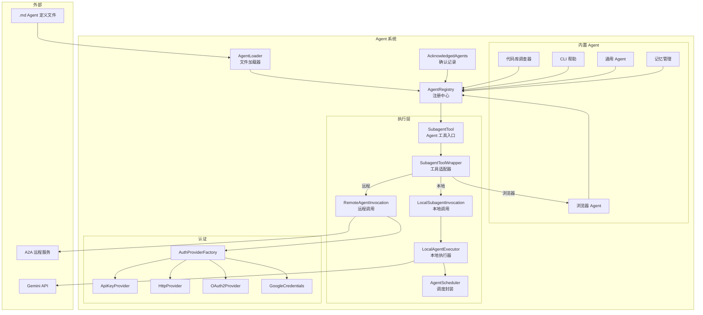
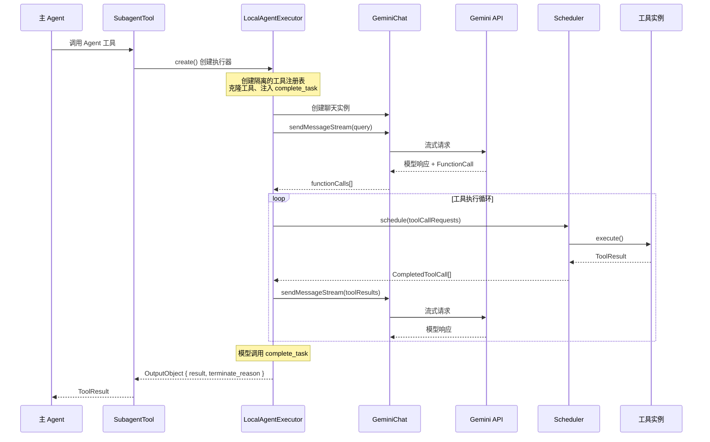

# agents (Agent 定义、注册与执行)

## 概述

`agents/` 目录实现了 Gemini CLI 的**子 Agent (Subagent) 系统**，提供了 Agent 的定义、发现、注册、加载和执行的完整生命周期管理。系统支持两种 Agent 类型：

- **本地 Agent (Local Agent)**: 在当前进程中运行，拥有独立的工具注册表和 GeminiChat 实例，通过 `LocalAgentExecutor` 驱动执行循环
- **远程 Agent (Remote Agent)**: 通过 A2A (Agent-to-Agent) 协议与外部 Agent 服务通信

Agent 系统的核心设计特点：
1. **声明式定义**: Agent 通过 Markdown + YAML frontmatter 文件声明（`.md`），支持用户级和项目级自定义
2. **工具隔离**: 每个子 Agent 拥有独立的 `ToolRegistry`，通过克隆方式避免状态共享
3. **递归防护**: 子 Agent 不能调用其他子 Agent，防止无限递归
4. **安全确认**: 项目级 Agent 需要用户确认（acknowledge）后才能注册

## 目录结构

```
agents/
├── types.ts                      # Agent 核心类型定义（AgentDefinition 等）
├── registry.ts                   # AgentRegistry 注册中心
├── agentLoader.ts                # Agent 定义文件加载器（Markdown/YAML）
├── agent-scheduler.ts            # Agent 专用工具调度封装
├── local-executor.ts             # 本地 Agent 执行引擎（ReAct 循环）
├── local-invocation.ts           # 本地 Agent 工具调用封装
├── remote-invocation.ts          # 远程 Agent (A2A) 调用封装
├── subagent-tool.ts              # SubagentTool -- Agent 作为工具的入口
├── subagent-tool-wrapper.ts      # Agent 定义 -> DeclarativeTool 适配器
├── codebase-investigator.ts      # 内置 Agent: 代码库调查器
├── cli-help-agent.ts             # 内置 Agent: CLI 帮助
├── generalist-agent.ts           # 内置 Agent: 通用 Agent
├── memory-manager-agent.ts       # 内置 Agent: 记忆管理
├── utils.ts                      # 模板字符串工具
├── a2a-client-manager.ts         # A2A 客户端管理
├── a2a-errors.ts                 # A2A 错误类型
├── a2aUtils.ts                   # A2A 工具函数
├── acknowledgedAgents.ts         # Agent 确认记录管理
├── browser/                      # 浏览器 Agent 子目录
├── auth-provider/                # A2A 认证提供者子目录
└── *.test.ts                     # 单元测试
```

## 架构图



## 核心组件

### AgentDefinition 类型体系 (types.ts)

Agent 定义采用泛型设计，支持 Zod schema 类型化的输出：

```typescript
type AgentDefinition<TOutput> = LocalAgentDefinition<TOutput> | RemoteAgentDefinition<TOutput>;
```

**LocalAgentDefinition** 包含：
- `kind: 'local'` -- 类型标识
- `name` / `description` -- 标识与描述
- `promptConfig` -- 系统提示词和初始消息配置
- `modelConfig` -- 模型和生成参数（温度等）
- `runConfig` -- 运行约束（最大回合数、超时时间）
- `toolConfig` -- 可用工具列表
- `mcpServers` -- 内联 MCP 服务器配置
- `inputConfig` / `outputConfig` -- 输入输出 schema

**RemoteAgentDefinition** 额外包含：
- `agentCardUrl` / `agentCardJson` -- A2A Agent Card 来源
- `auth` -- 认证配置

### AgentRegistry (registry.ts)

Agent 注册中心，负责 Agent 的完整生命周期管理：

1. **初始化加载**:
   - 注册内置 Agent（代码库调查器、CLI 帮助、通用、浏览器、记忆管理）
   - 从 `~/.gemini/agents/` 加载用户级 Agent
   - 从 `.gemini/agents/` 加载项目级 Agent（需信任检查和确认）
   - 从扩展中加载 Agent

2. **安全机制**:
   - 项目级 Agent 需要 hash 校验和用户确认（`AcknowledgedAgentsService`）
   - 非信任目录跳过项目 Agent 加载
   - 远程 Agent 默认需要用户确认执行

3. **配置合并**:
   - 支持用户在 settings 中覆盖 Agent 的 `runConfig`、`modelConfig`、`tools`、`mcpServers`
   - 自动注册模型配置别名

4. **策略管理**:
   - 为每个 Agent 动态注册策略规则
   - 本地 Agent 默认 ALLOW，远程 Agent 默认 ASK_USER

### AgentLoader (agentLoader.ts)

从 Markdown 文件加载 Agent 定义：

- 解析 YAML frontmatter 获取配置
- 支持本地 Agent（frontmatter + 正文作为 system prompt）
- 支持远程 Agent（单个或批量数组定义）
- 使用 Zod schema 严格验证所有字段
- 支持多种认证类型（apiKey、http、google-credentials、oauth）

### LocalAgentExecutor (local-executor.ts)

本地 Agent 的核心执行引擎，实现完整的 ReAct 循环：

**创建阶段 (`create()`)**:
1. 创建隔离的 `ToolRegistry`、`PromptRegistry`、`ResourceRegistry`
2. 发现并注册 Agent 指定的 MCP 服务器
3. 按工具配置从父注册表克隆工具（支持通配符 `*`、MCP 通配符）
4. **递归防护**: 跳过所有已注册的子 Agent 名称
5. 始终注入 `complete_task` 工具

**运行阶段 (`run()`)**:
1. 构建系统提示词（模板替换 + 记忆注入 + 环境上下文）
2. 创建 `GeminiChat` 实例
3. 执行循环: `callModel()` -> `processFunctionCalls()` -> 检查终止条件
4. 支持 `DeadlineTimer` 超时控制，确认等待时间不计入超时
5. 终止恢复机制: 超时/最大回合后给予一次"最后机会"回合

**终止模式**:
- `GOAL` -- 成功调用 `complete_task`
- `MAX_TURNS` -- 达到最大回合数
- `TIMEOUT` -- 执行超时
- `ABORTED` -- 用户中止
- `ERROR` -- 运行时错误
- `ERROR_NO_COMPLETE_TASK_CALL` -- 模型停止但未调用完成工具

### LocalSubagentInvocation (local-invocation.ts)

将 `LocalAgentExecutor` 封装为标准 `ToolInvocation`，负责：
- 创建并运行执行器
- 桥接 Agent 活动事件到工具的实时输出流（`SubagentProgress`）
- 维护最近活动列表（思考、工具调用、错误）
- 格式化最终结果为 `ToolResult`

### RemoteAgentInvocation (remote-invocation.ts)

通过 A2A 协议调用远程 Agent：
- 维护跨调用的会话状态（`contextId`、`taskId`）
- 支持流式响应处理
- 认证处理委托给 `A2AAuthProviderFactory`
- 友好的错误消息格式化

### SubagentTool (subagent-tool.ts)

Agent 作为工具的入口点，继承自 `BaseDeclarativeTool`：
- 在构造时验证输入 schema
- 通过 `SubagentToolWrapper` 创建实际调用
- 支持用户提示注入（user hints）
- 集成 OpenTelemetry 跟踪

### 内置 Agent

| Agent | 名称 | 说明 | 工具 |
|-------|------|------|------|
| CodebaseInvestigator | `codebase-investigator` | 代码库调查分析 | glob, grep, ls, read_file |
| CliHelp | `cli_help` | CLI 使用帮助 | 内部文档查询工具 |
| Generalist | `generalist` | 通用任务处理 | 所有可用工具 |
| BrowserAgent | `browser_agent` | 浏览器自动化 | MCP 浏览器工具 + 截图分析 |
| MemoryManager | `save_memory` | 记忆文件管理 | 文件读写工具 + ask_user |

## 依赖关系

### 内部依赖

- `config/` -- `Config`、`AgentLoopContext`、`MCPServerConfig`
- `core/` -- `GeminiChat`、提示词
- `scheduler/` -- `Scheduler`、工具调度
- `tools/` -- `ToolRegistry`、`BaseDeclarativeTool`、内置工具
- `services/` -- `ModelConfigService`、`ChatCompressionService`
- `policy/` -- 策略规则
- `telemetry/` -- 遥测日志
- `skills/` -- frontmatter 正则表达式

### 外部依赖

- `@google/genai` -- Gemini API 类型和工具声明
- `@a2a-js/sdk` -- A2A 协议 SDK
- `zod` -- Schema 验证
- `ajv` -- JSON Schema 验证
- `js-yaml` -- YAML 解析

## 数据流

### 本地 Agent 执行流程


