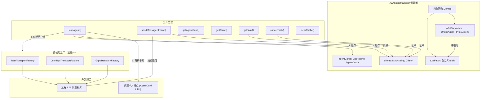

# a2a-client-manager.ts

## 概述

`A2AClientManager` 是 Gemini CLI 中负责与远程 A2A（Agent-to-Agent）代理通信的核心管理器。它封装了协议协商、身份认证、传输层选择以及客户端生命周期管理等功能。该类采用单一管理器模式，通过名称索引维护多个远程代理的客户端实例和 AgentCard 缓存，为上层提供统一的代理加载、消息发送、任务管理接口。

**文件路径**: `packages/core/src/agents/a2a-client-manager.ts`

**关键常量**:
- `A2A_TIMEOUT`: 30 分钟（1,800,000 毫秒）。远程代理可能执行耗时任务（如 Deep Research 可达 10 分钟以上），因此使用独立的超时配置，不受全局 5 分钟超时限制。

**导出类型**:
- `SendMessageResult`: 消息发送结果的联合类型，可以是 `Message`、`Task`、`TaskStatusUpdateEvent` 或 `TaskArtifactUpdateEvent`。

## 架构图（Mermaid）



## 核心组件

### 1. `A2AClientManager` 类

#### 私有属性

| 属性 | 类型 | 说明 |
|------|------|------|
| `clients` | `Map<string, Client>` | 以代理名称为键，缓存已创建的 A2A 客户端实例 |
| `agentCards` | `Map<string, AgentCard>` | 以代理名称为键，缓存已加载的代理卡片 |
| `a2aDispatcher` | `UndiciAgent \| ProxyAgent` | HTTP 调度器，支持代理和自定义超时 |
| `a2aFetch` | `typeof fetch` | 包装后的 fetch 函数，绑定了自定义调度器 |

#### 构造函数 `constructor(config: Config)`

- 从 `Config` 中读取代理（proxy）配置
- 如果配置了代理 URL，创建 `ProxyAgent`；否则创建普通 `UndiciAgent`
- 两种情况均设置 `headersTimeout` 和 `bodyTimeout` 为 30 分钟
- 封装 `a2aFetch`，将自定义 dispatcher 注入到所有请求中

#### 方法 `loadAgent(name, options, authHandler?): Promise<AgentCard>`

**功能**: 加载远程代理，获取其 AgentCard 并创建对应客户端。

**流程**:
1. **重复检查**: 如果同名代理已加载，抛出异常
2. **认证 fetch 构建**: 若提供 `authHandler`，使用 `createAuthenticatingFetchWithRetry` 包装 fetch
3. **卡片获取策略**: 先用非认证 fetch 请求卡片端点；若返回 401/403，自动重试使用认证 fetch（部分服务器拒绝不必要的认证头）
4. **卡片解析**: 支持两种模式：
   - `type === 'json'`: 直接解析内联 JSON
   - 其他: 通过 `DefaultAgentCardResolver` 从 URL 解析
5. **卡片规范化**: 调用 `normalizeAgentCard()` 处理 proto 字段名别名兼容问题
6. **传输层配置**: 同时注册三种传输工厂（REST、JSON-RPC、gRPC），gRPC 根据 URL 协议自动选择 SSL 或非安全凭证
7. **客户端创建**: 通过 `ClientFactory.createFromAgentCard()` 创建客户端
8. **缓存**: 将客户端和卡片存入各自的 Map
9. **错误分类**: 创建失败时通过 `classifyAgentError()` 对错误进行分类包装

#### 方法 `sendMessageStream(agentName, message, options?): AsyncIterable<SendMessageResult>`

**功能**: 向已加载的代理发送消息，返回异步可迭代的响应流。

**特性**:
- 使用 `async *` 生成器函数，支持流式响应
- 自动生成唯一 `messageId`（UUID v4）
- 支持传入 `contextId`、`taskId` 维持会话状态
- 支持通过 `AbortSignal` 取消请求
- 错误时附加代理名称前缀，便于调试

#### 方法 `getTask(agentName, taskId): Promise<Task>`

**功能**: 从指定代理获取任务详情。

#### 方法 `cancelTask(agentName, taskId): Promise<Task>`

**功能**: 取消指定代理上的任务。

#### 方法 `clearCache(): void`

**功能**: 清空所有缓存的客户端和代理卡片。

#### 方法 `getAgentCard(name): AgentCard | undefined`

**功能**: 获取已缓存的代理卡片。

#### 方法 `getClient(name): Client | undefined`

**功能**: 获取已缓存的客户端实例。

### 2. `SendMessageResult` 类型

联合类型，表示发送消息后可能收到的四种结果：

```typescript
type SendMessageResult =
  | Message                  // 完整消息响应
  | Task                     // 完整任务对象
  | TaskStatusUpdateEvent    // 增量状态更新事件
  | TaskArtifactUpdateEvent; // 增量产物更新事件
```

## 依赖关系

### 内部依赖

| 模块 | 导入内容 | 用途 |
|------|----------|------|
| `./a2aUtils.js` | `normalizeAgentCard` | 规范化 AgentCard 字段名（处理 proto 别名兼容） |
| `./types.js` | `AgentCardLoadOptions` | 代理卡片加载选项的类型定义 |
| `../config/config.js` | `Config` | 应用配置（获取代理 proxy 等信息） |
| `../utils/debugLogger.js` | `debugLogger` | 调试日志输出 |
| `./a2a-errors.js` | `classifyAgentError` | 错误分类与包装 |

### 外部依赖

| 包名 | 导入内容 | 用途 |
|------|----------|------|
| `@a2a-js/sdk` | `AgentCard`, `Message`, `MessageSendParams`, `Task`, `TaskStatusUpdateEvent`, `TaskArtifactUpdateEvent` | A2A 协议核心类型定义 |
| `@a2a-js/sdk/client` | `AuthenticationHandler`, `Client`, `ClientFactory`, `ClientFactoryOptions`, `DefaultAgentCardResolver`, `JsonRpcTransportFactory`, `RestTransportFactory`, `createAuthenticatingFetchWithRetry` | A2A 客户端 SDK：工厂、传输层、认证 |
| `@a2a-js/sdk/client/grpc` | `GrpcTransportFactory` | gRPC 传输层工厂 |
| `@grpc/grpc-js` | `grpc` | gRPC 凭证创建（SSL / 非安全） |
| `uuid` | `v4 as uuidv4` | 生成唯一消息 ID |
| `undici` | `Agent as UndiciAgent`, `ProxyAgent` | HTTP 客户端调度器（支持代理和自定义超时） |

## 关键实现细节

1. **超时独立化**: 使用专用的 `UndiciAgent`/`ProxyAgent` 作为 HTTP 调度器，超时时间为 30 分钟，与全局请求超时隔离。这是因为远程 A2A 代理（如 Deep Research）可能需要 10 分钟以上的处理时间。

2. **双重认证策略**: 获取 AgentCard 时采用"先无认证、后有认证"策略。首次用非认证 fetch 请求，若返回 401/403 再用认证 fetch 重试。这样既兼容不接受额外认证头的服务器（会返回 400），也兼容需要认证的服务器。

3. **多传输层支持**: 同时注册 REST、JSON-RPC、gRPC 三种传输工厂，由 `ClientFactory` 根据 AgentCard 中声明的接口自动选择最合适的传输方式。gRPC 根据 URL 是否以 `https://` 开头自动切换 SSL/非安全凭证。

4. **gRPC URL 回退**: 优先从 `agentCard.additionalInterfaces` 中查找 transport 为 `'GRPC'` 的接口 URL，找不到则回退到 `agentCard.url`。

5. **流式消息传输**: `sendMessageStream` 使用 `async *` 生成器，通过 `yield*` 委托给底层 SDK 的流式接口，实现真正的流式响应传递，避免一次性加载全部响应。

6. **代理卡片规范化**: 通过 `normalizeAgentCard()` 处理 proto 字段名别名（如 `supportedInterfaces` → `additionalInterfaces`，`protocolBinding` → `transport`），这是临时兼容方案，待 `@a2a-js/sdk` 原生支持后将移除。

7. **错误分类包装**: 加载代理失败时，通过 `classifyAgentError()` 对原始错误进行分类（如网络错误、认证错误等），提供更友好的错误信息。所有公开方法的错误信息都包含代理名称前缀，便于在多代理环境下快速定位问题。

8. **缓存管理**: 使用两个 `Map` 分别缓存客户端和代理卡片。`loadAgent` 会检查重复加载，`clearCache` 提供一键清空功能。注意当前没有单个代理卸载的接口。
