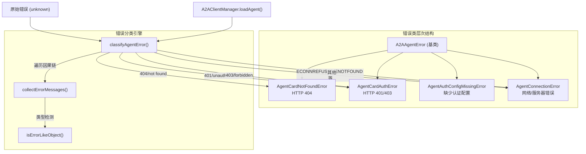

# a2a-errors.ts

## 概述

`a2a-errors.ts` 定义了 A2A（Agent-to-Agent）远程代理操作中使用的自定义错误类型体系。该模块为代理卡片获取、身份认证、网络通信等常见失败场景提供结构化的、用户友好的错误消息。每个错误类型都包含一个 `userMessage` 字段，用于在 CLI 中向用户展示可读的错误说明。

此外，模块还提供了核心工具函数 `classifyAgentError()`，能够从原始错误的完整因果链中提取信息，自动将其分类为具体的错误子类型。

**文件路径**: `packages/core/src/agents/a2a-errors.ts`

## 架构图（Mermaid）



## 核心组件

### 1. 错误类层次结构

#### `A2AAgentError` (基类)

继承自 `Error`，是所有 A2A 代理错误的基类。

| 属性 | 类型 | 说明 |
|------|------|------|
| `userMessage` | `string` (readonly) | 用户友好的消息，适合在 CLI 中显示 |
| `agentName` | `string` (readonly) | 关联的代理名称 |
| `name` | `string` | 固定为 `'A2AAgentError'` |

**构造函数参数**: `agentName`, `message`（技术消息）, `userMessage`（用户消息）, `options?`（ErrorOptions，支持 cause 链）

---

#### `AgentCardNotFoundError`

当代理卡片 URL 返回 HTTP 404 时抛出。

- **name**: `'AgentCardNotFoundError'`
- **用户消息示例**: `Agent card not found (404) at https://example.com. Verify the agent_card_url in your agent definition.`

---

#### `AgentCardAuthError`

当代理卡片 URL 返回 HTTP 401（未授权）或 403（禁止访问）时抛出。

| 额外属性 | 类型 | 说明 |
|----------|------|------|
| `statusCode` | `401 \| 403` (readonly) | HTTP 状态码 |

- **name**: `'AgentCardAuthError'`
- **用户消息示例**: `Authentication failed (401 Unauthorized) at https://example.com. Check the "auth" configuration in your agent definition.`

---

#### `AgentAuthConfigMissingError`

当代理卡片的安全方案要求身份认证，但代理定义中缺少必要的认证配置时抛出。

| 额外属性 | 类型 | 说明 |
|----------|------|------|
| `requiredAuth` | `string` (readonly) | 所需认证方案的可读描述 |
| `missingFields` | `string[]` (readonly) | 缺失的配置字段或条目列表 |

- **name**: `'AgentAuthConfigMissingError'`
- **用户消息示例**: `Agent requires OAuth2 but no auth is configured. Missing: client_id, client_secret`

---

#### `AgentConnectionError`

当发生通用/意外的网络或服务器错误时抛出（如连接被拒绝、DNS 解析失败等）。

- **name**: `'AgentConnectionError'`
- **构造函数**: 自动从 `cause` 中提取消息文本
- **用户消息示例**: `Connection failed for https://example.com: connect ECONNREFUSED 127.0.0.1:8080`

---

### 2. 辅助类型与函数

#### `ErrorLikeObject` 接口

描述错误因果链中可能出现的对象形状：

```typescript
interface ErrorLikeObject {
  message?: string;
  code?: string;        // 如 'ECONNREFUSED'
  status?: number;      // HTTP 状态码
  statusCode?: number;  // 备用 HTTP 状态码字段
  cause?: unknown;      // 嵌套的原因
}
```

#### `isErrorLikeObject(val): val is ErrorLikeObject`

类型守卫函数，判断一个值是否为非 null 对象（可能携带错误元数据）。

#### `collectErrorMessages(error): string`

**核心工具函数**：遍历错误的因果链（cause chain），收集所有消息、错误码、状态码，拼接成一个字符串用于模式匹配。

**实现细节**:
- 最大遍历深度为 10 层，防止无限循环
- 从每层提取：`message`、`code`、`status`/`statusCode`
- 支持 `Error` 实例、普通对象、字符串三种类型
- 通过 `cause` 属性递归遍历
- 所有提取的文本用空格连接

### 3. 错误分类函数

#### `classifyAgentError(agentName, agentCardUrl, error): A2AAgentError`

**功能**: 将 A2A SDK 抛出的原始错误分类为具体的 `A2AAgentError` 子类。

**分类优先级**（从高到低）:

| 优先级 | 匹配模式 | 返回类型 |
|--------|----------|----------|
| 1 | `ECONNREFUSED`, `ENOTFOUND`, `EHOSTUNREACH`, `ETIMEDOUT` | `AgentConnectionError` |
| 2 | `404` 或 `not found` | `AgentCardNotFoundError` |
| 3 | `401` 或 `unauthorized` | `AgentCardAuthError(401)` |
| 4 | `403` 或 `forbidden` | `AgentCardAuthError(403)` |
| 5 | 其他所有 | `AgentConnectionError`（兜底） |

**重要设计决策**: 连接错误（如 ENOTFOUND）在 404 模式之前检查，这是防御性措施，避免 DNS 错误被误判为 HTTP 404。

## 依赖关系

### 内部依赖

无。该模块是独立的错误定义模块，不依赖项目内其他模块。

### 外部依赖

无。该模块仅使用 JavaScript/TypeScript 内置的 `Error` 类。

## 关键实现细节

1. **因果链深度遍历**: A2A SDK 和 Node.js 的 fetch 实现经常将真正的错误（如 HTTP 状态码）深层嵌套在 `cause` 链中。`collectErrorMessages()` 通过递归遍历最多 10 层因果链来提取完整的错误上下文，确保模式匹配的准确性。

2. **双重消息设计**: 每个错误类都维护两个消息：`message`（继承自 Error，技术性描述，适合日志和调试）和 `userMessage`（用户友好描述，适合 CLI 展示）。这样上层代码可以根据场景选择合适的消息。

3. **正则模式匹配策略**: 使用正则表达式而非精确匹配来分类错误，因为不同的 SDK 和运行时可能使用不同格式的错误消息。例如 `\bnot[\s_-]?found\b` 可以匹配 "not found"、"not_found"、"not-found" 等变体。

4. **分类优先级设计**: 将网络层错误（ECONNREFUSED 等）置于最高优先级，是因为这些错误码可能伴随其他容易造成误判的文本。例如一个 DNS 解析失败可能包含 "not found" 字样，如果先匹配 404 模式就会产生错误分类。

5. **兜底策略**: 无法分类的错误统一归为 `AgentConnectionError`，保证函数始终返回一个 `A2AAgentError` 子类而非原始异常，确保上层代码的错误处理逻辑一致。

6. **Error.name 显式设置**: 每个错误子类都显式设置 `this.name`，避免打包工具（bundler）重命名类名导致错误名称丢失的问题（这与项目中 `#23913` issue 的修复方向一致）。
