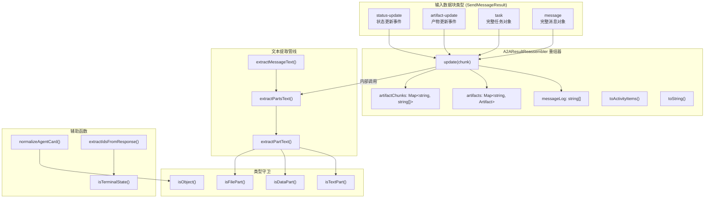

# a2aUtils.ts

## 概述

`a2aUtils.ts` 是 A2A（Agent-to-Agent）通信的核心工具模块，提供了流式响应重组、消息文本提取、代理卡片规范化、响应 ID 提取、状态判断等一系列实用功能。该模块是 A2A 子系统中使用最广泛的工具集，被客户端管理器、调度器等多个组件依赖。

**文件路径**: `packages/core/src/agents/a2aUtils.ts`

**核心导出**:
- `A2AResultReassembler` 类 —— 流式更新重组器
- `extractMessageText()` —— 消息文本提取
- `normalizeAgentCard()` —— 代理卡片字段规范化
- `extractIdsFromResponse()` —— 响应中提取 contextId/taskId
- `isTerminalState()` —— 判断任务是否为终态
- `AUTH_REQUIRED_MSG` —— 授权提示常量

## 架构图（Mermaid）



## 核心组件

### 1. `A2AResultReassembler` 类

将增量 A2A 流式更新重组为连贯的结果。按顺序展示状态/消息，并重组所有产物。

#### 私有属性

| 属性 | 类型 | 说明 |
|------|------|------|
| `messageLog` | `string[]` | 按顺序存储所有消息文本，自动去重连续重复 |
| `artifacts` | `Map<string, Artifact>` | 以 artifactId 为键，存储重组后的完整产物 |
| `artifactChunks` | `Map<string, string[]>` | 以 artifactId 为键，存储产物的文本分块（用于最终渲染） |

#### 方法 `update(chunk: SendMessageResult)`

处理一个新的流式数据块。根据 `chunk.kind` 分四种情况处理：

| kind | 处理逻辑 |
|------|----------|
| `'status-update'` | 检查 `auth-required` 状态并追加授权提示；提取状态消息中的文本 |
| `'artifact-update'` | 若 `append=true` 且已有同 ID 产物，追加 parts；否则整体替换。同步更新 `artifactChunks` |
| `'task'` | 处理状态消息和产物列表；若任务处于终态且无消息和产物，回退到 `history` 中最后一条代理消息 |
| `'message'` | 直接提取消息文本 |

**History 回退机制**: 某些代理实现不在最终响应的 `status.message` 中填充最终答案，而是将其存储在 `task.history` 数组中。当任务到达终态且无其他内容时，重组器会从历史记录中查找最后一条代理角色的消息作为结果。

#### 方法 `toActivityItems(): SubagentActivityItem[]`

返回当前重组状态的活动项数组。如果包含授权提示则返回 auth-required 状态项，否则返回"Working..."等待状态项。

#### 方法 `toString(): string`

返回人类可读的字符串表示：
- 先输出所有消息（拼接）
- 再输出所有产物（每个带标题，如 `Artifact (name):` 或 `Artifact:`）
- 消息和产物之间用空行分隔

#### 私有方法 `appendStateInstructions(state)`

当状态为 `'auth-required'` 时追加授权提示常量，并防止重复追加。

#### 私有方法 `pushMessage(message)`

提取消息文本并追加到日志，自动去重连续相同消息。

---

### 2. 文本提取函数

#### `extractMessageText(message: Message | undefined): string`

从 `Message` 对象中提取可读文本。处理 `null`/`undefined` 和非数组 `parts` 的防御性检查。各 part 以换行符连接。

#### `extractPartsText(parts: Part[], separator: string): string` (私有)

从 Part 数组中提取文本，使用指定分隔符连接非空结果。

#### `extractPartText(part: Part): string` (私有)

从单个 Part 提取文本，支持三种类型：

| Part 类型 | 输出格式 |
|-----------|----------|
| `TextPart` | 直接返回 `text` 字段 |
| `DataPart` | `Data: {JSON序列化}` |
| `FilePart` | `File: {文件名}` 或 `File: {URI}` 或 `File: [binary/unnamed]` |

---

### 3. `normalizeAgentCard(card: unknown): AgentCard`

规范化代理卡片，处理 proto 字段名别名与 SDK 期望字段名之间的差异。

**映射规则**:
| Proto 字段名 | SDK 期望字段名 | 说明 |
|--------------|---------------|------|
| `supportedInterfaces` | `additionalInterfaces` | 支持的接口列表 |
| `protocolBinding` | `transport` | 每个接口的传输协议 |

**实现细节**:
- 浅拷贝输入对象，避免修改 SDK 缓存的原始对象
- 仅在目标字段不存在时才进行映射（不覆盖已有值）
- 标记为 TODO，待 `@a2a-js/sdk` 原生支持后移除

---

### 4. `extractIdsFromResponse(result: SendMessageResult)`

从各类响应中提取 `contextId`、`taskId` 和 `clearTaskId` 标志，维持对话连续性。

| 响应类型 | contextId 来源 | taskId 来源 | clearTaskId |
|----------|---------------|-------------|-------------|
| `message` | `result.contextId` | `result.taskId` | `false` |
| `artifact-update` | `result.contextId` | `result.taskId` | `false` |
| `task` | `result.contextId` | `result.id` | 终态时为 `true` |
| `status-update` | `result.contextId` | `result.taskId` | 终态时为 `true` |

当任务到达终态（completed/failed/canceled/rejected）时，`clearTaskId` 为 `true`，通知调用方下次交互应开始新任务。

---

### 5. `isTerminalState(state: TaskState | undefined): boolean`

判断任务状态是否为终态。终态包括：
- `'completed'` —— 已完成
- `'failed'` —— 已失败
- `'canceled'` —— 已取消
- `'rejected'` —— 已拒绝

---

### 6. 类型守卫

| 函数 | 用途 |
|------|------|
| `isTextPart(part)` | 判断是否为 TextPart（`kind === 'text'`） |
| `isDataPart(part)` | 判断是否为 DataPart（`kind === 'data'`） |
| `isFilePart(part)` | 判断是否为 FilePart（`kind === 'file'`） |
| `isObject(val)` | 判断是否为非数组的对象 |

---

### 7. 常量

```typescript
export const AUTH_REQUIRED_MSG = `[Authorization Required] The agent has indicated it requires authorization to proceed. Please follow the agent's instructions.`;
```

当远程代理返回 `auth-required` 状态时使用的标准提示消息。

## 依赖关系

### 内部依赖

| 模块 | 导入内容 | 用途 |
|------|----------|------|
| `./a2a-client-manager.js` | `SendMessageResult` (类型) | 流式消息结果的联合类型 |
| `./types.js` | `SubagentActivityItem` (类型) | 子代理活动项的类型定义 |

### 外部依赖

| 包名 | 导入内容 | 用途 |
|------|----------|------|
| `@a2a-js/sdk` | `Message`, `Part`, `TextPart`, `DataPart`, `FilePart`, `Artifact`, `TaskState`, `AgentCard`, `AgentInterface` | A2A 协议核心类型 |

## 关键实现细节

1. **增量产物重组**: `A2AResultReassembler` 支持两种产物更新模式——追加模式（`append=true`，将新 parts 追加到已有产物）和替换模式（整体替换同 ID 产物）。使用 `structuredClone` 深拷贝产物数据，避免外部修改影响内部状态。

2. **History 回退策略**: 这是对不规范代理实现的兼容措施。某些代理不在终态响应的 `status.message` 中返回最终答案，而是将其放在 `task.history` 中。重组器在三个条件同时满足时触发回退：(a) 任务处于终态，(b) 消息日志为空，(c) 产物为空。回退时从 history 末尾反向查找第一条 agent 角色的消息。

3. **消息去重**: `pushMessage` 方法检查新消息是否与日志中最后一条相同，防止连续重复消息。这对流式场景很重要，因为多个 chunk 可能携带相同的状态消息。

4. **授权提示防重复**: `appendStateInstructions` 使用 `includes` 检查避免重复追加授权提示，因为多个数据块可能连续报告 `auth-required` 状态。

5. **浅拷贝规范化**: `normalizeAgentCard` 使用 `{ ...card }` 浅拷贝而非直接修改输入，保护 SDK 内部缓存的原始对象不被污染。字段映射只在目标字段不存在时生效，尊重已有的正确值。

6. **taskId 清除语义**: `extractIdsFromResponse` 中的 `clearTaskId` 标志是一个重要的会话管理信号。当任务到达终态后，调用方应该清除 taskId，这样下次交互会创建新任务而非在已完成的任务上继续。

7. **FilePart 提取优先级**: 文件类型 Part 的文本提取按优先级尝试：文件名 > URI > 通用标记 `[binary/unnamed]`，确保在任何情况下都能返回有意义的描述。
