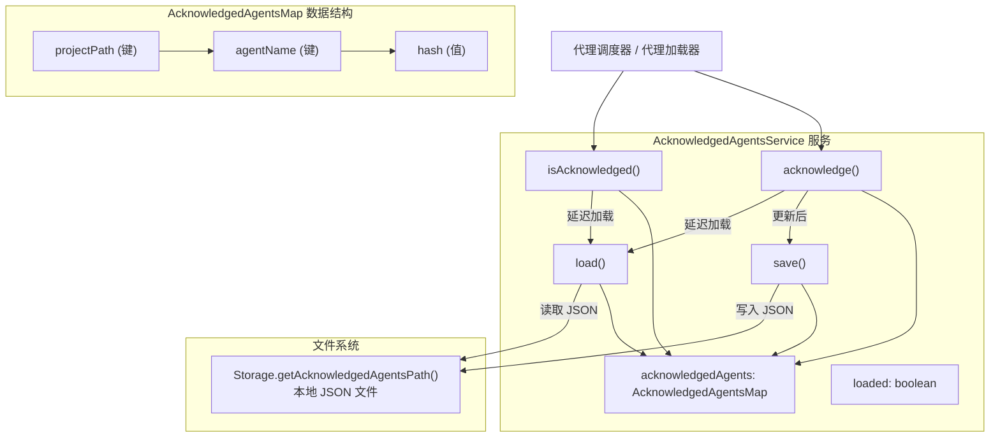

# acknowledgedAgents.ts

## 概述

`acknowledgedAgents.ts` 实现了代理确认（Acknowledgement）持久化服务。该服务用于记录用户已确认/批准使用的远程 A2A 代理，防止每次启动时重复提示用户确认。它维护一个按"项目路径 -> 代理名称 -> 代理哈希"组织的映射表，持久化存储到本地文件系统。通过哈希值校验，当代理配置发生变化时会自动要求用户重新确认。

**文件路径**: `packages/core/src/agents/acknowledgedAgents.ts`

## 架构图（Mermaid）



## 核心组件

### 1. `AcknowledgedAgentsMap` 接口

定义了确认状态的数据结构，采用两层嵌套的索引签名：

```typescript
interface AcknowledgedAgentsMap {
  // 第一层: 项目路径 -> 项目级代理映射
  [projectPath: string]: {
    // 第二层: 代理名称 -> 代理配置哈希
    [agentName: string]: string;
  };
}
```

**设计说明**: 按项目路径隔离，使得不同项目可以独立管理其代理确认状态。哈希值用于检测代理配置变更——当配置变更导致哈希不同时，视为未确认。

### 2. `AcknowledgedAgentsService` 类

#### 私有属性

| 属性 | 类型 | 说明 |
|------|------|------|
| `acknowledgedAgents` | `AcknowledgedAgentsMap` | 内存中的确认状态映射，初始为空对象 |
| `loaded` | `boolean` | 延迟加载标志，防止重复从文件系统读取 |

#### 方法 `load(): Promise<void>`

**功能**: 从本地文件系统加载确认状态。

**行为**:
- 若已加载（`loaded === true`），直接返回，不重复读取
- 通过 `Storage.getAcknowledgedAgentsPath()` 获取文件路径
- 读取并解析 JSON 内容
- 若文件不存在（`ENOENT`），静默回退为空对象
- 若解析失败或其他错误，记录调试日志并回退为空对象
- 无论成功与否，均设置 `loaded = true`

#### 方法 `save(): Promise<void>`

**功能**: 将当前确认状态持久化到文件系统。

**行为**:
- 自动创建目标目录（`recursive: true`）
- 以格式化 JSON（2 空格缩进）写入文件
- 写入失败时记录调试日志，不抛出异常

#### 方法 `isAcknowledged(projectPath, agentName, hash): Promise<boolean>`

**功能**: 检查指定代理在特定项目下是否已被确认。

**行为**:
- 先触发延迟加载（`await this.load()`）
- 查找项目路径对应的映射
- 比较代理名称对应的哈希值是否与传入的 hash 完全一致
- 项目路径不存在、代理名称不存在、或哈希不匹配均返回 `false`

#### 方法 `acknowledge(projectPath, agentName, hash): Promise<void>`

**功能**: 记录用户对指定代理的确认。

**行为**:
- 先触发延迟加载
- 若项目路径对应的映射不存在，初始化为空对象
- 设置代理名称 -> 哈希的映射
- 立即调用 `save()` 持久化

## 依赖关系

### 内部依赖

| 模块 | 导入内容 | 用途 |
|------|----------|------|
| `../config/storage.js` | `Storage` | 获取确认代理文件的存储路径 |
| `../utils/debugLogger.js` | `debugLogger` | 调试日志输出 |
| `../utils/errors.js` | `getErrorMessage`, `isNodeError` | 错误消息提取和 Node.js 错误类型判断 |

### 外部依赖

| 包名 | 导入内容 | 用途 |
|------|----------|------|
| `node:fs/promises` | `fs` | 异步文件读写 |
| `node:path` | `path` | 路径操作（获取目录名） |

## 关键实现细节

1. **延迟加载模式**: 通过 `loaded` 标志实现延迟加载，`isAcknowledged` 和 `acknowledge` 方法在首次调用时自动触发文件读取。后续调用直接使用内存缓存，避免重复 I/O。但注意这不是线程安全的——如果存在并发调用，可能会导致多次读取（虽然在 Node.js 单线程模型中通常不会造成问题）。

2. **容错设计**: 加载和保存操作都采用防御性编程：
   - 加载时：文件不存在静默回退，解析失败回退为空对象，均不抛出异常
   - 保存时：自动创建目录，写入失败仅记录日志不抛出
   - 这确保了确认功能的故障不会阻塞主流程

3. **哈希校验机制**: 确认状态不仅关联代理名称，还关联配置哈希。当代理配置（如 URL、认证方式等）发生变化导致哈希值不同时，`isAcknowledged` 会返回 `false`，迫使用户重新确认。这是一种安全机制，防止被篡改的代理配置在用户不知情的情况下继续使用。

4. **即时持久化**: `acknowledge` 方法在更新内存映射后立即调用 `save()`，确保确认状态不会因进程意外退出而丢失。不使用批量/延迟写入策略，因为代理确认是低频操作。

5. **项目隔离**: 以项目路径作为第一层键进行隔离，使得同一代理在不同项目中可以有不同的确认状态。这对于共享代理配置但需要逐项目审批的场景很重要。

6. **ENOENT 静默处理**: 首次使用时文件不存在是正常情况（`ENOENT`），不记录错误日志。只有非 ENOENT 的错误才记录到调试日志，避免正常流程产生噪音日志。
