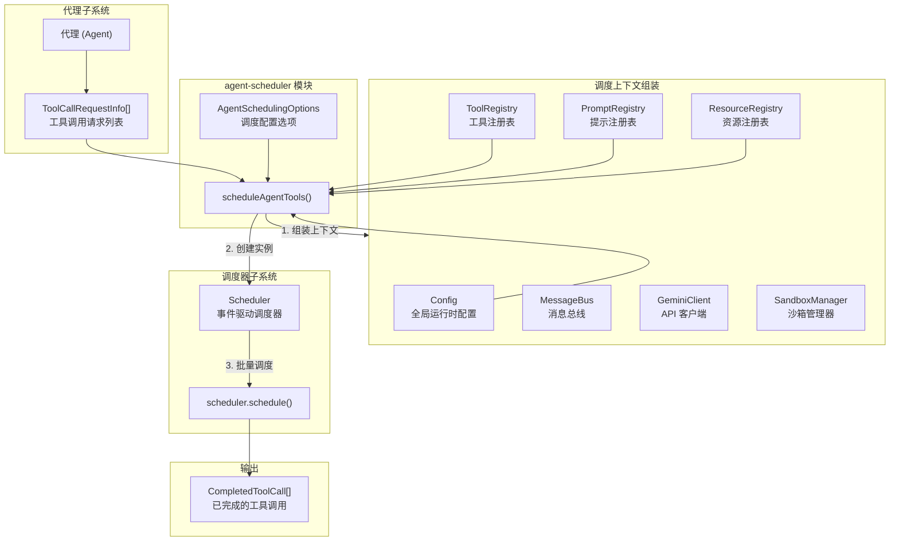

# agent-scheduler.ts

## 概述

`agent-scheduler.ts` 是代理工具调度的入口模块，提供了一个简洁的函数式接口 `scheduleAgentTools()`，用于将代理产生的一批工具调用请求提交给事件驱动的调度器（`Scheduler`）执行。该模块充当代理子系统与调度器子系统之间的桥梁，负责组装调度上下文、创建调度器实例并触发批量调度。

**文件路径**: `packages/core/src/agents/agent-scheduler.ts`

## 架构图（Mermaid）



## 核心组件

### 1. `AgentSchedulingOptions` 接口

定义代理工具调度所需的配置选项。

| 字段 | 类型 | 必填 | 说明 |
|------|------|------|------|
| `schedulerId` | `string` | 是 | 此代理调度器的唯一标识符 |
| `subagent` | `string` | 否 | 子代理名称 |
| `parentCallId` | `string` | 否 | 触发此代理的父工具调用 ID，用于建立调用层级关系 |
| `toolRegistry` | `ToolRegistry` | 是 | 此代理专用的工具注册表 |
| `promptRegistry` | `PromptRegistry` | 否 | 此代理专用的提示注册表 |
| `resourceRegistry` | `ResourceRegistry` | 否 | 此代理专用的资源注册表 |
| `signal` | `AbortSignal` | 是 | 取消信号，用于中止调度 |
| `getPreferredEditor` | `() => EditorType \| undefined` | 否 | 获取首选编辑器类型的回调函数 |
| `onWaitingForConfirmation` | `(waiting: boolean) => void` | 否 | 调度器等待用户确认时的通知回调 |

### 2. `scheduleAgentTools()` 函数

```typescript
async function scheduleAgentTools(
  config: Config,
  requests: ToolCallRequestInfo[],
  options: AgentSchedulingOptions,
): Promise<CompletedToolCall[]>
```

**功能**: 为代理调度一批工具调用请求。

**参数**:
- `config`: 全局运行时配置
- `requests`: 代理产生的工具调用请求列表
- `options`: 调度配置选项

**返回值**: `Promise<CompletedToolCall[]>` —— 所有已完成的工具调用结果

**执行流程**:

1. **解构选项**: 从 `options` 中提取所有配置字段

2. **组装调度上下文** (`schedulerContext`):

   | 上下文字段 | 来源 |
   |------------|------|
   | `config` | 直接传入的全局配置 |
   | `promptId` | `config.promptId` |
   | `toolRegistry` | `options.toolRegistry`（代理专用） |
   | `promptRegistry` | `options.promptRegistry` 或 `config.getPromptRegistry()`（回退） |
   | `resourceRegistry` | `options.resourceRegistry` 或 `config.getResourceRegistry()`（回退） |
   | `messageBus` | `toolRegistry.messageBus` |
   | `geminiClient` | `config.geminiClient` |
   | `sandboxManager` | `config.sandboxManager` |

3. **创建 Scheduler 实例**: 传入组装好的上下文、消息总线、编辑器获取函数（默认返回 undefined）、调度器 ID、子代理名称、父调用 ID、确认等待回调

4. **执行调度**: 调用 `scheduler.schedule(requests, signal)` 批量调度所有工具调用并返回结果

## 依赖关系

### 内部依赖

| 模块 | 导入内容 | 用途 |
|------|----------|------|
| `../config/config.js` | `Config` (类型) | 全局运行时配置 |
| `../scheduler/scheduler.js` | `Scheduler` | 事件驱动调度器，执行实际的工具调度 |
| `../scheduler/types.js` | `ToolCallRequestInfo`, `CompletedToolCall` (类型) | 工具调用请求和完成结果的类型定义 |
| `../tools/tool-registry.js` | `ToolRegistry` (类型) | 工具注册表，管理可用工具 |
| `../prompts/prompt-registry.js` | `PromptRegistry` (类型) | 提示注册表，管理系统提示 |
| `../resources/resource-registry.js` | `ResourceRegistry` (类型) | 资源注册表，管理可用资源 |
| `../utils/editor.js` | `EditorType` (类型) | 编辑器类型枚举 |

### 外部依赖

无。该模块不直接依赖任何外部 npm 包。

## 关键实现细节

1. **桥梁模式**: 该模块作为代理子系统和调度器子系统之间的桥梁，将代理相关的配置和上下文转化为调度器所需的格式。这种分层设计使得代理不需要直接了解调度器的内部实现。

2. **注册表回退策略**: `promptRegistry` 和 `resourceRegistry` 支持代理专用和全局两种来源。如果代理提供了专用注册表则使用专用的，否则回退到全局配置中的注册表（通过 `config.getPromptRegistry()` 和 `config.getResourceRegistry()`）。这允许子代理拥有隔离的工具/提示/资源环境，同时不强制要求必须提供。

3. **消息总线传递**: 消息总线从 `toolRegistry.messageBus` 获取，这意味着工具注册表拥有/管理消息总线的实例。调度器通过同一消息总线与工具进行事件驱动通信。

4. **一次性调度器**: 每次调用 `scheduleAgentTools()` 都会创建一个新的 `Scheduler` 实例。调度器是短生命周期的，仅用于执行当前批次的工具调用。这简化了状态管理，避免了调度器状态在多次调用间泄漏。

5. **取消支持**: 通过 `AbortSignal` 参数传递取消信号，贯穿到 `scheduler.schedule()` 调用中，确保长时间运行的工具调用可以被外部中止。

6. **父子调用追踪**: `parentCallId` 字段建立了工具调用的层级关系，允许追踪一个代理的工具调用是由哪个父工具调用触发的。这对调试多层代理嵌套场景非常有用。

7. **确认等待通知**: `onWaitingForConfirmation` 回调使上层 UI 能够感知调度器何时在等待用户确认（例如执行危险操作前），从而更新界面状态。
