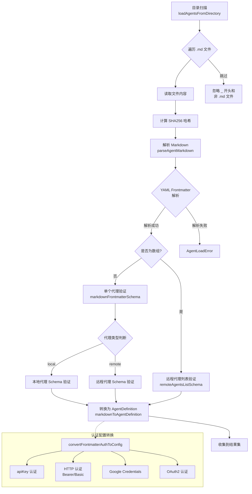
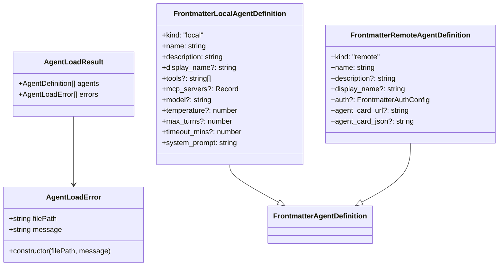

# agentLoader.ts

## 概述

`agentLoader.ts` 是 Gemini CLI 核心包中的**代理加载器模块**，负责从文件系统中加载、解析和验证代理（Agent）定义文件。该模块支持两种类型的代理：**本地代理（Local Agent）** 和 **远程代理（Remote Agent）**，它们均通过 Markdown 文件（带有 YAML frontmatter）进行定义。

该模块的核心职责包括：
- 解析 Markdown 文件中的 YAML frontmatter 元数据
- 使用 Zod 模式对代理定义进行严格验证
- 将前端定义格式（Frontmatter DTO）转换为内部 `AgentDefinition` 类型
- 从指定目录批量加载所有代理定义文件
- 支持多种认证方式（API Key、HTTP、OAuth2、Google Credentials）

## 架构图（Mermaid）





## 核心组件

### 1. `AgentLoadError` 类（第 28-36 行）

自定义错误类，继承自 `Error`，用于在代理加载过程中抛出带有文件路径上下文的错误。

```typescript
export class AgentLoadError extends Error {
  constructor(
    public filePath: string,
    message: string,
  ) {
    super(`Failed to load agent from ${filePath}: ${message}`);
    this.name = 'AgentLoadError';
  }
}
```

- `filePath`：导致错误的文件路径
- 自动格式化错误消息，携带文件路径上下文

### 2. `AgentLoadResult` 接口（第 41-44 行）

代理加载结果的数据结构，采用"结果 + 错误"模式，允许部分成功。

```typescript
export interface AgentLoadResult {
  agents: AgentDefinition[];
  errors: AgentLoadError[];
}
```

### 3. Zod 验证模式（第 46-230 行）

模块定义了一系列严格的 Zod Schema 用于数据验证：

| Schema 名称 | 用途 | 关键约束 |
|---|---|---|
| `nameSchema` | 代理名称验证 | 必须为 slug 格式：`/^[a-z0-9-_]+$/` |
| `mcpServerSchema` | MCP 服务器配置验证 | 支持 command/url/http_url/tcp 多种连接方式 |
| `localAgentSchema` | 本地代理定义验证 | 严格模式（`.strict()`），不允许多余字段 |
| `remoteAgentUrlSchema` | 远程代理（URL 模式）验证 | 必须提供 `agent_card_url` |
| `remoteAgentJsonSchema` | 远程代理（JSON 模式）验证 | 必须提供有效 JSON 的 `agent_card_json` |
| `authConfigSchema` | 认证配置验证 | 使用 `discriminatedUnion` 按 `type` 字段区分四种认证方式 |

**认证类型详情：**

| 认证类型 | 必需字段 | 说明 |
|---|---|---|
| `apiKey` | `key` | API 密钥认证 |
| `http` (Bearer) | `scheme`, `token` | HTTP Bearer Token 认证 |
| `http` (Basic) | `scheme`, `username`, `password` | HTTP Basic 认证 |
| `google-credentials` | 无必需字段 | Google 凭证认证，可选 `scopes` |
| `oauth` | 无必需字段 | OAuth2 认证，可选 `client_id`、`client_secret` 等 |

### 4. `guessIntendedKind` 函数（第 232-254 行）

智能推断代理类型的辅助函数。当用户在 YAML frontmatter 中未显式指定 `kind` 字段时，通过分析已存在的字段名来推断用户意图：

- 存在 `tools`、`mcp_servers`、`model`、`temperature`、`max_turns`、`timeout_mins` → 推断为 `local`
- 存在 `agent_card_url`、`auth`、`agent_card_json` → 推断为 `remote`
- 用于优化 Zod 联合类型验证的错误消息，隐藏不相关分支的错误

### 5. `formatZodError` 函数（第 256-286 行）

将 Zod 验证错误格式化为人类可读的错误消息。特别处理了 `discriminatedUnion` 和 `union` 类型的错误，根据 `guessIntendedKind` 的结果过滤不相关分支的错误信息，并通过 `Set` 去重。

### 6. `parseAgentMarkdown` 函数（第 296-379 行）

**核心解析函数**，负责：
1. 读取文件内容（支持预加载内容）
2. 使用 `FRONTMATTER_REGEX` 提取 YAML frontmatter 和 Markdown 正文
3. 使用 `js-yaml` 解析 YAML
4. 判断是否为远程代理数组格式
5. 使用 `markdownFrontmatterSchema` 进行验证
6. 对本地代理，将 Markdown 正文作为 `system_prompt`
7. 返回 `FrontmatterAgentDefinition[]`（支持单个文件定义多个远程代理）

### 7. `convertFrontmatterAuthToConfig` 函数（第 385-450 行）

将 frontmatter 中的认证配置（snake_case YAML 格式）转换为内部 `A2AAuthConfig` 类型。使用 `switch` 语句处理四种认证类型，并通过 TypeScript 的 `never` 类型确保穷尽检查。

### 8. `markdownToAgentDefinition` 函数（第 459-562 行）

**核心转换函数**，将解析后的 `FrontmatterAgentDefinition` DTO 转换为内部 `AgentDefinition` 结构：

- **远程代理**：构建 `RemoteAgentDefinition`，包含 `agentCardUrl` 或 `agentCardJson`
- **本地代理**：构建完整的 `AgentDefinition`，包含：
  - `promptConfig`：系统提示词 + 查询模板 `${query}`
  - `modelConfig`：模型名称（默认 `inherit`）、temperature（默认 1）、topP（固定 0.95）
  - `runConfig`：最大轮次（默认 `DEFAULT_MAX_TURNS`）、最大时间（默认 `DEFAULT_MAX_TIME_MINUTES`）
  - `toolConfig`：工具列表配置
  - `mcpServers`：MCP 服务器配置映射
  - `inputConfig`：输入 Schema，定义 `query` 字段

### 9. `loadAgentsFromDirectory` 函数（第 572-629 行）

**目录级批量加载函数**，整体流程：
1. 读取目录内容（目录不存在时返回空结果，不报错）
2. 过滤出 `.md` 文件（排除 `_` 开头的文件）
3. 逐个文件：读取内容 → 计算 SHA256 哈希 → 解析 → 转换
4. 收集所有成功加载的代理和所有错误
5. 采用容错模式：单个文件失败不影响其他文件的加载

## 依赖关系

### 内部依赖

| 模块路径 | 导入内容 | 用途 |
|---|---|---|
| `./types.js` | `AgentDefinition`, `RemoteAgentDefinition`, `DEFAULT_MAX_TURNS`, `DEFAULT_MAX_TIME_MINUTES` | 代理定义的核心类型和默认常量 |
| `./auth-provider/types.js` | `A2AAuthConfig` | 认证配置类型定义 |
| `../config/config.js` | `MCPServerConfig` | MCP 服务器配置类 |
| `../tools/tool-names.js` | `isValidToolName` | 工具名称验证（支持通配符） |
| `../skills/skillLoader.js` | `FRONTMATTER_REGEX` | Markdown frontmatter 提取正则表达式 |
| `../utils/errors.js` | `getErrorMessage` | 错误消息提取工具 |

### 外部依赖

| 包名 | 用途 |
|---|---|
| `js-yaml` | YAML frontmatter 解析（`load` 函数） |
| `zod` | 运行时数据验证和类型推断 |
| `node:fs/promises` | 异步文件系统操作 |
| `node:fs` | `Dirent` 类型（目录条目） |
| `node:path` | 路径拼接 |
| `node:crypto` | SHA256 哈希计算 |

## 关键实现细节

1. **容错加载模式**：`loadAgentsFromDirectory` 采用"尽力而为"策略，单个文件的加载失败不会中断整个目录的处理，错误被收集到 `errors` 数组中与成功结果一起返回。

2. **内容哈希追踪**：每个加载的代理文件都会计算 SHA256 哈希值并附加到 `metadata` 中，这可用于检测文件变更、缓存失效等场景。

3. **智能错误报告**：`formatZodError` 结合 `guessIntendedKind` 实现了智能错误过滤。当用户定义本地代理时，不会显示远程代理相关的验证错误，反之亦然，大幅提升了开发者体验。

4. **单文件多代理支持**：一个 Markdown 文件的 frontmatter 可以是一个远程代理数组（YAML 数组格式），允许在单个文件中定义多个远程代理。

5. **约定优于配置**：
   - 以 `_` 开头的文件被自动忽略（用于草稿或禁用的代理）
   - 仅处理 `.md` 后缀的文件
   - 模型默认值为 `inherit`（继承父级配置）
   - temperature 默认为 1，topP 固定为 0.95

6. **严格模式验证**：`localAgentSchema` 使用 `.strict()` 模式，不允许未知字段出现在 frontmatter 中，确保配置的准确性。

7. **认证类型穷尽检查**：`convertFrontmatterAuthToConfig` 使用 TypeScript 的 `never` 类型实现编译期穷尽检查，确保新增认证类型时不会遗漏处理分支。

8. **系统提示词来源**：本地代理的 `system_prompt` 来自 Markdown 正文部分（frontmatter 之后的内容），这种设计让用户可以用标准 Markdown 编写复杂的系统提示词。
