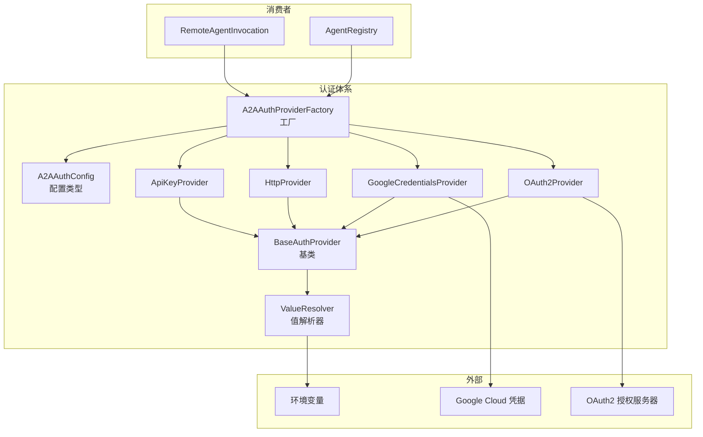

# agents/auth-provider (A2A 认证提供者)

## 概述

`auth-provider/` 子目录实现了远程 Agent (A2A) 通信所需的**认证提供者体系**。它提供了一个工厂模式的认证框架，支持多种认证方案（API Key、HTTP Bearer/Basic、Google Credentials、OAuth2），用于在调用远程 A2A Agent 时自动附加认证信息。

## 目录结构

```
auth-provider/
├── types.ts                        # 认证配置类型定义
├── factory.ts                      # AuthProviderFactory 工厂
├── base-provider.ts                # BaseAuthProvider 基类
├── api-key-provider.ts             # API Key 认证
├── http-provider.ts                # HTTP 认证（Bearer/Basic/自定义）
├── google-credentials-provider.ts  # Google 应用默认凭据
├── oauth2-provider.ts              # OAuth2 认证
├── value-resolver.ts               # 值解析器（支持环境变量引用）
└── *.test.ts                       # 单元测试
```

## 架构图



## 核心组件

### A2AAuthConfig (types.ts)

认证配置的联合类型，支持四种方案：

| 类型 | 配置字段 | 说明 |
|------|---------|------|
| `apiKey` | `key`, `name?` | API 密钥认证 |
| `http` | `scheme`, `token`/`username`+`password`/`value` | HTTP 认证头 |
| `google-credentials` | `scopes?` | Google 应用默认凭据 (ADC) |
| `oauth2` | `client_id`, `client_secret`, `scopes`, URLs | OAuth2 授权流 |

### A2AAuthProviderFactory (factory.ts)

工厂类，负责：
- 根据配置类型创建对应的认证提供者
- 验证认证配置与 Agent Card 的 security schemes 是否匹配
- 描述必需的认证配置（用于错误提示）

### ValueResolver (value-resolver.ts)

智能值解析器，支持认证配置中的值引用：
- 直接字面量值
- `$ENV_VAR` 语法引用环境变量
- 安全处理缺失环境变量的情况

### 各认证提供者

- **ApiKeyProvider**: 在请求头中附加 API Key
- **HttpProvider**: 支持 Bearer token、Basic auth 和自定义 scheme
- **GoogleCredentialsProvider**: 使用 `google-auth-library` 获取 ADC token
- **OAuth2Provider**: 完整的 OAuth2 授权码流程

## 依赖关系

### 内部依赖
- `agents/types.ts` -- `RemoteAgentDefinition`

### 外部依赖
- `@a2a-js/sdk` -- `AuthenticationHandler` 接口
- `google-auth-library` -- Google 凭据获取
