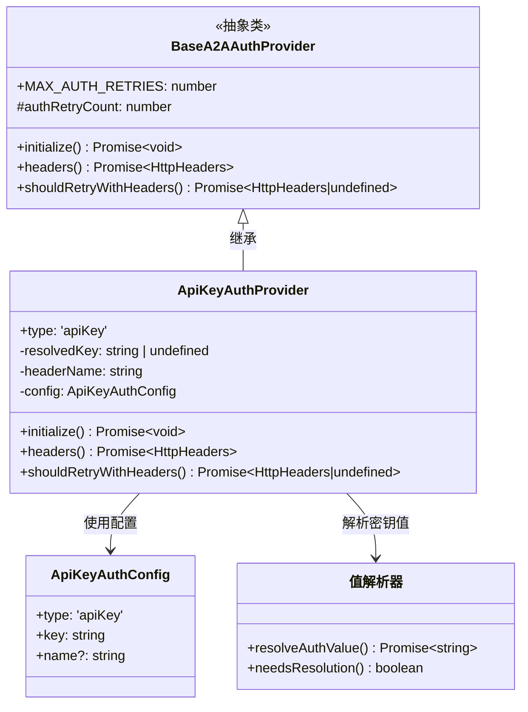
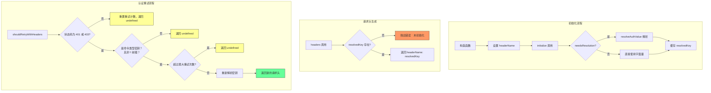
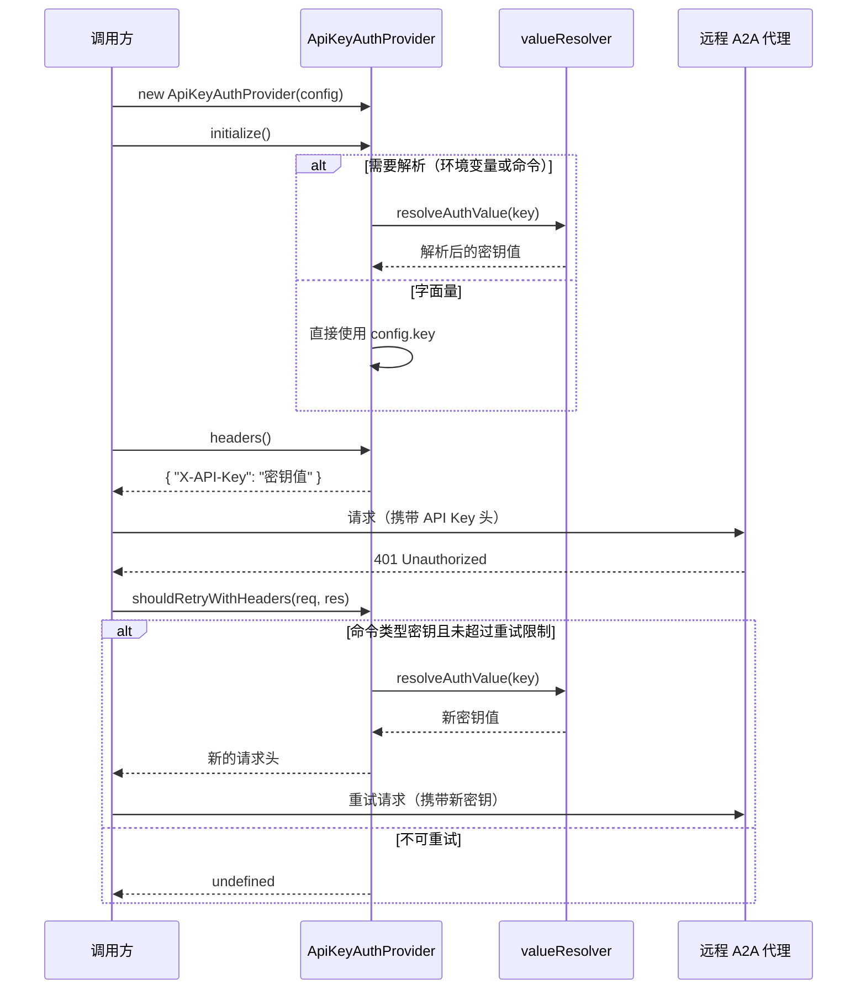

# api-key-provider.ts

## 概述

`api-key-provider.ts` 实现了基于 API Key 的认证提供者 `ApiKeyAuthProvider`，继承自 `BaseA2AAuthProvider`。它负责将 API 密钥作为 HTTP 请求头发送给远程 A2A（Agent-to-Agent）代理。

该认证提供者支持三种 API Key 值的来源：
- **字面量字符串**：直接使用配置中的值。
- **环境变量引用**：以 `$` 前缀标识（如 `$MY_API_KEY`），运行时从环境变量解析。
- **Shell 命令**：以 `!` 前缀标识（如 `!vault read secret/key`），运行时执行命令获取密钥。

## 架构图（Mermaid）







## 核心组件

### `ApiKeyAuthProvider` 类

继承自 `BaseA2AAuthProvider`，实现 API Key 认证逻辑。

#### 属性

| 属性 | 类型 | 可见性 | 描述 |
|------|------|--------|------|
| `type` | `'apiKey'` | `readonly` | 认证类型标识符 |
| `resolvedKey` | `string \| undefined` | `private` | 解析后的 API 密钥值 |
| `headerName` | `string` | `private readonly` | HTTP 请求头名称 |
| `config` | `ApiKeyAuthConfig` | `private readonly` | 认证配置对象 |

#### 常量

| 常量 | 值 | 描述 |
|------|---|------|
| `DEFAULT_HEADER_NAME` | `'X-API-Key'` | 默认的 HTTP 请求头名称 |

#### 构造函数

```typescript
constructor(private readonly config: ApiKeyAuthConfig)
```

- 调用父类 `super()` 构造函数。
- 设置 `headerName`：优先使用 `config.name`，若未指定则使用默认值 `'X-API-Key'`。

#### `initialize()` 方法

```typescript
override async initialize(): Promise<void>
```

初始化认证提供者，解析 API 密钥值：

1. 通过 `needsResolution()` 判断密钥值是否需要动态解析（环境变量或 Shell 命令）。
2. 若需要解析，调用 `resolveAuthValue()` 异步解析，并通过 `debugLogger` 记录解析来源（环境变量或命令）。
3. 若为字面量，直接赋值给 `resolvedKey`。

#### `headers()` 方法

```typescript
async headers(): Promise<HttpHeaders>
```

返回包含 API Key 的 HTTP 请求头：

- 如果 `resolvedKey` 不存在（未调用 `initialize()`），抛出错误。
- 返回格式：`{ [headerName]: resolvedKey }`。

#### `shouldRetryWithHeaders()` 方法

```typescript
override async shouldRetryWithHeaders(
  _req: RequestInit,
  res: Response,
): Promise<HttpHeaders | undefined>
```

在认证失败时尝试重新获取密钥并重试：

1. **非认证错误**：如果响应状态码不是 401 或 403，重置重试计数器并返回 `undefined`（不重试）。
2. **不可重试的密钥类型**：
   - 如果密钥不以 `!` 开头（字面量或环境变量），返回 `undefined`。原因：字面量和环境变量每次解析结果相同，重试无意义。
   - 如果密钥以 `!!` 开头，也返回 `undefined`。（`!!` 前缀可能表示缓存命令，同样不适合重试。）
3. **超过重试限制**：如果 `authRetryCount >= MAX_AUTH_RETRIES`，返回 `undefined`。
4. **执行重试**：递增重试计数器，重新调用 `resolveAuthValue()` 解析密钥，返回新的请求头。

## 依赖关系

### 内部依赖

| 模块路径 | 导入内容 | 用途 |
|---------|---------|------|
| `./base-provider.js` | `BaseA2AAuthProvider` | 认证提供者基类 |
| `./types.js` | `ApiKeyAuthConfig` | API Key 认证配置类型 |
| `./value-resolver.js` | `resolveAuthValue`, `needsResolution` | 认证值的动态解析工具函数 |
| `../../utils/debugLogger.js` | `debugLogger` | 调试日志记录器 |

### 外部依赖

| 包名 | 导入内容 | 用途 |
|------|---------|------|
| `@a2a-js/sdk/client` | `HttpHeaders` | HTTP 请求头类型定义 |

## 关键实现细节

1. **三种密钥来源的统一处理**：
   - **字面量**：直接使用，不需要解析（`needsResolution()` 返回 `false`）。
   - **环境变量**（`$` 前缀）：通过 `resolveAuthValue()` 从环境变量读取。
   - **Shell 命令**（`!` 前缀）：通过 `resolveAuthValue()` 执行命令获取输出。
   - 这种设计使得用户可以灵活选择密钥管理方式，例如直接写入配置文件、使用环境变量或集成密钥管理工具（如 Vault）。

2. **智能重试策略**：
   - 仅对以单个 `!` 开头（但不以 `!!` 开头）的命令类型密钥进行重试。
   - 这是因为只有命令每次执行可能返回不同的值（如通过 Vault 旋转的密钥），而字面量和环境变量在运行时不会变化。
   - `!!` 前缀的特殊处理可能用于区分缓存命令与动态命令。

3. **初始化守卫**：
   - `headers()` 方法在 `resolvedKey` 为空时抛出明确的错误信息，提醒调用方必须先调用 `initialize()`。
   - 这是一种防御性编程，防止未初始化状态下生成空的认证头。

4. **调试日志的安全性**：
   - `initialize()` 中的日志仅记录密钥来源类型（"env var" 或 "command"），不记录实际的密钥值，避免敏感信息泄露。

5. **自定义请求头名称**：
   - 默认使用 `X-API-Key` 请求头，但可通过 `config.name` 自定义。
   - 这支持不同远程代理使用不同的 API Key 头约定（如 `Authorization`、`Api-Key` 等）。

6. **重试计数器的重置机制**：
   - 当收到非 401/403 的响应时，`authRetryCount` 被重置为 0。
   - 这意味着每次认证成功（或遇到非认证错误）后，重试配额都会恢复。
