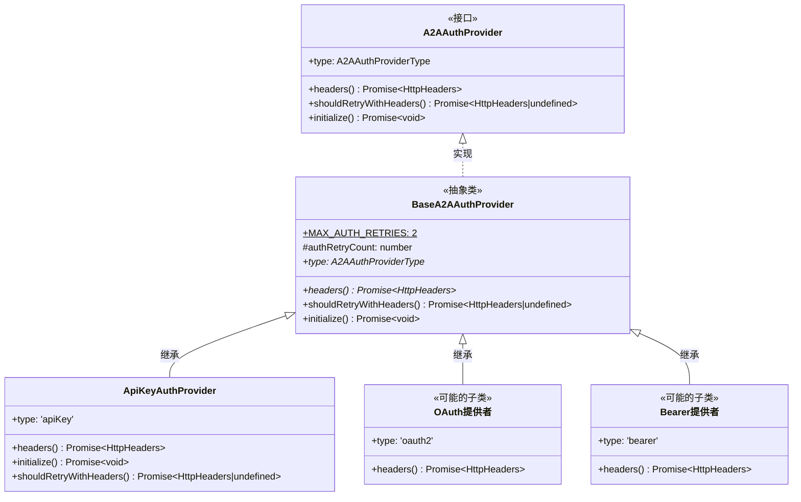
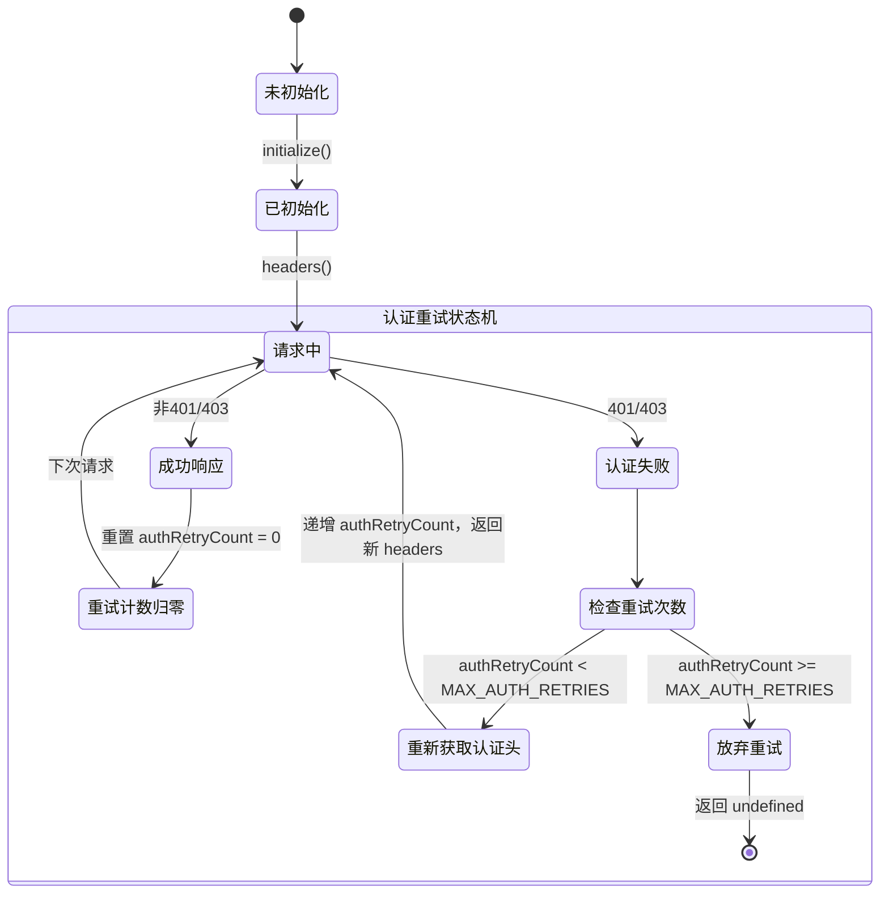
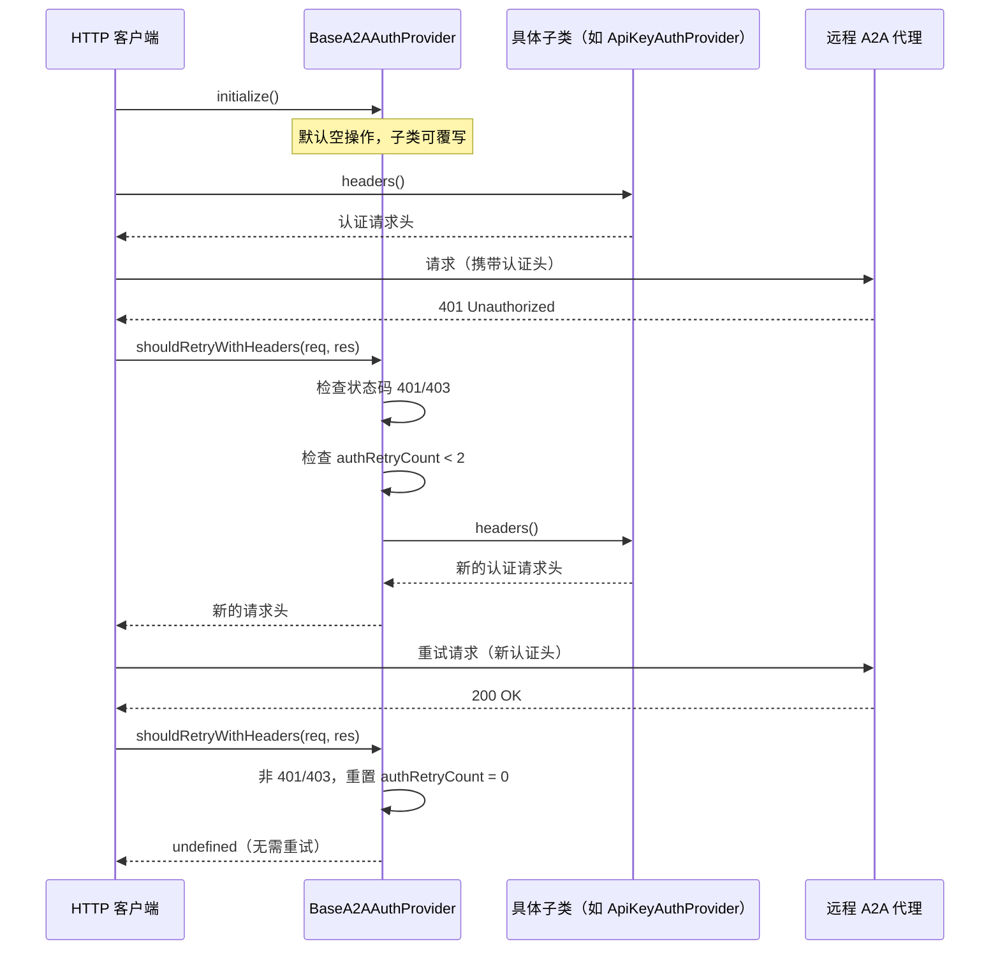

# base-provider.ts

## 概述

`base-provider.ts` 定义了 A2A（Agent-to-Agent）认证提供者的抽象基类 `BaseA2AAuthProvider`。它实现了 `A2AAuthProvider` 接口，提供了认证重试和初始化的默认实现，同时要求子类实现具体的认证头生成逻辑。

该基类是所有 A2A 认证提供者（如 `ApiKeyAuthProvider`、OAuth 提供者等）的共同父类，通过模板方法模式统一了认证流程中的重试机制和生命周期管理。

## 架构图（Mermaid）







## 核心组件

### `BaseA2AAuthProvider` 抽象类

实现 `A2AAuthProvider` 接口，是所有认证提供者的基类。

#### 静态属性

| 属性 | 类型 | 值 | 可见性 | 描述 |
|------|------|---|--------|------|
| `MAX_AUTH_RETRIES` | `number` | `2` | `protected static readonly` | 认证失败时的最大重试次数 |

#### 实例属性

| 属性 | 类型 | 初始值 | 可见性 | 描述 |
|------|------|--------|--------|------|
| `authRetryCount` | `number` | `0` | `protected` | 当前连续认证失败的重试计数器 |

#### 抽象成员

##### `type` 属性

```typescript
abstract readonly type: A2AAuthProviderType;
```
认证提供者的类型标识，由子类定义具体值（如 `'apiKey'`、`'oauth2'`、`'bearer'` 等）。

##### `headers()` 方法

```typescript
abstract headers(): Promise<HttpHeaders>;
```
返回需要附加到 HTTP 请求中的认证头。子类必须实现此方法以提供具体的认证信息。

#### 默认实现方法

##### `shouldRetryWithHeaders(req, res)` 方法

```typescript
async shouldRetryWithHeaders(
  _req: RequestInit,
  res: Response,
): Promise<HttpHeaders | undefined>
```

认证失败时的重试逻辑（默认实现）：

1. **检查状态码**：仅对 401（Unauthorized）和 403（Forbidden）响应触发重试。
2. **检查重试配额**：如果 `authRetryCount >= MAX_AUTH_RETRIES`（即已重试 2 次），返回 `undefined` 放弃重试。
3. **执行重试**：递增 `authRetryCount`，调用 `this.headers()` 获取新的认证头返回。
4. **非认证错误**：对于非 401/403 响应，重置 `authRetryCount` 为 0，返回 `undefined`。

子类可以覆写此方法以实现自定义重试逻辑（如 `ApiKeyAuthProvider` 中仅对命令类型密钥重试）。

##### `initialize()` 方法

```typescript
async initialize(): Promise<void>
```

初始化钩子方法，默认为空操作（no-op）。子类可覆写以执行异步初始化（如解析环境变量、执行 Shell 命令获取密钥等）。

## 依赖关系

### 内部依赖

| 模块路径 | 导入内容 | 用途 |
|---------|---------|------|
| `./types.js` | `A2AAuthProvider`, `A2AAuthProviderType` | 认证提供者接口和类型枚举 |

### 外部依赖

| 包名 | 导入内容 | 用途 |
|------|---------|------|
| `@a2a-js/sdk/client` | `HttpHeaders` | HTTP 请求头类型定义 |

## 关键实现细节

1. **模板方法模式**：
   - `BaseA2AAuthProvider` 使用了经典的模板方法（Template Method）设计模式。
   - 基类定义了重试策略的整体流程（`shouldRetryWithHeaders`），而具体的认证头生成逻辑（`headers`）由子类实现。
   - 子类可以选择性地覆写 `shouldRetryWithHeaders` 和 `initialize` 来定制行为，也可以使用默认实现。

2. **重试机制的设计**：
   - **最大重试次数为 2 次**：这是一个保守的默认值，避免在认证配置错误时产生过多无效请求。
   - **计数器重置策略**：当收到非 401/403 响应时，计数器重置为 0。这意味着每次成功认证后，重试配额都会恢复。这支持长时间运行的代理在密钥过期后重新获取认证。
   - **渐进式重试**：没有实现退避策略（backoff），每次重试都是立即执行。这对于简单的密钥刷新场景已经足够。

3. **生命周期管理**：
   - 提供者的生命周期为：`构造` -> `initialize()` -> `headers()` -> `shouldRetryWithHeaders()`（可选循环）。
   - `initialize()` 方法为异步，支持需要网络请求或命令执行的初始化场景。
   - 默认 `initialize()` 为空操作，使得不需要异步初始化的子类无需覆写。

4. **`protected` 可见性的选择**：
   - `authRetryCount` 为 `protected`，允许子类直接访问和修改重试计数器。
   - `MAX_AUTH_RETRIES` 为 `protected static readonly`，子类可以在重试逻辑中引用但无法修改。
   - 这种设计给予子类足够的灵活性来实现自定义重试策略（如 `ApiKeyAuthProvider` 在 `shouldRetryWithHeaders` 中直接操作 `authRetryCount`）。

5. **接口与抽象类的分离**：
   - `A2AAuthProvider` 是接口定义，`BaseA2AAuthProvider` 是抽象类实现。
   - 这种分离使得类型系统可以引用接口而不依赖具体实现，同时基类提供了可复用的默认行为。
   - 如果需要不继承基类的认证提供者，可以直接实现 `A2AAuthProvider` 接口。

6. **防御性编程**：
   - `shouldRetryWithHeaders` 的 `_req` 参数以下划线前缀标记为未使用，但保留在签名中以符合接口契约，并为子类提供请求上下文的访问能力。
   - 默认实现不使用请求信息，但子类（如需要根据请求 URL 决定是否重试的提供者）可以使用它。
