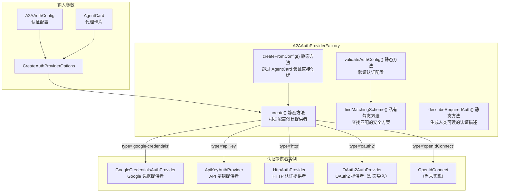

# factory.ts

## 概述

`factory.ts` 是 A2A（Agent-to-Agent）认证提供者的**工厂类**文件。它实现了工厂模式（Factory Pattern），负责根据不同的认证配置类型动态创建对应的认证提供者实例。该文件是整个 `auth-provider` 模块的核心入口点，所有认证提供者的实例化都通过此工厂完成。

工厂支持以下认证类型：
- `google-credentials` -- Google 凭据认证
- `apiKey` -- API 密钥认证
- `http` -- HTTP 认证（如 Bearer Token）
- `oauth2` -- OAuth 2.0 认证（动态导入）
- `openIdConnect` -- OpenID Connect 认证（尚未实现）

此外，工厂还提供认证配置验证功能，可以根据 AgentCard 中声明的安全方案（SecurityScheme）验证用户配置是否满足要求。

## 架构图（Mermaid）



## 核心组件

### 1. `CreateAuthProviderOptions` 接口

工厂创建方法的参数接口，包含以下字段：

| 字段名 | 类型 | 必填 | 说明 |
|--------|------|------|------|
| `agentName` | `string` | 否 | 代理名称，用于 OAuth/OIDC 的令牌存储 |
| `authConfig` | `A2AAuthConfig` | 否 | 认证配置对象，决定使用哪种认证类型 |
| `agentCard` | `AgentCard` | 否 | A2A 代理卡片，包含安全方案定义 |
| `targetUrl` | `string` | 否 | 目标 URL，某些提供者（如 google-credentials）用它确定令牌的 audience |
| `agentCardUrl` | `string` | 否 | 获取代理卡片的 URL，用于 OAuth2 的 URL 发现 |

### 2. `A2AAuthProviderFactory` 类

静态工厂类，所有方法均为静态方法，无需实例化。

#### 2.1 `create()` 方法

```typescript
static async create(options: CreateAuthProviderOptions): Promise<A2AAuthProvider | undefined>
```

核心工厂方法。根据 `authConfig.type` 使用 `switch` 语句分发到对应的提供者构造逻辑：

- **`google-credentials`**：创建 `GoogleCredentialsAuthProvider`，传入 `targetUrl` 作为 audience 参数
- **`apiKey`**：创建 `ApiKeyAuthProvider`
- **`http`**：创建 `HttpAuthProvider`
- **`oauth2`**：通过 **动态 `import()`** 加载 `OAuth2AuthProvider`，避免将 `MCPOAuthTokenStorage` 拉入静态模块图中造成初始化冲突。传入 `agentName`、`agentCard` 和 `agentCardUrl`
- **`openIdConnect`**：抛出未实现错误

每个提供者创建后都会调用 `await provider.initialize()` 进行初始化。

当 `authConfig` 未提供时返回 `undefined`。使用 TypeScript 的 `never` 类型进行穷尽性检查，确保所有认证类型都被处理。

#### 2.2 `createFromConfig()` 方法

```typescript
static async createFromConfig(authConfig: A2AAuthConfig, agentName?: string): Promise<A2AAuthProvider>
```

简化版工厂方法，绕过 AgentCard 验证，直接根据配置创建提供者。由于 `authConfig` 是必需参数，返回值不会是 `undefined`（使用非空断言 `!`）。

#### 2.3 `validateAuthConfig()` 方法

```typescript
static validateAuthConfig(
  authConfig: A2AAuthConfig | undefined,
  securitySchemes: Record<string, SecurityScheme> | undefined,
): AuthValidationResult
```

验证认证配置是否满足 AgentCard 中声明的安全方案要求。返回 `AuthValidationResult`，包含验证结果和差异信息。

- 如果没有安全方案要求，返回 `{ valid: true }`
- 如果有安全方案但没有配置，返回无效结果并列出缺失信息
- 如果有配置，调用 `findMatchingScheme()` 查找匹配

#### 2.4 `findMatchingScheme()` 私有方法

```typescript
private static findMatchingScheme(
  authConfig: A2AAuthConfig,
  securitySchemes: Record<string, SecurityScheme>,
): { matched: boolean; missingConfig: string[] }
```

遍历所有安全方案，检查当前认证配置是否匹配其中任一方案。遵循 A2A 规范的 **OR 语义**——只要匹配任意一个方案即可。

特殊逻辑：当认证类型是 `google-credentials` 且安全方案要求 HTTP Bearer 认证时，也视为匹配（因为 Google 凭据最终生成的也是 Bearer Token）。

支持的安全方案类型：`apiKey`、`http`、`oauth2`、`openIdConnect`、`mutualTLS`（不支持但有错误提示）。

#### 2.5 `describeRequiredAuth()` 方法

```typescript
static describeRequiredAuth(securitySchemes: Record<string, SecurityScheme>): string
```

将安全方案转换为人类可读的描述字符串，各方案之间用 `" OR "` 连接，用于错误消息展示。

## 依赖关系

### 内部依赖

| 导入模块 | 导入内容 | 说明 |
|----------|----------|------|
| `./types.js` | `A2AAuthConfig`, `A2AAuthProvider`, `AuthValidationResult` | 认证相关类型定义 |
| `./api-key-provider.js` | `ApiKeyAuthProvider` | API 密钥认证提供者 |
| `./http-provider.js` | `HttpAuthProvider` | HTTP 认证提供者 |
| `./google-credentials-provider.js` | `GoogleCredentialsAuthProvider` | Google 凭据认证提供者 |
| `./oauth2-provider.js` | `OAuth2AuthProvider`（动态导入） | OAuth2 认证提供者 |

### 外部依赖

| 导入模块 | 导入内容 | 说明 |
|----------|----------|------|
| `@a2a-js/sdk` | `AgentCard`, `SecurityScheme` | A2A 协议 SDK 的类型定义 |

## 关键实现细节

1. **动态导入 OAuth2 提供者**：`OAuth2AuthProvider` 使用 `await import('./oauth2-provider.js')` 动态导入，而非顶层静态导入。这是为了避免将 `MCPOAuthTokenStorage` 拉入工厂的静态模块依赖图，防止与 `code_assist/oauth-credential-storage.ts` 产生初始化冲突。这是一个刻意的架构决策。

2. **穷尽性检查（Exhaustive Check）**：在 `create()` 和 `findMatchingScheme()` 方法中，`switch` 语句的 `default` 分支使用了 `const _exhaustive: never = authConfig` 模式。这利用 TypeScript 的类型系统确保所有可能的认证类型都被处理，如果后续新增类型但忘记添加处理分支，编译时会报错。

3. **OR 语义的安全方案匹配**：A2A 规范规定，AgentCard 中定义的多个安全方案之间是 OR 关系，只需满足其中任意一个即可通过验证。`findMatchingScheme()` 在找到第一个匹配时立即返回 `{ matched: true }`。

4. **Google 凭据与 HTTP Bearer 的兼容**：`findMatchingScheme()` 中有一个特殊处理——当配置类型是 `google-credentials` 且安全方案要求 HTTP Bearer 认证时，视为匹配。这是因为 Google 凭据本质上会生成 Bearer Token，可以满足 HTTP Bearer 认证的要求。

5. **异步初始化模式**：所有提供者在创建后都需要调用 `await provider.initialize()` 进行异步初始化（如获取令牌、建立连接等），体现了两步构建模式（Two-Phase Construction）。

6. **工厂方法返回 `undefined` 的语义**：当 `authConfig` 缺失时，`create()` 返回 `undefined`，表示调用者应提示用户配置认证信息。这与抛出异常的语义不同——`undefined` 表示"需要配置"，而异常表示"配置有误"。
