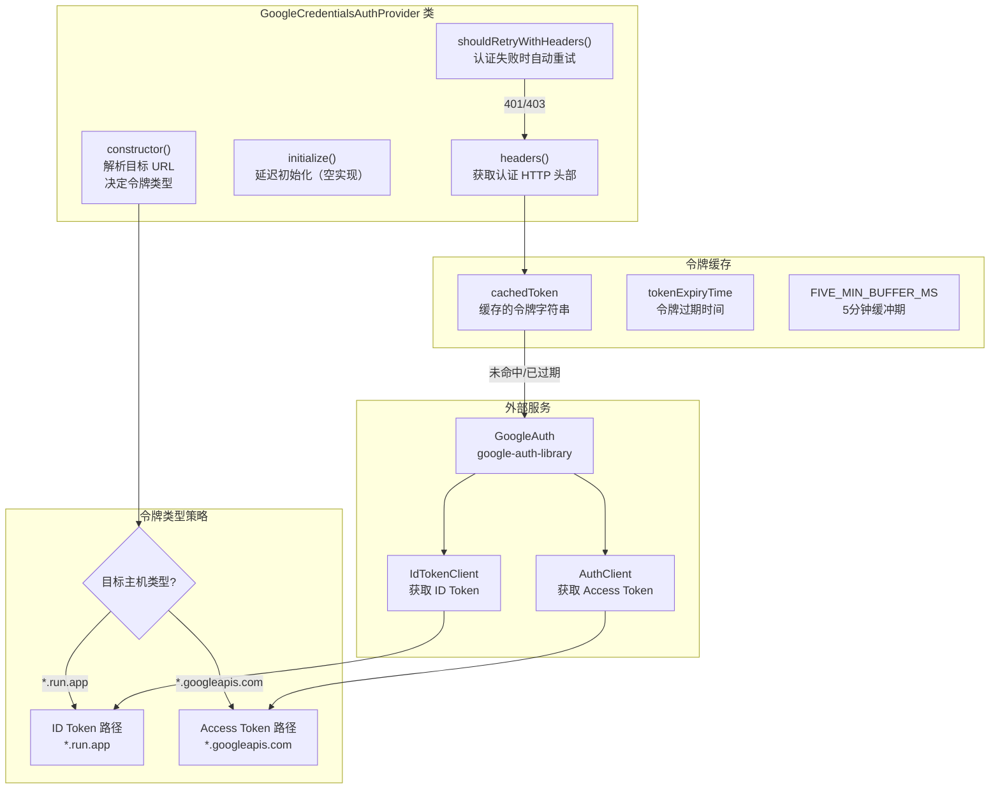

# google-credentials-provider.ts

## 概述

`google-credentials-provider.ts` 实现了基于 **Google ADC（Application Default Credentials，应用默认凭据）** 的认证提供者。它是 `BaseA2AAuthProvider` 的子类，专门用于与 Google Cloud 服务和 Cloud Run 应用进行认证交互。

该提供者的核心智能在于：**根据目标端点 URL 自动判断应使用 ID Token（身份令牌）还是 Access Token（访问令牌）**。具体策略为：
- 当目标主机是 `*.run.app`（Cloud Run 服务）时，使用 **ID Token**
- 当目标主机是 `*.googleapis.com` 时，使用 **Access Token**
- 其他主机直接拒绝，抛出错误

此外，提供者内置了令牌缓存机制和认证失败后的自动重试逻辑。

## 架构图（Mermaid）



## 核心组件

### 1. 类定义

```typescript
export class GoogleCredentialsAuthProvider extends BaseA2AAuthProvider
```

继承自 `BaseA2AAuthProvider`，`type` 字段固定为 `'google-credentials'`。

### 2. 私有成员

| 成员名 | 类型 | 说明 |
|--------|------|------|
| `auth` | `GoogleAuth` | Google Auth 库实例，用于获取凭据 |
| `useIdToken` | `boolean` | 是否使用 ID Token（默认 `false`，即使用 Access Token） |
| `audience` | `string \| undefined` | 令牌的目标受众（audience），取自目标 URL 的主机名 |
| `cachedToken` | `string \| undefined` | 缓存的令牌字符串 |
| `tokenExpiryTime` | `number \| undefined` | 令牌过期的时间戳（毫秒） |
| `config` | `GoogleCredentialsAuthConfig` | 认证配置对象 |

### 3. 常量

| 常量名 | 值 | 说明 |
|--------|-----|------|
| `CLOUD_RUN_HOST_REGEX` | `/^(.*\.)?run\.app$/` | 匹配 Cloud Run 服务主机名的正则 |
| `ALLOWED_HOSTS` | `[/^.+\.googleapis\.com$/, CLOUD_RUN_HOST_REGEX]` | 允许使用此提供者的主机白名单 |

### 4. `constructor(config, targetUrl)`

构造函数执行以下步骤：

1. **验证 `targetUrl`**：如果未提供则抛出错误，因为需要它来确定令牌的 audience
2. **解析主机名**：从 `targetUrl` 中提取 hostname
3. **判断令牌类型**：如果主机匹配 `CLOUD_RUN_HOST_REGEX`（即 `*.run.app`），设置 `useIdToken = true`
4. **设置 audience**：将 hostname 设为 audience
5. **主机白名单验证**：如果不使用 ID Token，且主机不在 `ALLOWED_HOSTS` 白名单中，抛出错误
6. **配置 scopes**：如果配置中指定了 scopes 则使用，否则默认使用 `https://www.googleapis.com/auth/cloud-platform`
7. **创建 `GoogleAuth` 实例**

### 5. `initialize()`

```typescript
override async initialize(): Promise<void>
```

空实现。采用延迟获取策略，令牌在首次调用 `headers()` 时才获取。这是一个有意为之的设计决策，因为延迟获取通常更适合认证令牌场景。

### 6. `headers()`

```typescript
async headers(): Promise<HttpHeaders>
```

核心方法，返回包含认证信息的 HTTP 头部对象。执行流程：

1. **检查缓存**：如果缓存令牌存在且未过期（考虑 5 分钟缓冲期），直接返回 `{ Authorization: 'Bearer <token>' }`
2. **清除过期缓存**
3. **获取新令牌**：
   - **ID Token 路径**：调用 `auth.getIdTokenClient(audience)` 获取 ID Token 客户端，再调用 `fetchIdToken(audience)` 获取令牌。使用 `OAuthUtils.parseTokenExpiry()` 解析令牌中的过期时间
   - **Access Token 路径**：调用 `auth.getClient()` 获取认证客户端，再调用 `getAccessToken()` 获取令牌。过期时间从客户端凭据的 `expiry_date` 字段获取
4. **更新缓存**并返回认证头部

### 7. `shouldRetryWithHeaders(req, res)`

```typescript
override async shouldRetryWithHeaders(
  _req: RequestInit,
  res: Response,
): Promise<HttpHeaders | undefined>
```

认证失败后的重试逻辑：

1. 如果响应状态码不是 401 或 403，重置重试计数器并返回 `undefined`（不重试）
2. 如果已达到最大重试次数（`MAX_AUTH_RETRIES`），返回 `undefined`
3. 否则递增重试计数器，清除令牌缓存，重新调用 `headers()` 获取新令牌

## 依赖关系

### 内部依赖

| 导入模块 | 导入内容 | 说明 |
|----------|----------|------|
| `./base-provider.js` | `BaseA2AAuthProvider` | 认证提供者基类 |
| `./types.js` | `GoogleCredentialsAuthConfig` | Google 凭据认证配置类型 |
| `../../utils/debugLogger.js` | `debugLogger` | 调试日志工具 |
| `../../mcp/oauth-utils.js` | `OAuthUtils`, `FIVE_MIN_BUFFER_MS` | OAuth 工具类（解析令牌过期时间）和 5 分钟缓冲常量 |

### 外部依赖

| 导入模块 | 导入内容 | 说明 |
|----------|----------|------|
| `@a2a-js/sdk/client` | `HttpHeaders` | HTTP 头部类型定义 |
| `google-auth-library` | `GoogleAuth` | Google 官方认证库，提供 ADC 凭据管理 |

## 关键实现细节

1. **智能令牌类型选择**：提供者根据目标 URL 自动判断使用 ID Token 还是 Access Token。Cloud Run 服务需要 ID Token 进行身份验证（因为 Cloud Run 默认要求 OIDC 身份验证），而 Google API（`*.googleapis.com`）使用 Access Token 进行授权。这一设计让调用者无需关心令牌类型的细节。

2. **主机白名单安全机制**：`ALLOWED_HOSTS` 限制了只有 `*.googleapis.com` 和 `*.run.app` 两类主机可以使用此提供者。这是一种安全防护措施，防止 Google 凭据被意外发送到不受信任的第三方服务。注意，对于 `run.app` 主机使用 ID Token 路径时不需要做白名单检查（因为 ID Token 的 audience 绑定了特定服务，安全性由 Google 平台保证）。

3. **令牌缓存与过期缓冲**：令牌被缓存后，会在过期时间之前 5 分钟（`FIVE_MIN_BUFFER_MS`）就被视为过期并重新获取。这个缓冲期确保令牌在实际使用时不会刚好过期，避免了竞态条件。

4. **ID Token 过期时间解析**：ID Token 的过期时间通过 `OAuthUtils.parseTokenExpiry()` 从 JWT payload 中解析获取（ID Token 是一个 JWT）。而 Access Token 的过期时间则直接从 Google Auth 客户端的 `credentials.expiry_date` 字段获取。

5. **延迟令牌获取**：`initialize()` 方法为空实现，令牌在首次调用 `headers()` 时才获取。这避免了不必要的网络请求（比如创建了提供者但从未实际发起认证请求的场景）。

6. **认证失败重试**：`shouldRetryWithHeaders()` 在遇到 401/403 时自动清除缓存并重新获取令牌。这可以处理令牌意外过期或被撤销的情况。重试次数受 `BaseA2AAuthProvider.MAX_AUTH_RETRIES` 限制，防止无限重试。

7. **错误处理**：获取令牌失败时，错误信息会通过 `debugLogger.error()` 记录，并重新抛出一个包含描述性信息的新错误，便于上层调用者理解失败原因。
