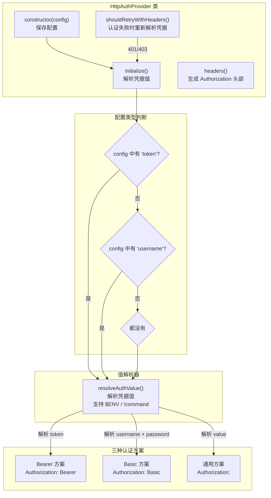

# http-provider.ts

## 概述

`http-provider.ts` 实现了基于 **HTTP 认证方案**的认证提供者。它是 `BaseA2AAuthProvider` 的子类，支持三种 HTTP 认证方式：

- **Bearer** -- 使用 Bearer Token 进行认证
- **Basic** -- 使用用户名和密码进行基本认证（Base64 编码）
- **其他 IANA 注册方案** -- 使用原始值（raw value）与任意 IANA 注册的认证方案搭配

该提供者的一大特色是凭据值的**动态解析**：通过 `resolveAuthValue()` 函数，令牌、用户名、密码等值可以来自环境变量（`$ENV`）或命令执行结果（`!command`），这使得凭据轮换场景下的认证失败重试变得有意义。

## 架构图（Mermaid）



## 核心组件

### 1. 类定义

```typescript
export class HttpAuthProvider extends BaseA2AAuthProvider
```

继承自 `BaseA2AAuthProvider`，`type` 字段固定为 `'http'`。

### 2. 私有成员

| 成员名 | 类型 | 说明 |
|--------|------|------|
| `config` | `HttpAuthConfig` | HTTP 认证配置对象（只读） |
| `resolvedToken` | `string \| undefined` | 解析后的 Bearer Token |
| `resolvedUsername` | `string \| undefined` | 解析后的用户名（Basic 认证） |
| `resolvedPassword` | `string \| undefined` | 解析后的密码（Basic 认证） |
| `resolvedValue` | `string \| undefined` | 解析后的原始值（通用认证方案） |

### 3. `constructor(config)`

简单构造函数，仅保存传入的 `HttpAuthConfig` 配置。实际的凭据解析推迟到 `initialize()` 方法中执行。

### 4. `initialize()`

```typescript
override async initialize(): Promise<void>
```

异步初始化方法，根据配置对象的形状（通过 `in` 操作符检查属性）决定解析哪些凭据值：

- **有 `token` 属性**：调用 `resolveAuthValue(config.token)` 解析 Bearer Token
- **有 `username` 属性**：分别调用 `resolveAuthValue()` 解析用户名和密码
- **都没有**：调用 `resolveAuthValue(config.value)` 解析通用方案的原始值

初始化完成后通过 `debugLogger.debug()` 记录当前使用的认证方案。

### 5. `headers()`

```typescript
override async headers(): Promise<HttpHeaders>
```

根据配置类型生成对应的 `Authorization` 头部：

| 配置类型 | 生成的头部 | 说明 |
|----------|-----------|------|
| 有 `token` | `Authorization: Bearer <resolvedToken>` | Bearer Token 认证 |
| 有 `username` | `Authorization: Basic <base64(username:password)>` | Basic 认证，使用 `Buffer.from().toString('base64')` 编码 |
| 其他 | `Authorization: <scheme> <resolvedValue>` | 使用配置中的 scheme 和解析后的值 |

如果对应的 resolved 值为空（即未初始化），抛出 `'HttpAuthProvider not initialized'` 错误。

### 6. `shouldRetryWithHeaders(req, res)`

```typescript
override async shouldRetryWithHeaders(
  req: RequestInit,
  res: Response,
): Promise<HttpHeaders | undefined>
```

认证失败后的重试逻辑：

1. 检查响应状态码是否为 401 或 403
2. 检查是否已达到最大重试次数 `MAX_AUTH_RETRIES`
3. 如果可以重试，**重新调用 `initialize()`** 重新解析凭据值
4. 调用父类的 `shouldRetryWithHeaders()` 方法继续处理

重新调用 `initialize()` 的意义在于：如果凭据值来自环境变量或命令执行（`$ENV` / `!command`），在令牌轮换后重新解析可以获得新的凭据。

## 依赖关系

### 内部依赖

| 导入模块 | 导入内容 | 说明 |
|----------|----------|------|
| `./base-provider.js` | `BaseA2AAuthProvider` | 认证提供者基类，提供重试计数等基础功能 |
| `./types.js` | `HttpAuthConfig` | HTTP 认证配置类型定义 |
| `./value-resolver.js` | `resolveAuthValue` | 凭据值解析器，支持从环境变量或命令输出解析值 |
| `../../utils/debugLogger.js` | `debugLogger` | 调试日志工具 |

### 外部依赖

| 导入模块 | 导入内容 | 说明 |
|----------|----------|------|
| `@a2a-js/sdk/client` | `HttpHeaders` | HTTP 头部类型定义 |

## 关键实现细节

1. **基于配置形状的分发**：`initialize()` 和 `headers()` 方法都使用 `in` 操作符检查配置对象是否包含特定属性（`'token' in config`、`'username' in config`）来决定处理逻辑。这是 TypeScript 的类型守卫（Type Guard）模式，可以正确缩窄联合类型。

2. **动态凭据解析**：所有凭据值都通过 `resolveAuthValue()` 函数解析，而不是直接使用配置中的字符串。这意味着配置值可以是环境变量引用（如 `$MY_TOKEN`）或命令引用（如 `!cat /path/to/token`），在运行时动态获取实际值。

3. **重试时重新解析凭据**：在 `shouldRetryWithHeaders()` 中，认证失败后会重新调用 `initialize()` 来重新解析凭据值。这对于凭据轮换场景特别有用——如果令牌已过期，环境变量可能已经更新为新令牌，重新解析就能获取到新值。

4. **Base64 编码的 Basic 认证**：Basic 认证按照 RFC 7617 规范，将 `username:password` 使用 Base64 编码后放入 `Authorization` 头部。使用 Node.js 的 `Buffer.from().toString('base64')` 进行编码。

5. **通用 IANA 方案支持**：除了 Bearer 和 Basic，还支持任意 IANA 注册的 HTTP 认证方案。此时直接将 `config.scheme` 和解析后的 `value` 组合为 `Authorization` 头部值。

6. **初始化检查**：`headers()` 方法在返回之前会检查对应的 resolved 值是否存在，如果不存在则抛出未初始化错误。这确保了调用者必须先调用 `initialize()` 才能使用认证头部。

7. **委托给父类的重试逻辑**：`shouldRetryWithHeaders()` 在重新解析凭据后，调用 `super.shouldRetryWithHeaders(req, res)` 将控制权交回父类。这允许父类 `BaseA2AAuthProvider` 管理重试计数器和其他基础重试逻辑。
