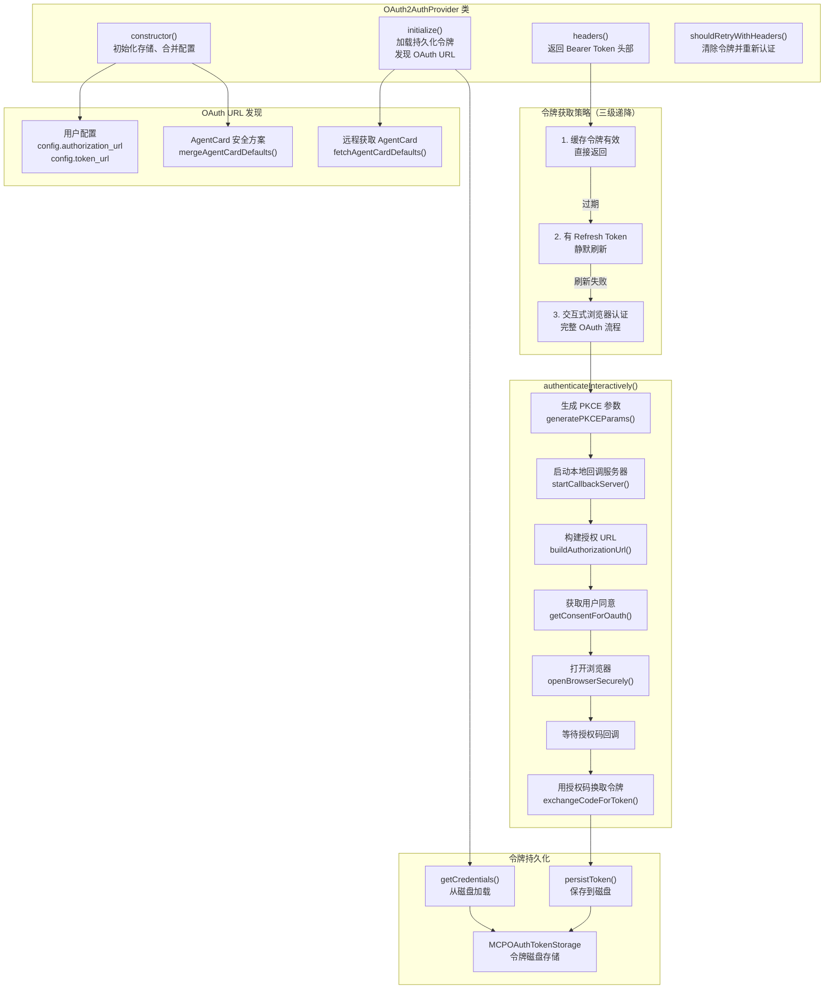

# oauth2-provider.ts

## 概述

`oauth2-provider.ts` 实现了基于 **OAuth 2.0 授权码流程（Authorization Code Flow）配合 PKCE** 的认证提供者。它是 `BaseA2AAuthProvider` 的子类，专门用于与需要 OAuth 2.0 认证的 A2A 远程代理交互。

这是所有认证提供者中最复杂的一个，它实现了完整的 OAuth 2.0 生命周期管理：

1. **令牌持久化**：通过 `MCPOAuthTokenStorage` 将令牌存储到磁盘，支持跨会话复用
2. **自动刷新**：当 Access Token 过期但 Refresh Token 有效时，静默刷新令牌
3. **交互式认证**：当没有有效令牌时，启动浏览器进行 OAuth 授权流程
4. **URL 发现**：OAuth 端点 URL 可以从用户配置、AgentCard 安全方案或远程获取的 AgentCard 中自动发现
5. **PKCE 安全增强**：使用 PKCE（Proof Key for Code Exchange）防止授权码拦截攻击

该提供者在工厂类中通过**动态 `import()`** 加载，以避免静态模块图中的初始化冲突。

## 架构图（Mermaid）



## 核心组件

### 1. 类定义

```typescript
export class OAuth2AuthProvider extends BaseA2AAuthProvider
```

继承自 `BaseA2AAuthProvider`，`type` 字段固定为 `'oauth2'`。

### 2. 私有成员

| 成员名 | 类型 | 说明 |
|--------|------|------|
| `config` | `OAuth2AuthConfig` | OAuth2 认证配置对象（只读） |
| `agentName` | `string` | 代理名称，用于令牌存储的键（只读） |
| `agentCardUrl` | `string \| undefined` | AgentCard 的获取 URL，用于 OAuth URL 发现（只读） |
| `tokenStorage` | `MCPOAuthTokenStorage` | 令牌持久化存储实例 |
| `cachedToken` | `OAuthToken \| null` | 内存中缓存的令牌 |
| `authorizationUrl` | `string \| undefined` | OAuth 授权端点 URL |
| `tokenUrl` | `string \| undefined` | OAuth 令牌端点 URL |
| `scopes` | `string[] \| undefined` | 请求的 OAuth 权限范围 |

### 3. `constructor(config, agentName, agentCard?, agentCardUrl?)`

构造函数执行以下步骤：

1. **初始化令牌存储**：创建 `MCPOAuthTokenStorage` 实例，存储路径为 `Storage.getA2AOAuthTokensPath()`，客户端标识为 `'gemini-cli-a2a'`
2. **从用户配置中提取 OAuth URL**：`authorization_url`、`token_url`、`scopes`
3. **合并 AgentCard 默认值**：调用 `mergeAgentCardDefaults()` 从传入的 AgentCard 中补充缺失的 OAuth URL

### 4. `initialize()`

```typescript
override async initialize(): Promise<void>
```

异步初始化方法，执行两项工作：

1. **远程发现 OAuth URL**：如果 `authorizationUrl` 或 `tokenUrl` 仍然缺失且有 `agentCardUrl`，调用 `fetchAgentCardDefaults()` 远程获取 AgentCard 并提取 OAuth URL
2. **加载持久化令牌**：从 `tokenStorage` 中加载之前保存的令牌，如果令牌未过期则缓存到内存中

### 5. `headers()`

```typescript
override async headers(): Promise<HttpHeaders>
```

核心方法，采用**三级递降策略**获取有效的 Bearer Token：

| 级别 | 条件 | 行为 |
|------|------|------|
| 第一级 | 缓存令牌有效 | 直接返回 `Authorization: Bearer <token>` |
| 第二级 | 令牌过期但有 Refresh Token | 调用 `refreshAccessToken()` 静默刷新，成功后持久化并返回 |
| 第三级 | 无有效令牌 | 调用 `authenticateInteractively()` 启动完整 OAuth 浏览器认证流程 |

如果第二级刷新失败，会清除过期的凭据并自动降级到第三级交互式认证。

### 6. `shouldRetryWithHeaders(req, res)`

```typescript
override async shouldRetryWithHeaders(
  _req: RequestInit,
  res: Response,
): Promise<HttpHeaders | undefined>
```

认证失败（401/403）后的重试逻辑：

1. 清除内存缓存（`cachedToken = null`）
2. 删除磁盘上的持久化令牌
3. 重新调用 `headers()` 获取新令牌（可能触发交互式认证）

### 7. `mergeAgentCardDefaults(agentCard)` 私有方法

```typescript
private mergeAgentCardDefaults(agentCard?: Pick<AgentCard, 'securitySchemes'> | null): void
```

从 AgentCard 的 `securitySchemes` 中查找第一个 `oauth2` 类型且包含 `authorizationCode` 流程的安全方案，提取：
- `authorizationUrl` -- 授权端点
- `tokenUrl` -- 令牌端点
- `scopes` -- 权限范围（从 `flow.scopes` 对象的键名提取）

使用 `??=`（空值合并赋值运算符）确保只有在用户配置缺失时才从 AgentCard 中补充。

### 8. `fetchAgentCardDefaults()` 私有方法

```typescript
private async fetchAgentCardDefaults(): Promise<void>
```

使用 `DefaultAgentCardResolver` 从 `agentCardUrl` 远程获取 AgentCard，然后调用 `mergeAgentCardDefaults()` 提取 OAuth URL。获取失败时只记录警告日志，不抛出异常。

### 9. `authenticateInteractively()` 私有方法

```typescript
private async authenticateInteractively(): Promise<OAuthToken>
```

执行完整的 OAuth 2.0 Authorization Code + PKCE 流程。详细步骤：

1. **前置检查**：确认 `client_id`、`authorizationUrl`、`tokenUrl` 都已配置
2. **生成 PKCE 参数**：调用 `generatePKCEParams()` 生成 `code_verifier`、`code_challenge` 和 `state`
3. **启动本地回调服务器**：调用 `startCallbackServer()` 在本地端口监听 OAuth 回调
4. **构建授权 URL**：调用 `buildAuthorizationUrl()` 生成完整的授权请求 URL
5. **获取用户同意**：调用 `getConsentForOauth()` 询问用户是否同意进行认证
6. **发出反馈信息**：通过 `coreEvents.emitFeedback()` 向用户显示授权 URL，以防浏览器未自动打开
7. **打开浏览器**：调用 `openBrowserSecurely()` 安全地打开系统浏览器
8. **等待授权码**：等待回调服务器接收到授权码
9. **交换令牌**：调用 `exchangeCodeForToken()` 用授权码换取 Access Token
10. **保存令牌**：转换格式、缓存到内存、持久化到磁盘

如果用户拒绝同意，抛出 `FatalCancellationError`。

### 10. `toOAuthToken(response, fallbackRefreshToken?)` 私有方法

```typescript
private toOAuthToken(response: {...}, fallbackRefreshToken?: string): OAuthToken
```

将 OAuth 令牌响应转换为内部 `OAuthToken` 格式：
- `accessToken` -- 访问令牌
- `tokenType` -- 令牌类型，默认 `'Bearer'`
- `refreshToken` -- 刷新令牌，新响应中的优先，否则使用 `fallbackRefreshToken`
- `scope` -- 权限范围
- `expiresAt` -- 过期时间戳，由 `expires_in`（秒）转换为绝对时间戳（毫秒）

### 11. `persistToken()` 私有方法

```typescript
private async persistToken(): Promise<void>
```

将当前缓存的令牌保存到磁盘存储，保存时关联 `agentName`、`client_id` 和 `tokenUrl`。

## 依赖关系

### 内部依赖

| 导入模块 | 导入内容 | 说明 |
|----------|----------|------|
| `./base-provider.js` | `BaseA2AAuthProvider` | 认证提供者基类 |
| `./types.js` | `OAuth2AuthConfig` | OAuth2 认证配置类型 |
| `../../mcp/oauth-token-storage.js` | `MCPOAuthTokenStorage` | OAuth 令牌持久化存储 |
| `../../mcp/token-storage/types.js` | `OAuthToken` | OAuth 令牌内部类型定义 |
| `../../utils/oauth-flow.js` | `generatePKCEParams`, `startCallbackServer`, `getPortFromUrl`, `buildAuthorizationUrl`, `exchangeCodeForToken`, `refreshAccessToken`, `OAuthFlowConfig` | OAuth 流程工具函数集 |
| `../../utils/secure-browser-launcher.js` | `openBrowserSecurely` | 安全浏览器启动器 |
| `../../utils/authConsent.js` | `getConsentForOauth` | OAuth 用户同意获取 |
| `../../utils/errors.js` | `FatalCancellationError`, `getErrorMessage` | 错误处理工具 |
| `../../utils/events.js` | `coreEvents` | 核心事件总线 |
| `../../utils/debugLogger.js` | `debugLogger` | 调试日志工具 |
| `../../config/storage.js` | `Storage` | 配置存储管理，获取令牌存储路径 |

### 外部依赖

| 导入模块 | 导入内容 | 说明 |
|----------|----------|------|
| `@a2a-js/sdk/client` | `HttpHeaders`, `DefaultAgentCardResolver` | HTTP 头部类型和 AgentCard 解析器 |
| `@a2a-js/sdk` | `AgentCard` | A2A 代理卡片类型定义 |

## 关键实现细节

1. **三级令牌获取策略**：`headers()` 方法实现了一个优雅的降级策略——缓存令牌 > 静默刷新 > 交互式认证。这确保了最佳的用户体验：大多数情况下用户无需干预，只有在必要时才需要浏览器交互。

2. **动态导入的原因**：此提供者在 `factory.ts` 中通过 `await import('./oauth2-provider.js')` 动态加载，而非静态导入。原因是 `MCPOAuthTokenStorage` 的模块依赖会与 `code_assist/oauth-credential-storage.ts` 产生初始化冲突。动态导入将加载时机推迟到实际需要时。

3. **PKCE 安全增强**：交互式认证使用 PKCE（Proof Key for Code Exchange，RFC 7636）。在授权请求中发送 `code_challenge`，在令牌交换时发送 `code_verifier`，防止授权码在传输过程中被拦截利用。

4. **多源 OAuth URL 发现**：OAuth 端点 URL 有三个来源，按优先级排列：
   - 用户配置中的 `authorization_url` / `token_url`（最高优先级）
   - 构造时传入的 AgentCard 的 `securitySchemes`
   - 远程获取的 AgentCard（通过 `agentCardUrl`，在 `initialize()` 时获取）

   使用 `??=` 运算符确保高优先级来源的值不会被低优先级覆盖。

5. **令牌持久化**：令牌通过 `MCPOAuthTokenStorage` 保存到磁盘（路径由 `Storage.getA2AOAuthTokensPath()` 决定），支持跨会话复用。令牌以 `agentName` 为键存储，关联 `client_id` 和 `tokenUrl` 信息。

6. **刷新令牌回退**：`toOAuthToken()` 方法中，如果新的令牌响应没有返回 `refresh_token`（某些 OAuth 服务在刷新时不返回新的 refresh token），则使用之前的 `refresh_token` 作为回退，确保刷新链不断裂。

7. **用户交互与反馈**：交互式认证流程中，通过 `getConsentForOauth()` 获取用户明确同意，并通过 `coreEvents.emitFeedback()` 向用户展示完整的授权 URL（以防浏览器未自动打开）。用户拒绝同意时抛出 `FatalCancellationError` 而非普通错误，表示这是一个不可恢复的取消操作。

8. **AgentCard 获取的容错**：`fetchAgentCardDefaults()` 在获取远程 AgentCard 失败时只记录警告日志而不抛出异常。这是因为 OAuth URL 可能已通过用户配置提供，远程获取只是补充手段。

9. **`resource` 参数为 `undefined`**：在调用 `buildAuthorizationUrl()` 和 `exchangeCodeForToken()` 时，`resource` 参数被明确设为 `undefined` 并标注了注释 `/* resource= */ undefined`。这是因为 MCP 协议需要 `resource` 参数，但 A2A 协议不需要。
