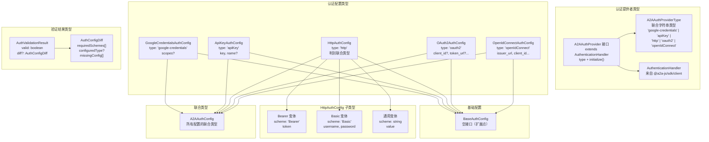

# types.ts

## 概述

`types.ts` 是 `auth-provider` 模块的**核心类型定义文件**，定义了 A2A（Agent-to-Agent）远程代理认证所需的全部 TypeScript 类型和接口。该文件是整个认证系统的类型基础，所有认证提供者（Provider）和工厂类都依赖于此处定义的类型。

这些类型对应了 A2A 协议规范中服务端 `SecurityScheme` 类型的**客户端配置**形式，即描述了客户端如何为不同安全方案提供认证凭据。

文件中定义的类型可以分为三大类：
1. **认证提供者接口** -- `A2AAuthProvider`、`A2AAuthProviderType`
2. **认证配置类型** -- 各种 `*AuthConfig` 接口及其联合类型 `A2AAuthConfig`
3. **验证结果类型** -- `AuthValidationResult`、`AuthConfigDiff`

参考规范：[A2A Protocol SecurityScheme](https://a2a-protocol.org/latest/specification/#451-securityscheme)

## 架构图（Mermaid）



## 核心组件

### 1. `A2AAuthProviderType` 类型别名

```typescript
export type A2AAuthProviderType =
  | 'google-credentials'
  | 'apiKey'
  | 'http'
  | 'oauth2'
  | 'openIdConnect';
```

字符串字面量联合类型，列出了所有支持的认证提供者类型：

| 值 | 说明 | 对应 A2A 规范 |
|-----|------|--------------|
| `'google-credentials'` | Google ADC 凭据（Gemini 特有） | 非标准扩展 |
| `'apiKey'` | API 密钥 | APIKeySecurityScheme |
| `'http'` | HTTP 认证（Bearer/Basic/其他） | HTTPAuthSecurityScheme |
| `'oauth2'` | OAuth 2.0 | OAuth2SecurityScheme |
| `'openIdConnect'` | OpenID Connect | OpenIdConnectSecurityScheme |

### 2. `A2AAuthProvider` 接口

```typescript
export interface A2AAuthProvider extends AuthenticationHandler {
  readonly type: A2AAuthProviderType;
  initialize?(): Promise<void>;
}
```

所有认证提供者必须实现的接口。

| 成员 | 类型 | 说明 |
|------|------|------|
| `type` | `A2AAuthProviderType`（只读） | 标识提供者类型的判别属性 |
| `initialize()` | `() => Promise<void>`（可选） | 异步初始化方法，用于加载凭据或建立连接 |

该接口继承自 `@a2a-js/sdk/client` 的 `AuthenticationHandler`，后者提供了 `headers()` 和 `shouldRetryWithHeaders()` 等方法定义。

### 3. `BaseAuthConfig` 接口

```typescript
export interface BaseAuthConfig {}
```

空接口，作为所有认证配置类型的基类。当前为空，但预留了将来扩展公共属性的能力。带有 ESLint 的 `@typescript-eslint/no-empty-object-type` 禁用注释。

### 4. `GoogleCredentialsAuthConfig` 接口

```typescript
export interface GoogleCredentialsAuthConfig extends BaseAuthConfig {
  type: 'google-credentials';
  scopes?: string[];
}
```

Google ADC（Application Default Credentials）认证的客户端配置。这是 Gemini CLI 特有的扩展，不在 A2A 标准规范中。

| 字段 | 类型 | 必填 | 说明 |
|------|------|------|------|
| `type` | `'google-credentials'` | 是 | 判别字段 |
| `scopes` | `string[]` | 否 | Google API 权限范围，默认使用 `cloud-platform` |

### 5. `ApiKeyAuthConfig` 接口

```typescript
export interface ApiKeyAuthConfig extends BaseAuthConfig {
  type: 'apiKey';
  key: string;
  name?: string;
}
```

对应 A2A 规范的 `APIKeySecurityScheme` 的客户端配置。当前**仅支持 header 位置**（不支持 query 和 cookie）。

| 字段 | 类型 | 必填 | 说明 |
|------|------|------|------|
| `type` | `'apiKey'` | 是 | 判别字段 |
| `key` | `string` | 是 | API 密钥值。**支持 `$ENV_VAR`、`!command` 或字面量** |
| `name` | `string` | 否 | HTTP 头部名称，默认 `'X-API-Key'` |

### 6. `HttpAuthConfig` 类型

```typescript
export type HttpAuthConfig = BaseAuthConfig & {
  type: 'http';
} & (BearerVariant | BasicVariant | GenericVariant);
```

对应 A2A 规范的 `HTTPAuthSecurityScheme` 的客户端配置。这是一个**判别联合类型（Discriminated Union）**，通过交叉类型（`&`）和联合类型（`|`）组合而成，包含三个变体：

#### 6.1 Bearer 变体

| 字段 | 类型 | 说明 |
|------|------|------|
| `scheme` | `'Bearer'` | 固定为 Bearer |
| `token` | `string` | Bearer Token 值。支持 `$ENV_VAR`、`!command` 或字面量 |

#### 6.2 Basic 变体

| 字段 | 类型 | 说明 |
|------|------|------|
| `scheme` | `'Basic'` | 固定为 Basic |
| `username` | `string` | 用户名。支持 `$ENV_VAR`、`!command` 或字面量 |
| `password` | `string` | 密码。支持 `$ENV_VAR`、`!command` 或字面量 |

#### 6.3 通用变体

| 字段 | 类型 | 说明 |
|------|------|------|
| `scheme` | `string` | 任意 IANA 注册的认证方案（如 `"Digest"`、`"HOBA"`、`"Custom"`） |
| `value` | `string` | 原始值，最终生成 `Authorization: <scheme> <value>`。支持 `$ENV_VAR`、`!command` 或字面量 |

### 7. `OAuth2AuthConfig` 接口

```typescript
export interface OAuth2AuthConfig extends BaseAuthConfig {
  type: 'oauth2';
  client_id?: string;
  client_secret?: string;
  scopes?: string[];
  authorization_url?: string;
  token_url?: string;
}
```

对应 A2A 规范的 `OAuth2SecurityScheme` 的客户端配置。

| 字段 | 类型 | 必填 | 说明 |
|------|------|------|------|
| `type` | `'oauth2'` | 是 | 判别字段 |
| `client_id` | `string` | 否 | OAuth2 客户端 ID |
| `client_secret` | `string` | 否 | OAuth2 客户端密钥 |
| `scopes` | `string[]` | 否 | 权限范围 |
| `authorization_url` | `string` | 否 | 授权端点 URL。如果省略，从 AgentCard 中自动发现 |
| `token_url` | `string` | 否 | 令牌端点 URL。如果省略，从 AgentCard 中自动发现 |

注意所有字段都是可选的，因为 `authorization_url` 和 `token_url` 可以从 AgentCard 的安全方案中自动发现。

### 8. `OpenIdConnectAuthConfig` 接口

```typescript
export interface OpenIdConnectAuthConfig extends BaseAuthConfig {
  type: 'openIdConnect';
  issuer_url: string;
  client_id: string;
  client_secret?: string;
  target_audience?: string;
  scopes?: string[];
}
```

对应 A2A 规范的 `OpenIdConnectSecurityScheme` 的客户端配置。**注意：该类型已定义但对应的提供者尚未实现**（工厂类中会抛出 `not yet implemented` 错误）。

| 字段 | 类型 | 必填 | 说明 |
|------|------|------|------|
| `type` | `'openIdConnect'` | 是 | 判别字段 |
| `issuer_url` | `string` | 是 | OIDC 签发者 URL |
| `client_id` | `string` | 是 | 客户端 ID |
| `client_secret` | `string` | 否 | 客户端密钥 |
| `target_audience` | `string` | 否 | 目标受众 |
| `scopes` | `string[]` | 否 | 权限范围 |

### 9. `A2AAuthConfig` 联合类型

```typescript
export type A2AAuthConfig =
  | GoogleCredentialsAuthConfig
  | ApiKeyAuthConfig
  | HttpAuthConfig
  | OAuth2AuthConfig
  | OpenIdConnectAuthConfig;
```

所有认证配置类型的联合。这是一个**判别联合类型**，以 `type` 字段作为判别属性。工厂类的 `switch (authConfig.type)` 语句和 TypeScript 的穷尽性检查都依赖于此联合类型。

### 10. `AuthConfigDiff` 接口

```typescript
export interface AuthConfigDiff {
  requiredSchemes: string[];
  configuredType?: A2AAuthProviderType;
  missingConfig: string[];
}
```

认证配置验证的差异信息，描述用户配置与 AgentCard 要求之间的不匹配。

| 字段 | 类型 | 说明 |
|------|------|------|
| `requiredSchemes` | `string[]` | AgentCard 要求的安全方案名称列表 |
| `configuredType` | `A2AAuthProviderType \| undefined` | 用户当前配置的认证类型，未配置时为 `undefined` |
| `missingConfig` | `string[]` | 人类可读的缺失配置描述列表 |

### 11. `AuthValidationResult` 接口

```typescript
export interface AuthValidationResult {
  valid: boolean;
  diff?: AuthConfigDiff;
}
```

认证配置验证的结果。

| 字段 | 类型 | 说明 |
|------|------|------|
| `valid` | `boolean` | 验证是否通过 |
| `diff` | `AuthConfigDiff \| undefined` | 当 `valid` 为 `false` 时，包含差异详情 |

## 依赖关系

### 内部依赖

无内部模块依赖。此文件作为类型定义文件，是被其他模块依赖的基础。

### 外部依赖

| 导入模块 | 导入内容 | 说明 |
|----------|----------|------|
| `@a2a-js/sdk/client` | `AuthenticationHandler` | A2A SDK 的认证处理器接口，`A2AAuthProvider` 继承于此 |

## 关键实现细节

1. **判别联合类型（Discriminated Union）**：`A2AAuthConfig` 是一个以 `type` 字段为判别属性的联合类型。这使得 TypeScript 可以在 `switch` 语句中自动缩窄类型范围，工厂类中的穷尽性检查（`const _exhaustive: never = authConfig`）依赖于此特性。如果新增了一种认证类型但忘记在 `switch` 中添加处理分支，TypeScript 会在编译时报错。

2. **`HttpAuthConfig` 的复合联合类型**：`HttpAuthConfig` 使用交叉类型（`&`）将公共属性（`type: 'http'`）与三个变体的联合类型（Bearer | Basic | 通用）组合。这种设计使得 `HttpAuthProvider` 可以使用 `'token' in config` 和 `'username' in config` 来判断当前变体，TypeScript 会正确缩窄类型。

3. **动态值解析支持**：`ApiKeyAuthConfig` 和 `HttpAuthConfig` 中的敏感值字段（`key`、`token`、`username`、`password`、`value`）都标注了"支持 `$ENV_VAR`、`!command` 或字面量"。这意味着这些字符串在使用前需要通过 `resolveAuthValue()` 函数解析，支持从环境变量读取（`$MY_TOKEN`）或执行命令获取（`!cat /path/to/secret`）。

4. **A2A 规范对齐**：每个配置接口都标注了对应的 A2A 规范安全方案类型。`GoogleCredentialsAuthConfig` 是唯一的例外，它是 Gemini CLI 特有的扩展，不在 A2A 标准规范中。

5. **`BaseAuthConfig` 空接口**：虽然当前为空，但所有认证配置都继承自它。这是一种"预留扩展点"的设计，将来如果需要为所有认证配置添加公共属性（如 `description`、`enabled` 等），只需修改 `BaseAuthConfig` 即可。

6. **`A2AAuthProvider` 的 `initialize()` 可选性**：`initialize()` 方法被标记为可选（`initialize?()`），这意味着某些提供者可能不需要异步初始化。然而在实践中，工厂类 `create()` 方法始终会调用 `provider.initialize()`，只是某些提供者（如 `GoogleCredentialsAuthProvider`）的 `initialize()` 实现为空操作。

7. **OAuth2AuthConfig 的全可选字段设计**：`OAuth2AuthConfig` 中所有字段（除 `type`）都是可选的。这是因为 `authorization_url` 和 `token_url` 可以从 AgentCard 自动发现，`client_id` 和 `client_secret` 在某些公开 OAuth 场景中可能不需要。这种宽松的类型定义将验证逻辑推迟到运行时（`authenticateInteractively()` 中进行检查）。

8. **OpenIdConnect 的前瞻定义**：`OpenIdConnectAuthConfig` 类型已完整定义，但对应的提供者实现尚未完成（工厂类中标记为 TODO）。这种"类型先行"的做法使得配置解析和验证逻辑已经就绪，只需补充提供者实现即可。
