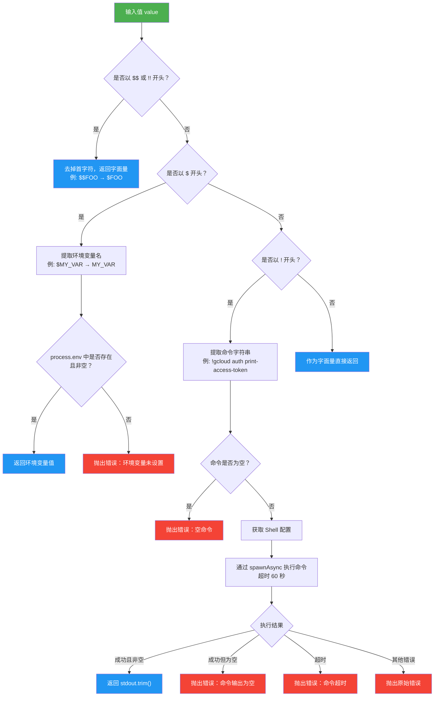
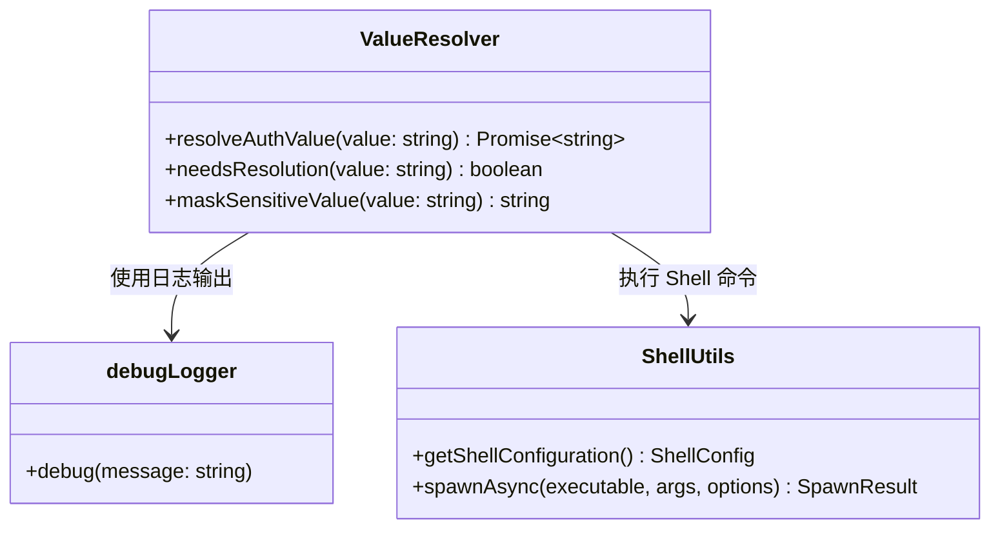

# value-resolver.ts

## 概述

`value-resolver.ts` 是认证提供者（auth-provider）模块中的值解析器工具文件。它的核心职责是将配置中的认证值从多种格式（环境变量引用、Shell 命令、字面量）解析为实际的字符串值。这在处理 API 密钥、Token 等敏感认证信息时非常关键，允许用户以灵活的方式配置认证凭据，而无需将明文密钥硬编码在配置文件中。

该模块导出三个函数：
- `resolveAuthValue` - 异步解析认证值（核心函数）
- `needsResolution` - 判断一个值是否需要解析
- `maskSensitiveValue` - 将敏感值脱敏处理，用于日志输出

## 架构图（Mermaid）





## 核心组件

### 1. `resolveAuthValue(value: string): Promise<string>`

这是模块的核心异步函数，负责将输入值解析为实际的认证字符串。支持四种输入格式：

| 输入格式 | 含义 | 示例 | 结果 |
|----------|------|------|------|
| `$$...` 或 `!!...` | 转义前缀，去掉第一个字符返回字面量 | `$$FOO` | `$FOO` |
| `$ENV_VAR` | 读取环境变量 | `$GEMINI_API_KEY` | 环境变量的实际值 |
| `!command` | 执行 Shell 命令，取 stdout | `!gcloud auth print-access-token` | 命令的标准输出（已 trim） |
| 其他字符串 | 字面量 | `my-api-key-123` | `my-api-key-123` |

**关键实现细节：**
- 转义检测优先于功能前缀检测（`$$` 优先于 `$`，`!!` 优先于 `!`）
- 环境变量为空字符串也视为"未设置"，会抛出错误
- Shell 命令执行有 60 秒超时限制（`COMMAND_TIMEOUT_MS = 60_000`）
- 命令通过 `spawnAsync` 以子进程方式执行，使用系统 Shell 配置
- 命令输出自动 trim，如果 trim 后为空则抛出错误
- 超时通过 `AbortSignal.timeout()` 实现

### 2. `needsResolution(value: string): boolean`

轻量级同步检测函数，判断给定值是否需要通过 `resolveAuthValue` 进行解析。

```typescript
export function needsResolution(value: string): boolean {
  return value.startsWith('$') || value.startsWith('!');
}
```

> **注意：** 该函数不区分转义前缀（如 `$$`），对 `$$FOO` 也会返回 `true`。调用者通常在决定是否需要触发异步解析流程时使用此函数。

### 3. `maskSensitiveValue(value: string): string`

用于日志脱敏的工具函数。对敏感值进行掩码处理，仅保留首尾各 2 个字符，中间用 `****` 替代。

```typescript
export function maskSensitiveValue(value: string): string {
  if (value.length <= 12) {
    return '****';
  }
  return `${value.slice(0, 2)}****${value.slice(-2)}`;
}
```

- 长度 <= 12 的短值完全掩码为 `****`（防止短值被推断）
- 长度 > 12 的值保留首尾各 2 字符，如 `sk-1234567890ab` -> `sk****ab`

## 依赖关系

### 内部依赖

| 模块 | 导入内容 | 用途 |
|------|---------|------|
| `../../utils/debugLogger.js` | `debugLogger` | 调试日志输出，记录环境变量解析和命令执行的调试信息 |
| `../../utils/shell-utils.js` | `getShellConfiguration`, `spawnAsync` | 获取当前系统的 Shell 配置（如 `/bin/bash`、`/bin/zsh`），以及异步执行子进程命令 |

### 外部依赖

| 模块 | 用途 |
|------|------|
| Node.js `process.env` | 读取环境变量（内置全局对象） |
| Node.js `AbortSignal` | 实现命令执行超时控制（内置 API） |

## 关键实现细节

### 1. 解析优先级与转义机制

值解析按严格的优先级顺序执行：

1. **转义前缀** (`$$`, `!!`) - 最高优先级，去掉一个前缀字符后直接返回
2. **环境变量** (`$`) - 从 `process.env` 读取
3. **Shell 命令** (`!`) - 通过子进程执行
4. **字面量** - 默认兜底，直接返回

这种设计允许用户在需要以 `$` 或 `!` 开头的字面量值时，通过双写前缀进行转义。

### 2. Shell 命令执行的安全考量

- **超时保护**：通过 `AbortSignal.timeout(60_000)` 限制命令最长执行 60 秒，防止挂起
- **Shell 隔离**：使用 `getShellConfiguration()` 获取系统 Shell 配置，通过 `spawnAsync` 以独立子进程运行
- **Windows 兼容**：`windowsHide: true` 参数确保在 Windows 上不弹出命令行窗口
- **输出验证**：命令成功执行但输出为空时仍然抛出错误，避免使用空认证值

### 3. 错误处理策略

模块采用"快速失败"策略，在以下情况抛出明确的错误信息：

- 环境变量不存在或为空 -> 提示用户设置环境变量
- 命令格式为空 (`!` 后无内容) -> 提示期望的格式
- 命令输出为空 -> 提示具体哪个命令返回了空输出
- 命令超时 -> 提示超时时间
- 其他命令执行错误 -> 透传原始错误

### 4. 典型使用场景

该模块通常配合认证提供者（auth-provider）使用，典型场景包括：

```
# 配置文件中的认证值示例
api_key: $GEMINI_API_KEY              # 从环境变量读取
token: !gcloud auth print-access-token # 动态执行命令获取 token
static_key: my-hardcoded-key-123       # 直接使用字面量
escaped: $$NOT_AN_ENV_VAR              # 转义，实际值为 $NOT_AN_ENV_VAR
```
