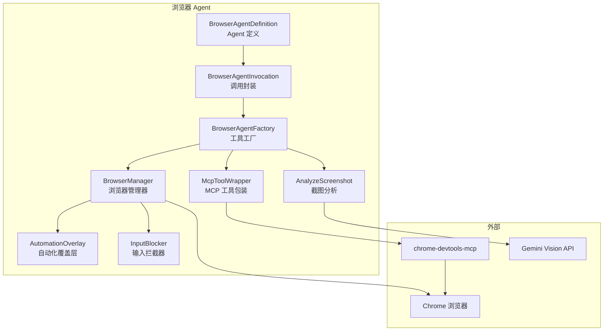
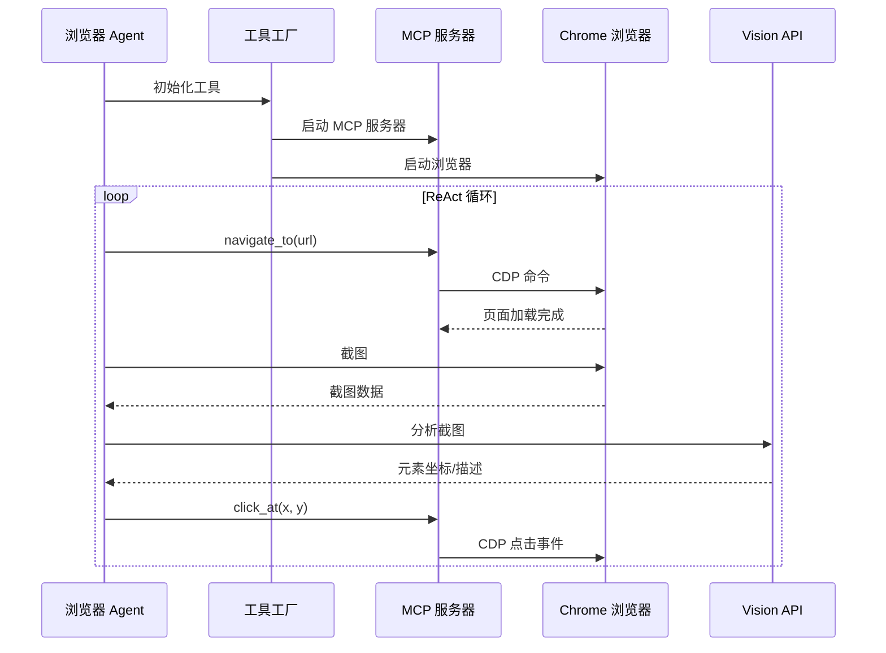

# agents/browser (浏览器 Agent)

## 概述

`browser/` 子目录实现了 Gemini CLI 的**浏览器自动化 Agent**，它能够启动和控制浏览器实例来完成网页交互任务。该 Agent 基于 `LocalAgentDefinition` 模式，使用 `LocalAgentExecutor` 驱动 ReAct 循环，工具在运行时通过 `browserAgentFactory` 动态配置。

浏览器 Agent 通过 MCP (Model Context Protocol) 与 `chrome-devtools-mcp` 服务通信，提供了截图分析、元素点击、页面导航等浏览器操作能力。

## 目录结构

```
browser/
├── browserAgentDefinition.ts     # Agent 定义（提示词、模型配置等）
├── browserAgentFactory.ts        # 工具动态配置工厂
├── browserAgentInvocation.ts     # Agent 调用封装
├── browserManager.ts             # 浏览器实例生命周期管理
├── analyzeScreenshot.ts          # 截图分析工具（基于 Vision 模型）
├── mcpToolWrapper.ts             # MCP 工具包装（添加确认逻辑）
├── automationOverlay.ts          # 自动化状态覆盖层（页面注入）
├── inputBlocker.ts               # 用户输入拦截（防止自动化干扰）
├── modelAvailability.ts          # 模型可用性检查
├── browser-tools-manifest.json   # 工具清单
└── *.test.ts                     # 单元测试
```

## 架构图



## 核心组件

### BrowserAgentDefinition (browserAgentDefinition.ts)

浏览器 Agent 的声明式定义：
- **名称**: `browser_agent`
- **模型**: 使用 Flash 模型（预览版或稳定版，取决于配置）
- **输出 Schema**: `{ success: boolean, summary: string, data?: unknown }`
- **系统提示词**: 包含详细的浏览器操作指南和视觉识别说明

### BrowserAgentFactory (browserAgentFactory.ts)

在运行时动态配置浏览器 Agent 的工具集：
- 启动/复用浏览器 MCP 服务器实例
- 注册 MCP 工具（导航、点击、输入等）
- 注册截图分析工具
- 管理浏览器会话生命周期

### BrowserManager (browserManager.ts)

浏览器实例的生命周期管理器：
- 使用 `puppeteer-core` 启动/连接 Chrome 浏览器
- 注入自动化覆盖层（显示 Agent 控制状态）
- 管理输入拦截（防止用户操作干扰自动化流程）
- 截图捕获和页面状态获取

### AnalyzeScreenshot (analyzeScreenshot.ts)

基于 Vision 模型的截图分析工具：
- 捕获当前页面截图
- 使用 Gemini Vision API 分析截图内容
- 返回视觉元素的坐标和描述

### McpToolWrapper (mcpToolWrapper.ts)

对 MCP 浏览器工具添加确认和安全逻辑的包装层。

## 依赖关系

### 内部依赖
- `agents/types.ts` -- `LocalAgentDefinition`
- `config/models.ts` -- 模型选择
- `tools/mcp-tool.ts` -- MCP 工具集成
- `core/baseLlmClient.ts` -- Vision API 调用

### 外部依赖
- `puppeteer-core` -- 浏览器控制
- `chrome-devtools-mcp` -- Chrome DevTools MCP 服务
- `@google/genai` -- Vision API

## 数据流


