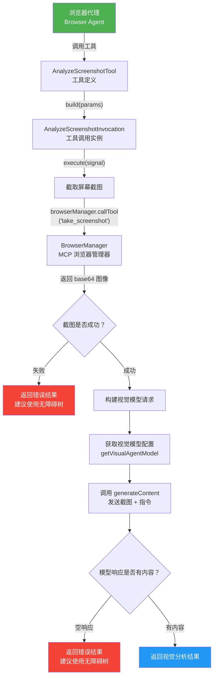
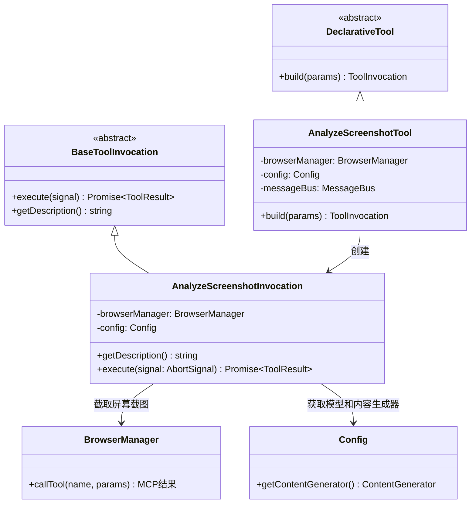

# analyzeScreenshot.ts

## 概述

`analyzeScreenshot.ts` 是浏览器代理（browser agent）模块中的视觉分析工具文件。它实现了 `analyze_screenshot` 工具，允许浏览器代理通过截屏和视觉模型（Vision LLM）来识别页面上的元素。

当语义浏览器代理（semantic browser agent）需要通过视觉属性（如颜色、布局、精确像素坐标）来识别元素，而这些信息在无障碍树（accessibility tree）中不可用时，就会调用此工具。该工具会截取当前页面的屏幕截图，将其发送给支持图像理解的大语言模型进行分析，然后将分析结果（坐标、元素描述等）返回给浏览器代理，由浏览器代理决定后续操作。

该模块导出一个工厂函数 `createAnalyzeScreenshotTool`，内部包含两个核心类：
- `AnalyzeScreenshotTool` - 工具声明类（继承 `DeclarativeTool`）
- `AnalyzeScreenshotInvocation` - 工具调用执行类（继承 `BaseToolInvocation`）

## 架构图（Mermaid）





## 核心组件

### 1. `VISUAL_SYSTEM_PROMPT` 常量

视觉分析模型的系统提示词，指导模型的行为：

- **角色定位**：视觉分析代理，仅负责分析，不执行操作
- **坐标系统**：基于视口的像素坐标，(0,0) 为左上角
- **响应格式**：提供精确坐标、元素描述、布局分析
- **关键约束**：尽可能提供坐标以支持 `click_at(x, y)` 操作；如果元素不可见需明确说明

### 2. `AnalyzeScreenshotInvocation` 类

继承自 `BaseToolInvocation`，是工具的实际执行逻辑。

#### 构造函数参数

| 参数 | 类型 | 说明 |
|------|------|------|
| `browserManager` | `BrowserManager` | 浏览器管理器，用于调用 MCP 工具截图 |
| `config` | `Config` | 配置对象，用于获取视觉模型和内容生成器 |
| `params` | `Record<string, unknown>` | 工具调用参数，包含 `instruction` 字段 |
| `messageBus` | `MessageBus` | 消息总线 |

#### `execute(signal: AbortSignal)` 方法

核心执行流程：

1. **截取屏幕截图**：通过 `browserManager.callTool('take_screenshot', {})` 调用 MCP 工具
2. **提取图像数据**：遍历 MCP 响应的 content 数组，查找 `type === 'image'` 的项，提取 base64 数据和 MIME 类型
3. **调用视觉模型**：使用 `contentGenerator.generateContent()` 发送包含截图和用户指令的请求
   - 模型参数：`temperature: 0`，`topP: 0.95`
   - 角色标记：`LlmRole.UTILITY_TOOL`
   - 使用标签：`'visual-analysis'`
4. **解析响应**：从候选结果中提取文本部分
5. **返回结果**：包装为 `ToolResult` 格式

#### 错误处理

| 错误场景 | 处理方式 |
|----------|---------|
| 截图失败（无 base64 数据） | 返回错误结果，建议使用无障碍树元素 |
| 视觉模型返回空响应 | 返回错误结果，建议使用无障碍树元素 |
| 模型不可用（404/403/not found/permission） | 返回友好提示，建议使用无障碍树和 UID |
| 其他错误 | 返回包含错误信息的结果，建议使用无障碍树 |

### 3. `AnalyzeScreenshotTool` 类

继承自 `DeclarativeTool`，定义了工具的元信息和参数 schema。

| 属性 | 值 |
|------|-----|
| 工具名称 | `analyze_screenshot` |
| 工具 ID | `analyze_screenshot` |
| 类别 | `Kind.Other` |
| 输出为 Markdown | `true` |
| 可更新输出 | `false` |

**参数 Schema：**

```json
{
  "type": "object",
  "properties": {
    "instruction": {
      "type": "string",
      "description": "What to identify or analyze visually..."
    }
  },
  "required": ["instruction"]
}
```

### 4. `createAnalyzeScreenshotTool()` 工厂函数

模块唯一导出的函数，用于创建 `AnalyzeScreenshotTool` 实例。

```typescript
export function createAnalyzeScreenshotTool(
  browserManager: BrowserManager,
  config: Config,
  messageBus: MessageBus,
): AnalyzeScreenshotTool
```

## 依赖关系

### 内部依赖

| 模块 | 导入内容 | 用途 |
|------|---------|------|
| `../../tools/tools.js` | `DeclarativeTool`, `BaseToolInvocation`, `Kind`, `ToolResult`, `ToolInvocation` | 工具基类和类型定义 |
| `../../confirmation-bus/message-bus.js` | `MessageBus` | 消息总线类型 |
| `./browserManager.js` | `BrowserManager` | 浏览器管理器，用于 MCP 工具调用（截图） |
| `../../config/config.js` | `Config` | 配置对象，提供内容生成器和模型信息 |
| `./modelAvailability.js` | `getVisualAgentModel` | 获取当前可用的视觉分析模型 |
| `../../utils/debugLogger.js` | `debugLogger` | 调试日志输出 |
| `../../telemetry/llmRole.js` | `LlmRole` | LLM 角色标记，用于遥测 |

### 外部依赖

无直接外部 npm 依赖。间接依赖通过 `Config.getContentGenerator()` 使用 Gemini API 等大模型 API。

## 关键实现细节

### 1. MCP 截图响应解析

MCP（Model Context Protocol）的 `take_screenshot` 工具返回的 content 数组通常包含两个元素：
- `content[0]`：文本描述（`type: 'text'`）
- `content[1]`：实际的 PNG 图片（`type: 'image'`，含 `data` 和 `mimeType`）

代码遍历整个 content 数组查找图像类型，而不是假设固定位置，增强了健壮性。

### 2. 视觉模型调用参数

```typescript
{
  model: visualModel,           // 由 getVisualAgentModel 动态确定
  config: {
    temperature: 0,             // 确定性输出，无随机性
    topP: 0.95,                 // 限制采样概率范围
    systemInstruction: VISUAL_SYSTEM_PROMPT,
    abortSignal: signal,        // 支持中断
  },
  contents: [
    {
      role: 'user',
      parts: [
        { text: "指令文本" },
        { inlineData: { mimeType, data: screenshotBase64 } }
      ]
    }
  ]
}
```

- `temperature: 0` 确保分析结果的稳定性和一致性
- 使用 `inlineData` 而非 URL，直接传输 base64 编码的截图
- 通过 `AbortSignal` 支持调用方中断操作

### 3. 优雅降级策略

该工具采用"分级降级"策略，确保即使视觉分析失败，浏览器代理也能继续工作：

1. **截图失败** -> 建议使用无障碍树元素
2. **模型不可用**（403/404） -> 明确告知模型不可用，建议使用无障碍树和 UID
3. **模型返回空** -> 建议使用无障碍树元素
4. **其他错误** -> 提供错误信息，建议使用无障碍树

所有错误路径都不会抛出异常到调用者，而是返回包含降级建议的 `ToolResult`。

### 4. 职责边界

该工具严格遵循"分析-不执行"原则：
- 只负责对截图进行视觉分析并返回结果
- 不直接执行任何浏览器操作（点击、输入等）
- 分析结果中包含坐标信息，由调用方（浏览器代理）决定后续动作
- 这种设计保持了浏览器代理对操作流程的完全控制权
