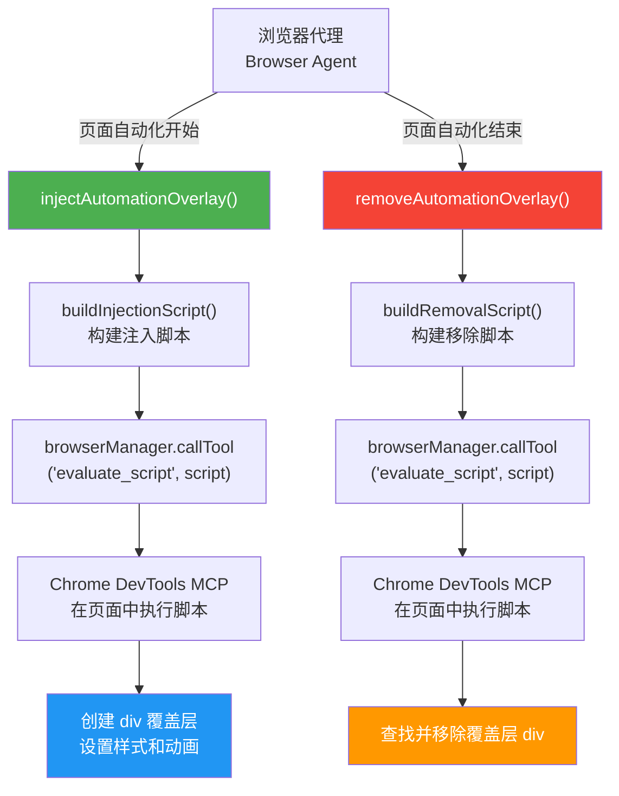
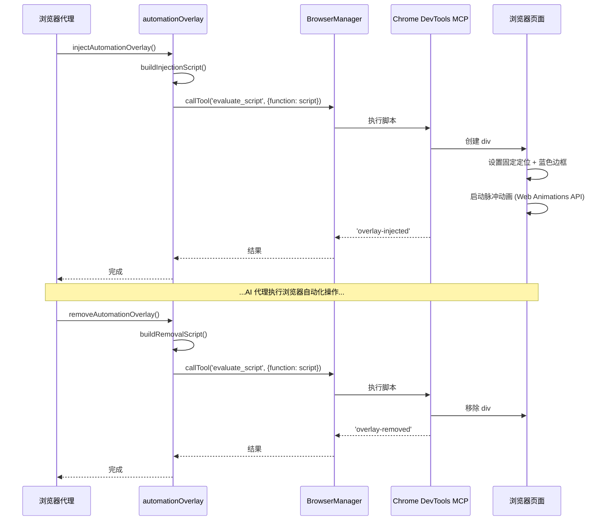

# automationOverlay.ts

## 概述

`automationOverlay.ts` 是浏览器代理模块中的自动化覆盖层（overlay）工具文件。它提供了在浏览器页面上注入和移除一个脉冲蓝色边框覆盖层的功能，用于在 AI 代理控制浏览器时给用户提供直观的视觉指示。

该覆盖层的核心特征：
- 一个固定定位的 6px 蓝色边框，覆盖整个视口
- 使用 Web Animations API 实现脉冲呼吸动画效果（蓝色边框明暗交替）
- `pointer-events: none` 确保不影响用户与页面的正常交互
- `z-index: 2147483647`（32 位整数最大值）确保覆盖层始终在最上层
- 使用 Web Animations API（而非注入 `<style>` 标签）以兼容严格 CSP（Content Security Policy）的网站

该模块导出两个异步函数：
- `injectAutomationOverlay` - 注入覆盖层
- `removeAutomationOverlay` - 移除覆盖层

## 架构图（Mermaid）





## 核心组件

### 1. `OVERLAY_ELEMENT_ID` 常量

```typescript
const OVERLAY_ELEMENT_ID = '__gemini_automation_overlay';
```

覆盖层 DOM 元素的唯一 ID，使用 `__gemini_` 前缀避免与页面现有元素冲突。注入和移除脚本都通过此 ID 定位元素。

### 2. `buildInjectionScript(): string`

内部函数，构建用于注入覆盖层的 JavaScript 箭头函数字符串。

**生成的脚本逻辑：**

1. 检查是否已存在覆盖层（通过 ID 查找），如已存在则先移除（幂等性）
2. 创建一个新的 `<div>` 元素
3. 设置无障碍属性（`aria-hidden="true"`, `role="presentation"`），避免影响屏幕阅读器
4. 通过 `Object.assign(overlay.style, {...})` 设置内联样式：
   - `position: fixed` - 固定定位，不随页面滚动
   - `top/left/right/bottom: 0` - 覆盖整个视口
   - `zIndex: 2147483647` - 最高层级（32 位整数最大值）
   - `pointerEvents: none` - 不拦截鼠标事件
   - `border: 6px solid rgba(66, 133, 244, 1.0)` - Google 蓝色边框
5. 将元素追加到 `document.documentElement`（即 `<html>` 元素）
6. 使用 Web Animations API 创建脉冲动画：
   - 三帧关键帧：透明 -> 不透明 -> 透明
   - 持续时间 2000ms，无限循环，缓入缓出
   - 包含 `boxShadow` 内发光效果

**脚本格式说明：**
- 返回箭头函数表达式（非 IIFE），因为 `chrome-devtools-mcp` 的 `evaluate_script` 工具会在内部调用它
- 避免使用嵌套模板字面量，使用字符串拼接代替
- 动画部分使用 `try-catch` 包裹，如果 Web Animations API 不可用或被 CSP 阻止，边框本身仍然可见

### 3. `buildRemovalScript(): string`

内部函数，构建用于移除覆盖层的 JavaScript 箭头函数字符串。

逻辑简单：通过 ID 查找元素，如果存在则调用 `el.remove()` 移除。

### 4. `injectAutomationOverlay(browserManager, signal?): Promise<void>`

导出的异步函数，注入自动化覆盖层。

| 参数 | 类型 | 必须 | 说明 |
|------|------|------|------|
| `browserManager` | `BrowserManager` | 是 | 浏览器管理器实例，用于调用 MCP 工具 |
| `signal` | `AbortSignal` | 否 | 用于中断操作的信号 |

**执行流程：**
1. 调用 `buildInjectionScript()` 生成脚本
2. 通过 `browserManager.callTool('evaluate_script', { function: script }, signal)` 执行
3. 检查结果的 `isError` 字段，记录成功或失败日志
4. 任何异常都被 `catch` 捕获并记录为警告，不向上抛出

### 5. `removeAutomationOverlay(browserManager, signal?): Promise<void>`

导出的异步函数，移除自动化覆盖层。参数和错误处理与 `injectAutomationOverlay` 完全一致，仅使用的脚本不同。

## 依赖关系

### 内部依赖

| 模块 | 导入内容 | 用途 |
|------|---------|------|
| `./browserManager.js` | `BrowserManager`（类型） | 浏览器管理器，用于调用 Chrome DevTools MCP 的 `evaluate_script` 工具 |
| `../../utils/debugLogger.js` | `debugLogger` | 日志记录（log 和 warn 级别） |

### 外部依赖

| 依赖 | 用途 |
|------|------|
| Chrome DevTools MCP `evaluate_script` 工具 | 运行时依赖，在浏览器页面中执行 JavaScript |
| Web Animations API（浏览器端） | 实现覆盖层的脉冲动画效果 |

## 关键实现细节

### 1. CSP 兼容性设计

许多网站（如 google.com）使用严格的内容安全策略（Content Security Policy），禁止注入 `<style>` 标签或使用内联样式表。该模块的设计充分考虑了这一点：

- **内联样式**：使用 `Object.assign(overlay.style, {...})` 而非注入 `<style>` 标签，因为 CSP 通常不限制通过 JavaScript 设置元素的 `style` 属性
- **Web Animations API**：使用 `element.animate()` 而非 CSS `@keyframes`，避免了 CSP 对 `style-src` 的限制
- **动画容错**：`try-catch` 包裹动画代码，即使动画创建失败，静态蓝色边框仍然可见

### 2. 幂等性

`buildInjectionScript()` 生成的脚本在创建新覆盖层之前会先检查并移除已存在的覆盖层：

```javascript
const existing = document.getElementById(id);
if (existing) existing.remove();
```

这确保了多次调用 `injectAutomationOverlay` 不会产生多个覆盖层。

### 3. 无障碍考虑

覆盖层元素设置了以下无障碍属性：
- `aria-hidden="true"` - 对屏幕阅读器隐藏
- `role="presentation"` - 标记为纯展示性元素

这确保了覆盖层不会干扰使用辅助技术的用户。

### 4. 错误静默处理

两个导出函数都采用"静默失败"策略：
- 所有错误都被 `catch` 捕获
- 错误仅记录到 `debugLogger.warn`，不向上传播
- 这是有意为之的设计，因为覆盖层是辅助性的视觉指示，其失败不应阻断浏览器代理的核心自动化流程

### 5. 视觉效果参数

| 参数 | 值 | 说明 |
|------|-----|------|
| 边框宽度 | 6px | 足够醒目但不过分 |
| 边框颜色 | `rgba(66, 133, 244, 1.0)` | Google 品牌蓝色 (#4285F4) |
| 动画帧 | 3 帧 | 透明(0.3) -> 不透明(1.0) -> 透明(0.3) |
| 动画时长 | 2000ms | 2 秒一个完整呼吸循环 |
| 动画缓动 | `ease-in-out` | 平滑过渡 |
| 内发光 | `inset box-shadow` | 8px-16px 范围的蓝色内阴影 |
| 循环次数 | `Infinity` | 持续脉冲直到移除 |
