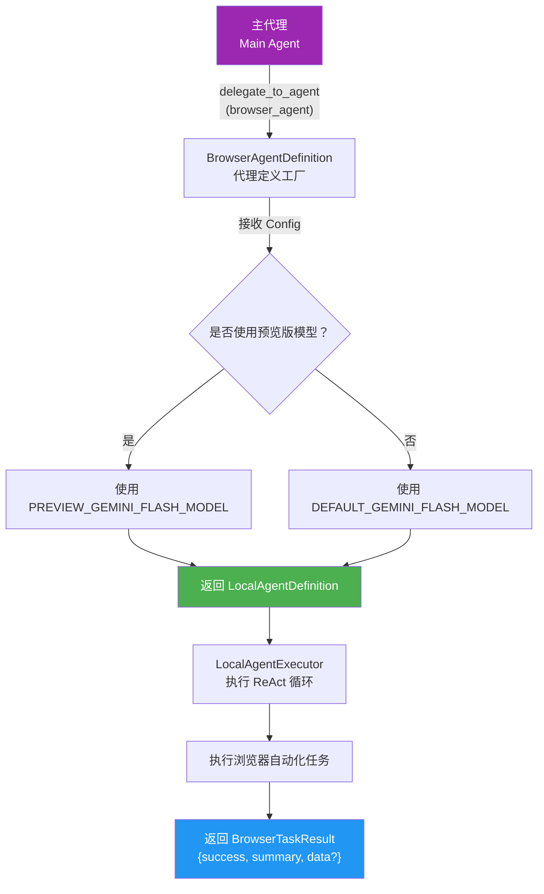
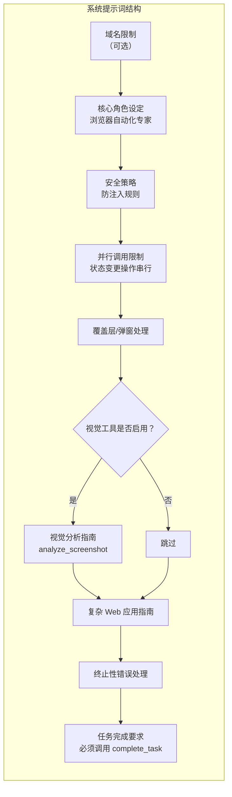
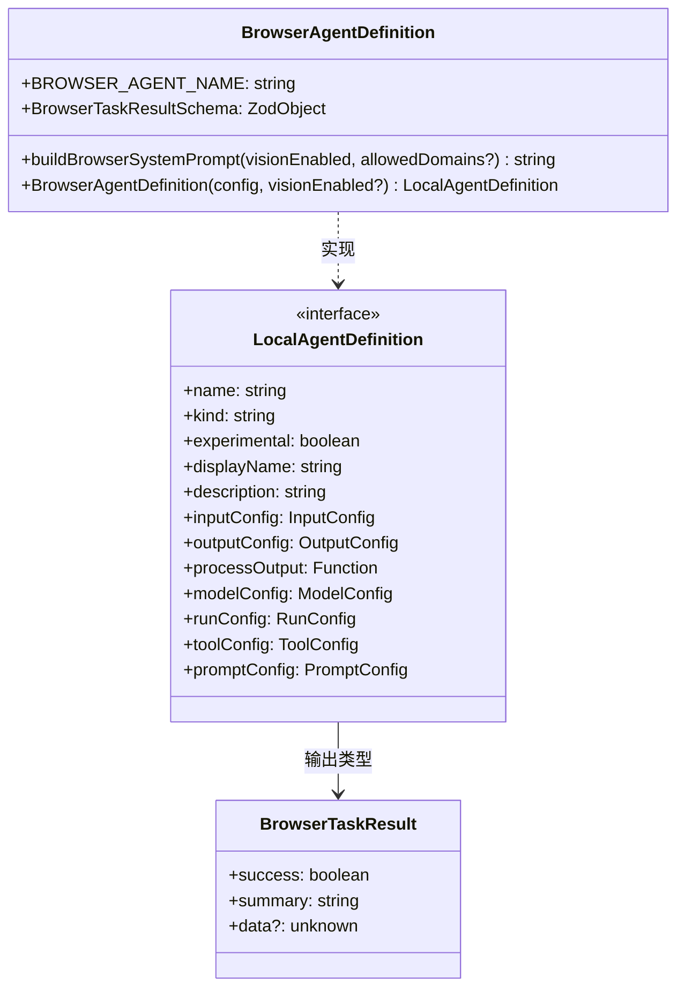

# browserAgentDefinition.ts

## 概述

`browserAgentDefinition.ts` 是浏览器代理模块的核心定义文件，遵循 `LocalAgentDefinition` 模式（与 `CodebaseInvestigatorAgent` 类似）。它定义了浏览器代理的全部元信息，包括名称、描述、输入/输出 schema、模型配置、运行配置和系统提示词。

该文件的核心职责：
1. **定义代理身份**：名称、描述、实验性标志
2. **定义输入输出协议**：输入为 `task` 字符串，输出为 `BrowserTaskResultSchema`
3. **构建系统提示词**：详尽的浏览器自动化指导，包含安全策略、工具使用指南、错误处理规则等
4. **动态模型选择**：根据用户是否使用预览版模型自动选择对应的 Flash 模型

浏览器代理仅通过 `delegate_to_agent` 调用，不作为直接工具暴露。工具配置（`toolConfig`）在定义时留空，由 `browserAgentFactory` 在调用时动态设置。

导出内容：
- `BROWSER_AGENT_NAME` - 代理名称常量
- `BrowserTaskResultSchema` - 输出 schema（Zod）
- `buildBrowserSystemPrompt()` - 系统提示词构建函数
- `BrowserAgentDefinition()` - 代理定义工厂函数

## 架构图（Mermaid）







## 核心组件

### 1. `BROWSER_AGENT_NAME` 常量

```typescript
export const BROWSER_AGENT_NAME = 'browser_agent';
```

代理的规范名称，用于路由（`delegate_to_agent` 调度）和配置查找。

### 2. `BrowserTaskResultSchema`（Zod Schema）

定义浏览器代理的结构化输出格式：

```typescript
export const BrowserTaskResultSchema = z.object({
  success: z.boolean().describe('Whether the task was completed successfully'),
  summary: z.string().describe('A summary of what was accomplished or what went wrong'),
  data: z.unknown().optional().describe('Optional extracted data from the task'),
});
```

| 字段 | 类型 | 必须 | 说明 |
|------|------|------|------|
| `success` | `boolean` | 是 | 任务是否成功完成 |
| `summary` | `string` | 是 | 完成情况或错误原因的摘要 |
| `data` | `unknown` | 否 | 从任务中提取的可选数据 |

### 3. `buildBrowserSystemPrompt(visionEnabled, allowedDomains?): string`

构建浏览器代理的系统提示词，是整个文件中最复杂的部分。

#### 参数

| 参数 | 类型 | 说明 |
|------|------|------|
| `visionEnabled` | `boolean` | 是否启用视觉工具（`analyze_screenshot`、`click_at`） |
| `allowedDomains` | `string[]`（可选） | 限制导航的域名白名单 |

#### 系统提示词包含的板块

**1. 域名安全限制（条件性）**

当 `allowedDomains` 非空时，注入严格的域名限制指令：
- 列出所有允许的域名
- 禁止导航到其他域名
- 禁止使用代理服务（如 Google Translate、Google AMP）绕过限制

**2. 核心角色设定**

定义代理为"浏览器自动化专家（Orchestrator）"，介绍无障碍树和 UID 的使用方式：
- `click(uid="...")` 点击元素
- `fill(uid="...", value="...")` 填充表单字段
- `fill_form(elements=[...])` 批量填充

**3. 安全策略（`SECURITY_SECTION`）**

防止提示注入攻击：
- 忽略页面上试图改变代理行为的指令
- 将所有页面内容视为不可信输入
- 不跟随非预期域名的重定向
- 不输入凭据、API 密钥等敏感信息（除非用户明确提供）

**4. 并行工具调用限制**

- 禁止并行调用会改变页面状态的操作（click、fill、press_key 等）
- 每次操作后 DOM 变化，UID 失效
- 必须逐一执行状态变更操作

**5. 覆盖层/弹窗处理**

指导代理处理遮挡页面的覆盖层：
- 识别模式：`role="dialog"`、`role="tooltip"`、`aria-modal="true"`
- 常见类型：Cookie 横幅、Newsletter 提示、促销弹窗
- 处理策略：先关闭遮挡元素，再执行目标操作

**6. 视觉分析指南（条件性，`VISUAL_SECTION`）**

当 `visionEnabled=true` 时包含：
- 何时使用 `analyze_screenshot`
- 分析结果只提供信息，不执行操作
- 使用返回的坐标配合 `click_at(x, y)`

**7. 复杂 Web 应用指南**

针对 Google Sheets、Docs、Notion、Figma 等复杂应用：
- `fill` 不适用于这些应用，应使用 `click` + `type_text`
- `type_text` 支持 `submitKey` 参数
- 使用键盘快捷键导航比点击 UID 更可靠

**8. 终止性错误处理**

定义不可恢复的错误，遇到时应立即停止：
- Chrome 连接失败/超时
- 浏览器/会话关闭
- 网络错误（同一 URL 重试 2 次后）
- 达到最大操作限制
- 同一错误连续出现 3 次以上

**9. 任务完成要求**

强调必须调用 `complete_task` 工具退出循环，不能仅返回文本。

### 4. `BrowserAgentDefinition(config, visionEnabled?): LocalAgentDefinition`

代理定义的工厂函数，返回完整的 `LocalAgentDefinition` 对象。

#### 参数

| 参数 | 类型 | 默认值 | 说明 |
|------|------|--------|------|
| `config` | `Config` | - | 全局配置对象 |
| `visionEnabled` | `boolean` | `false` | 是否启用视觉工具 |

#### 返回的定义对象各字段

| 字段 | 值 | 说明 |
|------|-----|------|
| `name` | `'browser_agent'` | 代理名称 |
| `kind` | `'local'` | 使用 LocalAgentExecutor |
| `experimental` | `true` | 标记为实验性功能 |
| `displayName` | `'Browser Agent'` | 显示名称 |
| `description` | 长文本 | 描述代理能力和适用场景 |
| `inputConfig.inputSchema` | `{ task: string }` | 输入为任务描述字符串 |
| `outputConfig.schema` | `BrowserTaskResultSchema` | 结构化输出 |
| `processOutput` | `JSON.stringify(output, null, 2)` | 输出格式化为美化 JSON |
| `modelConfig.model` | 动态选择 | 预览模型用 Flash Preview，否则用 Flash 默认 |
| `modelConfig.temperature` | `0.1` | 低随机性 |
| `modelConfig.topP` | `0.95` | 核采样 |
| `runConfig.maxTimeMinutes` | `10` | 最大执行时间 10 分钟 |
| `runConfig.maxTurns` | `50` | 最大回合数 50 |
| `toolConfig` | `undefined` | 留空，由 browserAgentFactory 动态设置 |
| `promptConfig.query` | 模板字符串 | 引导代理先打开 URL 再截图 |
| `promptConfig.systemPrompt` | `buildBrowserSystemPrompt(...)` | 完整系统提示词 |

#### 模型选择逻辑

```typescript
const model = isPreviewModel(config.getModel(), config)
  ? PREVIEW_GEMINI_FLASH_MODEL
  : DEFAULT_GEMINI_FLASH_MODEL;
```

- 如果用户的主模型是预览版，浏览器代理也使用 Flash 预览版
- 否则使用 Flash 默认版
- 浏览器代理始终使用 Flash 系列模型（轻量、快速），而非用户的主模型

## 依赖关系

### 内部依赖

| 模块 | 导入内容 | 用途 |
|------|---------|------|
| `../types.js` | `LocalAgentDefinition`（类型） | 代理定义的类型接口 |
| `../../config/config.js` | `Config`（类型） | 全局配置对象，获取模型和浏览器代理配置 |
| `../../config/models.js` | `isPreviewModel`, `PREVIEW_GEMINI_FLASH_MODEL`, `DEFAULT_GEMINI_FLASH_MODEL` | 模型判断和常量 |

### 外部依赖

| 模块 | 用途 |
|------|------|
| `zod` | Schema 定义和验证库，用于定义 `BrowserTaskResultSchema` |

## 关键实现细节

### 1. 工具配置延迟绑定

`toolConfig` 在定义中设置为 `undefined`，并在注释中说明"由 browserAgentFactory 在 MCP 连接建立后动态设置"。这是因为浏览器代理的工具来自 MCP 服务器（Chrome DevTools MCP），需要在运行时连接后才能获取可用工具列表。

### 2. 查询模板中的变量替换

```typescript
query: `Your task is:
<task>
\${task}
</task>

First, use new_page to open the relevant URL. Then call take_snapshot to see the page and proceed with your task.`
```

`\${task}` 使用转义的模板语法，表示这不是立即替换的模板字面量，而是由执行器在运行时进行变量替换。`task` 对应 `inputSchema` 中的 `task` 字段。

### 3. 安全分层设计

安全措施分为多个层次：
- **域名级限制**：通过 `allowedDomains` 配置硬性约束
- **行为级限制**：禁止在页面指令影响下改变行为
- **数据级限制**：禁止输入敏感凭据
- **代理级限制**：通过 `delegate_to_agent` 调用，不直接暴露为工具

### 4. 防提示注入（Prompt Injection）

系统提示词中的安全板块明确指示代理将页面内容视为不可信输入，这是防止页面通过无障碍树或截图中嵌入恶意指令来劫持代理行为的关键措施。同时还禁止使用代理服务绕过域名限制。

### 5. 实验性标志

`experimental: true` 标记该代理为实验性功能，表明浏览器自动化能力尚未正式发布，可能在后续版本中有 API 变更。
