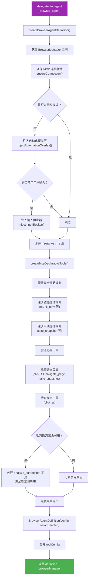
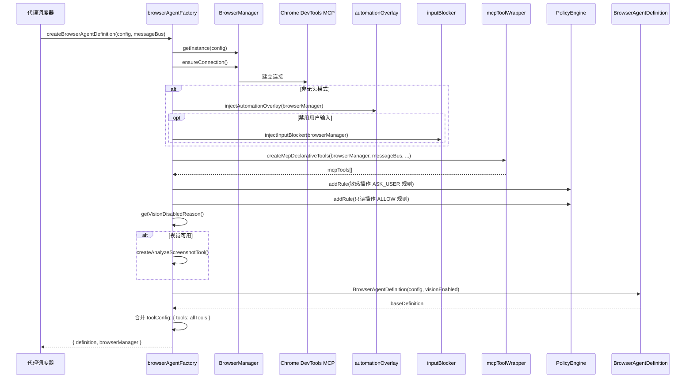
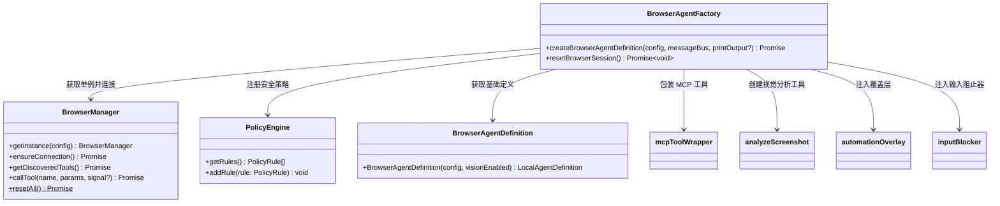

# browserAgentFactory.ts

## 概述

`browserAgentFactory.ts` 是浏览器代理模块的工厂文件，负责创建完整配置的浏览器代理定义。它是 `browserAgentDefinition.ts`（静态定义）和实际运行环境之间的桥梁。当浏览器代理通过 `delegate_to_agent` 被调用时，此工厂函数被执行，完成以下关键任务：

1. **建立浏览器连接**：获取或创建 `BrowserManager` 单例，确保 MCP 连接就绪
2. **注入 UI 覆盖层**：在非无头模式下注入自动化覆盖层和输入阻止器
3. **发现并包装 MCP 工具**：从 Chrome DevTools MCP 动态发现可用工具，包装为声明式工具
4. **配置安全策略**：为敏感操作和只读操作注册适当的策略规则
5. **视觉能力检测**：判断是否启用视觉分析工具
6. **组装最终定义**：将基础定义与动态工具配置合并，返回完整的 `LocalAgentDefinition`

该模块导出两个函数：
- `createBrowserAgentDefinition` - 创建完整的浏览器代理定义（核心工厂函数）
- `resetBrowserSession` - 关闭所有持久化浏览器会话，清理资源

## 架构图（Mermaid）







## 核心组件

### 1. `createBrowserAgentDefinition(config, messageBus, printOutput?)`

核心工厂函数，完成浏览器代理的完整初始化流程。

#### 参数

| 参数 | 类型 | 必须 | 说明 |
|------|------|------|------|
| `config` | `Config` | 是 | 运行时全局配置 |
| `messageBus` | `MessageBus` | 是 | 消息总线，用于工具调用通信 |
| `printOutput` | `(msg: string) => void` | 否 | 进度信息输出回调 |

#### 返回值

```typescript
Promise<{
  definition: LocalAgentDefinition<typeof BrowserTaskResultSchema>;
  browserManager: BrowserManager;
}>
```

返回完整配置的代理定义和浏览器管理器实例（管理器实例用于后续清理）。

#### 执行流程详解

**阶段 1：建立浏览器连接**

```typescript
const browserManager = BrowserManager.getInstance(config);
await browserManager.ensureConnection();
```

通过单例模式获取 `BrowserManager`，确保 MCP 连接已建立。同一会话模式/配置下共享同一实例。

**阶段 2：注入 UI 元素（非无头模式）**

```typescript
if (!browserConfig?.customConfig?.headless) {
    await injectAutomationOverlay(browserManager);
    if (shouldDisableInput) {
        await injectInputBlocker(browserManager);
    }
}
```

- **自动化覆盖层**：蓝色脉冲边框，指示 AI 正在控制浏览器
- **输入阻止器**：阻止用户在自动化期间操作浏览器，由 `config.shouldDisableBrowserUserInput()` 控制

**阶段 3：MCP 工具发现与包装**

```typescript
const mcpTools = await createMcpDeclarativeTools(
    browserManager, messageBus, shouldDisableInput,
    browserConfig.customConfig.blockFileUploads,
);
```

从 Chrome DevTools MCP 动态发现所有可用工具，并将它们包装为框架的 `DeclarativeTool` 格式。传入 `shouldDisableInput` 和 `blockFileUploads` 控制某些工具的可用性。

**阶段 4：安全策略配置**

分两类注册策略规则：

**敏感操作规则（ASK_USER）**：

| 工具名 | 条件 | 策略 | 优先级 |
|--------|------|------|--------|
| `fill` | 始终 | `ASK_USER` | 999 |
| `fill_form` | 始终 | `ASK_USER` | 999 |
| `upload_file` | `confirmSensitiveActions=true` 时 | `ASK_USER` | 999 |
| `evaluate_script` | `confirmSensitiveActions=true` 时 | `ASK_USER` | 999 |

优先级 999 确保这些规则不会被 YOLO 模式覆盖。

**只读操作规则（ALLOW）**：

对所有标记了 `readOnlyHint` 注解的 MCP 工具，以及 `take_snapshot`、`take_screenshot` 这两个白名单工具，注册 `ALLOW` 策略，减少不必要的用户确认。

工具名格式遵循 `{MCP_TOOL_PREFIX}{BROWSER_AGENT_NAME}_{toolName}` 模式。

**阶段 5：工具验证**

验证必需的语义工具和视觉工具是否可用：

```typescript
// 必需语义工具
const requiredSemanticTools = ['click', 'fill', 'navigate_page', 'take_snapshot'];

// 必需视觉工具
const requiredVisualTools = ['click_at'];
```

缺失的语义工具会记录警告但不阻断执行；视觉工具缺失会影响视觉能力的启用。

**阶段 6：视觉能力检测（`getVisionDisabledReason`）**

视觉功能需要同时满足三个条件：

| 条件 | 检查方式 | 不满足时的原因 |
|------|---------|--------------|
| 视觉模型已配置 | `browserConfig.customConfig.visualModel` | "No visualModel configured." |
| `click_at` 工具可用 | `missingVisualTools.length === 0` | "Visual tools missing..." |
| 认证类型兼容 | 不在阻止列表中 | "Visual agent model not available for current auth type." |

阻止的认证类型：
- `AuthType.LOGIN_WITH_GOOGLE`
- `AuthType.LEGACY_CLOUD_SHELL`
- `AuthType.COMPUTE_ADC`

如果视觉可用，将 `analyze_screenshot` 工具添加到工具列表。

**阶段 7：组装最终定义**

```typescript
const baseDefinition = BrowserAgentDefinition(config, !visionDisabledReason);
const definition = {
    ...baseDefinition,
    toolConfig: { tools: allTools },
};
```

调用 `BrowserAgentDefinition` 工厂获取基础定义，然后通过展开运算符合并 `toolConfig`，填充之前留空的工具配置。

### 2. `resetBrowserSession(): Promise<void>`

清理函数，关闭所有持久化浏览器会话并释放资源。

```typescript
export async function resetBrowserSession(): Promise<void> {
  await BrowserManager.resetAll();
}
```

在以下场景调用：
- 用户执行 `/clear` 命令
- CLI 退出时

### 3. 内部辅助函数

#### `generateAskUserRules(toolName: string): PolicyRule`

生成敏感操作的 `ASK_USER` 策略规则：

```typescript
{
  toolName: `${MCP_TOOL_PREFIX}${BROWSER_AGENT_NAME}_${toolName}`,
  decision: PolicyDecision.ASK_USER,
  priority: 999,
  source: 'BrowserAgent (Sensitive Actions)',
  mcpName: BROWSER_AGENT_NAME,
}
```

#### `generateAllowRules(toolName: string): PolicyRule`

生成只读操作的 `ALLOW` 策略规则：

```typescript
{
  toolName: `${MCP_TOOL_PREFIX}${BROWSER_AGENT_NAME}_${toolName}`,
  decision: PolicyDecision.ALLOW,
  priority: PRIORITY_SUBAGENT_TOOL,
  source: 'BrowserAgent (Read-Only)',
  mcpName: BROWSER_AGENT_NAME,
}
```

#### `isRuleEqual(rule1, rule2): boolean`

比较两个策略规则是否等价（通过 `toolName`、`decision`、`priority`、`mcpName` 四个字段），用于避免重复注册。

## 依赖关系

### 内部依赖

| 模块 | 导入内容 | 用途 |
|------|---------|------|
| `../../config/config.js` | `Config`（类型） | 全局配置 |
| `../../core/contentGenerator.js` | `AuthType` | 认证类型枚举，用于视觉能力的认证检查 |
| `../types.js` | `LocalAgentDefinition`（类型） | 代理定义接口 |
| `../../confirmation-bus/message-bus.js` | `MessageBus`（类型） | 消息总线 |
| `../../tools/tools.js` | `AnyDeclarativeTool`（类型） | 声明式工具类型 |
| `./browserManager.js` | `BrowserManager` | 浏览器管理器，管理 MCP 连接和工具调用 |
| `./browserAgentDefinition.js` | `BROWSER_AGENT_NAME`, `BrowserAgentDefinition`, `BrowserTaskResultSchema` | 代理基础定义 |
| `../../tools/mcp-tool.js` | `MCP_TOOL_PREFIX` | MCP 工具名称前缀 |
| `./mcpToolWrapper.js` | `createMcpDeclarativeTools` | MCP 工具包装器 |
| `./analyzeScreenshot.js` | `createAnalyzeScreenshotTool` | 视觉分析工具 |
| `./automationOverlay.js` | `injectAutomationOverlay` | 自动化覆盖层 |
| `./inputBlocker.js` | `injectInputBlocker` | 输入阻止器 |
| `../../utils/debugLogger.js` | `debugLogger` | 调试日志 |
| `../../policy/types.js` | `PolicyDecision`, `PRIORITY_SUBAGENT_TOOL`, `PolicyRule` | 策略引擎类型和常量 |

### 外部依赖

无直接外部 npm 依赖。所有功能通过内部模块间接使用。

## 关键实现细节

### 1. MCP 工具隔离

文件开头的注释明确强调：

> MCP tools are ONLY available to the browser agent's isolated registry. They are NOT registered in the main agent's ToolRegistry.

这是安全和架构上的重要设计：
- 浏览器自动化工具（click、fill 等）不暴露给主代理
- 只有通过 `delegate_to_agent` 调用浏览器代理时，这些工具才可用
- 防止主代理直接调用浏览器操作，确保权限隔离

### 2. 安全策略的不可覆盖性

敏感操作（fill、fill_form）的策略规则使用优先级 999：

```typescript
priority: 999,
```

注释中说明这"不会被 YOLO 模式覆盖"。YOLO 模式允许自动批准操作，但填写表单等涉及数据提交的操作始终需要用户确认，这是一个硬安全约束。

### 3. 视觉能力的多层门控

视觉分析功能的启用需要通过三层检查：
1. **配置层**：`visualModel` 已配置
2. **工具层**：`click_at` 工具在 MCP 中可用（取决于 chrome-devtools-mcp 版本）
3. **认证层**：当前认证类型不在阻止列表中

任何一层不满足，视觉功能即被禁用，`analyze_screenshot` 工具不会添加到工具列表，且 `BrowserAgentDefinition` 会收到 `visionEnabled=false`，系统提示词中不包含视觉分析指南。

### 4. 单例模式与资源管理

`BrowserManager` 使用单例模式（`getInstance`），同一配置下共享连接。工厂函数返回 `browserManager` 实例供调用方后续使用（如清理）。`resetBrowserSession` 通过 `BrowserManager.resetAll()` 静态方法重置所有实例。

### 5. 工具名称命名规范

策略规则中的工具名遵循固定格式：

```
{MCP_TOOL_PREFIX}{BROWSER_AGENT_NAME}_{toolName}
```

例如：`mcp_browser_agent_fill`、`mcp_browser_agent_take_snapshot`

这种命名方式确保策略规则能精确匹配到浏览器代理的特定工具，不会与其他代理的工具冲突。

### 6. 策略规则去重

通过 `isRuleEqual` 函数检查规则是否已存在，避免重复注册。比较的字段包括 `toolName`、`decision`、`priority` 和 `mcpName`，不比较 `source` 字段（因为 source 仅用于日志标识）。

### 7. 进度反馈

可选的 `printOutput` 回调函数在各关键阶段输出进度信息：
- "Browser connected with isolated MCP client."
- "Injecting automation overlay..."
- "Injecting input blocker..."

这些信息用于在 CLI 中向用户展示初始化进度。
