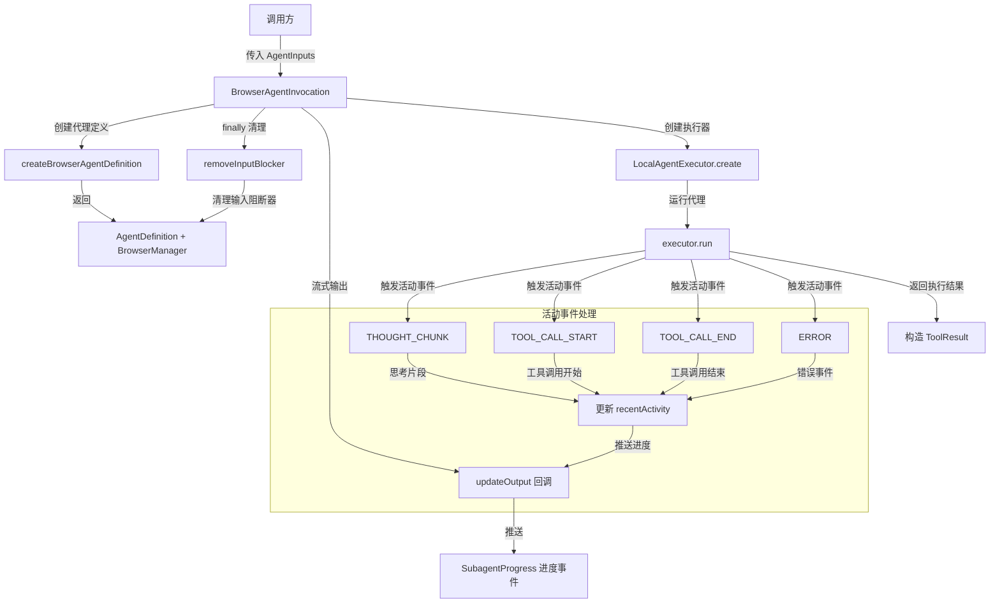

# browserAgentInvocation.ts

## 概述

`BrowserAgentInvocation` 是浏览器代理的调用入口类，继承自 `BaseToolInvocation<AgentInputs, ToolResult>`。与普通的 `LocalSubagentInvocation` 不同，它专门处理浏览器代理的异步工具设置流程：

1. 通过 `browserAgentFactory` 创建包含 MCP 工具的代理定义
2. 在执行完毕后清理浏览器资源（输入阻断器）
3. MCP 工具仅在浏览器代理的隔离注册表中可用

该文件是浏览器代理生命周期管理的核心，负责启动、监控活动、流式输出进度以及错误处理。

## 架构图（Mermaid）



## 核心组件

### 类: `BrowserAgentInvocation`

继承自 `BaseToolInvocation<AgentInputs, ToolResult>`。

#### 构造函数

```typescript
constructor(
  private readonly context: AgentLoopContext,
  params: AgentInputs,
  messageBus: MessageBus,
  _toolName?: string,        // 默认值: 'browser_agent'
  _toolDisplayName?: string,  // 默认值: 'Browser Agent'
)
```

- `context`: 代理循环上下文，包含配置信息
- `params`: 代理输入参数（键值对）
- `messageBus`: 消息总线，用于确认和通信
- `_toolName` / `_toolDisplayName`: 可选工具名称，默认为 `browser_agent` / `Browser Agent`

#### 属性

| 属性 | 类型 | 说明 |
|------|------|------|
| `context` | `AgentLoopContext` | 代理循环上下文（私有只读） |
| `config` | `Config` | 通过 getter 从 context 获取配置 |

#### 方法: `getDescription(): string`

返回可读的调用描述。对每个输入参数截取前 50 个字符，最终描述不超过 200 个字符。

格式: `Running browser agent with inputs: { key: value, ... }`

#### 方法: `execute(signal, updateOutput?): Promise<ToolResult>`

核心执行方法，完整流程如下:

1. **初始化阶段**
   - 发送初始 `SubagentProgress`（状态: `running`，活动列表为空）
   - 创建 `printOutput` 回调函数，将低级连接日志作为思考活动推入 `recentActivity`

2. **创建代理定义**
   - 调用 `createBrowserAgentDefinition(config, messageBus, printOutput)` 获取代理定义和 `browserManager`

3. **注册活动回调 `onActivity`**
   - 处理 4 种事件类型:
     - `THOUGHT_CHUNK`: 思考片段，追加或更新最后一个思考条目
     - `TOOL_CALL_START`: 工具调用开始，记录名称、参数、调用 ID
     - `TOOL_CALL_END`: 工具调用结束，标记为 `completed` 或 `error`
     - `ERROR`: 错误事件，区分取消和真正错误，标记所有运行中的工具
   - 活动列表最多保留 20 条（`MAX_RECENT_ACTIVITY`）
   - 每次更新后通过 `updateOutput` 推送最新进度

4. **执行代理**
   - 通过 `LocalAgentExecutor.create(definition, context, onActivity)` 创建执行器
   - 调用 `executor.run(params, signal)` 执行代理
   - 使用 `safeJsonToMarkdown` 格式化结果

5. **返回结果**
   - 成功时返回 `llmContent`（纯文本）和 `returnDisplay`（Markdown 格式）
   - 推送最终进度（状态: `completed`）

6. **错误处理**
   - 区分 `AbortError`（中止）和其他错误
   - 对错误消息进行清洗（`sanitizeErrorMessage`）
   - 标记所有运行中的活动为 `cancelled` 或 `error`
   - 返回带有 `ToolErrorType.EXECUTION_FAILED` 的错误结果

7. **资源清理（finally）**
   - 调用 `removeInputBlocker(browserManager)` 清理输入阻断器
   - 注意: 不关闭 `browserManager` 本身，因为持久会话需要保持

### 常量

| 常量 | 值 | 说明 |
|------|-----|------|
| `INPUT_PREVIEW_MAX_LENGTH` | 50 | 输入参数预览的最大字符数 |
| `DESCRIPTION_MAX_LENGTH` | 200 | 描述文本的最大字符数 |
| `MAX_RECENT_ACTIVITY` | 20 | 最近活动列表的最大条目数 |

## 依赖关系

### 内部依赖

| 模块 | 导入项 | 用途 |
|------|--------|------|
| `../../config/config.js` | `Config` | 配置类型 |
| `../../config/agent-loop-context.js` | `AgentLoopContext` | 代理循环上下文类型 |
| `../local-executor.js` | `LocalAgentExecutor` | 本地代理执行器，负责实际运行代理 |
| `../../utils/markdownUtils.js` | `safeJsonToMarkdown` | 将 JSON 安全转换为 Markdown 格式 |
| `../../tools/tools.js` | `BaseToolInvocation`, `ToolResult`, `ToolLiveOutput` | 工具调用基类和结果类型 |
| `../../tools/tool-error.js` | `ToolErrorType` | 工具错误类型枚举 |
| `../types.js` | `AgentInputs`, `SubagentActivityEvent`, `SubagentProgress`, `SubagentActivityItem`, `isToolActivityError` | 代理类型定义 |
| `../../confirmation-bus/message-bus.js` | `MessageBus` | 消息总线类型 |
| `./browserAgentFactory.js` | `createBrowserAgentDefinition` | 浏览器代理工厂，创建含 MCP 工具的定义 |
| `./inputBlocker.js` | `removeInputBlocker` | 输入阻断器清理函数 |
| `../../utils/agent-sanitization-utils.js` | `sanitizeThoughtContent`, `sanitizeToolArgs`, `sanitizeErrorMessage` | 内容清洗工具 |

### 外部依赖

| 模块 | 导入项 | 用途 |
|------|--------|------|
| `node:crypto` | `randomUUID` | 生成唯一 ID，用于活动条目标识 |

## 关键实现细节

1. **活动流式推送机制**: 通过 `updateOutput` 回调实时向调用方推送 `SubagentProgress` 对象。活动列表采用滑动窗口策略，最多保留最近 20 条记录，防止内存膨胀。

2. **思考片段合并**: 对于连续的 `THOUGHT_CHUNK` 事件，如果上一条活动也是运行中的思考类型，则直接覆盖内容而非新增条目，避免碎片化。

3. **安全清洗**: 所有用户可见的内容都经过清洗处理:
   - `sanitizeThoughtContent` 清洗思考内容
   - `sanitizeToolArgs` 清洗工具参数
   - `sanitizeErrorMessage` 清洗错误消息
   这是防止潜在的注入或敏感信息泄露的安全措施。

4. **优雅的错误分类**: 区分 `AbortError`（用户主动取消）和执行错误，对取消操作使用 `cancelled` 状态而非 `error`，提供更准确的状态反馈。

5. **资源清理策略**: `finally` 块中只清理输入阻断器（`removeInputBlocker`），而不销毁 `browserManager`。这是因为浏览器会话可能是持久的，需要跨多次调用保持存活。

6. **工具调用 ID 追踪**: 每个工具调用通过 `callId` 追踪，`TOOL_CALL_END` 事件通过倒序查找匹配的运行中工具调用来更新状态，确保正确匹配。

7. **双格式结果返回**: 成功执行后返回两种格式:
   - `llmContent`: 纯文本格式，供 LLM 消费
   - `returnDisplay`: Markdown 格式，供 UI 展示
