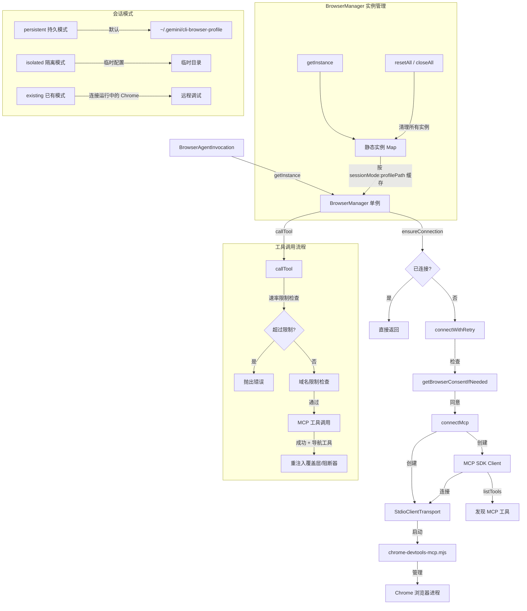

# browserManager.ts

## 概述

`BrowserManager` 是浏览器代理的核心管理类，负责完整的浏览器生命周期管理。它通过 `chrome-devtools-mcp`（Chrome DevTools MCP 服务器）以 stdio 方式启动和控制浏览器进程，使用 MCP（Model Context Protocol）协议与浏览器通信。

该类的关键设计特性:

- **隔离性**: MCP 客户端完全与主代理的工具注册表隔离，不会将浏览器工具注册到全局注册表
- **单例模式**: 使用静态 Map 管理实例，按 `sessionMode:profilePath` 键值缓存，避免重复创建
- **自动重连**: 支持指数退避的重连机制（最多 3 次）
- **导航安全**: 在可能导致页面导航的工具调用后，自动重新注入自动化覆盖层和输入阻断器
- **域名限制**: 支持域名白名单，防止浏览器导航到未授权的域名
- **操作速率限制**: 限制每个任务的最大操作次数，防止失控执行

## 架构图（Mermaid）



## 核心组件

### 接口: `McpContentItem`

MCP 工具调用响应中的内容项。

```typescript
interface McpContentItem {
  type: 'text' | 'image';
  text?: string;
  data?: string;      // Base64 编码的图像数据
  mimeType?: string;  // 图像 MIME 类型，如 'image/png'
}
```

### 接口: `McpToolCallResult`

MCP 工具调用的结果。

```typescript
interface McpToolCallResult {
  content?: McpContentItem[];
  isError?: boolean;
}
```

### 类: `BrowserManager`

#### 常量

| 常量 | 值 | 说明 |
|------|-----|------|
| `BROWSER_PROFILE_DIR` | `'cli-browser-profile'` | 默认浏览器配置目录名（位于 `~/.gemini/` 下） |
| `MCP_TIMEOUT_MS` | `60_000` | MCP 操作默认超时（60秒） |
| `MAX_RECONNECT_RETRIES` | `3` | 最大重连尝试次数 |
| `RECONNECT_BASE_DELAY_MS` | `500` | 指数退避基础延迟（毫秒） |
| `POTENTIALLY_NAVIGATING_TOOLS` | `Set<string>` | 可能导致页面导航的工具集合：`click`, `click_at`, `navigate_page`, `new_page`, `select_page`, `press_key`, `handle_dialog` |

#### 静态方法

| 方法 | 说明 |
|------|------|
| `getInstanceKey(config)` | 根据配置生成实例缓存键（`sessionMode:profilePath`） |
| `getInstance(config)` | 获取或创建 BrowserManager 单例 |
| `resetAll()` | 关闭所有缓存的实例并清空缓存 |
| `closeAll()` | `resetAll()` 的别名，用于 CLI 退出清理 |

#### 实例属性

| 属性 | 类型 | 说明 |
|------|------|------|
| `config` | `Config` | 配置对象（私有） |
| `rawMcpClient` | `Client \| undefined` | 原始 MCP SDK 客户端（非包装器） |
| `mcpTransport` | `StdioClientTransport \| undefined` | Stdio 传输层 |
| `discoveredTools` | `McpTool[]` | 从 MCP 服务器发现的工具列表 |
| `disconnected` | `boolean` | 是否已断开连接 |
| `connectionPromise` | `Promise<void> \| undefined` | 当前正在进行的连接 Promise（防止并发连接） |
| `actionCounter` | `number` | 操作计数器 |
| `maxActionsPerTask` | `number` | 每个任务的最大操作数（默认 100） |
| `shouldInjectOverlay` | `boolean` | 是否注入自动化覆盖层（headless 模式下为 false） |
| `shouldDisableInput` | `boolean` | 是否禁用浏览器用户输入 |

#### 实例方法

##### `getRawMcpClient(): Promise<Client>`
获取隔离的 MCP SDK 客户端。如果未连接则先确保连接。

##### `getDiscoveredTools(): Promise<McpTool[]>`
获取从 MCP 服务器发现的工具定义列表。

##### `callTool(toolName, args, signal?): Promise<McpToolCallResult>`
调用 MCP 服务器上的工具。完整流程:
1. 检查 AbortSignal 是否已中止
2. 检查操作速率限制（`maxActionsPerTask`）
3. 检查域名导航限制（`checkNavigationRestrictions`）
4. 通过 MCP 客户端调用工具（带 60 秒超时）
5. 如有 AbortSignal 则与之竞赛
6. 对于可能导航的工具，在成功后重新注入覆盖层和输入阻断器

##### `isConnected(): boolean`
返回 MCP 客户端是否已连接且健康。

##### `ensureConnection(): Promise<void>`
确保浏览器和 MCP 客户端已连接。使用 `connectionPromise` 防止并发调用者触发重复连接。

##### `connectWithRetry(): Promise<void>`（私有）
带指数退避重试的连接方法。首先检查用户同意（隐私通知），然后最多尝试 3 次连接。退避延迟: 500ms, 1000ms, 2000ms。

##### `close(): Promise<void>`
关闭浏览器和清理连接。先关闭 MCP 客户端，再关闭传输层（这会终止浏览器进程）。

##### `connectMcp(): Promise<void>`（私有）
核心连接方法。创建 MCP 客户端和 Stdio 传输层，启动 `chrome-devtools-mcp.mjs` 子进程。根据会话模式传递不同参数:
- `persistent`: 使用 `--userDataDir` 指定持久配置目录
- `isolated`: 传递 `--isolated` 使用临时配置
- `existing`: 传递 `--autoConnect` 连接到已运行的 Chrome

还处理 `--headless`、`--experimental-vision`、域名限制（`--host-rules`）、隐私统计选项等。

##### `checkNavigationRestrictions(toolName, args): string | undefined`（私有）
检查域名导航限制。仅对 `navigate_page` 和 `new_page` 工具生效。不仅检查主 URL，还检查查询参数和 fragment 中嵌入的 URL，防止通过代理服务绕过域名限制。

##### `isDomainAllowed(hostname, allowedDomains): boolean`（私有）
检查主机名是否匹配允许的域名列表。支持通配符模式（`*.example.com`）。

##### `createConnectionError(message, sessionMode): Error`（私有）
根据错误消息和会话模式创建带有上下文感知修复建议的错误对象。针对"已运行"（配置锁定）、超时、existing 模式连接失败等不同情况提供不同的诊断建议。

##### `registerInputBlockerHandler(): void`（私有）
注册 MCP 通知回调处理器。当收到 `notifications/resources/updated` 通知时（表示页面内容已变化），自动重新注入输入阻断器。与已有的通知处理器链式调用。

## 依赖关系

### 内部依赖

| 模块 | 导入项 | 用途 |
|------|--------|------|
| `../../utils/debugLogger.js` | `debugLogger` | 调试日志记录 |
| `../../utils/events.js` | `coreEvents` | 核心事件发射器（反馈和控制台日志） |
| `../../config/config.js` | `Config` | 配置类型 |
| `../../config/storage.js` | `Storage` | 存储工具类，获取全局 Gemini 目录路径 |
| `../../utils/browserConsent.js` | `getBrowserConsentIfNeeded` | 首次运行时获取浏览器使用同意 |
| `./inputBlocker.js` | `injectInputBlocker` | 注入输入阻断器 |
| `./automationOverlay.js` | `injectAutomationOverlay` | 注入自动化覆盖层 |

### 外部依赖

| 模块 | 导入项 | 用途 |
|------|--------|------|
| `@modelcontextprotocol/sdk/client/index.js` | `Client` | MCP SDK 客户端 |
| `@modelcontextprotocol/sdk/client/stdio.js` | `StdioClientTransport` | MCP Stdio 传输层 |
| `@modelcontextprotocol/sdk/types.js` | `Tool as McpTool` | MCP 工具类型定义 |
| `node:path` | `path` | 路径处理 |
| `node:fs` | `fs` | 文件系统操作（检查 bundle 文件是否存在） |
| `node:url` | `fileURLToPath` | 将 `import.meta.url` 转换为文件路径 |

## 关键实现细节

1. **单例 + 缓存键机制**: 通过 `sessionMode:profilePath` 组合键管理多个单例，不同的会话模式和配置路径维护独立的浏览器实例。这允许同一进程中运行多个配置不同的浏览器代理。

2. **并发连接保护**: `connectionPromise` 字段确保多个并发调用者在连接建立期间共享同一个 Promise，避免重复的 `connectMcp()` 调用。在 `finally` 中清除该 Promise，保证下次连接尝试不会被旧的 Promise 阻塞。

3. **导航后自动重注入**: `POTENTIALLY_NAVIGATING_TOOLS` 集合定义了可能导致页面导航的 7 个工具。每次这些工具成功执行后，自动重新注入覆盖层和输入阻断器。注入操作是幂等的，已存在时会复用 DOM 元素。注入失败不会中断工具结果。

4. **多层域名安全防护**:
   - Chrome 层面: 通过 `--host-rules` 参数在浏览器层面限制网络访问
   - 工具调用层面: `checkNavigationRestrictions` 在工具调用前检查 URL
   - 嵌入 URL 检测: 检查查询参数和 fragment 中嵌入的 URL，防止通过代理服务（如 Google Translate）绕过限制

5. **会话模式设计**:
   - `persistent`（默认）: 使用 `~/.gemini/cli-browser-profile/` 目录保存浏览器配置，跨会话持久化
   - `isolated`: 使用 `--isolated` 标志创建临时配置，会话结束后清理
   - `existing`: 使用 `--autoConnect` 连接到已运行的 Chrome 实例（需要用户在 `chrome://inspect/#remote-debugging` 启用远程调试），会使用用户的 cookie 和登录状态

6. **上下文感知的错误恢复建议**: `createConnectionError` 方法根据错误消息的具体内容和当前会话模式，生成针对性的修复建议，而不是通用的错误消息。例如"配置锁定"错误会建议关闭其他 Chrome 实例或切换到 isolated 模式。

7. **Stdio 传输与 stderr 处理**: MCP 传输使用 `pipe` 模式处理 stderr，防止 MCP 服务器的横幅和警告破坏终端 UI（备用缓冲区模式下）。stderr 输出被转发到 `debugLogger`，在 `--debug` 模式下可见。

8. **Bundle 路径回退**: 查找 `chrome-devtools-mcp.mjs` bundle 文件时有多级回退逻辑，兼容不同的构建目录结构（`dist/` 目录在不在当前路径中的两种情况）。
