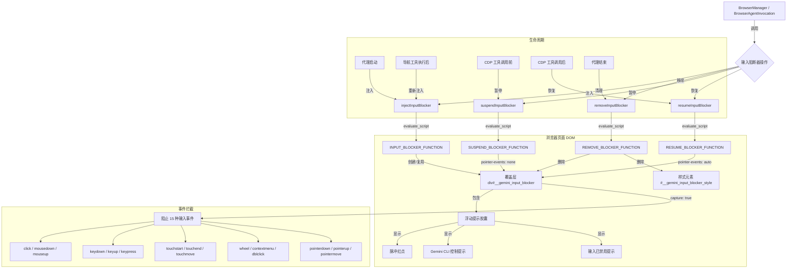

# inputBlocker.ts

## 概述

`inputBlocker.ts` 是浏览器代理的输入阻断工具模块。它通过向被控制的浏览器页面注入透明覆盖层（overlay），捕获并阻止所有用户输入事件，同时显示一个信息提示横幅，告知用户浏览器正在被自动化控制。

该模块的核心设计理念是**持久性覆盖层 + pointer-events 切换**:
- 覆盖层在整个浏览器代理会话期间保持在 DOM 中，不会被频繁创建和销毁
- 当 CDP 工具需要与页面元素交互时，通过将 `pointer-events` 设为 `none` 临时暂停阻断（覆盖层仍可见但不拦截事件）
- 工具调用完成后恢复 `pointer-events: auto` 重新激活阻断
- 这种方式避免了 DOM 变动和视觉闪烁

所有脚本通过 `chrome-devtools-mcp` 的 `evaluate_script` 工具执行，该工具期望接收一个函数声明字符串（非 IIFE，非原始代码）。

## 架构图（Mermaid）

## 核心组件

### 常量: JavaScript 函数字符串

#### `INPUT_BLOCKER_FUNCTION`

注入输入阻断器覆盖层的 JavaScript 函数。核心行为:

1. **幂等性检查**: 如果 `#__gemini_input_blocker` 已存在，只确保 `pointer-events: auto` 然后返回，使重复注入几乎无开销
2. **创建覆盖层 `div`**:
   - ID: `__gemini_input_blocker`
   - `position: fixed; inset: 0`（全屏覆盖）
   - `z-index: 2147483646`（接近最大值）
   - `cursor: not-allowed`（视觉提示不可交互）
   - `background: transparent`（完全透明）
   - `aria-hidden: true` + `role: presentation`（无障碍隐藏）
3. **拦截 15 种输入事件**: 使用 `capture: true` 在捕获阶段拦截，调用 `preventDefault()` + `stopPropagation()` + `stopImmediatePropagation()` 完全阻止事件传播
4. **创建浮动提示胶囊（pill）**:
   - 位于页面底部中央
   - 深色半透明背景 + 毛玻璃效果（`backdrop-filter: blur(16px)`）
   - 圆角胶囊形状（`border-radius: 999px`）
   - 包含脉冲红点 + "Gemini CLI is controlling this browser" + 分隔线 + "Input disabled during automation"
   - 入场动画: 从下方滑入 + 淡入
5. **注入 `@keyframes` 样式**: 为脉冲红点创建 `__gemini_pulse` 动画

#### `REMOVE_BLOCKER_FUNCTION`

完全移除输入阻断器。删除覆盖层 DOM 元素（`#__gemini_input_blocker`）和注入的样式元素（`#__gemini_input_blocker_style`）。仅在最终清理时使用。

#### `SUSPEND_BLOCKER_FUNCTION`

暂停输入阻断器。将覆盖层的 `pointer-events` 设为 `none`，使其对点击测试（hit-testing）不可见，CDP 的点击和交互操作可以穿透覆盖层到达页面元素。覆盖层在 DOM 中保持不变，无视觉变化。

#### `RESUME_BLOCKER_FUNCTION`

恢复输入阻断器。将覆盖层的 `pointer-events` 恢复为 `auto`，重新拦截用户输入。

### 导出函数

#### `injectInputBlocker(browserManager, signal?): Promise<void>`

注入输入阻断器到当前页面。

- 通过 `browserManager.callTool('evaluate_script', ...)` 执行注入脚本
- 失败时仅记录警告日志，不抛出异常（输入阻断器是 UX 增强，非关键功能）

#### `removeInputBlocker(browserManager, signal?): Promise<void>`

完全移除输入阻断器。仅在最终清理时调用（如 `BrowserAgentInvocation.execute()` 的 `finally` 块中）。

- 失败时仅记录警告日志，不抛出异常

#### `suspendInputBlocker(browserManager, signal?): Promise<void>`

临时暂停输入阻断器，使 CDP 工具调用可以与页面元素交互。

- 失败时静默忽略（非关键操作，工具调用仍会继续尝试）

#### `resumeInputBlocker(browserManager, signal?): Promise<void>`

在工具调用完成后恢复输入阻断器。

- 失败时静默忽略

## 依赖关系

### 内部依赖

| 模块 | 导入项 | 用途 |
|------|--------|------|
| `./browserManager.js` | `BrowserManager`（类型） | 浏览器管理器，用于执行脚本调用 |
| `../../utils/debugLogger.js` | `debugLogger` | 调试日志记录（注入成功/失败） |

### 外部依赖

无外部依赖。

## 关键实现细节

1. **幂等注入机制**: `INPUT_BLOCKER_FUNCTION` 首先检查 `#__gemini_input_blocker` 是否已存在。如果存在，只需确保 `pointer-events: auto` 即可返回。这使得在导航工具执行后的重复注入几乎没有开销，因为大多数点击操作实际上不会导致页面导航。

2. **pointer-events 切换策略**: 这是一种精巧的设计——不通过增删 DOM 来控制阻断行为，而是通过 CSS `pointer-events` 属性切换。`none` 值使元素对所有指针事件透明，CDP 的 `dispatchMouseEvent` 等操作可以直达页面元素；`auto` 值恢复事件拦截。这避免了:
   - DOM 操作的开销
   - 覆盖层添加/移除导致的视觉闪烁
   - 竞态条件（多个工具同时操作 DOM）

3. **z-index 层级设计**: 覆盖层使用 `z-index: 2147483646`（32 位有符号整数最大值减 1），浮动提示胶囊使用 `2147483647`（最大值）。这确保:
   - 覆盖层在几乎所有页面元素之上
   - 提示胶囊在覆盖层之上
   - 不使用最大值作为覆盖层的 z-index，为胶囊预留空间

4. **全面的事件拦截**: 拦截 15 种输入事件，覆盖鼠标（click, mousedown, mouseup, dblclick, contextmenu）、键盘（keydown, keyup, keypress）、触摸（touchstart, touchend, touchmove）、滚轮（wheel）、指针（pointerdown, pointerup, pointermove）。使用 `capture: true` 确保在捕获阶段就拦截，防止事件到达目标元素。

5. **非关键功能的容错设计**: 所有四个导出函数都采用 try-catch 包裹，失败时不抛出异常。`injectInputBlocker` 和 `removeInputBlocker` 记录警告日志，`suspendInputBlocker` 和 `resumeInputBlocker` 完全静默。这体现了输入阻断器作为 UX 增强而非核心功能的定位。

6. **evaluate_script 接口约束**: `chrome-devtools-mcp` 的 `evaluate_script` 工具期望参数格式为 `{ function: "() => { ... }" }`——一个函数声明字符串。不是原始代码、不是 IIFE、参数名不是 `code` 或 `expression`。所有 JavaScript 常量都遵循这一约束。

7. **入场动画**: 浮动提示胶囊使用 CSS transition 实现入场动画（`opacity 0.4s` + `transform 0.4s`），初始状态 `opacity: 0; transform: translateX(-50%) translateY(20px)`，通过 `requestAnimationFrame` 在下一帧触发动画到最终位置。
