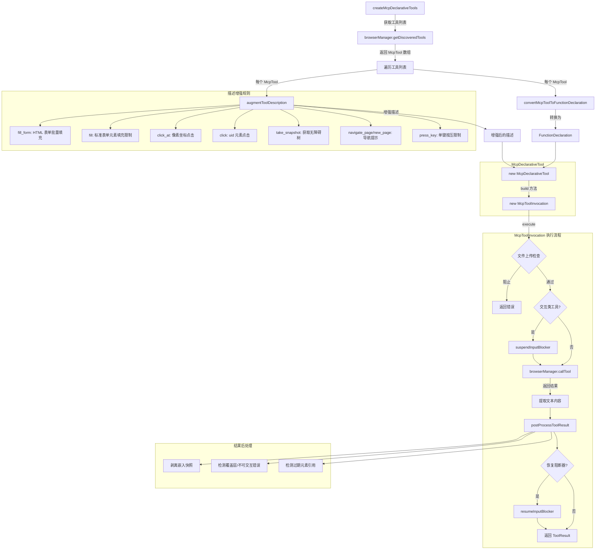

# mcpToolWrapper.ts

## 概述

`mcpToolWrapper.ts` 负责将从 `chrome-devtools-mcp` 服务器动态发现的 MCP 工具转换为 Gemini CLI 内部的 `DeclarativeTool` 实例。这些工具仅注册在浏览器代理的隔离 `ToolRegistry` 中，不会污染主代理的工具注册表。

该模块的核心职责:
1. **工具包装**: 将 MCP 工具定义（`McpTool`）包装为 `McpDeclarativeTool`，每个工具构建时创建 `McpToolInvocation` 实例
2. **输入阻断器协调**: 对交互类工具（click, fill 等）在执行前暂停输入阻断器，执行后恢复
3. **描述增强**: 为工具描述添加使用指导提示，帮助模型做出正确的工具选择
4. **结果后处理**: 对工具执行结果进行后处理，剥离嵌入的快照、检测常见错误模式并添加恢复提示
5. **确认机制**: 通过 MCP 类型的确认对话框请求用户确认工具调用

## 架构图（Mermaid）



## 核心组件

### 常量: `INTERACTIVE_TOOLS`

需要在执行前暂停输入阻断器的交互类工具集合:

| 工具名 | 说明 |
|--------|------|
| `click` | 按 uid 点击元素 |
| `click_at` | 按坐标点击 |
| `fill` | 填充表单字段 |
| `fill_form` | 批量填充表单 |
| `hover` | 悬停在元素上 |
| `drag` | 拖拽操作 |
| `upload_file` | 文件上传 |

### 类: `McpToolInvocation`

继承自 `BaseToolInvocation<Record<string, unknown>, ToolResult>`，是 MCP 工具的调用执行类。

#### 构造函数

```typescript
constructor(
  browserManager: BrowserManager,   // 浏览器管理器
  toolName: string,                 // MCP 工具名
  params: Record<string, unknown>,  // 工具参数
  messageBus: MessageBus,           // 消息总线
  shouldDisableInput: boolean,      // 是否启用输入阻断
  blockFileUploads: boolean = false  // 是否阻止文件上传
)
```

工具名前缀格式: `mcp__browser_agent_{toolName}`（使用 `MCP_TOOL_PREFIX` + `BROWSER_AGENT_NAME` + 工具名）。

#### 核心方法

##### `getDescription(): string`
返回 `"Calling MCP tool: {toolName}"`。

##### `getConfirmationDetails(signal): Promise<ToolCallConfirmationDetails | false>`
返回 MCP 类型的确认详情，包含服务器名称（`BROWSER_AGENT_NAME`）和工具名称。确认后通过 `publishPolicyUpdate` 更新策略。

##### `getPolicyUpdateOptions(outcome): PolicyUpdateOptions | undefined`
返回 `{ mcpName: BROWSER_AGENT_NAME }`，用于策略引擎确定工具调用是否被允许。

##### `needsBlockerSuspend: boolean`（getter）
判断是否需要暂停输入阻断器：`shouldDisableInput` 为 true 且工具在 `INTERACTIVE_TOOLS` 集合中。

##### `execute(signal): Promise<ToolResult>`
执行流程:
1. **文件上传检查**: 若 `blockFileUploads` 为 true 且工具为 `upload_file`，直接返回错误
2. **暂停输入阻断器**: 对交互类工具调用 `suspendInputBlocker`
3. **调用 MCP 工具**: 通过 `browserManager.callTool` 执行
4. **提取文本内容**: 过滤 `type === 'text'` 的内容项并拼接
5. **后处理结果**: 调用 `postProcessToolResult` 添加上下文提示
6. **恢复输入阻断器**: 对交互类工具调用 `resumeInputBlocker`
7. **错误处理**: Chrome 连接错误直接重新抛出（终止代理），其他错误返回错误结果

### 类: `McpDeclarativeTool`

继承自 `DeclarativeTool<Record<string, unknown>, ToolResult>`，是 MCP 工具的声明式定义类。

#### 构造函数

```typescript
constructor(
  browserManager: BrowserManager,
  name: string,
  description: string,
  parameterSchema: unknown,
  messageBus: MessageBus,
  shouldDisableInput: boolean,
  blockFileUploads: boolean = false
)
```

注册时的属性:
- `Kind`: `Kind.Other`
- `isOutputMarkdown`: `true`
- `canUpdateOutput`: `false`

#### 方法

##### `toolAnnotations: Record<string, unknown>`（getter override）
返回 `{ _serverName: BROWSER_AGENT_NAME }`，用于策略引擎的工具身份判定。

##### `build(params): ToolInvocation`
创建并返回 `McpToolInvocation` 实例。

### 导出函数: `createMcpDeclarativeTools`

```typescript
async function createMcpDeclarativeTools(
  browserManager: BrowserManager,
  messageBus: MessageBus,
  shouldDisableInput?: boolean,   // 默认 false
  blockFileUploads?: boolean,     // 默认 false
): Promise<McpDeclarativeTool[]>
```

工厂函数，核心流程:
1. 调用 `browserManager.getDiscoveredTools()` 获取 MCP 工具列表
2. 对每个工具调用 `convertMcpToolToFunctionDeclaration` 转换 schema
3. 调用 `augmentToolDescription` 增强描述
4. 创建 `McpDeclarativeTool` 实例

### 内部函数: `convertMcpToolToFunctionDeclaration`

将 MCP 工具定义转换为 Gemini `FunctionDeclaration`。直接将 MCP 的 `inputSchema`（JSON Schema）传递为 `parametersJsonSchema`，若无 schema 则使用空对象。

### 内部函数: `augmentToolDescription`

根据工具名为描述添加使用指导提示。采用部分匹配策略（`toolName.toLowerCase().includes(key)`），更具体的键排在前面防止短路匹配。

增强提示涵盖:

| 工具 | 增强提示要点 |
|------|-------------|
| `fill_form` | 批量填充标准 HTML 表单，不适用于 canvas/自定义组件 |
| `fill` | 仅适用于 `<input>`, `<textarea>`, `<select>`，不适用于自定义组件；失败时建议先 click 再 press_key |
| `click_at` | 精确像素坐标点击 |
| `click` | 使用无障碍树快照中的 uid，操作后 uid 失效需重新获取快照 |
| `hover` | 使用无障碍树快照中的 uid |
| `take_snapshot` | 首先调用以查看元素，每次状态变化后需重新调用 |
| `navigate_page` | 导航后需调用 take_snapshot |
| `new_page` | 打开新标签页后需调用 take_snapshot |
| `press_key` | 仅接受单个按键名，不接受多字符字符串 |

### 导出函数: `postProcessToolResult`

```typescript
function postProcessToolResult(toolName: string, result: string): string
```

对工具结果进行后处理:

1. **剥离嵌入快照**: 除 `take_snapshot` 外，删除 `## Latest page snapshot` 及其后内容，防止 token 膨胀
2. **检测覆盖层/不可交互错误**: 匹配 `not interactable`, `obscured`, `intercept`, `blocked`, `element is not visible`, `element not found`，对 click 类工具添加提示：寻找关闭/取消按钮
3. **检测过期元素引用**: 匹配 `stale`, `detached`，建议调用 `take_snapshot` 获取新的 uid

## 依赖关系

### 内部依赖

| 模块 | 导入项 | 用途 |
|------|--------|------|
| `../../tools/tools.js` | `ToolConfirmationOutcome`, `DeclarativeTool`, `BaseToolInvocation`, `Kind`, `ToolResult`, `ToolInvocation`, `ToolCallConfirmationDetails`, `PolicyUpdateOptions` | 工具框架的核心类型和基类 |
| `../../confirmation-bus/message-bus.js` | `MessageBus` | 消息总线类型 |
| `./browserManager.js` | `BrowserManager`, `McpToolCallResult` | 浏览器管理器和工具调用结果类型 |
| `../../utils/debugLogger.js` | `debugLogger` | 调试日志 |
| `./inputBlocker.js` | `suspendInputBlocker`, `resumeInputBlocker` | 输入阻断器暂停/恢复 |
| `../../tools/mcp-tool.js` | `MCP_TOOL_PREFIX` | MCP 工具名前缀常量 |
| `./browserAgentDefinition.js` | `BROWSER_AGENT_NAME` | 浏览器代理名称常量 |

### 外部依赖

| 模块 | 导入项 | 用途 |
|------|--------|------|
| `@google/genai` | `FunctionDeclaration`（类型） | Gemini 函数声明类型定义 |
| `@modelcontextprotocol/sdk/types.js` | `Tool as McpTool`（类型） | MCP 工具类型定义 |

## 关键实现细节

1. **工具隔离架构**: `McpDeclarativeTool` 和 `McpToolInvocation` 形成了一层隔离适配层。MCP 工具不直接注册到全局工具注册表，而是通过 `BrowserManager` 的隔离 MCP 客户端执行。`toolAnnotations` 中的 `_serverName` 用于策略引擎的身份识别。

2. **输入阻断器协调协议**: 对于 `INTERACTIVE_TOOLS` 中的 7 个工具，在执行前暂停输入阻断器（`pointer-events: none`），执行后恢复（`pointer-events: auto`）。这是因为 `chrome-devtools-mcp` 在执行这些工具前会进行可交互性检查（interactability check），如果覆盖层拦截了事件，检查会失败。在错误路径上也确保恢复阻断器，并对恢复失败进行静默处理。

3. **Chrome 连接错误的致命性处理**: 当错误消息包含 `"Could not connect to Chrome"` 时，直接重新抛出错误而非返回错误结果。这会终止整个代理执行，避免 LLM 无意义地重试一个无法恢复的错误。

4. **描述增强的匹配顺序**: `augmentToolDescription` 中的 hints 字典使用 `Object.entries` 遍历，更具体的键（如 `fill_form`）必须排在短键（如 `fill`）之前。这是因为使用 `includes` 进行部分匹配，`fill` 会匹配到 `fill_form`，所以需要先检查更具体的键。

5. **快照剥离防止 token 膨胀**: `chrome-devtools-mcp` 的许多工具响应中会嵌入 `## Latest page snapshot` 格式的无障碍树快照。除了 `take_snapshot` 工具需要返回完整快照外，其他工具的嵌入快照会被剥离，防止 LLM 上下文窗口中的 token 快速膨胀。

6. **错误模式检测与恢复引导**: `postProcessToolResult` 通过模式匹配检测常见错误，并向 LLM 提供恢复建议:
   - 覆盖层/弹窗阻塞: 建议寻找关闭按钮（x, Close, "Got it", "Accept"）
   - 过期元素引用: 建议重新调用 `take_snapshot` 获取新 uid
   这些提示直接嵌入工具结果中，比在系统提示中添加通用指导更有效。

7. **确认机制集成**: 每次 MCP 工具调用前通过 `getConfirmationDetails` 返回确认对话框详情。确认结果通过 `publishPolicyUpdate` 更新策略，后续同类调用可以基于策略跳过确认。
