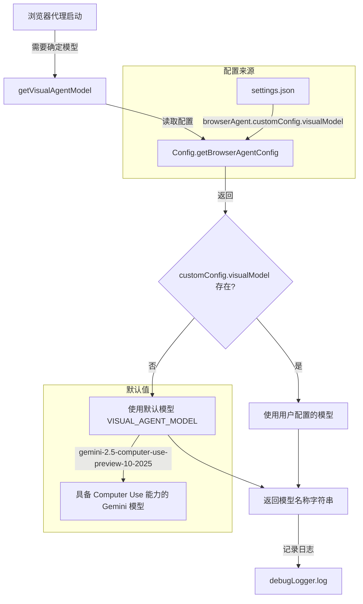

# modelAvailability.ts

## 概述

`modelAvailability.ts` 是浏览器代理的模型配置模块。它负责提供浏览器代理使用的默认视觉模型（Computer Use 能力模型），并提供从运行时配置中解析实际使用模型的工具函数。

该模块非常精简，仅包含一个常量和一个函数，职责单一明确：确定浏览器代理应该使用哪个 Gemini 模型。

## 架构图（Mermaid）



## 核心组件

### 常量: `VISUAL_AGENT_MODEL`

```typescript
export const VISUAL_AGENT_MODEL = 'gemini-2.5-computer-use-preview-10-2025';
```

默认的视觉代理模型标识符。这是一个具备 Computer Use（计算机使用）能力的 Gemini 模型预览版，版本日期为 2025 年 10 月。Computer Use 能力意味着该模型能够理解屏幕截图、无障碍树快照，并生成浏览器操作指令。

### 导出函数: `getVisualAgentModel`

```typescript
export function getVisualAgentModel(config: Config): string
```

从配置中获取视觉代理模型，如果未配置则回退到默认值。

**参数:**
- `config`: 运行时配置对象（`Config` 类型）

**返回值:**
- `string`: 要使用的模型名称

**逻辑:**
1. 调用 `config.getBrowserAgentConfig()` 获取浏览器代理配置
2. 读取 `customConfig.visualModel` 字段
3. 若该字段存在则使用用户配置值，否则使用 `VISUAL_AGENT_MODEL` 默认值
4. 通过 `debugLogger.log` 记录最终使用的模型名称
5. 返回模型名称字符串

## 依赖关系

### 内部依赖

| 模块 | 导入项 | 用途 |
|------|--------|------|
| `../../config/config.js` | `Config`（类型） | 运行时配置类型，提供 `getBrowserAgentConfig()` 方法 |
| `../../utils/debugLogger.js` | `debugLogger` | 调试日志记录，输出最终使用的模型名称 |

### 外部依赖

无外部依赖。

## 关键实现细节

1. **配置优先级**: 用户可以在 `settings.json` 的 `browserAgent.customConfig.visualModel` 字段中覆盖默认模型。这遵循了"约定优于配置"原则——默认提供一个合理的模型选择，但允许高级用户自定义。

2. **模型命名约定**: 默认模型名 `gemini-2.5-computer-use-preview-10-2025` 遵循 Gemini 模型的标准命名规则：`gemini-{版本}-{能力}-{发布状态}-{日期}`。`computer-use` 表示该模型具备理解和操作计算机界面的能力，这是浏览器代理的核心需求。

3. **空值合并运算符**: 使用 `??` 而非 `||`，这意味着只有当 `visualModel` 为 `undefined` 或 `null` 时才使用默认值。如果用户显式设置为空字符串 `""`，将会使用空字符串（虽然这通常不是有效配置，但保留了用户意图的精确性）。

4. **与其他模块的关系**: 该模块被 `browserAgentFactory.ts` 或 `browserAgentDefinition.ts` 等上层模块调用，用于在创建浏览器代理定义时确定使用哪个 LLM 模型。模型选择直接影响浏览器代理的视觉理解和操作规划能力。

5. **调试可观测性**: 每次调用 `getVisualAgentModel` 都会通过 `debugLogger.log` 记录最终使用的模型，在 `--debug` 模式下可以确认模型选择是否符合预期，有助于排查配置问题。
