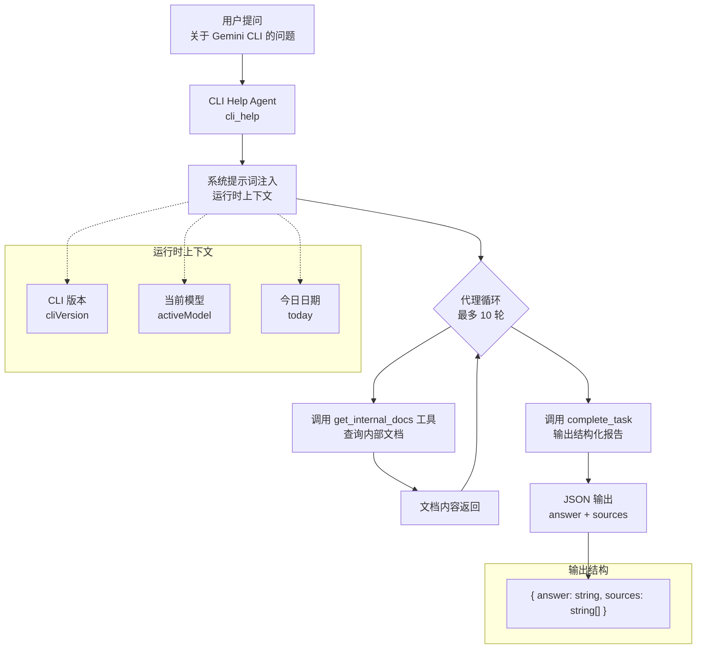
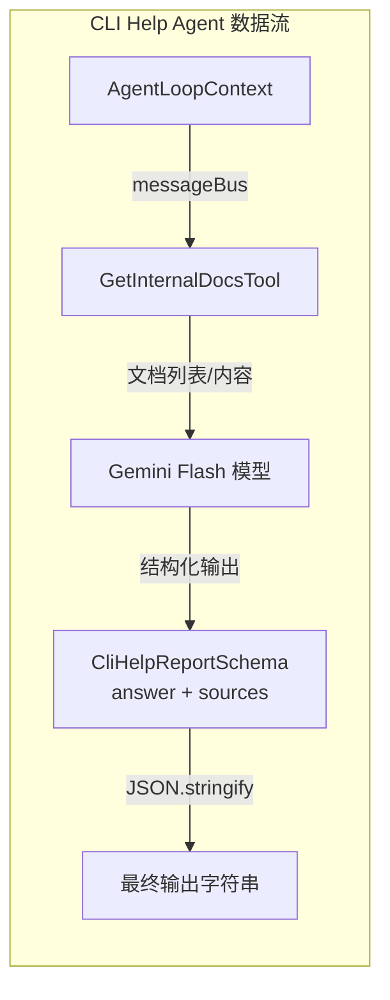

# cli-help-agent.ts

## 概述

`cli-help-agent.ts` 定义了 **CLI Help Agent**（CLI 帮助代理），这是一个专门用于回答关于 Gemini CLI 本身的问题的子代理。它能够查询内部文档，结合运行时上下文（CLI 版本、当前模型、日期等），为用户提供关于 CLI 功能、配置模式（如策略）、自定义子代理创建方法等方面的准确使用指导。

该代理的核心特点：
- 使用 Gemini Flash 模型（轻量快速）
- 配备 `get_internal_docs` 工具访问内部文档
- 输出结构化的 JSON 报告（答案 + 引用来源）
- 低 temperature（0.1）以保证回答的准确性和一致性
- 启用思考模式（thinking）并设置无限思考预算

## 架构图（Mermaid）





## 核心组件

### 1. `CliHelpReportSchema`（第 13-20 行）

使用 Zod 定义的输出报告模式，确保代理产出结构化的、可验证的输出。

```typescript
const CliHelpReportSchema = z.object({
  answer: z.string().describe('The detailed answer to the user question about Gemini CLI.'),
  sources: z.array(z.string()).describe('The documentation files used to answer the question.'),
});
```

| 字段 | 类型 | 说明 |
|---|---|---|
| `answer` | `string` | 关于 Gemini CLI 问题的详细回答 |
| `sources` | `string[]` | 回答时引用的文档文件列表 |

### 2. `CliHelpAgent` 工厂函数（第 26-94 行）

导出的工厂函数，接受 `AgentLoopContext` 上下文参数，返回完整的 `AgentDefinition` 定义。使用泛型 `AgentDefinition<typeof CliHelpReportSchema>` 将输出模式与代理定义类型绑定。

#### 代理基本信息

| 属性 | 值 | 说明 |
|---|---|---|
| `name` | `cli_help` | 代理内部标识名 |
| `kind` | `local` | 本地代理类型 |
| `displayName` | `CLI Help Agent` | 显示名称 |
| `description` | 专门回答 Gemini CLI 问题... | 用于代理选择时的描述（告知主模型何时调用此代理） |

#### 输入配置（`inputConfig`）

```typescript
inputConfig: {
  inputSchema: {
    type: 'object',
    properties: {
      question: {
        type: 'string',
        description: 'The specific question about Gemini CLI.',
      },
    },
    required: ['question'],
  },
}
```

- 接受单个必需参数 `question`（字符串类型）
- 代表用户关于 Gemini CLI 的具体问题

#### 输出配置（`outputConfig`）

```typescript
outputConfig: {
  outputName: 'report',
  description: 'The final answer and sources as a JSON object.',
  schema: CliHelpReportSchema,
}
```

- 输出名为 `report`
- 绑定 `CliHelpReportSchema` 进行结构化输出验证
- `processOutput` 将输出对象格式化为缩进 2 的 JSON 字符串

#### 模型配置（`modelConfig`）

| 参数 | 值 | 说明 |
|---|---|---|
| `model` | `GEMINI_MODEL_ALIAS_FLASH` | 使用 Flash 模型（快速、低成本） |
| `temperature` | `0.1` | 极低随机性，确保回答一致性和准确性 |
| `topP` | `0.95` | 核采样参数 |
| `includeThoughts` | `true` | 启用思考过程输出 |
| `thinkingBudget` | `-1` | 无限思考预算（不限制思考 token 数量） |

#### 运行配置（`runConfig`）

| 参数 | 值 | 说明 |
|---|---|---|
| `maxTimeMinutes` | `3` | 最大运行时间 3 分钟 |
| `maxTurns` | `10` | 最多执行 10 轮工具调用 |

#### 工具配置（`toolConfig`）

代理仅配备一个工具：

- **`GetInternalDocsTool`**：内部文档查询工具，通过 `context.messageBus` 进行通信。支持无参数调用（列出所有可用文档）或指定文件名查询具体文档内容。

#### 提示词配置（`promptConfig`）

**查询模板：**
```
Your task is to answer the following question about Gemini CLI:
<question>
${question}
</question>
```

**系统提示词核心要点：**
1. 自我定位为 Gemini CLI 专家
2. 注入运行时上下文变量：`${cliVersion}`、`${activeModel}`、`${today}`
3. 指示代理首先使用 `get_internal_docs` 工具探索文档
4. 要求精确回答并引用来源
5. 明确为非交互模式（不能向用户追问）
6. 必须通过 `complete_task` 提交结构化 JSON 报告

## 依赖关系

### 内部依赖

| 模块路径 | 导入内容 | 用途 |
|---|---|---|
| `./types.js` | `AgentDefinition` | 代理定义类型接口 |
| `../config/models.js` | `GEMINI_MODEL_ALIAS_FLASH` | Flash 模型别名常量 |
| `../tools/get-internal-docs.js` | `GetInternalDocsTool` | 内部文档查询工具类 |
| `../config/agent-loop-context.js` | `AgentLoopContext` | 代理循环上下文类型（提供 messageBus 等） |

### 外部依赖

| 包名 | 用途 |
|---|---|
| `zod` | 输出模式定义和运行时验证 |

## 关键实现细节

1. **工厂函数模式**：`CliHelpAgent` 不是一个静态对象，而是一个接受 `AgentLoopContext` 参数的工厂函数。这种设计使得代理可以在运行时获取 `messageBus` 等上下文依赖，实现依赖注入。

2. **极低 Temperature 策略**：`temperature: 0.1` 是所有代理中最低的设置之一，这是因为帮助文档查询需要高度准确和可重复的回答，而非创造性内容。

3. **无限思考预算**：`thinkingBudget: -1` 表示不限制模型的思考 token 数量，允许模型在回答复杂 CLI 问题时进行充分推理。

4. **结构化输出强制约束**：通过 `outputConfig.schema` 绑定 Zod Schema，确保代理必须以 `{ answer, sources }` 格式输出，而非自由文本。`processOutput` 函数将结构化对象序列化为格式化的 JSON 字符串。

5. **文档驱动的回答模式**：系统提示词明确指示代理"先查文档，再回答"，并且要求引用来源。这种 RAG（检索增强生成）模式确保回答基于实际文档而非模型的先验知识。

6. **非交互约束**：系统提示词中明确声明代理在循环中运行，无法向用户追问。对于模糊问题，代理应尽力以可用信息作答，而非请求澄清。

7. **Flash 模型选择**：使用 `GEMINI_MODEL_ALIAS_FLASH` 而非默认模型，在功能满足需求的前提下优化响应速度和成本——帮助文档查询不需要最强大的推理能力。
