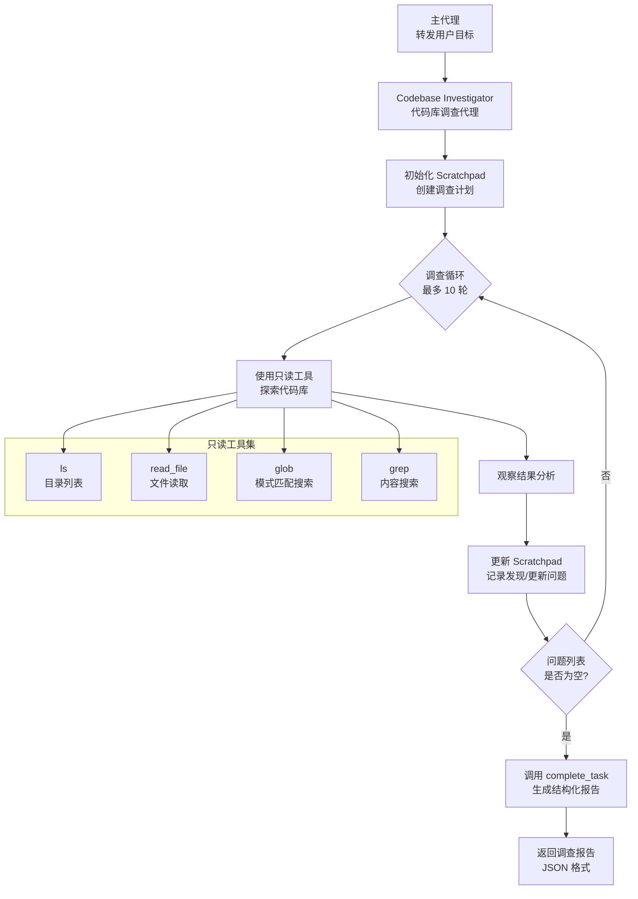
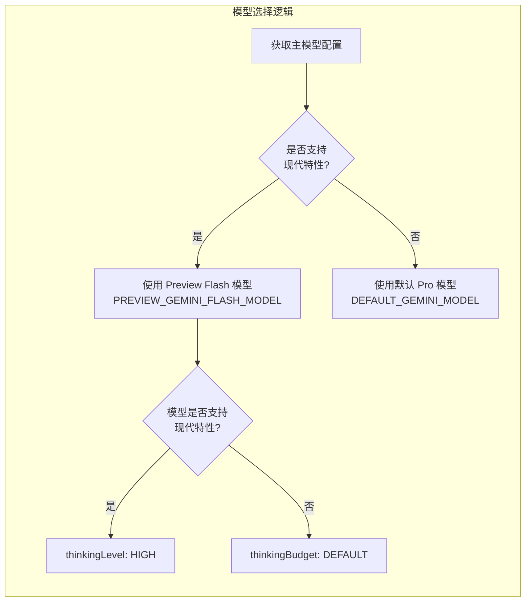
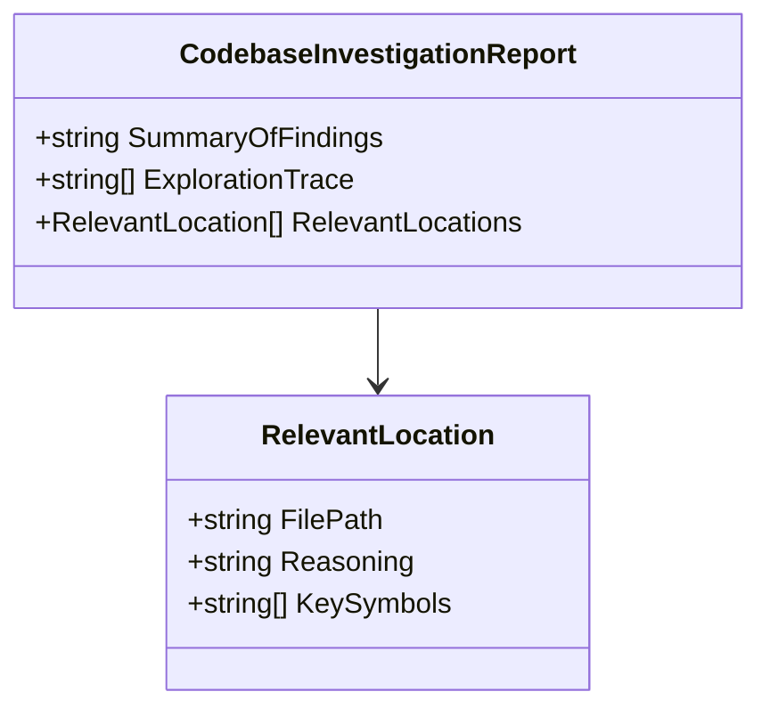

# codebase-investigator.ts

## 概述

`codebase-investigator.ts` 定义了 **Codebase Investigator Agent**（代码库调查代理），这是一个超级专业化的子代理，专注于对代码库进行深度分析、架构映射和系统级依赖理解。它在更大的代理系统中担当"逆向工程专家"的角色，负责为主代理提供深入的、可操作的代码库上下文信息。

该代理的典型使用场景：
- **模糊请求处理**：用户需求不够明确时，先调查代码库结构再制定计划
- **Bug 根因分析**：追踪 bug 的根本原因、影响范围和修复方案
- **系统重构**：理解现有架构和依赖关系
- **全面特性实现**：在开发新功能前了解相关代码的全貌
- **代码库知识问答**：回答需要调查才能回答的代码库相关问题

该代理仅拥有只读工具（ls、read_file、glob、grep），不会修改任何代码，确保调查过程的安全性。

## 架构图（Mermaid）







## 核心组件

### 1. `CodebaseInvestigationReportSchema`（第 25-45 行）

使用 Zod 定义的结构化调查报告模式，这是代理调查完成后的输出格式。

```typescript
const CodebaseInvestigationReportSchema = z.object({
  SummaryOfFindings: z.string().describe("A summary of the investigation's conclusions..."),
  ExplorationTrace: z.array(z.string()).describe('A step-by-step list of actions...'),
  RelevantLocations: z.array(z.object({
    FilePath: z.string(),
    Reasoning: z.string(),
    KeySymbols: z.array(z.string()),
  })).describe('A list of relevant files and the key symbols within them.'),
});
```

| 字段 | 类型 | 说明 |
|---|---|---|
| `SummaryOfFindings` | `string` | 调查结论和洞察的总结，包含根因分析、修复建议等 |
| `ExplorationTrace` | `string[]` | 调查过程中每一步的工具使用和操作记录 |
| `RelevantLocations` | `object[]` | 相关文件列表，每个条目包含文件路径、关联理由和关键符号名 |

### 2. `CodebaseInvestigatorAgent` 工厂函数（第 51-193 行）

导出的工厂函数，接受 `Config` 配置参数，返回 `LocalAgentDefinition` 定义。

#### 代理基本信息

| 属性 | 值 | 说明 |
|---|---|---|
| `name` | `codebase_investigator` | 代理内部标识名 |
| `kind` | `local` | 本地代理类型 |
| `displayName` | `Codebase Investigator Agent` | 显示名称 |
| `description` | 专门用于代码库分析、架构映射... | 详细描述代理的调用时机和能力 |

#### 模型选择逻辑（第 56-58 行）

```typescript
const model = supportsModernFeatures(config.getModel())
  ? PREVIEW_GEMINI_FLASH_MODEL
  : DEFAULT_GEMINI_MODEL;
```

模型选择基于主模型的能力：
- **若主模型支持现代特性**：使用 `PREVIEW_GEMINI_FLASH_MODEL`（更快、更经济）
- **若主模型不支持现代特性**：回退到 `DEFAULT_GEMINI_MODEL`（Pro 模型，确保能力不低于需求）

#### 跨平台命令适配（第 60-63 行）

```typescript
const listCommand = process.platform === 'win32'
  ? '`dir /s` (CMD) or `Get-ChildItem -Recurse` (PowerShell)'
  : '`ls -R`';
```

根据运行平台自动选择示例中的目录列表命令，用于系统提示词中的示例展示。

#### 输入配置（`inputConfig`）

接受单个必需参数 `objective`（字符串类型），要求包含：
- 用户的原始目标描述
- 额外上下文和问题
- 主代理可能补充的信息

#### 模型配置（`modelConfig`）

| 参数 | 值 | 说明 |
|---|---|---|
| `model` | 动态选择 | Flash 或 Pro 模型 |
| `temperature` | `0.1` | 低随机性，确保分析准确性 |
| `topP` | `0.95` | 核采样参数 |
| 思考配置 | 条件选择 | 现代模型使用 `ThinkingLevel.HIGH`，否则使用 `DEFAULT_THINKING_MODE` 预算 |

#### 运行配置（`runConfig`）

| 参数 | 值 | 说明 |
|---|---|---|
| `maxTimeMinutes` | `3` | 最大运行时间 3 分钟 |
| `maxTurns` | `10` | 最多执行 10 轮工具调用 |

#### 工具配置（`toolConfig`）

仅授予**只读**工具，确保调查过程不会修改代码库：

| 工具名称 | 用途 |
|---|---|
| `LS_TOOL_NAME` | 列出目录内容 |
| `READ_FILE_TOOL_NAME` | 读取文件内容 |
| `GLOB_TOOL_NAME` | 按模式搜索文件路径 |
| `GREP_TOOL_NAME` | 按正则搜索文件内容 |

#### 提示词配置（`promptConfig`）

**查询模板：**
```
Your task is to do a deep investigation of the codebase to find all relevant files,
code locations, architectural mental map and insights to solve for the following user objective:
<objective>
${objective}
</objective>
```

**系统提示词核心设计（极其详细的工作指南）：**

1. **角色定位**：超级专业化的逆向工程 AI 代理，专注构建代码心智模型
2. **核心指令（RULES）**：
   - 深度分析，不仅仅是找文件——理解代码的"为什么"
   - 系统化且好奇的探索——像高级工程师做代码审查
   - 全面且精确——找到完整且最小的需要理解/修改的位置集合
   - 允许使用 `web_fetch` 研究不理解的库或概念
3. **Scratchpad 管理机制**（核心工作方法）：
   - **初始化**：第一轮必须创建 `<scratchpad>`，包含调查清单和待解决问题
   - **持续更新**：每次观察后必须更新 scratchpad
   - **标记完成项**：`[x]` 标记已完成的清单项
   - **记录发现**：包括文件路径、用途、相关性
   - **记录死胡同**：避免重复调查无关路径
4. **终止条件**：待解决问题列表（Questions to Resolve）为空时才可完成调查

## 依赖关系

### 内部依赖

| 模块路径 | 导入内容 | 用途 |
|---|---|---|
| `./types.js` | `LocalAgentDefinition` | 本地代理定义类型接口 |
| `../tools/tool-names.js` | `GLOB_TOOL_NAME`, `GREP_TOOL_NAME`, `LS_TOOL_NAME`, `READ_FILE_TOOL_NAME` | 只读工具名称常量 |
| `../config/models.js` | `DEFAULT_THINKING_MODE`, `DEFAULT_GEMINI_MODEL`, `PREVIEW_GEMINI_FLASH_MODEL`, `supportsModernFeatures` | 模型配置常量和能力检测函数 |
| `../config/config.js` | `Config` | 全局配置类型 |

### 外部依赖

| 包名 | 用途 |
|---|---|
| `zod` | 输出模式定义和运行时验证 |
| `@google/genai` | `ThinkingLevel` 枚举（思考级别配置） |

## 关键实现细节

1. **自适应模型选择**：代理根据主模型的能力动态选择自身使用的模型。如果主模型支持现代特性，则使用更快的 Flash Preview 模型；否则使用默认 Pro 模型。这种策略在保证能力的同时优化了性能和成本。

2. **自适应思考配置**：思考（Thinking）配置同样根据模型能力自适应。现代模型使用 `ThinkingLevel.HIGH`（基于级别的配置），非现代模型使用 `thinkingBudget`（基于 token 数量的配置）。

3. **Scratchpad 工作方法论**：系统提示词中引入了一套完整的"纸上思考"方法论（Scratchpad Management），包含初始化、持续更新、完成标记、问题追踪等流程。这不仅是提示词技巧，更是一种结构化推理框架，确保代理的调查过程可追踪、有条理。

4. **严格只读约束**：通过 `toolConfig.tools` 仅配置只读工具（ls、read_file、glob、grep），从架构层面确保调查代理不可能修改代码库，实现了安全隔离。

5. **跨平台兼容**：示例中的目录列表命令根据 `process.platform` 自动适配 Windows（`dir /s` / `Get-ChildItem -Recurse`）和 Unix/Mac（`ls -R`），体现了跨平台设计意识。

6. **结构化报告输出**：与自由文本不同，代理必须以 `{ SummaryOfFindings, ExplorationTrace, RelevantLocations }` 结构输出报告，其中 `RelevantLocations` 精确到文件路径、理由和关键符号名，便于主代理直接使用这些信息制定后续行动计划。

7. **终止条件的明确定义**：系统提示词中明确规定"Questions to Resolve 列表为空"才允许完成调查，避免代理过早结束调查、遗漏关键信息。

8. **与主代理的职责分工**：该代理明确被指示"不要编写最终实现代码"（DO NOT write the final implementation code yourself），它的职责是提供上下文和洞察，而非实施变更。这种清晰的分工设计避免了子代理越权操作。
