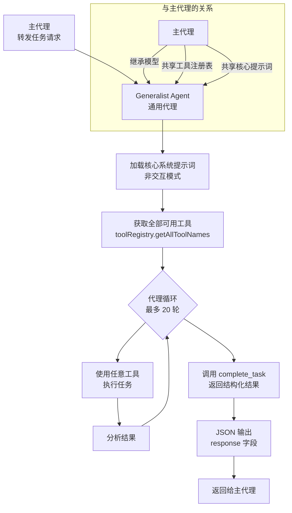
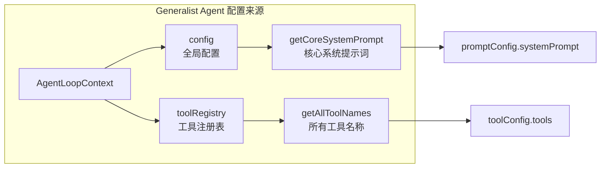

# generalist-agent.ts

## 概述

`generalist-agent.ts` 定义了 **Generalist Agent**（通用代理），这是一个拥有**全部工具访问权限**的通用子代理。它使用与主代理相同的核心系统提示词，但运行在非交互模式下，专为处理资源密集型或大批量操作任务而设计。

该代理的核心设计理念是**保持主会话历史的精简高效**——将繁重的工作卸载到子代理中执行，避免主对话上下文膨胀。

典型使用场景：
- **批量重构/错误修复**：跨多个文件的批量代码修改
- **高输出量命令执行**：运行产生大量输出的命令
- **探索性调查**：投机性的代码探索和分析
- **大数据处理**：涉及处理大量数据的任务
- **轮次密集型任务**：需要多轮工具调用才能完成的复杂操作

## 架构图（Mermaid）





## 核心组件

### 1. `GeneralistAgentSchema`（第 12-14 行）

使用 Zod 定义的极简输出模式，仅包含单个 `response` 字符串字段。

```typescript
const GeneralistAgentSchema = z.object({
  response: z.string().describe('The final response from the agent.'),
});
```

| 字段 | 类型 | 说明 |
|---|---|---|
| `response` | `string` | 代理的最终响应文本 |

这与其他专业代理（如 Codebase Investigator 的多字段报告）形成鲜明对比——通用代理不需要特定格式的输出结构，因为它的任务类型是多样化的。

### 2. `GeneralistAgent` 工厂函数（第 20-68 行）

导出的工厂函数，接受 `AgentLoopContext` 上下文参数，返回 `LocalAgentDefinition` 定义。

#### 代理基本信息

| 属性 | 值 | 说明 |
|---|---|---|
| `name` | `generalist` | 代理内部标识名 |
| `kind` | `local` | 本地代理类型 |
| `displayName` | `Generalist Agent` | 显示名称 |
| `description` | 拥有所有工具的通用代理... | 详细描述适用场景（批量操作、高输出量、探索性调查等） |

#### 输入配置（`inputConfig`）

```typescript
inputConfig: {
  inputSchema: {
    type: 'object',
    properties: {
      request: {
        type: 'string',
        description: 'The task or question for the generalist agent.',
      },
    },
    required: ['request'],
  },
}
```

- 接受单个必需参数 `request`（字符串类型）
- 代表需要通用代理处理的任务或问题

#### 输出配置（`outputConfig`）

| 属性 | 值 | 说明 |
|---|---|---|
| `outputName` | `result` | 输出名称 |
| `description` | 任务的最终答案或结果 | 输出描述 |
| `schema` | `GeneralistAgentSchema` | 输出验证模式 |

#### 模型配置（`modelConfig`）

```typescript
modelConfig: {
  model: 'inherit',
}
```

- **`model: 'inherit'`**：继承主代理的模型配置，不独立指定模型
- 未指定 `temperature`、`topP` 等参数，完全沿用主代理的生成配置
- 这是所有子代理中唯一使用 `inherit` 模型策略的代理

#### 工具配置（`toolConfig`）——使用 getter 延迟求值

```typescript
get toolConfig() {
  const tools = context.toolRegistry.getAllToolNames();
  return { tools };
}
```

- 使用 JavaScript **getter** 属性实现**延迟求值**（lazy evaluation）
- 每次访问 `toolConfig` 时从 `context.toolRegistry` 动态获取所有可用工具名称
- 这意味着代理始终拥有系统中注册的**全部工具**的访问权限，包括后续动态注册的工具

#### 提示词配置（`promptConfig`）——同样使用 getter 延迟求值

```typescript
get promptConfig() {
  return {
    systemPrompt: getCoreSystemPrompt(
      context.config,
      /*useMemory=*/ undefined,
      /*interactiveOverride=*/ false,
    ),
    query: '${request}',
  };
}
```

- 使用 `getCoreSystemPrompt` 获取与主代理**相同的核心系统提示词**
- `useMemory` 参数为 `undefined`（使用默认行为）
- `interactiveOverride` 设为 `false`，强制非交互模式——代理不会向用户追问
- 查询模板简单引用 `${request}` 输入变量

#### 运行配置（`runConfig`）

| 参数 | 值 | 说明 |
|---|---|---|
| `maxTimeMinutes` | `10` | 最大运行时间 10 分钟（所有子代理中最长） |
| `maxTurns` | `20` | 最多执行 20 轮工具调用（所有子代理中最多） |

与其他子代理（3 分钟 / 10 轮）相比，通用代理拥有更宽裕的资源限制，以适应其处理复杂、耗时任务的定位。

## 依赖关系

### 内部依赖

| 模块路径 | 导入内容 | 用途 |
|---|---|---|
| `./types.js` | `LocalAgentDefinition` | 本地代理定义类型接口 |
| `../config/agent-loop-context.js` | `AgentLoopContext` | 代理循环上下文类型（提供 config、toolRegistry 等） |
| `../core/prompts.js` | `getCoreSystemPrompt` | 获取核心系统提示词函数 |

### 外部依赖

| 包名 | 用途 |
|---|---|
| `zod` | 输出模式定义和运行时验证 |

## 关键实现细节

1. **"继承一切"设计哲学**：Generalist Agent 的设计理念是尽可能继承主代理的能力——继承模型（`model: 'inherit'`）、继承全部工具（`getAllToolNames()`）、继承核心提示词（`getCoreSystemPrompt`）。它本质上是主代理的"分身"，但运行在独立的上下文中以保持主会话历史的精简。

2. **Getter 延迟求值模式**：`toolConfig` 和 `promptConfig` 都使用了 JavaScript getter 属性而非普通属性。这是一个关键的设计选择：
   - **工具列表**可能在代理定义创建后动态变化（如 MCP 服务器注册新工具），getter 确保每次访问时获取最新的工具列表
   - **系统提示词**依赖运行时配置（如 `context.config`），getter 确保在实际使用时才求值，避免过早绑定

3. **非交互模式强制**：通过 `interactiveOverride: false` 参数调用 `getCoreSystemPrompt`，确保代理在子代理循环中运行时不会尝试与用户交互（如请求确认、追问等）。这是子代理的通用约束。

4. **宽裕的资源限制**：10 分钟 / 20 轮的限制是所有内置子代理中最宽裕的（CLI Help 和 Codebase Investigator 均为 3 分钟 / 10 轮），反映了该代理处理大批量、高复杂度任务的定位。

5. **极简输出模式**：与 Codebase Investigator 的详细结构化报告不同，Generalist Agent 的输出仅有一个 `response` 字段。这种极简设计匹配其"通用"定位——不同类型的任务需要不同格式的输出，单一字符串字段提供了最大的灵活性。

6. **上下文隔离的价值**：该代理的核心价值不在于拥有独特的能力（它的能力与主代理相同），而在于提供**上下文隔离**——子代理的工具调用历史、中间结果等不会污染主会话的上下文窗口，从而使主代理能够处理更长的对话而不受窗口大小限制。

7. **无自定义系统提示词**：这是唯一一个不定义自己专属系统提示词的子代理——它直接复用主代理的核心提示词。这进一步体现了其"通用分身"的角色定位。
