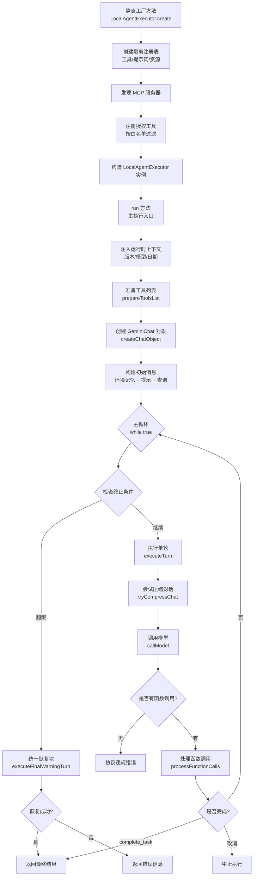
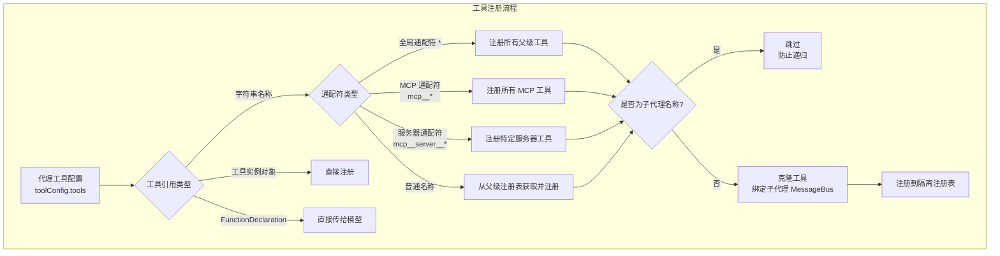
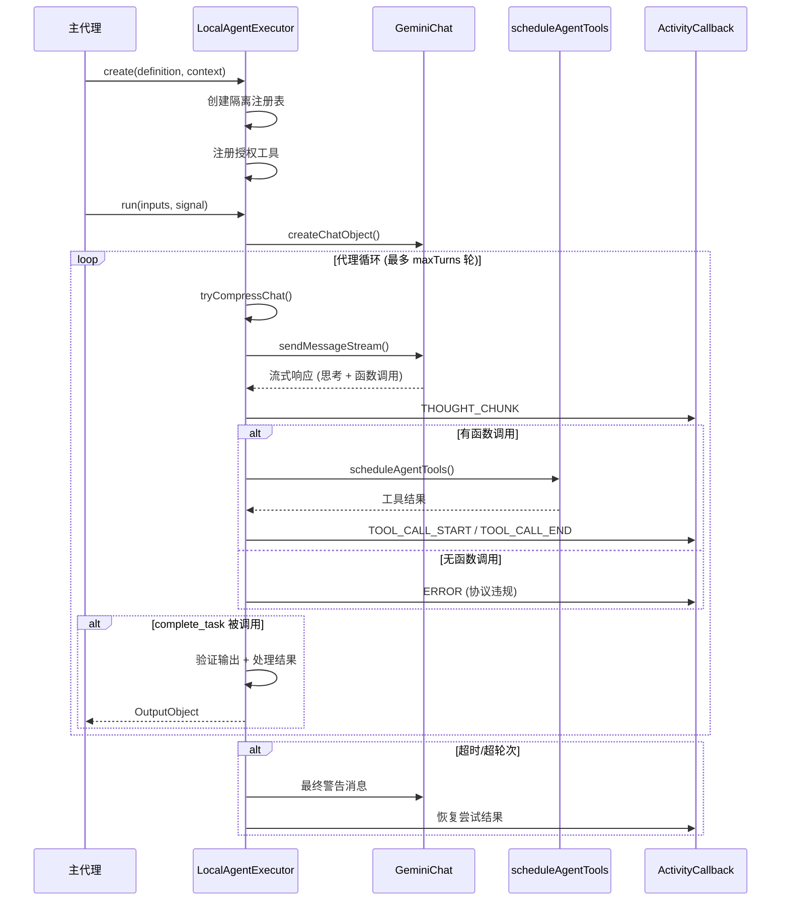
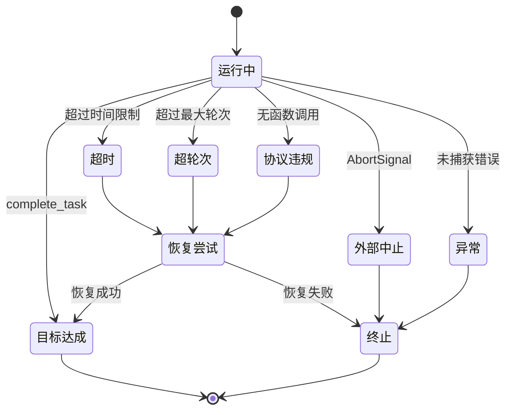

# local-executor.ts

## 概述

`local-executor.ts` 是 Gemini CLI 核心包中最重要的文件之一，它实现了 **LocalAgentExecutor**（本地代理执行器）——负责实际运行本地代理定义（`LocalAgentDefinition`）的执行引擎。这个执行器管理整个代理生命周期：从初始化、工具注册、模型调用、工具执行、对话压缩，到超时恢复和最终结果输出。

该模块是代理系统的"运行时核心"，它将静态的代理定义转化为动态的执行过程。核心设计理念包括：
- **隔离执行**：每个代理实例拥有独立的工具注册表、提示词注册表和资源注册表
- **安全控制**：工具访问权限白名单机制，防止子代理递归调用
- **优雅降级**：超时/超轮次时的恢复尝试（Grace Period）机制
- **流式处理**：流式接收模型输出，实时提取思考内容和函数调用
- **活动上报**：通过回调机制实时上报代理活动事件

文件约 1475 行，是整个 agents 子系统中最大的模块。

## 架构图（Mermaid）









## 核心组件

### 1. 类型定义和常量

#### `ActivityCallback`（第 81 行）

```typescript
export type ActivityCallback = (activity: SubagentActivityEvent) => void;
```

代理活动事件回调类型，用于将代理内部事件（思考、工具调用、错误等）上报给外部观察者。

#### `TASK_COMPLETE_TOOL_NAME`（第 83 行）

```typescript
const TASK_COMPLETE_TOOL_NAME = 'complete_task';
```

每个代理必须调用的特殊工具名称，用于标记任务完成并提交最终结果。这是代理唯一的正常退出方式。

#### `GRACE_PERIOD_MS`（第 84 行）

```typescript
const GRACE_PERIOD_MS = 60 * 1000; // 1 min
```

恢复尝试的宽限期时间（1 分钟），在代理超时或超轮次后给予额外时间调用 `complete_task`。

#### `AgentTurnResult`（第 87-96 行）

单轮执行结果的联合类型：
- `{ status: 'continue', nextMessage }` — 继续下一轮
- `{ status: 'stop', terminateReason, finalResult }` — 终止执行

### 2. `createUnauthorizedToolError` 函数（第 98-100 行）

```typescript
export function createUnauthorizedToolError(toolName: string): string {
  return `Unauthorized tool call: '${toolName}' is not available to this agent.`;
}
```

生成未授权工具调用的错误消息，当代理试图调用其白名单之外的工具时使用。

### 3. `LocalAgentExecutor` 类（第 108-1474 行）

执行器的核心类，泛型参数 `TOutput extends z.ZodTypeAny` 约束输出模式类型。

#### 3.1 私有属性

| 属性 | 类型 | 说明 |
|---|---|---|
| `definition` | `LocalAgentDefinition<TOutput>` | 代理定义（只读） |
| `agentId` | `string` | 随机生成的 6 位 ID（`Math.random().toString(36).slice(2, 8)`） |
| `toolRegistry` | `ToolRegistry` | 隔离的工具注册表 |
| `promptRegistry` | `PromptRegistry` | 隔离的提示词注册表 |
| `resourceRegistry` | `ResourceRegistry` | 隔离的资源注册表 |
| `context` | `AgentLoopContext` | 代理循环上下文 |
| `onActivity` | `ActivityCallback?` | 活动事件回调 |
| `compressionService` | `ChatCompressionService` | 对话压缩服务 |
| `parentCallId` | `string?` | 父级工具调用 ID |
| `hasFailedCompressionAttempt` | `boolean` | 压缩失败标记 |

#### 3.2 `executionContext` getter（第 121-133 行）

创建子代理专用的执行上下文，关键行为：
- 使用 `this.agentId` 作为 `promptId`
- 保留主代理的 `parentSessionId`（通过 `this.context.parentSessionId || this.context.promptId`）
- 使用隔离的注册表实例
- 从工具注册表获取 `messageBus`

#### 3.3 `create` 静态工厂方法（第 146-272 行）

**唯一的实例创建入口**（构造函数为 private），核心流程：

1. **创建子代理消息总线**：`parentMessageBus.derive(definition.name)` — 注入子代理名称到工具确认请求中
2. **创建隔离注册表**：`ToolRegistry`、`PromptRegistry`、`ResourceRegistry` 各一个独立实例
3. **发现 MCP 服务器**：如果代理定义中配置了 `mcpServers`，通过全局 MCP 管理器发现并注册
4. **工具注册流程**（核心逻辑）：
   - 获取所有已注册的代理名称（用于防止递归）
   - 定义 `registerToolInstance`：检查工具是否为子代理名称 → 克隆工具（绑定子代理 messageBus）→ 注册
   - 定义 `registerToolByName`：支持通配符解析（`*`、`mcp__*`、`mcp__serverName__*`）、MCP 工具名称解析、普通工具名称查找
   - 如果 `toolConfig` 存在：按配置列表注册
   - 如果 `toolConfig` 不存在：默认注册所有可用工具
5. **工具排序**：`agentToolRegistry.sortTools()`
6. **获取父级调用 ID**：通过 `getToolCallContext()` 获取

**防递归机制**：通过检查工具名称是否在已注册代理名称集合中来防止代理调用其他代理。

#### 3.4 `executeTurn` 方法（第 308-379 行）

执行单轮代理逻辑：

1. 尝试压缩对话历史（`tryCompressChat`）
2. 调用模型（`callModel`）获取函数调用和文本响应
3. 检查中止信号（区分超时中止和外部中止）
4. 处理无函数调用的情况（协议违规错误）
5. 处理函数调用（`processFunctionCalls`）
6. 根据结果返回 `continue` 或 `stop`

#### 3.5 `executeFinalWarningTurn` 方法（第 413-499 行）

**恢复尝试机制**——当代理因超时、超轮次或协议违规而终止时：

1. 发出"执行限制已达"的思考事件
2. 创建 1 分钟宽限期计时器
3. 发送最终警告消息（告知代理必须立即调用 `complete_task`）
4. 组合外部信号和宽限期信号
5. 执行一个额外的回合
6. 判断恢复是否成功（是否调用了 `complete_task`）
7. 无论成功与否，记录遥测日志

#### 3.6 `run` 方法（第 508-800 行）

**主执行入口**，整体流程：

1. **初始化阶段**：
   - 设置截止时间定时器（`DeadlineTimer`）
   - 创建确认等待暂停/恢复回调（等待用户确认时暂停计时）
   - 组合外部信号和超时信号
   - 记录代理启动遥测
   - 注入运行时上下文（CLI 版本、当前模型、日期）
   - 准备工具列表和聊天对象
   - 模板化查询字符串

2. **注入监听阶段**：
   - 注册注入监听器（用户引导提示 + 后台完成）
   - 加载环境记忆（JIT 上下文或环境记忆）
   - 构建初始消息（记忆 + 提示 + 查询）

3. **主循环阶段**：
   - 检查终止条件（最大轮次）
   - 检查中止信号（超时或外部中止）
   - 执行单轮（`executeTurn`）
   - 处理轮间注入（用户提示和后台完成）

4. **清理阶段**：
   - 注销注入监听器
   - 移除 MCP 注册表

5. **统一恢复块**：
   - 对可恢复的终止原因（TIMEOUT、MAX_TURNS、ERROR_NO_COMPLETE_TASK_CALL）尝试最终恢复
   - 恢复成功则更新终止原因为 GOAL

6. **异常处理**：
   - 特别处理由内部超时引起的 AbortError
   - 对超时异常也尝试恢复

7. **最终清理**（`finally`）：
   - 中止截止时间定时器
   - 记录代理完成遥测

#### 3.7 `tryCompressChat` 方法（第 802-837 行）

对话历史压缩逻辑：

| 压缩状态 | 处理方式 |
|---|---|
| `COMPRESSION_FAILED_INFLATED_TOKEN_COUNT` | 标记失败，避免后续再次尝试昂贵的摘要压缩 |
| `COMPRESSED` | 更新对话历史，重置失败标记 |
| `CONTENT_TRUNCATED` | 更新对话历史，但不重置失败标记（截断是因为摘要化之前就失败了） |

#### 3.8 `callModel` 方法（第 844-935 行）

模型调用逻辑：

1. 获取解析后的模型配置（`getResolvedConfig`）
2. 如果模型是 `auto`，通过路由服务（`ModelRouterService`）选择模型
3. 使用 `chat.sendMessageStream` 发起流式请求
4. 遍历流式响应：
   - 提取思考内容（`parseThought`），发出 `THOUGHT_CHUNK` 事件
   - 收集函数调用（`functionCalls`）
   - 收集文本响应

#### 3.9 `processFunctionCalls` 方法（第 987-1316 行）

**最复杂的方法**（约 330 行），处理模型返回的所有函数调用：

1. **分类处理**：
   - `complete_task`：同步处理完成任务
   - 未授权工具：生成错误响应
   - 普通工具：异步调度执行

2. **`complete_task` 处理逻辑**：
   - 防止重复调用（同一轮中只允许一次）
   - 如果有 `outputConfig`：从参数中提取输出 → Zod 验证 → `processOutput` 处理 → 提交
   - 如果无 `outputConfig`：使用默认 `result` 参数
   - 验证失败时撤销完成状态，让代理重试

3. **工具调度**：使用 `scheduleAgentTools` 并行调度工具调用

4. **取消处理**：
   - **软拒绝**（用户点击取消）：不中止代理，让代理重新思考策略
   - **硬中止**（Ctrl+C）：中止代理执行

5. **结果重组**：按原始函数调用顺序重组工具响应

#### 3.10 `prepareToolsList` 方法（第 1321-1374 行）

准备发送给模型的工具声明列表：

1. 收集 `toolConfig` 中的原始 `FunctionDeclaration`
2. 添加工具注册表中所有已注册工具的声明
3. **注入 `complete_task` 工具**（始终存在）：
   - 如果有 `outputConfig`：使用 `zodToJsonSchema` 将 Zod Schema 转换为 JSON Schema，作为 `complete_task` 的参数定义
   - 如果无 `outputConfig`：使用默认的 `result` 字符串参数

#### 3.11 `buildSystemPrompt` 方法（第 1377-1419 行）

构建最终系统提示词：

1. 模板化代理定义中的系统提示词（注入用户输入变量）
2. 追加系统记忆（用户持久化记忆）
3. 追加环境上下文（工作目录和文件夹结构）
4. 追加标准非交互执行规则：
   - 不能请求用户输入
   - 必须使用绝对路径
   - 被拒绝的操作必须换策略
   - 必须通过 `complete_task` 完成任务

#### 3.12 辅助方法

- **`applyTemplateToInitialMessages`**（第 1428-1441 行）：对初始消息中的文本部分应用模板字符串替换
- **`checkTermination`**（第 1448-1457 行）：检查是否超过最大轮次
- **`emitActivity`**（第 1460-1473 行）：发出代理活动事件到回调函数

## 依赖关系

### 内部依赖

| 模块路径 | 导入内容 | 用途 |
|---|---|---|
| `../config/agent-loop-context.js` | `AgentLoopContext` | 代理循环上下文类型 |
| `../utils/errorReporting.js` | `reportError` | 错误上报工具 |
| `../core/geminiChat.js` | `GeminiChat`, `StreamEventType` | Gemini 聊天客户端和流事件类型 |
| `../tools/tool-registry.js` | `ToolRegistry` | 工具注册表类 |
| `../prompts/prompt-registry.js` | `PromptRegistry` | 提示词注册表类 |
| `../resources/resource-registry.js` | `ResourceRegistry` | 资源注册表类 |
| `../tools/tools.js` | `AnyDeclarativeTool`, `ToolConfirmationOutcome` | 工具类型和确认结果枚举 |
| `../tools/mcp-tool.js` | `DiscoveredMCPTool`, `isMcpToolName`, `parseMcpToolName`, `MCP_TOOL_PREFIX` | MCP 工具相关功能 |
| `../core/turn.js` | `CompressionStatus` | 对话压缩状态枚举 |
| `../scheduler/types.js` | `ToolCallRequestInfo` | 工具调用请求信息类型 |
| `../services/chatCompressionService.js` | `ChatCompressionService` | 对话压缩服务类 |
| `../utils/environmentContext.js` | `getDirectoryContextString` | 获取环境目录上下文 |
| `../prompts/snippets.js` | `renderUserMemory` | 渲染用户记忆片段 |
| `../utils/promptIdContext.js` | `promptIdContext` | 提示词 ID 上下文管理（AsyncLocalStorage） |
| `../telemetry/loggers.js` | `logAgentStart`, `logAgentFinish`, `logRecoveryAttempt` | 遥测日志函数 |
| `../telemetry/types.js` | `AgentStartEvent`, `AgentFinishEvent`, `LlmRole`, `RecoveryAttemptEvent` | 遥测事件类型 |
| `./types.js` | `AgentTerminateMode`, `DEFAULT_QUERY_STRING`, `DEFAULT_MAX_TURNS`, `DEFAULT_MAX_TIME_MINUTES`, `SubagentActivityErrorType`, `SUBAGENT_REJECTED_ERROR_PREFIX`, `SUBAGENT_CANCELLED_ERROR_MESSAGE`, `LocalAgentDefinition`, `AgentInputs`, `OutputObject`, `SubagentActivityEvent` | 代理类型和常量 |
| `../utils/errors.js` | `getErrorMessage` | 错误消息提取 |
| `./utils.js` | `templateString` | 模板字符串替换 |
| `../config/models.js` | `DEFAULT_GEMINI_MODEL`, `isAutoModel` | 模型常量和检测函数 |
| `../routing/routingStrategy.js` | `RoutingContext` | 模型路由上下文类型 |
| `../utils/thoughtUtils.js` | `parseThought` | 思考内容解析 |
| `./registry.js` | `getModelConfigAlias` | 获取模型配置别名 |
| `../utils/version.js` | `getVersion` | 获取 CLI 版本 |
| `../utils/toolCallContext.js` | `getToolCallContext` | 获取工具调用上下文 |
| `./agent-scheduler.js` | `scheduleAgentTools` | 代理工具调度函数 |
| `../utils/deadlineTimer.js` | `DeadlineTimer` | 截止时间计时器 |
| `../utils/fastAckHelper.js` | `formatUserHintsForModel`, `formatBackgroundCompletionForModel` | 用户提示和后台完成格式化 |
| `../config/injectionService.js` | `InjectionSource` | 注入来源类型 |

### 外部依赖

| 包名 | 导入内容 | 用途 |
|---|---|---|
| `@google/genai` | `Type`, `Content`, `Part`, `FunctionCall`, `FunctionDeclaration`, `Schema` | Gemini API 核心类型 |
| `zod` | `z` | 运行时模式验证（用作类型约束） |
| `zod-to-json-schema` | `zodToJsonSchema` | 将 Zod Schema 转换为 JSON Schema（用于 `complete_task` 工具参数定义） |

## 关键实现细节

1. **隔离注册表模式**：每个代理实例创建独立的 `ToolRegistry`、`PromptRegistry`、`ResourceRegistry`。工具通过 `tool.clone(subagentMessageBus)` 克隆到子代理上下文，确保状态隔离和消息路由正确。

2. **防递归保护**：`create` 方法中通过 `allAgentNames` 集合检查，阻止子代理通过工具调用其他代理，从根本上防止代理递归死循环。

3. **通配符工具注册**：支持三级通配符 — `*`（全部工具）、`mcp__*`（全部 MCP 工具）、`mcp__serverName__*`（特定 MCP 服务器的全部工具），提供灵活的工具授权配置。

4. **优雅恢复（Grace Period）**：当代理因超时、超轮次或协议违规而终止时，不会立即丢弃所有中间结果，而是给予 1 分钟的宽限期让代理调用 `complete_task` 提交当前进度。恢复成功的遥测数据通过 `RecoveryAttemptEvent` 记录。

5. **确认等待暂停计时**：通过 `onWaitingForConfirmation` 回调与 `DeadlineTimer` 配合，在等待用户确认工具操作（如文件写入确认）时暂停截止时间计时器，确保用户思考时间不会被算入代理超时。

6. **轮间注入机制**：在代理循环的每轮之间，检查并注入两种外部信息：
   - **用户引导提示**（`user_steering`）：用户在代理运行过程中发送的提示
   - **后台完成**（`background_completion`）：其他后台任务的完成通知
   - 注入顺序有讲究：后台完成先于用户提示（`unshift` 顺序），使模型先看到上下文再看用户反应

7. **`complete_task` 双层验证**：
   - 有 `outputConfig` 时：用 Zod Schema 验证输出，失败则撤销完成状态让代理重试
   - 无 `outputConfig` 时：使用默认 `result` 参数，必须提供非空值
   - 防止同一轮内重复调用 `complete_task`

8. **软拒绝 vs 硬中止**：工具被取消时区分两种情况：
   - **软拒绝**（用户点击"取消"）：不中止代理，给出重新思考策略的指令
   - **硬中止**（Ctrl+C）：立即中止代理执行

9. **自动模型路由**：当配置的模型为 `auto` 时，通过 `ModelRouterService` 动态路由选择最合适的模型。路由失败时回退到 `DEFAULT_GEMINI_MODEL`，确保不会因为路由问题导致代理完全失败。

10. **对话压缩策略**：使用 `ChatCompressionService` 在每轮开始前尝试压缩对话历史，支持三种结果：摘要压缩成功、内容截断（摘要失败后的降级）、压缩失败（标记避免后续重试）。这确保长时间运行的代理不会因上下文窗口溢出而失败。

11. **流式模型输出处理**：`callModel` 使用流式 API（`sendMessageStream`），在接收过程中实时：
    - 解析思考内容（`parseThought`）并通过 `THOUGHT_CHUNK` 事件上报
    - 收集函数调用
    - 拼接文本响应

    这使得外部可以实时展示代理的思考过程。

12. **私有构造函数 + 静态工厂**：构造函数为 `private`，强制使用 `create` 静态方法创建实例。`create` 方法执行异步的工具发现和注册流程，这些操作无法在构造函数中完成。
