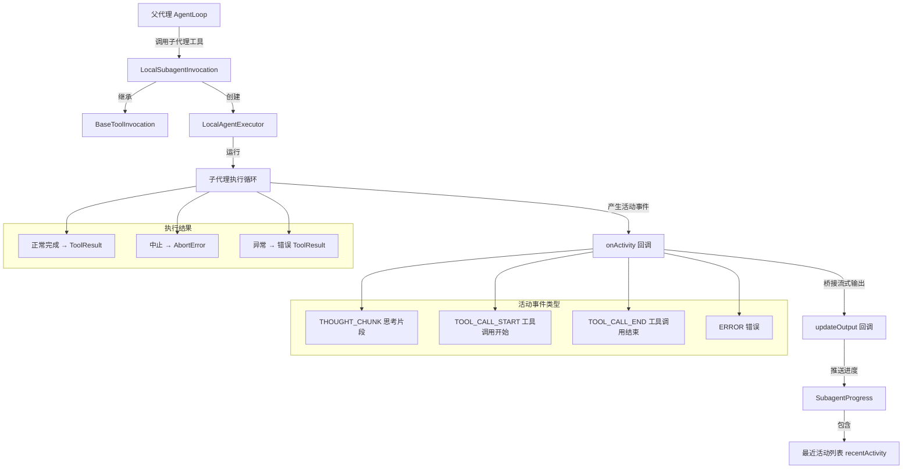

# local-invocation.ts

## 概述

`local-invocation.ts` 是 Gemini CLI 核心包中负责**本地子代理调用**的模块。它定义了 `LocalSubagentInvocation` 类，该类继承自 `BaseToolInvocation`，代表一个经过验证的、可执行的子代理工具实例。

该类的核心职责是编排子代理（subagent）的完整执行生命周期：
1. 初始化 `LocalAgentExecutor` 本地代理执行器
2. 运行代理的执行循环
3. 将代理的流式活动事件（如思考、工具调用）桥接到工具的实时输出流
4. 将最终结果格式化为 `ToolResult` 返回

该模块是子代理系统中"本地执行"路径的关键实现，与 `remote-invocation.ts`（远程执行路径）形成对比。

## 架构图（Mermaid）



## 核心组件

### 类：`LocalSubagentInvocation`

继承自 `BaseToolInvocation<AgentInputs, ToolResult>`，是本地子代理调用的具体实现。

#### 构造函数

```typescript
constructor(
  private readonly definition: LocalAgentDefinition,  // 代理定义配置
  private readonly context: AgentLoopContext,          // 代理循环上下文
  params: AgentInputs,                                // 经验证的输入参数
  messageBus: MessageBus,                             // 消息总线（策略执行）
  _toolName?: string,                                 // 可选的工具名（覆盖定义中的名称）
  _toolDisplayName?: string,                          // 可选的工具显示名
)
```

构造函数通过 `super()` 调用父类 `BaseToolInvocation`，传入参数、消息总线、工具名和显示名。工具名和显示名如未提供，则回退到 `definition.name` 和 `definition.displayName`。

#### 方法：`getDescription(): string`

返回一个简洁的、人类可读的调用描述，用于日志和显示。

- 将所有输入参数拼接为 `key: value` 格式，每个值最多截取 `INPUT_PREVIEW_MAX_LENGTH`(50) 个字符
- 整体描述最多截取 `DESCRIPTION_MAX_LENGTH`(200) 个字符
- 格式示例：`Running subagent 'agentName' with inputs: { key1: val1, key2: val2 }`

#### 方法：`execute(signal, updateOutput?): Promise<ToolResult>`

核心执行方法，编排子代理的完整执行流程。

**参数：**
- `signal: AbortSignal` — 用于取消代理执行的中止信号
- `updateOutput?: (output: ToolLiveOutput) => void` — 可选回调，用于流式推送中间输出

**执行流程：**

1. **初始化阶段**：发送初始 `SubagentProgress`（状态为 `running`，活动列表为空）
2. **注册活动回调 `onActivity`**：处理四种活动事件类型（见下文）
3. **创建执行器**：通过 `LocalAgentExecutor.create()` 创建执行器实例
4. **运行执行器**：调用 `executor.run(params, signal)` 获取输出
5. **处理结果**：
   - 若 `terminate_reason === ABORTED`：发送取消进度，抛出 `AbortError`
   - 正常完成：发送完成进度，返回包含 `llmContent` 和 `returnDisplay` 的 `ToolResult`
6. **异常处理**：
   - 将所有运行中的活动项标记为 `error` 或 `cancelled`
   - 非中止错误追加错误活动项
   - 中止错误重新抛出，非中止错误返回失败的 `ToolResult`

### 活动事件处理（onActivity 回调）

`onActivity` 回调是连接子代理执行器和 UI 输出的桥梁，处理四种 `SubagentActivityEvent` 类型：

| 事件类型 | 处理逻辑 |
|---------|---------|
| `THOUGHT_CHUNK` | 如果最后一个活动项是运行中的思考，则更新其内容；否则新增一个思考活动项。内容经过 `sanitizeThoughtContent` 清洗。 |
| `TOOL_CALL_START` | 新增一个 `tool_call` 类型的活动项，包含工具名、显示名、描述和参数。参数经过 `sanitizeToolArgs` 清洗。 |
| `TOOL_CALL_END` | 从最近活动列表中反向查找匹配的运行中工具调用，将其标记为 `completed` 或 `error`。 |
| `ERROR` | 处理三种错误子类型：取消（cancelled）、拒绝（rejected）、一般错误。取消和拒绝会标记对应工具调用为 `cancelled`，一般错误标记为 `error`。同时追加一个思考活动项展示错误信息。 |

每次更新后，活动列表保留最近 `MAX_RECENT_ACTIVITY`(3) 项，并将进度副本通过 `updateOutput` 推送。

### 常量

| 常量名 | 值 | 用途 |
|-------|---|------|
| `INPUT_PREVIEW_MAX_LENGTH` | 50 | 描述中单个输入值的最大显示长度 |
| `DESCRIPTION_MAX_LENGTH` | 200 | 整体描述的最大长度 |
| `MAX_RECENT_ACTIVITY` | 3 | 最近活动列表的最大条目数 |

## 依赖关系

### 内部依赖

| 模块路径 | 导入内容 | 用途 |
|---------|---------|------|
| `../config/agent-loop-context.js` | `AgentLoopContext` | 代理循环的上下文信息（配置、状态等） |
| `./local-executor.js` | `LocalAgentExecutor` | 本地代理的实际执行器，负责运行代理循环 |
| `../tools/tools.js` | `BaseToolInvocation`, `ToolResult`, `ToolLiveOutput` | 工具调用基类和结果/输出类型 |
| `./types.js` | `LocalAgentDefinition`, `AgentInputs`, `SubagentActivityEvent`, `SubagentProgress`, `SubagentActivityItem`, `AgentTerminateMode`, `SubagentActivityErrorType`, `SUBAGENT_REJECTED_ERROR_PREFIX`, `SUBAGENT_CANCELLED_ERROR_MESSAGE`, `isToolActivityError` | 代理系统的核心类型定义和常量 |
| `../confirmation-bus/message-bus.js` | `MessageBus` | 消息总线，用于策略执行（如用户确认） |
| `../utils/agent-sanitization-utils.js` | `sanitizeThoughtContent`, `sanitizeToolArgs`, `sanitizeErrorMessage` | 安全清洗函数，防止注入或敏感信息泄露 |

### 外部依赖

| 包名 | 导入内容 | 用途 |
|-----|---------|------|
| `node:crypto` | `randomUUID` | 为每个活动项生成唯一 ID |

## 关键实现细节

1. **流式进度桥接模式**：`onActivity` 回调将子代理执行器产生的低级事件（思考片段、工具调用开始/结束、错误）转换为统一的 `SubagentProgress` 结构，通过 `updateOutput` 回调推送给上层 UI。这是一种典型的事件适配器模式。

2. **活动列表滑动窗口**：`recentActivity` 数组最多保留 3 个最近活动项（`MAX_RECENT_ACTIVITY`），超出时从头部裁剪。这避免了长时间运行的子代理积累过多活动数据，同时确保 UI 展示最新状态。

3. **思考内容合并策略**：对于连续的 `THOUGHT_CHUNK` 事件，如果最后一个活动项仍是运行中的思考，则直接替换其内容（而非追加），这意味着只保留最新的思考文本片段。

4. **安全清洗机制**：所有展示给用户的内容都经过清洗函数处理：
   - `sanitizeThoughtContent` — 清洗思考内容
   - `sanitizeToolArgs` — 清洗工具参数
   - `sanitizeErrorMessage` — 清洗错误消息
   这防止了潜在的注入攻击或敏感信息泄露。

5. **错误分类与处理**：错误被细分为三类：
   - **取消（Cancelled）**：用户主动取消，对应工具调用标记为 `cancelled`
   - **拒绝（Rejected）**：策略拒绝，对应工具调用标记为 `cancelled`
   - **一般错误**：执行失败，对应工具调用标记为 `error`

   中止错误（`AbortError`）会被重新抛出，让上层处理；其他错误则被优雅地包装为失败的 `ToolResult` 返回，避免中断父代理的执行。

6. **结果格式双通道**：`ToolResult` 同时包含 `llmContent`（文本格式，供 LLM 理解）和 `returnDisplay`（`SubagentProgress` 结构，供 UI 渲染富文本进度）。对于错误情况，故意省略 `error` 属性，以确保 UI 渲染富文本进度而非原始错误消息。

7. **工具调用反向查找**：在 `TOOL_CALL_END` 和 `ERROR` 事件中，通过从 `recentActivity` 数组末尾反向查找匹配的运行中工具调用。这确保了在同名工具多次调用时，最后一个运行中的调用被正确标记。

8. **副本传递**：每次通过 `updateOutput` 推送进度时，使用展开运算符 `[...recentActivity]` 创建数组副本，避免外部修改影响内部状态。
