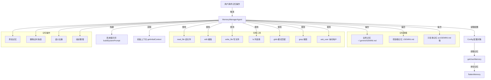

# memory-manager-agent.ts

## 概述

`memory-manager-agent.ts` 定义了**记忆管理代理（Memory Manager Agent）**，这是一个用于替代内置 `save_memory` 工具的本地子代理。它为用户提供了丰富的记忆操作能力：添加、删除、去重和组织存储在 `GEMINI.md` 文件中的记忆内容。

该代理管理着一个三层记忆体系：
- **全局记忆**：跨项目的用户偏好和习惯（存储在 `~/.gemini/GEMINI.md`）
- **项目根记忆**：项目级架构决策和约定（存储在 `./GEMINI.md`）
- **子目录记忆**：特定模块或目录的详细上下文（存储在各子目录的 `GEMINI.md`）

用户可以通过在 `~/.gemini/agents/` 或 `.gemini/agents/` 目录中放置自定义的 `save_memory.md` 文件来覆盖此代理。

## 架构图（Mermaid）



## 核心组件

### 输出 Schema：`MemoryManagerSchema`

```typescript
const MemoryManagerSchema = z.object({
  response: z.string().describe('A summary of the memory operations performed.'),
});
```

使用 Zod 定义的输出模式，要求代理返回一个 `response` 字符串，描述执行的记忆操作摘要。

### 工厂函数：`MemoryManagerAgent(config: Config)`

这不是一个类，而是一个**工厂函数**，接收 `Config` 配置对象并返回 `LocalAgentDefinition<typeof MemoryManagerSchema>` 类型的代理定义。

使用工厂函数而非静态对象的原因是：代理定义需要依赖运行时的 `Config` 对象来获取用户记忆和全局配置目录。

#### 返回的代理定义

| 属性 | 值 | 说明 |
|------|---|------|
| `kind` | `'local'` | 本地代理类型 |
| `name` | `'save_memory'` | 代理名称，与被替代的内置工具同名 |
| `displayName` | `'Memory Manager'` | UI 显示名 |
| `description` | 描述字符串 | 向 LLM 解释代理功能 |
| `inputConfig` | 包含 `request` 字段 | 输入参数配置 |
| `outputConfig` | `MemoryManagerSchema` | 输出格式配置 |
| `modelConfig` | `GEMINI_MODEL_ALIAS_FLASH` | 使用 Flash 模型（轻量快速） |
| `toolConfig` | 7 个工具 | 可用工具列表 |
| `promptConfig` | getter（延迟求值） | 系统提示词和查询模板 |
| `runConfig` | 5 分钟 / 10 轮 | 运行限制 |

#### 输入配置

```typescript
inputConfig: {
  inputSchema: {
    type: 'object',
    properties: {
      request: {
        type: 'string',
        description: '要执行的记忆操作...',
      },
    },
    required: ['request'],
  },
}
```

代理接受一个必填的 `request` 字符串参数，描述要执行的记忆操作。

### 内部函数：`getInitialContext()`

从 `Config` 对象获取用户的当前记忆内容，作为初始上下文提供给代理。

- 调用 `config.getUserMemory()` 获取记忆
- 如果记忆是字符串，直接使用
- 如果记忆是对象，通过 `flattenMemory()` 拼合 `global` 和 `project` 部分（排除扩展记忆，因为扩展记忆是只读的）
- 空记忆返回空字符串

### 内部函数：`buildSystemPrompt()`

构建代理的系统提示词，包含以下关键部分：

1. **记忆层级说明**：详细描述全局、项目根、子目录三级记忆结构及其用途
2. **路由规则**：指导代理将记忆路由到正确的存储位置
   - 全局：用户偏好、个人信息、跨项目习惯
   - 项目根：架构、约定、工作流、团队信息
   - 子目录：特定模块的详细上下文
   - **歧义处理**：当记忆可能属于全局或项目时，必须使用 `ask_user` 工具询问用户
3. **操作类型**：添加、删除过时条目、去重、组织整理
4. **限制规则**：保持文件精简、简洁条目、手术式编辑、只操作 `GEMINI.md` 文件
5. **效率与性能**：最小化轮数、并行操作、避免不必要的代码库探索

### 提示词配置（promptConfig）

```typescript
get promptConfig() {
  return {
    systemPrompt: buildSystemPrompt(),
    query: `${getInitialContext()}\${request}`,
  };
}
```

使用 getter 实现延迟求值，确保每次访问时获取最新的记忆状态。查询模板将初始上下文和用户请求拼接。

### 运行限制

```typescript
runConfig: {
  maxTimeMinutes: 5,
  maxTurns: 10,
}
```

代理最多运行 5 分钟、10 个交互轮次。

## 依赖关系

### 内部依赖

| 模块路径 | 导入内容 | 用途 |
|---------|---------|------|
| `./types.js` | `LocalAgentDefinition` | 本地代理定义类型 |
| `../tools/tool-names.js` | `ASK_USER_TOOL_NAME`, `EDIT_TOOL_NAME`, `GLOB_TOOL_NAME`, `GREP_TOOL_NAME`, `LS_TOOL_NAME`, `READ_FILE_TOOL_NAME`, `WRITE_FILE_TOOL_NAME` | 7 个工具名常量 |
| `../config/storage.js` | `Storage` | 获取全局 `.gemini` 目录路径 |
| `../config/memory.js` | `flattenMemory` | 将结构化记忆拼合为文本 |
| `../config/models.js` | `GEMINI_MODEL_ALIAS_FLASH` | Flash 模型别名 |
| `../config/config.js` | `Config` | 配置类型 |

### 外部依赖

| 包名 | 导入内容 | 用途 |
|-----|---------|------|
| `zod` | `z` | 输出 Schema 验证和类型推导 |

## 关键实现细节

1. **工厂函数模式**：`MemoryManagerAgent` 是一个工厂函数而非类或静态对象。它接收 `Config` 作为参数，闭包捕获了 `config` 和 `globalGeminiDir`，使得内部函数（`getInitialContext`、`buildSystemPrompt`）可以访问运行时配置。这种设计使代理定义可以适应不同的配置环境。

2. **延迟求值的 promptConfig**：使用 `get promptConfig()` getter 而非普通属性，确保每次创建代理实例时都能获取最新的记忆状态。如果使用静态属性，记忆内容在定义创建时就被固定了。

3. **Flash 模型选择**：该代理使用 `GEMINI_MODEL_ALIAS_FLASH`（Flash 轻量模型）而非默认的大模型，因为记忆管理操作相对简单，不需要强推理能力，使用 Flash 模型可以降低延迟和成本。

4. **扩展记忆排除**：在 `getInitialContext()` 中，`flattenMemory` 仅接收 `global` 和 `project` 记忆，明确排除了扩展（extension）记忆。这是因为扩展记忆是只读的，记忆管理代理不应尝试修改它们。

5. **歧义消解机制**：系统提示词明确要求代理在无法确定记忆应该存储在全局还是项目级别时，必须使用 `ask_user` 工具向用户确认。这避免了代理自行决断可能导致的错误路由。

6. **可覆盖设计**：文档注释中说明用户可以通过自定义 `save_memory.md` 覆盖此代理。这意味着代理注册系统支持用户级自定义代理优先于内置代理。

7. **工具集选择**：代理被授予了 7 个工具，涵盖文件读写操作（`read_file`、`edit`、`write_file`）、文件系统探索（`ls`、`glob`、`grep`）和用户交互（`ask_user`）。这是记忆管理所需的最小工具集。

8. **查询模板中的变量替换**：查询模板 `${getInitialContext()}\${request}` 中，`getInitialContext()` 在 getter 调用时立即求值，而 `\${request}` 是一个模板变量（转义的 `$`），在代理实际执行时由输入参数替换。这种双层模板机制允许静态上下文和动态输入的组合。

9. **效率导向的提示词设计**：系统提示词中包含大量效率优化指令，如"尽量少的轮数"、"并行操作不同文件"、"不要探索代码库"、"不要为已提供的文件内容调用 read_file"。这些指令旨在最小化代理的 token 消耗和执行时间。
