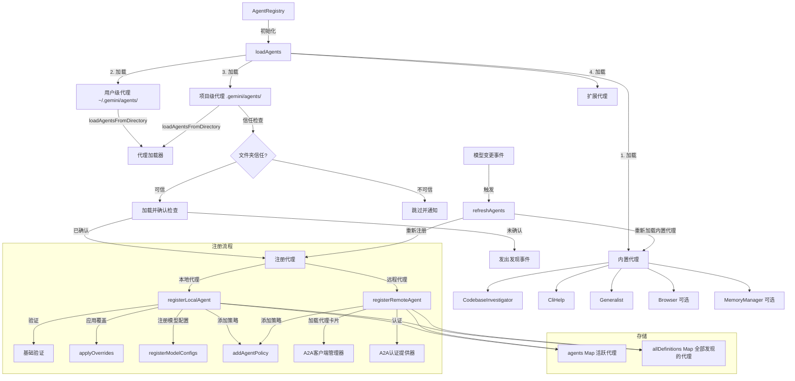

# registry.ts

## 概述

`registry.ts` 是 Gemini CLI 核心包中的**代理注册中心**模块，定义了 `AgentRegistry` 类。该类是整个代理系统的中央管理器，负责代理的发现、加载、验证、注册和生命周期管理。

`AgentRegistry` 管理多种来源的代理：
- **内置代理**：代码中硬编码的代理（如 CodebaseInvestigator、CliHelp、Generalist、Browser、MemoryManager）
- **用户级代理**：从 `~/.gemini/agents/` 目录加载的自定义代理
- **项目级代理**：从项目目录 `.gemini/agents/` 加载的代理（需要信任验证和确认）
- **扩展代理**：通过扩展系统注册的代理
- **远程代理**：通过 A2A（Agent-to-Agent）协议连接的远程代理

此外，该模块还导出了辅助函数 `getModelConfigAlias()`，用于为代理生成模型配置别名。

## 架构图（Mermaid）



## 核心组件

### 辅助函数：`getModelConfigAlias(definition)`

```typescript
export function getModelConfigAlias<TOutput extends z.ZodTypeAny>(
  definition: AgentDefinition<TOutput>,
): string {
  return `${definition.name}-config`;
}
```

为代理定义生成模型配置别名，格式为 `{代理名}-config`。用于在模型配置服务中注册代理特定的模型配置。

### 类：`AgentRegistry`

代理注册中心的核心类。

#### 属性

| 属性 | 类型 | 说明 |
|------|-----|------|
| `agents` | `Map<string, AgentDefinition<any>>` | 活跃（已启用且已注册）的代理映射表 |
| `allDefinitions` | `Map<string, AgentDefinition<any>>` | 所有已发现的代理映射表（包括未启用的） |
| `config` | `Config` | 注入的配置对象 |

#### 公共方法

##### `initialize(): Promise<void>`

初始化注册中心。

1. 监听 `CoreEvent.ModelChanged` 事件（模型变更时刷新代理）
2. 调用 `loadAgents()` 加载所有代理

##### `reload(): Promise<void>`

完全重载注册中心。

1. 清除 A2A 客户端缓存
2. 重新加载代理配置
3. 清空 `agents` 和 `allDefinitions` 映射
4. 重新调用 `loadAgents()`
5. 发出代理刷新事件

##### `acknowledgeAgent(agent): Promise<void>`

确认并注册一个先前未确认的代理（通常是项目级代理）。

1. 通过确认服务记录确认状态（使用代理的 hash）
2. 注册代理
3. 发出代理刷新事件

##### `dispose(): void`

清理资源，移除 `ModelChanged` 事件监听。

##### `getDefinition(name): AgentDefinition | undefined`

按名称获取一个已注册的活跃代理定义。

##### `getAllDefinitions(): AgentDefinition[]`

返回所有活跃代理定义的数组。

##### `getAllAgentNames(): string[]`

返回所有已注册代理名称列表。

##### `getAllDiscoveredAgentNames(): string[]`

返回所有已发现的代理名称列表（包括未启用的）。

##### `getDiscoveredDefinition(name): AgentDefinition | undefined`

按名称获取一个已发现的代理定义（不要求已启用）。

#### 私有方法

##### `loadAgents(): Promise<void>`

代理加载的主流程，按顺序执行：

1. **加载内置代理**：调用 `loadBuiltInAgents()`
2. **检查代理功能是否启用**：如果 `config.isAgentsEnabled()` 为 `false`，直接返回
3. **加载用户级代理**：从 `~/.gemini/agents/` 目录扫描加载
4. **加载项目级代理**：从 `.gemini/agents/` 加载，需要经过：
   - 文件夹信任检查（`folderTrust` 设置和 `isTrustedFolder`）
   - 代理确认检查（通过 `AcknowledgedAgentsService`）
   - 远程代理的 hash 计算（使用 `agentCardUrl` 或 `agentCardJson` 的 SHA-256）
   - 未确认的代理通过 `emitAgentsDiscovered` 事件通知 UI
5. **加载扩展代理**：遍历所有活跃扩展，注册其代理

##### `loadBuiltInAgents(): void`

注册内置代理：

| 代理 | 条件 |
|------|------|
| `CodebaseInvestigatorAgent` | 始终注册 |
| `CliHelpAgent` | 始终注册 |
| `GeneralistAgent` | 始终注册 |
| `BrowserAgentDefinition` | 浏览器代理配置启用时 |
| `MemoryManagerAgent` | 记忆管理器启用时（同时添加全局 .gemini 目录到工作区） |

##### `refreshAgents(scope): Promise<void>`

刷新代理：重新加载内置代理，然后按作用域重新注册所有已注册代理。

##### `registerAgent(definition): Promise<void>`

代理注册的分发器：根据 `kind` 字段分发到 `registerLocalAgent`（本地）或 `registerRemoteAgent`（远程）。

##### `registerLocalAgent(definition): void`

本地代理注册流程：

1. 验证：确保 `kind === 'local'` 且有 `name` 和 `description`
2. 存入 `allDefinitions`
3. 检查是否启用（考虑 `experimental` 标志和用户覆盖）
4. 应用设置覆盖（`applyOverrides`）
5. 存入 `agents`
6. 注册模型配置
7. 添加策略规则

##### `registerRemoteAgent(definition): Promise<void>`

远程代理注册流程：

1. 验证：确保 `kind === 'remote'` 且有 `name`
2. 存入 `allDefinitions`
3. 检查是否启用
4. 保存原始描述
5. 获取 A2A 客户端管理器
6. 创建认证处理器（如果配置了 `auth`）
7. 加载远程代理卡片（Agent Card）
8. 验证认证配置与安全方案的匹配
9. 合并描述（用户描述 + 代理描述 + 技能列表）
10. 存入 `agents`
11. 添加策略规则

错误处理：区分 `A2AAgentError`（结构化错误）和一般错误，输出友好的反馈信息。

##### `applyOverrides(definition, overrides): LocalAgentDefinition`

将用户的设置覆盖合并到代理定义中。使用 getter 包装器保留原始定义的延迟求值特性：

- `runConfig`：浅合并覆盖
- `modelConfig`：通过 `ModelConfigService.merge()` 深度合并
- `tools`：完全替换
- `mcpServers`：浅合并

##### `registerModelConfigs(definition): void`

为代理注册模型配置：

1. 解析模型：如果是 `'inherit'`，使用当前全局模型
2. 通过 `modelConfigService.registerRuntimeModelConfig()` 注册
3. 如果是 auto 模型，额外注册运行时模型覆盖

##### `addAgentPolicy(definition): void`

为代理添加动态策略规则：

1. 检查用户是否已为该工具定义了策略（`ignoreDynamic=true`），如有则跳过
2. 清理旧的动态策略
3. 添加新策略：
   - 本地代理：`PolicyDecision.ALLOW`（自动允许）
   - 远程代理：`PolicyDecision.ASK_USER`（需要用户确认）

##### `isAgentEnabled(definition, overrides): boolean`

判断代理是否启用：
- 实验性代理默认禁用
- 用户覆盖中的 `enabled` 设置优先

##### `onModelChanged`

模型变更事件处理器，触发本地代理刷新。

## 依赖关系

### 内部依赖

| 模块路径 | 导入内容 | 用途 |
|---------|---------|------|
| `../config/storage.js` | `Storage` | 获取用户代理目录路径 |
| `../utils/events.js` | `CoreEvent`, `coreEvents` | 核心事件系统（模型变更、代理刷新、反馈等） |
| `../config/config.js` | `AgentOverride`, `Config` | 配置类型 |
| `./types.js` | `AgentDefinition`, `LocalAgentDefinition`, `getAgentCardLoadOptions`, `getRemoteAgentTargetUrl` | 代理类型定义和远程代理工具函数 |
| `./agentLoader.js` | `loadAgentsFromDirectory` | 从目录加载代理定义 |
| `./codebase-investigator.js` | `CodebaseInvestigatorAgent` | 代码库调查代理 |
| `./cli-help-agent.js` | `CliHelpAgent` | CLI 帮助代理 |
| `./generalist-agent.js` | `GeneralistAgent` | 通用代理 |
| `./browser/browserAgentDefinition.js` | `BrowserAgentDefinition` | 浏览器代理 |
| `./memory-manager-agent.ts` | `MemoryManagerAgent` | 记忆管理代理 |
| `./auth-provider/factory.js` | `A2AAuthProviderFactory` | A2A 认证提供器工厂 |
| `../utils/debugLogger.js` | `debugLogger` | 调试日志 |
| `../config/models.js` | `isAutoModel` | 判断是否为 auto 模型 |
| `../services/modelConfigService.js` | `ModelConfig`, `ModelConfigService` | 模型配置服务 |
| `../policy/types.js` | `PolicyDecision`, `PRIORITY_SUBAGENT_TOOL` | 策略决策类型 |
| `./a2a-errors.js` | `A2AAgentError`, `AgentAuthConfigMissingError` | A2A 错误类型 |

### 外部依赖

| 包名 | 导入内容 | 用途 |
|-----|---------|------|
| `node:crypto` | `crypto` (整体导入) | 为远程代理生成 SHA-256 hash |
| `@a2a-js/sdk/client` | `AuthenticationHandler` | A2A SDK 认证处理器接口 |
| `zod` | `z` | Schema 类型约束 |

## 关键实现细节

1. **多层级代理加载顺序与优先级**：代理按以下顺序加载：内置 → 用户级 → 项目级 → 扩展。后加载的同名代理会覆盖先加载的，因此优先级为：扩展 > 项目级 > 用户级 > 内置。这使得用户可以通过自定义代理替换内置行为。

2. **项目级代理安全机制**：项目级代理需要经过双重安全检查：
   - **文件夹信任检查**：只有在 `folderTrust` 未启用或当前项目是受信任文件夹时才加载
   - **确认机制**：每个项目代理都有一个 hash（基于文件内容或 `agentCardUrl`），首次发现的代理需要用户确认后才能注册。未确认的代理通过 `emitAgentsDiscovered` 事件通知 UI。

3. **远程代理 hash 策略**：远程代理使用 `agentCardUrl` 作为 hash，或对 `agentCardJson` 内容取 SHA-256。这使得同一文件中的多个远程代理可以被独立跟踪确认。

4. **代理覆盖保留延迟求值**：`applyOverrides` 方法使用 getter 包装器而非直接拷贝属性，确保原始定义中的延迟求值特性（如 `promptConfig` 的 getter）在合并后仍然生效。

5. **动态策略注册**：代理注册时自动添加策略规则。本地代理默认 `ALLOW`，远程代理默认 `ASK_USER`。如果用户已显式定义了某工具的策略，则不会被动态策略覆盖（通过 `hasRuleForTool(name, ignoreDynamic=true)` 检查）。

6. **双 Map 设计**：
   - `agents`：仅包含已启用且已成功注册的代理
   - `allDefinitions`：包含所有发现的代理（无论是否启用）

   这使得 UI 可以展示所有已发现的代理，同时运行时只使用活跃的代理。

7. **模型变更响应**：监听 `CoreEvent.ModelChanged` 事件，当全局模型变更时刷新本地代理。这是因为使用 `'inherit'` 模型的代理需要重新解析实际模型。

8. **远程代理描述合并**：远程代理的描述由三部分组成：用户定义描述、代理卡片描述、技能列表。这些被合并为一个完整的描述字符串，提供丰富的上下文给 LLM 做工具选择。

9. **错误容错设计**：所有代理注册操作都使用 `Promise.allSettled`（而非 `Promise.all`），确保单个代理加载失败不会影响其他代理的注册。错误通过 `debugLogger` 记录并通过 `coreEvents.emitFeedback` 通知用户。

10. **认证验证前置注册**：即使远程代理的认证配置与代理卡片的安全方案不匹配，代理仍然会被注册。这允许用户在修复配置后重试，而不需要重启。
