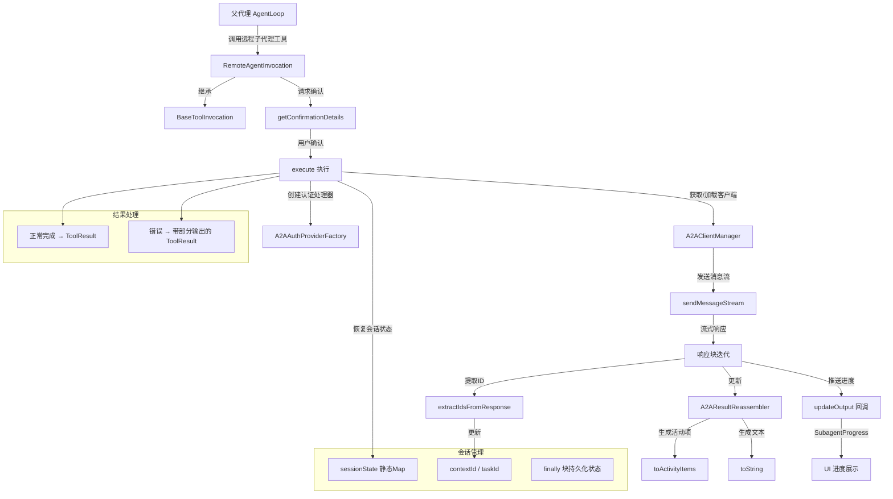

# remote-invocation.ts

## 概述

`remote-invocation.ts` 定义了 `RemoteAgentInvocation` 类，负责**远程子代理的调用**。该类继承自 `BaseToolInvocation`，是通过 A2A（Agent-to-Agent）协议与远程代理通信的工具调用实现。

与 `LocalSubagentInvocation`（本地执行）不同，`RemoteAgentInvocation` 完全绕过本地的 `LocalAgentExecutor` 执行循环，直接通过 `A2AClientManager` 向远程代理发送消息并接收流式响应。它管理着跨调用的会话状态（`contextId` 和 `taskId`），支持多轮对话。

该类是"远程执行"路径的核心实现，与 `local-invocation.ts`（本地执行路径）形成镜像关系。

## 架构图（Mermaid）



## 核心组件

### 类：`RemoteAgentInvocation`

继承自 `BaseToolInvocation<RemoteAgentInputs, ToolResult>`。

#### 静态属性

| 属性 | 类型 | 说明 |
|------|-----|------|
| `sessionState` | `Map<string, { contextId?, taskId? }>` | 跨调用实例持久化的会话状态。以代理名为键，存储 `contextId` 和 `taskId`。这是一个静态 Map，在所有 `RemoteAgentInvocation` 实例之间共享。 |

#### 实例属性

| 属性 | 类型 | 说明 |
|------|-----|------|
| `definition` | `RemoteAgentDefinition` | 远程代理定义 |
| `context` | `AgentLoopContext` | 代理循环上下文 |
| `contextId` | `string \| undefined` | 当前会话的上下文 ID |
| `taskId` | `string \| undefined` | 当前任务 ID |
| `clientManager` | `A2AClientManager` | A2A 客户端管理器 |
| `authHandler` | `AuthenticationHandler \| undefined` | 认证处理器（延迟初始化） |

#### 构造函数

```typescript
constructor(
  definition: RemoteAgentDefinition,  // 远程代理定义
  context: AgentLoopContext,          // 代理循环上下文
  params: AgentInputs,               // 输入参数
  messageBus: MessageBus,            // 消息总线
  _toolName?: string,                // 可选工具名
  _toolDisplayName?: string,         // 可选显示名
)
```

构造函数执行以下操作：
1. 从 `params` 中提取 `query` 参数，如未提供则使用 `DEFAULT_QUERY_STRING`
2. 验证 `query` 必须为字符串类型
3. 调用父类构造函数，传入严格类型的 `{ query }` 参数
4. 从上下文配置中获取 `A2AClientManager`，如不可用则抛出错误

#### 方法：`getDescription(): string`

返回调用描述：`Calling remote agent {displayName}`

#### 方法：`getAuthHandler(): Promise<AuthenticationHandler | undefined>` (私有)

延迟创建并缓存认证处理器：
1. 如果已创建，直接返回缓存的处理器
2. 如果代理定义了 `auth` 配置，通过 `A2AAuthProviderFactory.create()` 创建
3. 缓存并返回

#### 方法：`getConfirmationDetails(signal): Promise<ToolCallConfirmationDetails | false>` (protected override)

覆盖父类方法，为远程代理调用提供确认详情。当前实现**始终要求用户确认**远程代理调用：

```typescript
return {
  type: 'info',
  title: `Call Remote Agent: ${name}`,
  prompt: `Calling remote agent: "${this.params.query}"`,
  onConfirm: async () => { /* 策略更新由调度器中央处理 */ },
};
```

#### 方法：`execute(signal, updateOutput?): Promise<ToolResult>`

核心执行方法，编排与远程代理的通信流程。

**执行流程：**

1. **初始化阶段**：
   - 创建 `A2AResultReassembler` 实例
   - 发送初始进度（`running` 状态，显示"Working..."）
   - 从静态 `sessionState` 恢复先前的 `contextId` 和 `taskId`

2. **认证与客户端准备**：
   - 获取认证处理器（延迟创建）
   - 确保代理客户端已加载（通过 `clientManager.loadAgent()`）

3. **发送消息并接收流式响应**：
   - 调用 `clientManager.sendMessageStream()` 发送查询
   - 遍历响应流的每个 chunk：
     - 检查中止信号
     - 通过 `reassembler.update()` 累积响应
     - 推送运行中的进度（包含当前活动项和部分结果）
     - 通过 `extractIdsFromResponse()` 提取新的 `contextId` 和 `taskId`

4. **结果处理**：
   - 如无响应，抛出错误
   - 通过 `reassembler.toString()` 获取最终文本输出
   - 推送完成进度
   - 返回包含 `llmContent` 和 `returnDisplay` 的 `ToolResult`

5. **错误处理**：
   - 保留部分输出（`reassembler.toString()`）
   - 通过 `formatExecutionError()` 格式化错误消息
   - 合并部分输出和错误消息
   - 返回错误状态的 `ToolResult`（不抛出异常）

6. **finally 块**：
   - 无论成功还是失败，始终将 `contextId` 和 `taskId` 持久化到静态 `sessionState`

#### 方法：`formatExecutionError(error): string` (私有)

格式化执行错误为用户友好的消息：
- `A2AAgentError` 实例：使用其 `userMessage` 属性
- 其他错误：使用通用格式 `Error calling remote agent: {message}`

## 依赖关系

### 内部依赖

| 模块路径 | 导入内容 | 用途 |
|---------|---------|------|
| `../tools/tools.js` | `BaseToolInvocation`, `ToolConfirmationOutcome`, `ToolResult`, `ToolCallConfirmationDetails` | 工具调用基类和相关类型 |
| `./types.js` | `DEFAULT_QUERY_STRING`, `RemoteAgentInputs`, `RemoteAgentDefinition`, `AgentInputs`, `SubagentProgress`, `getAgentCardLoadOptions`, `getRemoteAgentTargetUrl` | 远程代理类型定义和工具函数 |
| `../config/agent-loop-context.js` | `AgentLoopContext` | 代理循环上下文 |
| `../confirmation-bus/message-bus.js` | `MessageBus` | 消息总线 |
| `./a2a-client-manager.js` | `A2AClientManager`, `SendMessageResult` | A2A 客户端管理器和响应类型 |
| `./a2aUtils.js` | `extractIdsFromResponse`, `A2AResultReassembler` | A2A 响应处理工具 |
| `../utils/debugLogger.js` | `debugLogger` | 调试日志 |
| `../utils/terminalSerializer.js` | `AnsiOutput` | 终端 ANSI 输出类型 |
| `./auth-provider/factory.js` | `A2AAuthProviderFactory` | A2A 认证提供器工厂 |
| `./a2a-errors.js` | `A2AAgentError` | A2A 错误基类 |

### 外部依赖

| 包名 | 导入内容 | 用途 |
|-----|---------|------|
| `@a2a-js/sdk/client` | `AuthenticationHandler` | A2A SDK 认证处理器接口 |

## 关键实现细节

1. **静态会话状态持久化**：`sessionState` 是一个静态 `Map`，跨所有 `RemoteAgentInvocation` 实例共享。由于每次工具调用会创建新的实例，静态状态确保了 `contextId` 和 `taskId` 在多次调用之间的连续性，支持多轮对话。状态在 `finally` 块中持久化，即使部分失败或中止也不会丢失。

2. **流式响应处理**：使用 `A2AResultReassembler` 累积和重组来自远程代理的流式响应 chunk。每个 chunk 到达时都会更新进度推送，实现实时的 UI 反馈。

3. **确认机制**：远程代理调用始终需要用户确认（通过 `getConfirmationDetails` 覆盖）。这是一个安全机制，因为远程代理可能执行不可预测的操作。注释表明策略更新现在由调度器中央处理。

4. **优雅的错误处理**：与本地调用不同，远程调用的错误处理不会抛出异常（即使是中止）。所有错误都被包装为失败的 `ToolResult` 返回，包含部分输出和格式化的错误消息。这确保了父代理能收到有用的错误信息而不是中断执行。

5. **部分输出保留**：在错误发生时，`reassembler.toString()` 返回到目前为止已接收的部分输出。这些部分输出与错误消息合并，确保即使通信中断也不会丢失已获得的信息。

6. **延迟客户端加载**：客户端仅在首次调用时通过 `clientManager.loadAgent()` 加载（如果 `getClient()` 返回 `null`）。后续调用复用已缓存的客户端，避免重复的网络请求。

7. **A2A 错误分类**：通过 `formatExecutionError` 方法区分 `A2AAgentError`（结构化的 A2A 错误，有预设的用户友好消息）和一般错误。这依赖于 `A2AAgentError` 基类的 `userMessage` 属性，避免为每个子类重复编写错误消息。

8. **上下文 ID 和任务 ID 管理**：从每个响应 chunk 中提取 `contextId` 和 `taskId`。`contextId` 只会被更新（不会被清除），而 `taskId` 可以通过 `clearTaskId` 标志清除。这支持了 A2A 协议的会话管理语义。

9. **输入参数严格化**：构造函数将宽松的 `AgentInputs`（可能包含多个字段）转换为严格的 `{ query }` 对象，确保只有 `query` 参数被传递给父类。如果未提供 `query`，使用 `DEFAULT_QUERY_STRING` 作为默认值。
